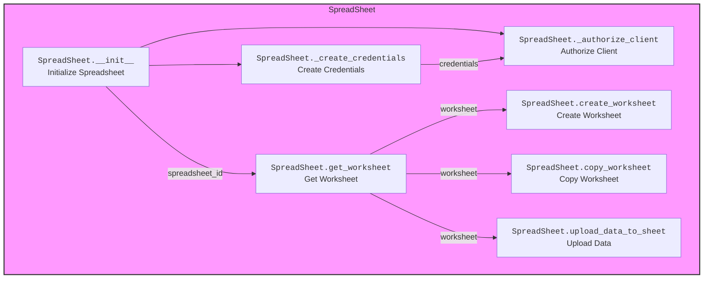
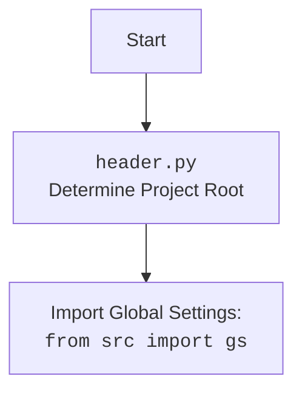

## АНАЛИЗ КОДА

### <алгоритм>
1.  **Инициализация (`__init__`)**:
    *   Принимает `spreadsheet_id` (может быть `None` для создания новой таблицы), `sheet_name`, и `spreadsheet_name`.
    *   Создает учетные данные Google API (`_create_credentials`).
    *   Авторизует клиент Google Sheets API (`_authorize_client`).
    *   Открывает существующую таблицу Google Sheet по `spreadsheet_id` или создает новую, если `spreadsheet_id` - `None`.
    *   Если таблица не найдена, выбрасывается исключение `gspread.exceptions.SpreadsheetNotFound`.
    *   **Пример**:
        ```python
        google_sheet_handler = SpreadSheet(
            spreadsheet_id='12345abcde', 
            sheet_name='Sheet1'
        )
        ```

2.  **Создание учетных данных (`_create_credentials`)**:
    *   Определяет путь к файлу с учетными данными JSON `e-cat-346312-137284f4419e.json` (путь определяется через `gs.path.secrets`).
    *   Определяет область доступа `SCOPES` для Google Sheets и Drive API.
    *   Создает объект `ServiceAccountCredentials` из JSON-файла учетных данных и области доступа.
    *   Возвращает созданные учетные данные.
    *   **Пример**:
        ```
        creds = _create_credentials()
        # creds имеет тип <oauth2client.service_account.ServiceAccountCredentials>
        ```

3.  **Авторизация клиента (`_authorize_client`)**:
    *   Использует полученные учетные данные для авторизации клиента Google Sheets API.
    *   Возвращает авторизованный клиент.
    *   **Пример**:
        ```
        client = _authorize_client(creds)
        # client имеет тип <gspread.client.Client>
        ```

4.  **Получение листа (`get_worksheet`)**:
    *   Принимает имя листа `worksheet_name`.
    *   Пытается получить существующий лист по имени из таблицы.
    *   Если лист не найден, вызывает метод `create_worksheet` для создания листа.
    *   Возвращает лист или `None` в случае ошибки.
    *   **Пример**:
        ```python
        worksheet = google_sheet_handler.get_worksheet(worksheet_name='Sheet1')
        # worksheet имеет тип <gspread.worksheet.Worksheet>
        ```

5.  **Создание листа (`create_worksheet`)**:
    *   Принимает имя нового листа `title` и размеры `dim` (строки и столбцы).
    *   Создает новый лист в Google Sheets и возвращает его.
    *   Обрабатывает ошибки при создании.
    *    **Пример**:
    ```python
         worksheet = google_sheet_handler.create_worksheet(title='Sheet2', dim={'rows':50, 'cols':15})
         # worksheet имеет тип <gspread.worksheet.Worksheet>
    ```

6.  **Копирование листа (`copy_worksheet`)**:
    *   Принимает имена исходного `from_worksheet` и нового листа `to_worksheet`.
    *   Копирует указанный лист в текущей Google Sheets таблицу.
    *   Возвращает скопированный лист.
     *   **Пример**:
    ```python
       worksheet = google_sheet_handler.copy_worksheet(from_worksheet='Sheet1', to_worksheet='Sheet3')
         # worksheet имеет тип <gspread.worksheet.Worksheet>
    ```

7.  **Загрузка данных (`upload_data_to_sheet`)**:
    *   Проверяет наличие и корректность файла данных `self.data_file`.
    *   Читает данные из CSV-файла с помощью `pandas`.
    *   Преобразует данные DataFrame в список списков (с заголовками).
    *   Записывает данные в Google Sheet с ячейки `A1`.
    *   Обрабатывает ошибки при загрузке.
    *    **Пример**:
    ```python
    data_file = Path('/mnt/data/google_extracted/your_data_file.csv')
        google_sheet_handler = SpreadSheet(
        spreadsheet_id='12345abcde',
        sheet_name='Sheet1'
        data_file = data_file
    )
    google_sheet_handler.upload_data_to_sheet()
    ```

### <mermaid>




### <объяснение>

#### Импорты:

*   `pathlib.Path`: Для работы с путями файлов и каталогов. Используется для указания пути к файлу учетных данных (`creds_file`).
*   `gspread`: Основная библиотека для взаимодействия с Google Sheets API.
*   `gspread.Spreadsheet`, `gspread.Worksheet`: Классы из `gspread` для работы с таблицами и листами.
*   `oauth2client.service_account.ServiceAccountCredentials`: Для создания учетных данных из JSON-файла.
*   `pandas as pd`: Для работы с данными в формате DataFrame, чтения из CSV.
*   `src.logger.logger as logger`: Для логирования событий и ошибок.
*   `src import gs`: Импортирует глобальные настройки, включая путь к файлу учетных данных.
*   `src.utils.printer import pprint`:  Используется для красивой печати данных, не используется в данном коде.

#### Классы:
*   **`SpreadSheet`**:
    *   **Роль**: Предоставляет интерфейс для работы с Google Sheets API, включая открытие, создание, загрузку данных в таблицы.
    *   **Атрибуты**:
        *   `spreadsheet_id: str | None`: ID Google Sheets таблицы.
        *   `spreadsheet_name: str | None`: Имя Google Sheets таблицы.
        *   `spreadsheet: gspread.Spreadsheet`: Объект, представляющий Google Sheets таблицу.
        *    `data_file: Path`: Путь к файлу с данными.
        *   `sheet_name: str`: Имя листа в Google Sheets.
        *   `credentials: ServiceAccountCredentials`: Учетные данные для доступа к API.
        *   `client: gspread.Client`: Клиент для взаимодействия с Google Sheets API.
        *   `worksheet: gspread.Worksheet`: Объект, представляющий лист в таблице.
        * `create_sheet: bool` - флаг для создания нового листа (не используется в текущем коде).

    *   **Методы**:
        *   `__init__(self, spreadsheet_id, sheet_name, spreadsheet_name)`:
            *   Инициализирует объект, устанавливает `spreadsheet_id`, получает учетные данные, авторизует клиент, открывает или создает таблицу.
        *   `_create_credentials(self)`:
            *   Создает учетные данные из JSON-файла.
        *   `_authorize_client(self)`:
            *   Авторизует клиент Google Sheets API.
        *    `get_worksheet(self, worksheet_name: str) -> Worksheet | None`:
           *    Возвращает лист по имени, создавая его, если необходимо.
        *   `create_worksheet(self, title:str, dim:dict = {'rows':100,'cols':10}) -> Worksheet | None`:
            *   Создает новый лист в Google Sheets.
        *   `copy_worksheet(self, from_worksheet: str, to_worksheet: str) -> Worksheet`:
             *    Копирует лист по имени.
        *   `upload_data_to_sheet(self)`:
            *   Загружает данные из CSV файла в Google Sheets.
            
#### Функции:
*   Все функции в коде являются методами класса `SpreadSheet`, и их назначение описано в разделе `Классы`.
#### Переменные:
*   `creds_file`: Путь к JSON файлу с учетными данными (тип: `pathlib.Path`).
*   `SCOPES`: Список областей доступа к Google API (тип: `list`).
*  `data_file`: Путь к файлу с данными (тип: `pathlib.Path`).
*  `data`: DataFrame, считанный из CSV файла (`pandas.DataFrame`).
*   `data_list`: Список списков, подготовленный для записи в Google Sheet.
*   `spreadsheet_id`: Идентификатор гугл таблицы
*   `spreadsheet_name`: Имя гугл таблицы
*   `sheet_name`: Имя листа в гугл таблице
*   `worksheet`: Рабочий лист в гугл таблице

#### Потенциальные ошибки и области для улучшения:
*   **Обработка ошибок**: В блоках `try...except` логируются ошибки, но исключения перебрасываются далее, возможно, следует более детально их обрабатывать.
*   **Безопасность**: Файл с учетными данными хранится локально. Рекомендуется использовать более безопасные методы хранения, например, в переменных окружения.
*   **Гибкость**: Параметры создания листа по умолчанию заданы жестко. Следует разрешить пользователю настраивать их.
*   **Отсутствует** механизм загрузки данных из листа, только выгрузка в лист.
*   **`copy_worksheet`** не реализован полностью.
*  **Не используется** `printer.pprint`

#### Взаимосвязь с другими частями проекта:
*   `src.logger.logger`: Используется для логирования событий, ошибок, и для отладки.
*   `src import gs`: Используется для получения пути к файлу с учетными данными, который задан в глобальных настройках.
*   `src.utils.printer`: Используется для красивой печати данных.
*   `header.py` Определяет путь к корневой директории проекта, используется в `src import gs`

Этот анализ предоставляет всестороннее понимание функциональности и структуры кода, а также выделяет потенциальные области для улучшения и возможные ошибки.