## <алгоритм>

1.  **Инициализация `SpreadSheet`:**
    *   При создании экземпляра `SpreadSheet` вызывается метод `__init__`.
    *   Получает `spreadsheet_id`, `spreadsheet_name` (если `spreadsheet_id` не указан).
    *   Создает учетные данные с помощью `_create_credentials`.
        *   Читает JSON файл с ключом `e-cat-346312-137284f4419e.json`.
        *   Устанавливает область доступа SCOPES: чтение/запись листов и диска.
        *   Возвращает объект `ServiceAccountCredentials`.
    *   Авторизует клиента Google Sheets API с помощью `_authorize_client`.
        *   Использует учетные данные для авторизации.
        *   Возвращает авторизованный клиент `gspread.Client`.
    *   Открывает существующую таблицу с помощью `client.open_by_key(self.spreadsheet_id)`, если `spreadsheet_id` указан, иначе, переходит в блок `except` с исключением `gspread.exceptions.SpreadsheetNotFound`.
    *   Если `spreadsheet_id` не найден, то вызывается исключение `gspread.exceptions.SpreadsheetNotFound` и метод завершает работу.

2.  **Получение или создание листа:**
    *   Вызывается метод `get_worksheet` с аргументом `worksheet_name`.
    *   Пытается получить существующий лист с помощью `spreadsheet.worksheet(worksheet_name)`.
        *   Если лист найден, возвращает его.
        *   Если лист не найден (`gspread.exceptions.WorksheetNotFound`), переходит к блоку `except`.
            *   Вызывается метод `create_worksheet(worksheet_name)` для создания нового листа.
                *   Создает новый лист с указанным именем и размерами по умолчанию 100x10.
                *   Возвращает созданный лист.
            *   Возвращает созданный лист.
        *  Если лист не найден, выбрасывается исключение.

3.  **Загрузка данных:**
    *   Вызывается метод `upload_data_to_sheet`.
    *   Проверяется, существует ли файл данных (`self.data_file`).
        *   Если файл не существует, выбрасывается ошибка `ValueError`.
    *   Читает данные из CSV файла с помощью `pd.read_csv(self.data_file)`.
        *   Преобразует данные `pandas.DataFrame` в список списков для загрузки в Google Sheets.
        *   Записывает данные в Google Sheets с помощью `self.worksheet.update('A1', data_list)`.

4.  **Копирование листа:**
    *   Вызывается метод `copy_worksheet`.
    *   Получает лист для копирования с помощью `self.spreadsheet.worksheet(from_worksheet)`.
    *   Создает дубликат листа с новым именем `to_worksheet` с помощью `worksheet.duplicate(new_sheet_name=to_worksheet)`.
    *  Возвращает скопированный лист.

**Примеры:**

*   **Инициализация `SpreadSheet`:**
    ```python
    google_sheet_handler = SpreadSheet(
        spreadsheet_id='1234567890',  # ID существующей таблицы
        sheet_name='Лист1'
    )
    ```
    *   Создается объект `SpreadSheet`, который использует существующую таблицу с ID `1234567890`.

*   **Получение листа:**
    ```python
    worksheet = google_sheet_handler.get_worksheet('Лист2')
    ```
    *   Если лист с именем `Лист2` существует, он возвращается.
    *   Если лист `Лист2` не существует, он создается.

*   **Загрузка данных:**
    ```python
     google_sheet_handler.upload_data_to_sheet()
    ```
    *   Данные из CSV файла, указанного в `self.data_file`, загружаются в текущий лист `self.worksheet`.

*   **Копирование листа:**
    ```python
      new_worksheet = google_sheet_handler.copy_worksheet(from_worksheet="Лист2", to_worksheet="Лист3")
    ```
    *  Создается копия `Лист2` с именем `Лист3`.

```mermaid
graph LR
    A[__init__] --> B{_create_credentials};
    B --> C{_authorize_client};
    C --> D{open_by_key};
     D -- success -->E[Spreadsheet]
    D -- SpreadsheetNotFound --> F[Error handling]
    E -->G[get_worksheet]
    G -->H{worksheet}
    H -- find --> I[Worksheet]
     H -- NotFound --> J{create_worksheet};
      J --> K[Worksheet]
      K -->I
    I --> L{upload_data_to_sheet}
     L -->M{check self.data_file}
     M --exists -->N[read_csv];
      M -- Not exists --> O[ValueError]
     N -->P{update};
     P-->Q[return]
    F-->R[Error handling]
    
    style A fill:#f9f,stroke:#333,stroke-width:2px
    style I fill:#ccf,stroke:#333,stroke-width:2px
     style E fill:#ccf,stroke:#333,stroke-width:2px
      style L fill:#ccf,stroke:#333,stroke-width:2px
       style R fill:#f00,stroke:#333,stroke-width:2px
    
    classDef class_error fill:#fbb,stroke:#333,stroke-width:2px
    class F,O class_error
    
```

## <mermaid>



**Объяснение зависимостей:**

*   **`__init__`:** Метод инициализации класса, который вызывает методы для создания учетных данных, авторизации клиента и открытия таблицы.
*   **`_create_credentials`:** Метод для создания учетных данных из JSON файла. Зависит от `oauth2client.service_account.ServiceAccountCredentials` для создания объекта учетных данных.
*   **`_authorize_client`:** Метод для авторизации клиента Google Sheets API. Зависит от `gspread.authorize` для создания авторизованного клиента.
*   **`open_by_key`:** Метод, который открывает существующую таблицу по `spreadsheet_id`. Зависит от `gspread.Client.open_by_key`.
*   **`get_worksheet`:** Метод для получения листа. Зависит от `gspread.Spreadsheet.worksheet` для получения листа по имени и `create_worksheet`.
*   **`create_worksheet`:** Метод для создания нового листа. Зависит от `gspread.Spreadsheet.add_worksheet` для создания нового листа.
*    **`upload_data_to_sheet`:** Метод для загрузки данных из CSV файла. Зависит от `pandas.read_csv` для чтения CSV файла и `gspread.Worksheet.update` для записи данных в Google Sheets.
*   **`Error handling`:** Обработка исключений `SpreadsheetNotFound`, `ValueError`, и других исключений в методах.
*   Стрелки указывают порядок вызова методов и передачу управления.

## <объяснение>

**Импорты:**

*   `pathlib.Path`: Используется для работы с путями к файлам и каталогам, в частности, для доступа к файлу с учетными данными.
*   `gspread`: Основная библиотека для взаимодействия с Google Sheets API.
*   `gspread.Spreadsheet`, `gspread.Worksheet`: Классы для представления Google Spreadsheet и Worksheet соответственно.
*   `oauth2client.service_account.ServiceAccountCredentials`: Используется для создания учетных данных из JSON файла.
*   `pandas as pd`: Библиотека для работы с данными, используется для чтения CSV файлов.
*   `src.logger.logger`: Пользовательский модуль для логирования ошибок и информации.
*   `src.gs`: Пользовательский модуль для доступа к переменным `path.secrets`.
*   `src.utils.printer.pprint`: Пользовательская функция для печати данных в консоль.

**Класс `SpreadSheet`:**

*   **Роль:** Предоставляет интерфейс для работы с Google Sheets, включая создание, открытие, чтение, запись и копирование листов.
*   **Атрибуты:**
    *   `spreadsheet_id`: ID Google Spreadsheet.
    *   `spreadsheet_name`: Имя Google Spreadsheet (используется только при создании новой таблицы).
    *   `spreadsheet`: Объект `gspread.Spreadsheet` для представления открытой таблицы.
    *   `data_file`: Путь к CSV файлу с данными для загрузки.
    *   `sheet_name`: Имя листа в Google Sheets.
    *   `credentials`: Учетные данные для доступа к API.
    *   `client`: Авторизованный клиент `gspread.Client` для работы с Google Sheets API.
    *   `worksheet`: Объект `gspread.Worksheet` для представления текущего листа.
*   **Методы:**
    *   `__init__`: Конструктор класса, инициализирует объект, устанавливает учетные данные, авторизует клиента и открывает Google Sheets.
    *   `_create_credentials`: Создает учетные данные из JSON файла.
    *   `_authorize_client`: Авторизует клиента Google Sheets API.
    *   `get_worksheet`: Получает лист по имени. Если лист не существует, создает его.
    *   `create_worksheet`: Создает новый лист с заданным именем и размерами.
    *   `copy_worksheet`: Копирует лист в текущей таблице.
    *   `upload_data_to_sheet`: Загружает данные из CSV файла в Google Sheets.

**Функции:**

*   `_create_credentials`:
    *   **Аргументы:** Нет.
    *   **Возвращаемое значение:** Объект `ServiceAccountCredentials` с учетными данными.
    *   **Назначение:** Читает JSON файл с ключом, устанавливает область доступа и создает объект учетных данных.
*   `_authorize_client`:
    *   **Аргументы:** Нет.
    *   **Возвращаемое значение:** Авторизованный клиент `gspread.Client`.
    *   **Назначение:** Авторизует клиента для доступа к API с использованием учетных данных.
*   `get_worksheet`:
    *   **Аргументы:** `worksheet_name` (str или Worksheet).
    *   **Возвращаемое значение:** Объект `gspread.Worksheet` или `None`.
    *   **Назначение:** Получает лист по имени из открытой таблицы, или создает его, если он не существует.
*   `create_worksheet`:
    *   **Аргументы:** `title` (str), `dim` (dict).
    *   **Возвращаемое значение:** Объект `gspread.Worksheet` или `None`.
    *   **Назначение:** Создает новый лист с заданным именем и размерами.
*   `upload_data_to_sheet`:
    *   **Аргументы:** Нет.
    *   **Возвращаемое значение:** Нет.
    *   **Назначение:** Читает данные из CSV файла и загружает их в Google Sheets.
*    `copy_worksheet`:
    *  **Аргументы:** `from_worksheet` (str), `to_worksheet` (str).
    *   **Возвращаемое значение:** Объект `gspread.Worksheet`.
    *   **Назначение:** Копирует лист из текущей таблицы.

**Переменные:**

*   `MODE`: Строка, определяющая режим работы (в данном случае `'dev'`).
*   `creds_file`: Путь к файлу с учетными данными (закомментировано). Вместо этого путь к файлу хранится в переменной `gs.path.secrets`.
*   `SCOPES`: Список областей доступа к Google API.
*   `spreadsheet_id`, `spreadsheet_name`, `spreadsheet`, `data_file`, `sheet_name`, `credentials`, `client`, `worksheet`, `create_sheet`: Атрибуты класса, описанные выше.

**Потенциальные ошибки и области для улучшения:**

*   **Отсутствие проверки `spreadsheet_id` при создании:** При инициализации класса, если `spreadsheet_id` равен `None` (для создания новой таблицы), не обрабатывается случай, когда `spreadsheet_name` не указан.
*   **Хранение файла учетных данных:** Файл `e-cat-346312-137284f4419e.json` хранится в директории. Желательно его хранить в защищенном месте или динамически формировать из конфиденциальных данных, как указано в комментарии `tmp`.
*   **Жестко заданные размеры листа:** Размеры листа 100x10, создаваемого методом `create_worksheet`,  могут быть параметризованы.
*   **Отсутствие обработки ошибок при создании листа:** Метод `create_worksheet` не возвращает `None`, если не удается создать страницу.
*   **Отсутствие обработки ошибок в `copy_worksheet`:** Метод не обрабатывает ситуации, когда не удается скопировать лист.
*  **Логирование:** Использование библиотеки `logger` не всегда реализовано, т.е. много закоментированных строк.

**Взаимосвязи с другими частями проекта:**

*   Зависит от `src.logger.logger` для логирования.
*   Зависит от `src.gs` для доступа к пути к файлу `secrets`.
*   Использует `src.utils.printer.pprint` для вывода данных (в текущей версии кода не используется).

Этот код предоставляет базовый функционал для работы с Google Sheets, но требует дальнейшей доработки для обеспечения надежности и удобства использования.