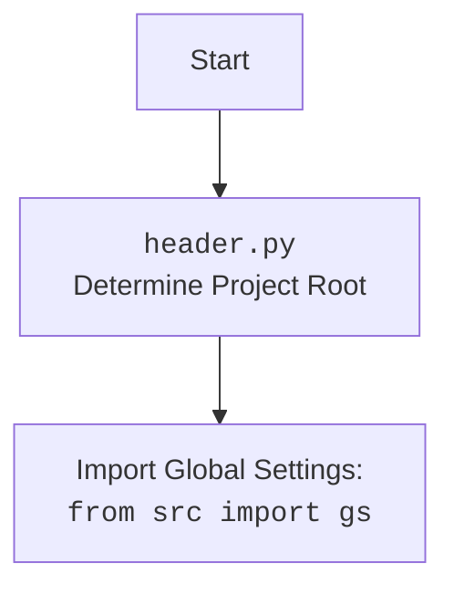

## АНАЛИЗ КОДА:

### 1. <алгоритм>

**Блок-схема работы класса `SpreadSheet`:**

1.  **Инициализация (`__init__`)**:
    *   Принимает `spreadsheet_id`, `spreadsheet_name` и `sheet_name`.
        *   Если `spreadsheet_id` равен `None` - создать новую таблицу (название `spreadsheet_name`)
    *   Создает объект `credentials` с помощью `_create_credentials()`.
        *   `_create_credentials()`:
            *   Определяет путь к файлу учетных данных (`e-cat-346312-137284f4419e.json`).
            *   Создает объект `ServiceAccountCredentials` с указанными областями доступа (чтение/запись таблиц и диска).
            *   Возвращает объект `credentials`
        *   Если возникает ошибка при чтении данных или файле нет, вызывается `raise Exception`.
    *   Создает авторизованный клиент `gspread.Client` с помощью `_authorize_client()`.
        *   `_authorize_client()`:
            *   Использует `credentials` для авторизации клиента Google Sheets.
            *   Возвращает авторизованный `gspread.Client`.
        *   Если возникает ошибка авторизации, вызывается `raise Exception`.
    *   Открывает существующую таблицу с помощью `client.open_by_key(self.spreadsheet_id)` или вызывает `SpreadsheetNotFound`, если ее нет.

2.  **Получение листа (`get_worksheet`)**:
    *   Принимает имя листа `worksheet_name`.
    *   Пытается получить лист через `self.spreadsheet.worksheet(worksheet_name)`.
        *   Если лист не найден (`WorksheetNotFound`), вызывает метод `create_worksheet` для создания нового.
    *   Возвращает объект `Worksheet` или `None` в случае ошибки создания.

3.  **Создание листа (`create_worksheet`)**:
     * Принимает `title` - имя создаваемого листа и `dim` - размерность создаваемого листа.
     *  Создает новый лист с именем `title` и размерностью `dim` через метод `add_worksheet`.
     *   Возвращает объект `Worksheet` созданного листа или `None` в случае ошибки.

4.  **Копирование листа (`copy_worksheet`)**:
    *   Принимает имя листа источника `from_worksheet` и имя листа назначения `to_worksheet`.
    *   Получает лист `worksheet` по имени `from_worksheet` через `self.spreadsheet.worksheet(from_worksheet)`.
    *   Копирует лист с новым именем `to_worksheet` через метод `worksheet.duplicate(new_sheet_name=to_worksheet)`.
    *   Возвращает объект `Worksheet` скопированного листа.

5.  **Загрузка данных (`upload_data_to_sheet`)**:
    *   Проверяет, что `self.data_file` установлен и существует.
    *   Читает данные из CSV файла в `pandas DataFrame` через `pd.read_csv(self.data_file)`.
    *   Конвертирует `DataFrame` в список списков (первый список - заголовки столбцов, остальные - данные) `data_list`.
    *   Обновляет данные на листе `self.worksheet` с ячейки `A1` через `self.worksheet.update('A1', data_list)`.
    *   Логирует ошибки в случае возникновения исключений.

### 2. <mermaid>

```mermaid
flowchart TD
    Start[Start] --> Initialize[__init__(): <br> Initialize Spreadsheet]
    
    Initialize --> CreateCredentials[_create_credentials(): <br> Create Google API Credentials]
     CreateCredentials --> SetCredentials[Set Credentials]
    
    SetCredentials --> AuthorizeClient[_authorize_client(): <br> Authorize Google API Client]
        AuthorizeClient --> SetClient[Set Authorized Client]
    
    SetClient --> OpenSpreadsheet[Open Existing Spreadsheet <br> or Create New]
    OpenSpreadsheet --> ExceptionHandler1{SpreadsheetNotFound?}

    ExceptionHandler1 -- Yes --> ErrorLog1[Log Error <br> Raise Exception]
    ExceptionHandler1 -- No --> GetWorksheet[get_worksheet(): Get Worksheet]

     GetWorksheet --> CheckWorksheet[Check if Worksheet Exists]
    CheckWorksheet -- Yes --> ReturnWorksheet[Return Worksheet]

     CheckWorksheet -- No --> CreateWorksheet[create_worksheet(): Create Worksheet]
        CreateWorksheet --> ReturnNewWorksheet[Return New Worksheet]
    
        ReturnNewWorksheet -->  UploadData[upload_data_to_sheet(): Upload Data to Sheet]
          ReturnWorksheet  -->  UploadData

    UploadData --> CheckDataFile[Check Data File]
        CheckDataFile -- No --> ErrorLog2[Log Error <br> Raise Exception]
        CheckDataFile -- Yes --> ReadCSV[Read Data from CSV]
        ReadCSV --> PrepareData[Prepare Data for Sheet]
        PrepareData --> UpdateSheet[Update Google Sheet]
       UpdateSheet --> End[End]

     ErrorLog1 --> End
    ErrorLog2 --> End


    style Start fill:#f9f,stroke:#333,stroke-width:2px
    style End fill:#f9f,stroke:#333,stroke-width:2px
```



**Объяснение `mermaid` диаграммы:**

1.  **`flowchart TD`**: Определяет тип диаграммы как блок-схему.
2.  **`Start[Start]`**: Начало процесса.
3.  **`Initialize[__init__(): Initialize Spreadsheet]`**: Вызов конструктора класса `SpreadSheet`, где происходит инициализация.
4.  **`CreateCredentials[_create_credentials(): Create Google API Credentials]`**: Вызов метода для создания учетных данных.
5.  **`SetCredentials[Set Credentials]`**: Установка полученных учетных данных.
6.   **`AuthorizeClient[_authorize_client(): Authorize Google API Client]`**: Вызов метода для авторизации клиента Google API.
7.  **`SetClient[Set Authorized Client]`**: Установка авторизованного клиента.
8.  **`OpenSpreadsheet[Open Existing Spreadsheet or Create New]`**: Попытка открыть существующий документ или создать новый.
9.  **`ExceptionHandler1{SpreadsheetNotFound?}`**: Проверка наличия исключения при поиске документа.
10. **`ErrorLog1[Log Error Raise Exception]`**: Логирование ошибки и возбуждение исключения, если документ не найден.
11. **`GetWorksheet[get_worksheet(): Get Worksheet]`**: Получение нужного листа документа.
12.  **`CheckWorksheet[Check if Worksheet Exists]`**: Проверка существования листа в документе.
13.  **`ReturnWorksheet[Return Worksheet]`**: Возврат существующего листа.
14.   **`CreateWorksheet[create_worksheet(): Create Worksheet]`**: Создание нового листа если не существует.
15.  **`ReturnNewWorksheet[Return New Worksheet]`**: Возврат нового листа.
16. **`UploadData[upload_data_to_sheet(): Upload Data to Sheet]`**: Загрузка данных на лист.
17. **`CheckDataFile[Check Data File]`**: Проверка наличия файла с данными.
18. **`ErrorLog2[Log Error Raise Exception]`**: Логирование ошибки и возбуждение исключения, если файл не найден.
19. **`ReadCSV[Read Data from CSV]`**: Чтение данных из файла CSV.
20. **`PrepareData[Prepare Data for Sheet]`**: Подготовка данных для вставки в таблицу Google.
21. **`UpdateSheet[Update Google Sheet]`**: Вставка данных в таблицу Google.
22. **`End[End]`**: Конец процесса.

**Зависимости:**
    -   Диаграмма показывает зависимость методов класса `SpreadSheet` и порядок их вызова.
    -   Поток управления начинается с инициализации класса и заканчивается загрузкой данных в таблицу Google.
    -   Основные логические блоки: создание учетных данных, авторизация клиента, открытие/создание таблицы, получение/создание листа, загрузка данных.
    -   Визуализируется логика обработки исключений.

### 3. <объяснение>

**Импорты:**

*   `pathlib.Path`: Используется для работы с путями к файлам и каталогам.
*   `gspread`: Основная библиотека для работы с Google Sheets API.
*   `gspread.Spreadsheet`, `gspread.Worksheet`: Классы, представляющие электронную таблицу и лист в Google Sheets.
*   `oauth2client.service_account.ServiceAccountCredentials`: Используется для создания учетных данных для сервисных аккаунтов Google.
*   `pandas as pd`: Библиотека `pandas` используется для работы с данными в формате `DataFrame`, который используется для чтения данных из CSV файла.
*    `src.logger.logger`: Модуль логирования из проекта, используется для записи сообщений о процессе выполнения программы и отслеживания ошибок.
*    `src.gs`: Модуль глобальных настроек проекта.
*    `src.utils.printer import pprint`: используется для форматированного вывода данных.

**Класс `SpreadSheet`:**

*   **Назначение:** Предоставляет интерфейс для работы с Google Sheets API. Позволяет создавать, открывать, и обновлять данные в таблицах Google.
*   **Атрибуты:**
    *   `spreadsheet_id` (`str | None`): ID электронной таблицы Google. Может быть `None` для создания новой таблицы.
    *   `spreadsheet_name` (`str | None`): Имя новой электронной таблицы (если `spreadsheet_id` - `None`).
    *   `spreadsheet` (`Spreadsheet`): Объект, представляющий открытую электронную таблицу.
    *   `data_file` (`Path`): Путь к CSV файлу с данными.
    *   `sheet_name` (`str`): Имя листа в электронной таблице.
    *   `credentials` (`ServiceAccountCredentials`): Учетные данные для доступа к Google Sheets API.
    *   `client` (`gspread.Client`): Авторизованный клиент для работы с Google Sheets API.
    *   `worksheet` (`Worksheet`): Объект, представляющий лист в электронной таблице.
    *   `create_sheet` (`bool`): флаг создания листа

*   **Методы:**
    *   `__init__(self, spreadsheet_id: str, *args, **kwards)`: Конструктор класса.
        *   Инициализирует объект, создавая учетные данные, авторизуя клиента и открывая таблицу.
        *   Параметры: `spreadsheet_id` (ID электронной таблицы), `spreadsheet_name` (имя для новой таблицы), `sheet_name` (имя листа).
        *   Пример: `SpreadSheet(spreadsheet_id='123abc456def', sheet_name='Sheet1')`
    *   `_create_credentials(self) -> ServiceAccountCredentials`: Создает объект `ServiceAccountCredentials` из JSON файла.
        *   Возвращает `ServiceAccountCredentials`.
        *   Пример: `credentials = self._create_credentials()`
    *   `_authorize_client(self) -> gspread.Client`: Авторизует клиент для работы с Google Sheets API.
        *   Возвращает авторизованный `gspread.Client`.
        *   Пример: `client = self._authorize_client()`
    *    `get_worksheet(self, worksheet_name: str | Worksheet) -> Worksheet | None`: Получает лист из таблицы.
        *   Если лист не найден - создаёт новый
        *   Возвращает объект `Worksheet`.
         *   Пример: `worksheet = self.get_worksheet('Sheet1')`
    *    `create_worksheet(self, title:str, dim:dict = {'rows':100,'cols':10}) -> Worksheet | None`: Создает новый лист в таблице.
         *  Возвращает объект `Worksheet`.
          *   Пример: `worksheet = self.create_worksheet('Sheet1')`
    *    `copy_worksheet(self, from_worksheet: str, to_worksheet: str) -> Worksheet`: копирует лист с именем `from_worksheet` в новый лист с именем `to_worksheet`
          *   Возвращает объект `Worksheet`.
          *   Пример: `worksheet = self.copy_worksheet('Sheet1', 'Sheet2')`
    *   `upload_data_to_sheet(self)`: Загружает данные из CSV файла в Google Sheets.
        *   Читает данные из `self.data_file`, конвертирует в список списков и записывает в `self.worksheet`.
        *   Пример: `self.upload_data_to_sheet()`

**Функции:**
*   `if __name__ == "__main__":` - Точка входа для запуска скрипта.
    *   Пример использования класса `SpreadSheet`
    *   Создается экземпляр `SpreadSheet` с `spreadsheet_id` = `None`, что приводит к созданию новой таблицы.
    *   Вызывается метод `upload_data_to_sheet()` для загрузки данных.

**Переменные:**
*   `data_file` (`Path`): путь к файлу с данными (в примере `/mnt/data/google_extracted/your_data_file.csv`).
*   `sheet_name` (`str`): имя листа в таблице (в примере `Sheet1`).
*   `google_sheet_handler` (`SpreadSheet`): экземпляр класса `SpreadSheet`.
*   `creds_file`: путь к файлу ключа для сервисного аккаунта.
*   `SCOPES`: область доступа к Google API.

**Потенциальные ошибки и улучшения:**

*   **Обработка ошибок:**
    *   Используется общий блок `try...except Exception as ex` для перехвата всех исключений, что может затруднить отладку.
    *   Рекомендуется обрабатывать более конкретные типы исключений.
*   **Хранение ключа:**
    *   Путь к файлу ключа `e-cat-346312-137284f4419e.json` жестко закодирован.
    *   Рекомендуется использовать переменные окружения или хранилище секретов для более безопасного хранения.
    *   Необходимо реализовать копирование файла в `tmp` перед использованием.
*   **Обработка файла данных:**
    *   Отсутствует обработка случаев, когда `self.data_file` не установлен (проверка только на `None`).
    *   Необходимо добавить проверку на соответствие формата CSV и обрабатывать ошибки чтения.
*   **Управление листами:**
    *   Отсутствует логика создания нескольких листов или выбора нужного листа из существующей таблицы.
*   **Логирование:**
    *  Используется логер `logger.debug()`, рекомендуется использовать `logger.info()` и `logger.warning()`.
*   **Расширяемость:**
    *   Класс ориентирован на загрузку данных из CSV файла, необходимо предусмотреть другие форматы.
    *  Нужно предусмотреть дополнительные методы для работы с Google Sheet API, которые могут потребоваться в будущем.

**Цепочка взаимосвязей с другими частями проекта:**

*   `src.logger.logger`: Логирование работы класса `SpreadSheet`.
*   `src.gs`: Получение глобальных настроек проекта (например, пути к файлам).
*   `src.utils.printer`: используется для форматированного вывода данных.
*   Взаимодействие с Google Sheets API.

Этот анализ предоставляет полное понимание функциональности, структуры и связей кода.