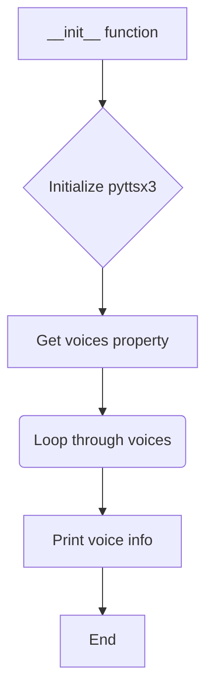
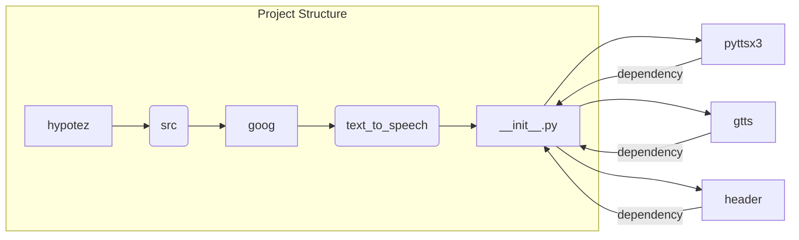

# <input code>

```python
## \file hypotez/src/goog/text_to_speech/__init__.py
# -*- coding: utf-8 -*-\n#! venv/Scripts/python.exe\n#! venv/bin/python/python3.12\n\n"""
.. module: src.goog.text_to_speech 
	:platform: Windows, Unix
	:synopsis: Google TTS 

"""
MODE = 'dev'

import header   
from attr import attr, attrs
import pyttsx3
from gtts import gTTS


class TTS():
    """ Google text to speach """
    def __init__(self,*args,**kwards):
        tts = pyttsx3.init()
        voices = tts.getProperty('voices')
        for v in voices:
            print(v)
    ...
_tts = TTS()
```

# <algorithm>



**Пример:**

Функция `__init__` инициализирует библиотеку `pyttsx3` для работы с текстом в речь.  Затем она получает список голосов из библиотеки, и выводит информацию о каждом голосе на консоль.


# <mermaid>



# <explanation>

**Импорты:**

* `header`:  Непонятно, что это за модуль без дополнительной информации. Предположительно, он содержит общие функции или константы для проекта.  Местоположение файла `header` находится в верхнем уровне папки `hypotez`, которая является root-папкой проекта.
* `attr`: Из пакета `attr`, позволяет создавать именованные атрибуты и структуры данных.  Используется для описания свойств класса `TTS`.
* `pyttsx3`: Библиотека для синтеза речи на Python.  Она отвечает за преобразование текста в аудио.  `pyttsx3` напрямую связан с функциональностью модуля, который предоставляет интерфейс для работы с различными голосами.
* `gtts`: Библиотека для синтеза речи на основе Google Text-to-Speech API. Этот модуль предоставляет возможность использовать Google TTS API,  обеспечивая различные голоса и языки. Он связывается с внешним сервером Google для преобразования текста в речь.

**Классы:**

* `TTS`: Класс для работы с синтезом речи.
    * `__init__`:  Инициализирует объект `TTS`. Внутри он инициализирует библиотеку `pyttsx3`, получает список доступных голосов и выводит информацию о них на консоль. Этот метод не использует `gTTS`.  
    * `...`: Подчёркивание показывает, что в классе есть не реализованные методы.  Реализация этих методов, вероятно,  будет добавлена позже, для того, чтобы класс имел возможность обрабатывать входной текст и воспроизводить речь.


**Функции:**

* Нет функций, кроме `__init__` метода класса `TTS`.

**Переменные:**

* `MODE`: Строковая переменная, хранящая значение 'dev'. Вероятно, используется для определения режима работы, например, 'dev' для разработки или 'prod' для производства.

**Возможные ошибки и улучшения:**

* Отсутствие реализации методов в классе `TTS`: Класс не имеет функций для обработки текста или воспроизведения звука.
* Неиспользование `gtts`: Библиотека `gtts` импортируется, но не используется.  Это может быть  несущественным или подразумевать, что `gtts` используется в других частях кода.
* Отсутствие обработки исключений:  Код не содержит обработку потенциальных исключений (`try...except` блоков), связанных с работой с `pyttsx3`. Это может привести к ошибкам при возникновении проблем с инициализацией или работой с библиотекой.
* Непонятно, как функция `header` связана с другими частями кода.  В целом, модуль требует дальнейшей разработки и уточнения назначения переменных и методов для полного понимания функциональности.
* Вывод голосов ( `print(v)` ) - просто вывод информации, в дальнейшем может понадобится работать с конкретными голосами, например, для выбора голоса по индексу или параметрам.


**Цепочка взаимосвязей:**

Модуль `text_to_speech` использует библиотеки `pyttsx3` и `gtts` для преобразования текста в речь.  Связь с другими частями проекта предполагает, что этот модуль будет вызван из других частей приложения для преобразования текстовых данных в аудиовыходы.
```