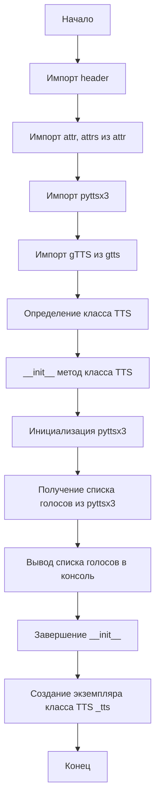

## Анализ кода `hypotez/src/goog/text_to_speech/__init__.py`

### 1. <алгоритм>

**Блок-схема:**



**Примеры:**

*   **`ImportHeader`**: Импортирует `header.py` для определения корневой директории проекта и загрузки общих настроек.
*   **`ImportAttr`**: Импортирует декораторы `attr` и `attrs` для упрощения создания классов данных.
*   **`ImportPyttsx3`**: Импортирует библиотеку `pyttsx3` для преобразования текста в речь (основная библиотека для работы с синтезом речи).
*   **`ImportGtts`**: Импортирует `gTTS` из библиотеки `gtts`, которая позволяет использовать Google Text-to-Speech API.
*   **`ClassTTS`**: Создаёт класс `TTS`, который инкапсулирует логику преобразования текста в речь.
*   **`InitTTS`**: Конструктор класса `TTS` инициализирует движок `pyttsx3` и выводит список доступных голосов в консоль.
*   **`InitPyttsx3`**: Создает экземпляр движка `pyttsx3` для управления синтезом речи.
*    **`GetVoices`**: Получает список голосов, поддерживаемых `pyttsx3`.
*    **`PrintVoices`**: Выводит каждый голос в консоль.
*    **`CreateTtsInstance`**: Создает экземпляр класса `TTS` для использования его функциональности.

### 2. <mermaid>

```mermaid
flowchart TD
    Start --> ImportHeader[<code>header.py</code><br> Determine Project Root and Global Settings]
    ImportHeader --> ImportAttr[<code>from attr import attr, attrs</code><br> for Data Classes]
    ImportAttr --> ImportPyttsx3[<code>import pyttsx3</code><br> Text to Speech Engine]
    ImportPyttsx3 --> ImportGtts[<code>from gtts import gTTS</code><br>Google Text to Speech API]
    ImportGtts --> ClassTTS[Class <code>TTS</code><br>Text-to-Speech Logic]
    ClassTTS --> InitMethod[<code>__init__(self, *args, **kwargs)</code><br>Initialize Text-to-Speech Engine]
    InitMethod --> InitPyttsx3Instance[<code>tts = pyttsx3.init()</code><br>Initialize pyttsx3 engine]
    InitPyttsx3Instance --> GetVoicesList[<code>voices = tts.getProperty('voices')</code><br>Get available voices]
    GetVoicesList --> LoopVoices[<code>for v in voices:</code><br>Loop through voices]
    LoopVoices --> PrintVoice[<code>print(v)</code><br>Display each voice details]
    PrintVoice --> LoopVoices
    LoopVoices --> EndInitMethod[End <code>__init__</code>]
    EndInitMethod --> CreateTtsObject[<code>_tts = TTS()</code><br>Create TTS object instance]
    CreateTtsObject --> End[End]
    

    
    subgraph header.py
        StartHeader[Start] --> DetermineRoot[Determine Project Root]
        DetermineRoot --> ImportGs[Import Global Settings: <br><code>from src import gs</code>] 
        ImportGs --> EndHeader[End]
    end
```

**Объяснение зависимостей `mermaid`:**

*   `ImportHeader`: Импортирует модуль `header.py`, который отвечает за определение корневой директории проекта и загрузку глобальных настроек из `src.gs`.
*   `ImportAttr`: Импортирует декораторы `attr` и `attrs` из библиотеки `attr`, которые используются для создания классов данных с минимальным количеством кода.
*   `ImportPyttsx3`: Импортирует библиотеку `pyttsx3`, которая является кросс-платформенной библиотекой для преобразования текста в речь.
*   `ImportGtts`: Импортирует класс `gTTS` из библиотеки `gtts`, которая обеспечивает доступ к Google Text-to-Speech API.
*   `ClassTTS`: Описывает класс `TTS`, который инкапсулирует логику преобразования текста в речь.
*   `InitMethod`: Указывает на метод `__init__` класса `TTS`, который инициализирует движок преобразования текста в речь и выводит список доступных голосов.
*    `InitPyttsx3Instance`: Инициализирует движок `pyttsx3`.
*    `GetVoicesList`: Получает список доступных голосов через метод `getProperty` движка `pyttsx3`.
*    `LoopVoices`: Проходит в цикле по списку голосов.
*    `PrintVoice`: Выводит информацию о каждом голосе.
*   `CreateTtsObject`: Создаёт экземпляр класса `TTS`.

### 3. <объяснение>

#### Импорты:

*   `import header`: Импортирует модуль `header.py`, который, как правило, содержит логику для определения корневой директории проекта и загрузки общих настроек. Этот модуль используется для настройки среды выполнения и доступа к необходимым конфигурациям.
*   `from attr import attr, attrs`: Импортирует декораторы `attr` и `attrs` из библиотеки `attr`. Эти декораторы упрощают создание классов данных, автоматически генерируя методы, такие как `__init__`, `__repr__`, и т.д. Это помогает уменьшить количество шаблонного кода при создании классов, которые в основном хранят данные.
*   `import pyttsx3`: Импортирует библиотеку `pyttsx3`, которая является кросс-платформенной библиотекой для преобразования текста в речь. Она позволяет программе синтезировать речь, используя различные движки преобразования текста в речь, доступные в системе.
*   `from gtts import gTTS`: Импортирует класс `gTTS` из библиотеки `gtts`. Библиотека `gtts` позволяет использовать Google Text-to-Speech API для синтеза речи.

#### Классы:

*   **`class TTS():`**:
    *   **Роль:** Этот класс представляет собой обертку для движка преобразования текста в речь (в данном случае, `pyttsx3` и `gTTS`, хотя `gTTS` не используется в примере конструктора). Он инкапсулирует логику инициализации и взаимодействия с этим движком.
    *   **Атрибуты:** В текущем виде класс не имеет явных атрибутов, но может их иметь в дальнейшем, например, для хранения экземпляра движка `pyttsx3` или настроек голоса.
    *   **Методы:**
        *   `__init__(self, *args, **kwargs)`: Это конструктор класса. Он инициализирует движок `pyttsx3`, получает список доступных голосов и выводит их в консоль.  В текущей реализации используются только `*args` и `**kwargs`, но они не обрабатываются. 

#### Функции:

*   В данном коде функции отсутствуют.

#### Переменные:

*   `_tts = TTS()`: Создается экземпляр класса `TTS` и присваивается переменной `_tts`. Это делает возможным использование функциональности класса через этот экземпляр.

#### Потенциальные ошибки и области для улучшения:

*   **Отсутствие реализации:** Класс `TTS` имеет метод `__init__`, который инициализирует `pyttsx3` и выводит голоса, но не имеет методов для непосредственного преобразования текста в речь. В будущем необходимо добавить такие методы, которые будут использовать `pyttsx3` или `gTTS` для синтеза речи.
*   **Неиспользуемый `gTTS`**: Библиотека `gtts` импортируется, но не используется в коде. Это может быть либо недоработка, либо подготовка для дальнейшей реализации.
*   **Обработка аргументов:** Конструктор `__init__` принимает `*args` и `**kwargs`, но не использует их.
*   **Отсутствие настроек голоса**: В коде не предусмотрено механизмов для выбора конкретного голоса. Голоса просто выводятся в консоль, но никак не используются.
*    **Обработка ошибок:** Не предусмотрена обработка ошибок, которые могут возникнуть при работе с `pyttsx3`. Например, если движок не сможет инициализироваться.
*   **Отсутствие документации**: Код содержит базовую документацию модуля, но отсутствует документация классов и методов, что затрудняет его понимание и дальнейшую разработку.

#### Взаимосвязи с другими частями проекта:

*   Зависимость от `header.py`: Зависимость от `header.py` показывает связь с системой общих настроек проекта. Модуль `header` является общим для всего проекта и содержит логику инициализации среды, определения корневой директории, и т.д.
*   Зависимость от `src`:  Импорт `from src import gs` в `header.py` показывает, что данный модуль использует глобальные настройки из пакета `src`. Это может быть связано с настройками проекта, путями к файлам, или другими параметрами.

**Улучшения:**

*   Добавить методы для преобразования текста в речь.
*   Реализовать использование `gTTS` и `pyttsx3` в качестве альтернативных движков.
*   Добавить возможность выбора голоса.
*   Реализовать обработку ошибок.
*   Написать подробную документацию для класса и методов.
*   Добавить возможность настройки параметров движков.