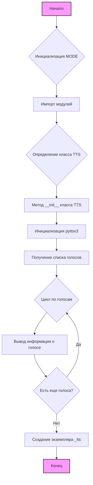

## Анализ кода `hypotez/src/goog/text_to_speech/__init__.py`

### <алгоритм>

1. **Инициализация**:
    - Устанавливается переменная `MODE = 'dev'`, определяющая режим работы (в данном случае, режим разработки).
    - Импортируются необходимые модули:
        - `header` (предположительно, кастомный модуль из проекта `hypotez`).
        - `attr`, `attrs` из пакета `attr` (для работы с классами и их атрибутами).
        - `pyttsx3` (библиотека для преобразования текста в речь).
        - `gTTS` из пакета `gtts` (библиотека для использования Google Text-to-Speech API).
2. **Создание класса `TTS`**:
    - Определяется класс `TTS` с описанием "Google text to speach".
    - Метод `__init__` этого класса вызывается при создании экземпляра класса.
    - Внутри `__init__`:
        - Создается экземпляр движка `pyttsx3` с помощью `pyttsx3.init()`.
        - Получается список доступных голосов с помощью `tts.getProperty('voices')`.
        - Проходится циклом по списку голосов и выводится информация о каждом голосе (по всей видимости, в целях отладки или демонстрации).
3. **Создание экземпляра `_tts`**:
    - Создается экземпляр класса `TTS` и присваивается переменной `_tts`.
    
### <mermaid>



**Описание зависимостей и переменных `mermaid`:**

-   **`Начало`**:  Начальная точка выполнения скрипта.
-   **`Инициализация MODE`**: Установка переменной `MODE` для определения режима работы.
-   **`Импорт модулей`**: Загрузка необходимых модулей, таких как `header`, `attr`, `pyttsx3`, `gTTS`.
-   **`Определение класса TTS`**: Объявление класса `TTS` для работы с преобразованием текста в речь.
-  **`Метод __init__ класса TTS`**:  Инициализация экземпляра класса `TTS`.
-  **`Инициализация pyttsx3`**: Создание экземпляра движка `pyttsx3`.
-  **`Получение списка голосов`**: Получение доступных голосов для синтеза речи.
-  **`Цикл по голосам`**: Перебор всех доступных голосов.
-  **`Вывод информации о голосе`**: Вывод информации о текущем голосе (например, имени и ID).
-  **`Есть еще голоса?`**: Проверка, есть ли еще голоса для обработки.
-  **`Создание экземпляра _tts`**: Создание экземпляра класса `TTS`.
-  **`Конец`**:  Конечная точка выполнения скрипта.

### <объяснение>

**Импорты:**

*   `header`: Это кастомный модуль, вероятно, содержащий общие определения или конфигурации, специфичные для проекта `hypotez`. Его точное назначение зависит от его реализации, но в контексте данного файла он используется без вызова каких-либо функций из него.
*   `attr` (из `attr`): Используется для определения классов с атрибутами.
*   `attrs` (из `attr`): Используется для определения классов с атрибутами.
*  `pyttsx3`: Это кросс-платформенная библиотека Python для преобразования текста в речь. Она используется для взаимодействия с движком преобразования текста в речь, установленным в системе пользователя.
*   `gTTS` (из `gtts`): Библиотека, которая позволяет использовать Google Text-to-Speech API для синтеза речи.

**Классы:**

*   `TTS`:
    *   **Роль**: Представляет функциональность преобразования текста в речь. Этот класс, по всей видимости, является оберткой для библиотеки `pyttsx3`.
    *   **Атрибуты**: На данный момент класс не имеет явно определенных атрибутов.
    *   **Методы**:
        *   `__init__(self, *args, **kwargs)`:
            *   **Аргументы**:  Принимает произвольное количество позиционных `*args` и именованных `**kwargs` аргументов.
            *   **Назначение**: Инициализирует объект `TTS`, используя `pyttsx3.init()`. Затем получает список доступных голосов и выводит их в консоль.
            *   **Пример**:
                ```python
                tts_instance = TTS() # Создается экземпляр класса.
                ```
    *   **Взаимодействие**: Создает экземпляр `pyttsx3` для работы с движком преобразования текста в речь.

**Переменные:**

*   `MODE`:
    *   **Тип**: Строка.
    *   **Использование**: Определяет режим работы (в данном случае `'dev'` для режима разработки). Возможно, в других частях проекта эта переменная используется для выбора различных конфигураций или поведения программы.
*   `_tts`:
    *   **Тип**: Экземпляр класса `TTS`.
    *   **Использование**: Представляет экземпляр класса `TTS`, который может использоваться для преобразования текста в речь.

**Потенциальные ошибки и области для улучшения:**

*   **Неполная реализация класса `TTS`**: В представленном коде метод `__init__` только выводит список голосов. Не реализованы методы для фактического преобразования текста в речь.
*   **Отсутствие обработки ошибок**: Код не обрабатывает возможные исключения при инициализации `pyttsx3` или при получении списка голосов.
*   **Зависимость от сторонних библиотек**: Зависимость от `pyttsx3` и `gtts` означает, что для работы кода эти библиотеки должны быть установлены.
*   **Отсутствие docstring для класса**:  У класса `TTS` нет docstring,  было бы полезно добавить краткое описание, какие задачи выполняет класс.
* **Предполагаемые проблемы:** 
    *   Код может не работать корректно на системах без установленного движка преобразования текста в речь.
    *   Вывод списка голосов в консоль может быть нежелателен в производственной среде.
*  **Улучшение**:
  * Рекомендуется добавить обработку ошибок, docstring для класса, а также методы для преобразования текста в речь.

**Цепочка взаимосвязей:**

1.  **`__init__.py`** (текущий файл) - отвечает за инициализацию функциональности преобразования текста в речь.
2.  **`header`** (предположительно) - предоставляет общие конфигурации для проекта.
3.  **`pyttsx3`** - предоставляет основной функционал для преобразования текста в речь.
4. **`gtts`** - предоставляет функционал для работы с Google Text-to-Speech API.
   
Этот файл является частью модуля `goog.text_to_speech` в пакете `hypotez` и предназначен для предоставления API для преобразования текста в речь в рамках этого проекта. Он зависит от библиотек `pyttsx3` и `gtts` для предоставления своей функциональности.