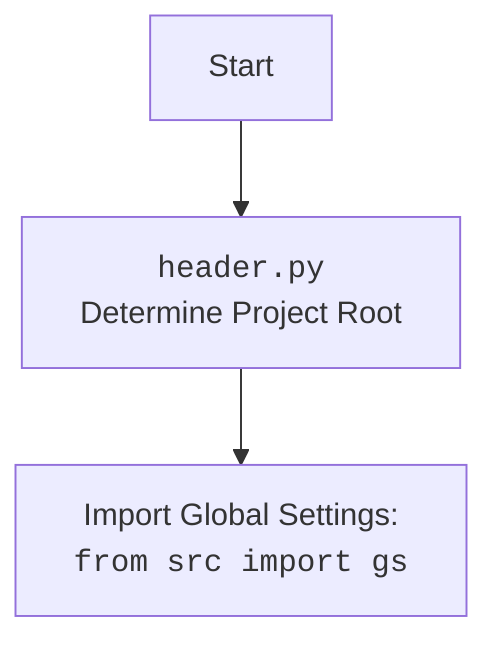

## Анализ кода `hypotez/src/goog/text_to_speech/__init__.py`

### 1. `<алгоритм>`

1.  **Импорт модулей:**
    *   Импортируется модуль `header` (предположительно для определения корневой директории проекта и глобальных настроек).
    *   Импортируется `attr` и `attrs` из библиотеки `attr`, вероятно, для создания классов данных.
    *   Импортируется `pyttsx3` для работы с синтезом речи, используя движок операционной системы.
    *   Импортируется `gTTS` из библиотеки `gtts` для работы с API Google Text-to-Speech.

2.  **Создание класса `TTS`:**
    *   Создается класс `TTS`, представляющий функциональность преобразования текста в речь.
    *   В конструкторе `__init__` класса `TTS`:
        *   Инициализируется движок `pyttsx3` с помощью `pyttsx3.init()`.
        *   Получается список доступных голосов с помощью `tts.getProperty('voices')`.
        *   Список голосов выводится в консоль.

3.  **Создание экземпляра класса `TTS`:**
    *   Создается экземпляр класса `TTS` с именем `_tts`.

**Примеры:**
*   **Импорт модулей:** `import header` (загружает настройки проекта), `from attr import attr, attrs` (для создания классов данных), `import pyttsx3` (для синтеза речи), `from gtts import gTTS` (для Google TTS).
*   **Создание экземпляра `TTS`**: `_tts = TTS()` создается для инициализации движка синтеза речи.
*   **Конструктор `__init__`:** `tts = pyttsx3.init()` - инициализирует движок, `voices = tts.getProperty('voices')` - получает список доступных голосов, `for v in voices: print(v)` - выводит информацию о голосах.

### 2. `<mermaid>`

```mermaid
flowchart TD
    Start --> ImportHeader[<code>header.py</code><br> Determine Project Root]
    ImportHeader --> ImportSettings[Import Global Settings:<br><code>from src import gs</code>]
    ImportSettings --> ImportAttr[Import <code>attr</code> and <code>attrs</code> from library <code>attr</code>]
    ImportAttr --> ImportPyttsx3[Import <code>pyttsx3</code> for OS-level speech synthesis]
    ImportPyttsx3 --> ImportGtts[Import <code>gTTS</code> from <code>gtts</code> library for Google TTS]
    ImportGtts --> ClassTTS[Define Class <code>TTS</code>:<br><code>class TTS()</code>]
    ClassTTS --> InitTTS[<code>__init__</code> method: <br>Initialize pyttsx3 engine, get available voices and print]
    InitTTS --> CreateTTSInstance[Create Instance <code>_tts</code> of Class <code>TTS</code>]
    CreateTTSInstance --> End
```

**Анализ зависимостей `mermaid`:**

*   `header.py`: Определяет корень проекта и загружает глобальные настройки.
*   `attr`: Библиотека используется для создания классов данных (не используется в явном виде в данном фрагменте).
*   `pyttsx3`: Библиотека для синтеза речи, использующая движок операционной системы.
*   `gtts`: Библиотека для работы с API Google Text-to-Speech.
*   `TTS`: Класс, который инкапсулирует функциональность преобразования текста в речь (использует pyttsx3 и gTTS)

**Дополнительный `mermaid` блок для `header.py`**



### 3. `<объяснение>`

**Импорты:**

*   `import header`: Импортирует модуль `header`, который, как предполагается, настраивает путь к проекту и импортирует глобальные настройки из файла `src/gs`.
    **Взаимосвязь с `src`:** Этот импорт связывает данный модуль с глобальными настройками проекта, предполагая, что они находятся в каталоге `src` и доступны через `gs`
*   `from attr import attr, attrs`: Импортирует `attr` и `attrs` из библиотеки `attr`, которая используется для более лаконичного создания классов данных. В данном коде не используется.
    **Взаимосвязь с `src`:** Непосредственной связи с другими пакетами `src` нет, но библиотека используется для определения классов, которые в свою очередь могут быть частью проекта.
*   `import pyttsx3`: Импортирует библиотеку `pyttsx3`, которая используется для синтеза речи через движок операционной системы.
    **Взаимосвязь с `src`:** Прямой связи нет, но `pyttsx3` используется в классе `TTS`, который является частью пакета `src.goog.text_to_speech`.
*   `from gtts import gTTS`: Импортирует класс `gTTS` из библиотеки `gtts`, которая используется для взаимодействия с Google Text-to-Speech API.
    **Взаимосвязь с `src`:** Прямой связи нет, но `gTTS` потенциально может использоваться в классе `TTS`, и поэтому является частью пакета `src.goog.text_to_speech` (хотя в данном примере не используется явно).

**Классы:**

*   `class TTS:`:
    *   **Роль:** Представляет функциональность преобразования текста в речь.
    *   **Атрибуты:** Не определены явно в представленном коде.
    *   **Методы:**
        *   `__init__(self, *args, **kwards)`: Конструктор класса. Инициализирует движок `pyttsx3`, получает список доступных голосов и выводит их в консоль. Аргументы `*args` и `**kwards` позволяют передавать произвольные позиционные и именованные аргументы.
    *   **Взаимодействие:** Инициализирует движок `pyttsx3`, который взаимодействует с операционной системой для синтеза речи.
    
**Функции:**

*   В данном коде нет явно определенных функций, но есть метод `__init__` в классе `TTS`:
    *   **Аргументы:** `self` (ссылка на экземпляр класса), `*args`, `**kwards` (неопределенное количество позиционных и именованных аргументов)
    *   **Возвращаемые значения:** Отсутствуют (метод является конструктором)
    *   **Назначение:** Инициализация экземпляра класса `TTS`.
    *   **Примеры:** `tts = pyttsx3.init()` - инициализирует движок синтеза речи; `voices = tts.getProperty('voices')` - получает список доступных голосов, `for v in voices: print(v)` - выводит информацию о голосах

**Переменные:**

*   `_tts`: Экземпляр класса `TTS`.
    *   **Тип:** `TTS`.
    *   **Использование:** Используется для доступа к методам и свойствам класса `TTS`.

**Потенциальные ошибки и области для улучшения:**

*   В конструкторе класса `TTS` не происходит никакого фактического синтеза речи, только инициализация `pyttsx3` и вывод списка голосов. Это может быть недостаточным, если предполагается фактическое использование.
*   Класс `TTS` объявлен с аргументами `*args, **kwards`, но нигде не используется в коде, вероятно, его нужно удалить.
*   Не используется `gTTS` для Google Text-to-Speech. Возможно, следует реализовать функциональность с использованием `gTTS`.
*   Нет обработки ошибок при инициализации `pyttsx3` и при получении списка голосов.
*   Не определены атрибуты и методы для фактического преобразования текста в речь.

**Цепочка взаимосвязей:**

1.  `header.py`: Устанавливает корень проекта и глобальные настройки.
2.  `src.goog.text_to_speech.__init__.py`: Импортирует `header.py`, получая доступ к глобальным настройкам, а также библиотеки `pyttsx3` и `gtts`.
3.  Класс `TTS`: Использует `pyttsx3` для синтеза речи и потенциально может использовать `gTTS` для Google Text-to-Speech.
4.  `_tts`: Экземпляр класса `TTS`, который можно использовать для преобразования текста в речь.