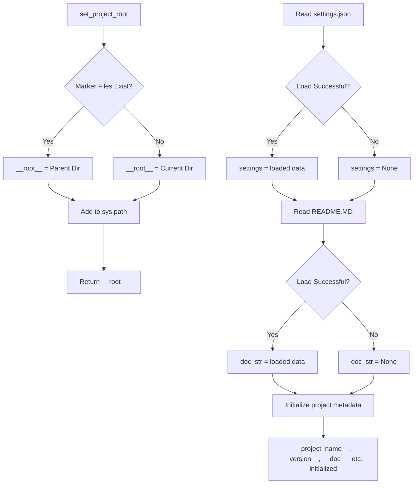

# <input code>

```python
## \file hypotez/src/goog/text_to_speech/header.py
# -*- coding: utf-8 -*-
#! venv/Scripts/python.exe
#! venv/bin/python/python3.12

"""
.. module: src.goog.text_to_speech 
	:platform: Windows, Unix
	:synopsis:

"""
MODE = 'dev'

import sys
import json
from packaging.version import Version

from pathlib import Path
def set_project_root(marker_files=('pyproject.toml', 'requirements.txt', '.git')) -> Path:
    """
    Finds the root directory of the project starting from the current file's directory,
    searching upwards and stopping at the first directory containing any of the marker files.

    Args:
        marker_files (tuple): Filenames or directory names to identify the project root.
    
    Returns:
        Path: Path to the root directory if found, otherwise the directory where the script is located.
    """
    __root__:Path
    current_path:Path = Path(__file__).resolve().parent
    __root__ = current_path
    for parent in [current_path] + list(current_path.parents):
        if any((parent / marker).exists() for marker in marker_files):
            __root__ = parent
            break
    if __root__ not in sys.path:
        sys.path.insert(0, str(__root__))
    return __root__


# Get the root directory of the project
__root__ = set_project_root()
"""__root__ (Path): Path to the root directory of the project"""

from src import gs

settings:dict = None
try:
    with open(gs.path.root / 'src' /  'settings.json', 'r') as settings_file:
        settings = json.load(settings_file)
except (FileNotFoundError, json.JSONDecodeError):
    ...

doc_str:str = None
try:
    with open(gs.path.root / 'src' /  'README.MD', 'r') as settings_file:
        doc_str = settings_file.read()
except (FileNotFoundError, json.JSONDecodeError):
    ...


__project_name__ = settings.get("project_name", 'hypotez') if settings  else 'hypotez'
__version__: str = settings.get("version", '')  if settings  else ''
__doc__: str = doc_str if doc_str else ''
__details__: str = ''
__author__: str = settings.get("author", '')  if settings else ''
__copyright__: str = settings.get("copyrihgnt", '')  if settings else ''
__cofee__: str = settings.get("cofee", "Treat the developer to a cup of coffee for boosting enthusiasm in development: https://boosty.to/hypo69")  if settings else "Treat the developer to a cup of coffee for boosting enthusiasm in development: https://boosty.to/hypo69"
```

# <algorithm>

1. **`set_project_root()` function:**
   - Takes a tuple of marker files as input.
   - Starts from the directory of the current file (`__file__`).
   - Iterates upwards through parent directories.
   - Checks if any of the marker files exist in the current parent directory.
   - If a marker file is found, the function sets `__root__` to the parent directory and breaks the loop.
   - If no marker files are found, `__root__` remains the current directory.
   - Adds the root directory to `sys.path` if it's not already present.
   - Returns the `__root__` Path object.

   *Example*: If `__file__` is in `/home/user/project/goog/text_to_speech/header.py`, and `pyproject.toml` exists in `/home/user/project`, the function will return `/home/user/project`.

2. **Initialization of `__root__`:**
   - Calls `set_project_root()` to obtain the project root directory.
   - Stores the result in the global variable `__root__`.


3. **Loading `settings.json`:**
   - Uses `gs.path.root` (likely a module or object defined elsewhere, providing access to a root path).
   - Attempts to load JSON data from `settings.json` located within the project root.
   - Stores the loaded data in the `settings` variable if successful.
   - Handles `FileNotFoundError` and `json.JSONDecodeError` with `...` for no operation.

4. **Loading `README.MD`:**
   - Attempts to load the content of `README.MD` file.
   - Stores the loaded content into `doc_str`.
   - Handles potential errors using `...`.


5. **Initialization of project metadata:**
   - Sets project name, version, docstring, details, author, copyright and coffee link based on data from `settings.json`.
   - Uses `settings.get()` to handle cases where values might not be present in `settings.json`.
   - Uses default values if the corresponding keys are not found in `settings.json`.

   *Example*: If "project_name" is not found in `settings.json`, `__project_name__` will be set to "hypotez".


# <mermaid>



The diagram shows how the `set_project_root` function identifies the project root and initializes the `__root__` global variable. It then shows the loading and handling of `settings.json` and `README.MD` files. This finally initializes project metadata based on the loaded data or default values. Dependencies include `pathlib`, `json`, `packaging.version`, and `sys`.


# <explanation>

* **Imports:**
    - `sys`: Provides access to system-specific parameters and functions, like `sys.path`.  Crucial for modifying the Python import search path.
    - `json`: Used for loading and saving JSON data from/to files.
    - `packaging.version`: Used to handle package versions in a robust way.
    - `pathlib`: Provides an object-oriented way of working with file paths, making the code more readable and less prone to errors related to different OS path separators.


* **`set_project_root` function:** This function is crucial for locating the project root directory. It ensures that the script can find other modules within the project.

* **`gs.path.root`:** This is likely a member of a `gs` (possibly "global settings") module which contains constants, providing the path to the root of the project.


* **`settings`:** A dictionary to hold configuration data loaded from `settings.json`.

* **`doc_str`:** A string variable that will contain the content of `README.MD`. This is likely used for documentation purposes.

* **Global Variables (`__project_name__`, etc.):** These variables store metadata about the project, such as its name, version, author, etc.

* **Error Handling (`try...except` blocks):**  The code includes `try...except` blocks to handle potential `FileNotFoundError` and `json.JSONDecodeError` during file reading and JSON parsing. This improves robustness, preventing crashes if the required files are not found or have invalid format.


* **Possible Improvements:**
    - Consider using type hinting more consistently throughout the code.
    - The `...` in the `except` blocks doesn't provide feedback.  Consider logging the error or raising a more specific exception to aid debugging.
    - Consider using a dedicated configuration management library instead of manually loading JSON files.


**Relationship to other parts of the project:**

The code interacts with the `gs` module to determine the project root directory and load configuration data. This suggests a larger project structure where `gs` likely manages project-wide settings and paths. The usage of `__root__` implies that the code is likely part of a larger project infrastructure.