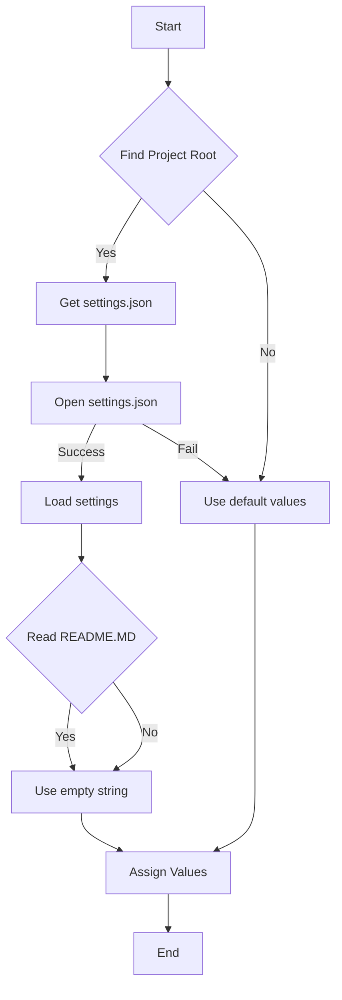
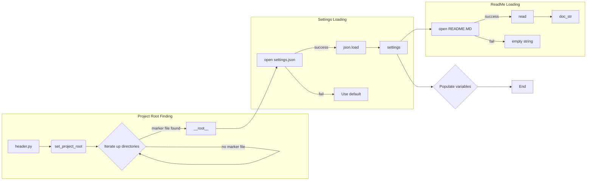

# <input code>

```python
## \file hypotez/src/goog/text_to_speech/header.py
# -*- coding: utf-8 -*-\
#! venv/Scripts/python.exe
#! venv/bin/python/python3.12

"""
.. module: src.goog.text_to_speech 
	:platform: Windows, Unix
	:synopsis:

"""
MODE = 'dev'

import sys
import json
from packaging.version import Version

from pathlib import Path
def set_project_root(marker_files=('pyproject.toml', 'requirements.txt', '.git')) -> Path:
    """
    Finds the root directory of the project starting from the current file's directory,
    searching upwards and stopping at the first directory containing any of the marker files.

    Args:
        marker_files (tuple): Filenames or directory names to identify the project root.
    
    Returns:
        Path: Path to the root directory if found, otherwise the directory where the script is located.
    """
    __root__:Path
    current_path:Path = Path(__file__).resolve().parent
    __root__ = current_path
    for parent in [current_path] + list(current_path.parents):
        if any((parent / marker).exists() for marker in marker_files):
            __root__ = parent
            break
    if __root__ not in sys.path:
        sys.path.insert(0, str(__root__))
    return __root__


# Get the root directory of the project
__root__ = set_project_root()
"""__root__ (Path): Path to the root directory of the project"""

from src import gs

settings:dict = None
try:
    with open(gs.path.root / 'src' /  'settings.json', 'r') as settings_file:
        settings = json.load(settings_file)
except (FileNotFoundError, json.JSONDecodeError):
    ...

doc_str:str = None
try:
    with open(gs.path.root / 'src' /  'README.MD', 'r') as settings_file:
        doc_str = settings_file.read()
except (FileNotFoundError, json.JSONDecodeError):
    ...


__project_name__ = settings.get("project_name", 'hypotez') if settings  else 'hypotez'
__version__: str = settings.get("version", '')  if settings  else ''
__doc__: str = doc_str if doc_str else ''
__details__: str = ''
__author__: str = settings.get("author", '')  if settings  else ''
__copyright__: str = settings.get("copyrihgnt", '')  if settings  else ''
__cofee__: str = settings.get("cofee", "Treat the developer to a cup of coffee for boosting enthusiasm in development: https://boosty.to/hypo69")  if settings  else "Treat the developer to a cup of coffee for boosting enthusiasm in development: https://boosty.to/hypo69"
```

# <algorithm>



* **Find Project Root (B):** The script starts by finding the project's root directory. It starts from the current file's directory and walks up the directory tree until it finds a directory containing any of the specified marker files (pyproject.toml, requirements.txt, .git).
* **Load Settings (F):** If the project root is found, the script attempts to load settings from the settings.json file located in the project's root directory within the 'src' folder.
* **Read README.MD (H):**  The script tries to read the README.MD file.
* **Assign Values (I):** The script assigns the loaded settings (or default values if loading fails) to variables like `__project_name__`, `__version__`, `__doc__`, etc.
* **End (J):** The script finishes execution after populating the variables.

# <mermaid>



# <explanation>

* **Imports:**
    * `sys`: Provides access to system-specific parameters and functions, like `sys.path` for adding directories to the Python module search path.
    * `json`: Used for handling JSON data for loading the `settings.json` file.
    * `packaging.version`:  Used for handling version strings, likely for comparing versions.
    * `pathlib`: Provides object-oriented tools for working with files and paths, making code more readable and robust.
    * `src.gs`: This import likely refers to a module (`gs`) within the `src` package.  It's crucial to the code's functionality as it provides paths (`gs.path.root`). This implies a modular design where the `gs` module likely handles paths to project resources (e.g., the root of the project).

* **`set_project_root` function:** This function is crucial for locating the project root directory. It starts from the current file's directory and traverses up the directory hierarchy. It's used to add the project's root directory to the Python module search path (`sys.path`) using `sys.path.insert(0, str(__root__))`, which helps to correctly import modules in the `src` package and is a good coding practice to be consistent with.
    * Arguments: `marker_files`: A tuple of filenames or directory names to search for in parent directories. This makes it more flexible, allowing the user to define markers to find the project root based on custom files or folders.
    * Return value: A `Path` object representing the root directory of the project.
    * Example: `set_project_root(('pyproject.toml', 'requirements.txt'))`.


* **Variables:**
    * `__root__`: Holds the absolute path to the project's root directory. This is a crucial variable for resolving relative paths later.
    * `settings`: A dictionary holding project settings loaded from `settings.json`.
    * `doc_str`: Stores the content of the README.MD file.
    * `__project_name__`, `__version__`, etc.: Variables storing project metadata extracted from the settings.

* **Error Handling (`try...except`):** The code uses `try...except` blocks to handle potential `FileNotFoundError` and `json.JSONDecodeError` exceptions when reading `settings.json` and `README.MD`. This makes the code more robust, preventing it from crashing if these files are missing or have invalid JSON.


* **Possible Improvements:**
    * **More robust error handling:** The `try...except` blocks currently use `...` for the `except` clause.  More specific exception handling could help in diagnosing problems like malformed JSON. A more informative message might be better than `...` if it catches an unexpected exception (such as a more specific `json.JSONDecodeError` exception).
    * **Type hints:** While type hints are present, they could be more comprehensive to improve readability and maintainability.
    * **Explicit `root` handling:**  `gs.path.root` is potentially implicit, but using an explicit `Path` object for `root` would improve clarity. This is a small improvement but would align the code with the use of other `Path` objects throughout the code, especially within the `set_project_root()` function.
* **Relationship to other parts:**  The code interacts with the `src` package, specifically with the `gs` module (likely related to project file paths). This module is imported and utilized to find and construct paths within the project structure. This suggests a clear architectural separation of concerns between the `gs` module (managing paths) and the file handling logic within `header.py`. The settings are stored in `src/settings.json`, and the README is read for documentation.


This code snippet, part of the overall project, seems to be designed for retrieving project settings and metadata, likely to be used by various parts of the application, with the `__root__` attribute allowing resolving relative paths (making the project self-contained without needing to hardcode paths).