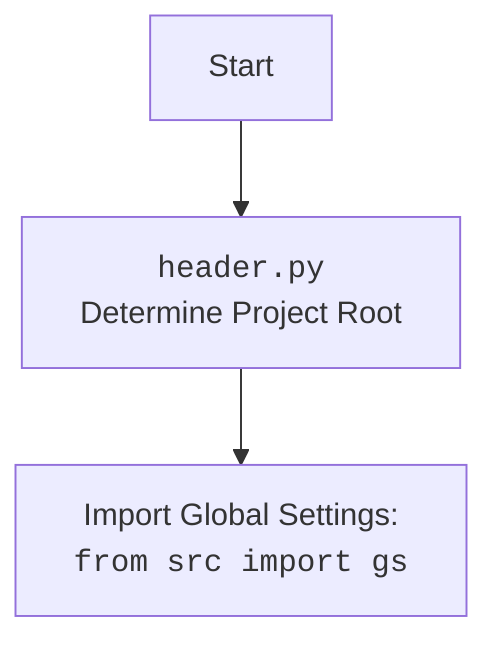

## ИНСТРУКЦИЯ:

Анализируй предоставленный код подробно и объясни его функциональность. Ответ должен включать три раздела:  

1. **<алгоритм>**: Опиши рабочий процесс в виде пошаговой блок-схемы, включая примеры для каждого логического блока, и проиллюстрируй поток данных между функциями, классами или методами.  
2. **<mermaid>**: Напиши код для диаграммы в формате `mermaid`, проанализируй и объясни все зависимости, 
    которые импортируются при создании диаграммы. 
    **ВАЖНО!** Убедитесь, что все имена переменных, используемые в диаграмме `mermaid`, 
    имеют осмысленные и описательные имена. Имена переменных вроде `A`, `B`, `C`, и т.д., не допускаются!  
    
    **Дополнительно**: Если в коде есть импорт `import header`, добавьте блок `mermaid` flowchart, объясняющий `header.py`:\
    ```mermaid
    flowchart TD
        Start --> Header[<code>header.py</code><br> Determine Project Root]
    
        Header --> import[Import Global Settings: <br><code>from src import gs</code>] 
    ```

3. **<объяснение>**: Предоставьте подробные объяснения:  
   - **Импорты**: Их назначение и взаимосвязь с другими пакетами `src.`.  
   - **Классы**: Их роль, атрибуты, методы и взаимодействие с другими компонентами проекта.  
   - **Функции**: Их аргументы, возвращаемые значения, назначение и примеры.  
   - **Переменные**: Их типы и использование.  
   - Выделите потенциальные ошибки или области для улучшения.  

Дополнительно, постройте цепочку взаимосвязей с другими частями проекта (если применимо).  

Это обеспечивает всесторонний и структурированный анализ кода.
## Формат ответа: `.md` (markdown)
**КОНЕЦ ИНСТРУКЦИИ**
```markdown
## Анализ кода `header.py`

### 1. <алгоритм>

**1. Определение корневой директории проекта (`set_project_root`)**
   - **Начало:** Функция принимает кортеж `marker_files` (по умолчанию `('__root__', '.git')`).
   - **Получение текущего пути:** Определяется абсолютный путь к директории, в которой находится текущий файл (`__file__`).
   - **Поиск корневой директории:**
     - Перебираются все родительские директории, начиная с текущей.
     - Для каждой директории проверяется, существует ли в ней хотя бы один из файлов или директорий, указанных в `marker_files`.
       - **Пример**:
         - Если `marker_files` = `('__root__', '.git')`, функция ищет файл `__root__` или директорию `.git` в текущей директории и выше.
         - Если найдено, то текущая родительская директория считается корнем проекта и сохраняется в переменной `__root__`.
     - Если корневая директория найдена, цикл прекращается.
   - **Добавление корневой директории в `sys.path`:**
     - Проверяется, находится ли корневая директория уже в `sys.path`.
     - Если нет, то она добавляется в начало `sys.path`, что позволяет импортировать модули из корневой директории проекта.
   - **Возврат:** Функция возвращает объект `Path`, представляющий путь к корневой директории проекта.
**2. Инициализация глобальных переменных**
    - **Определение корня проекта**: Вызывается функция `set_project_root` для определения корня проекта, результат сохраняется в переменной `__root__`.
    - **Загрузка настроек**:
      -  Файл `settings.json` из `src/settings.json` открывается и загружаются настройки, если файл существует и является валидным JSON. Если возникают ошибки `FileNotFoundError` или `json.JSONDecodeError` то переменной `settings` присваивается значение `None`.
    - **Загрузка документации**:
      - Файл `README.MD` из `src/README.MD` открывается и сохраняет содержимое файла в переменную `doc_str`. Если возникают ошибки `FileNotFoundError` или `json.JSONDecodeError` то переменной `doc_str` присваивается значение `None`.
    - **Инициализация глобальных переменных**: Инициализируются глобальные переменные:
      - `__project_name__`: Имя проекта (по умолчанию `hypotez`), либо из файла `settings.json` если он существует
      - `__version__`: Версия проекта,  либо из файла `settings.json` если он существует
      - `__doc__`: Документация проекта, либо из переменной `doc_str` если она существует
      - `__details__`: Детальная информация о проекте (по умолчанию пустая строка)
      - `__author__`: Автор проекта,  либо из файла `settings.json` если он существует
      - `__copyright__`: Информация об авторских правах,  либо из файла `settings.json` если он существует
      - `__cofee__`: Сообщение с призывом пожертвовать на кофе разработчику (по умолчанию строка с ссылкой на boosty.to),  либо из файла `settings.json` если он существует
**3. Импорт глобальных настроек**
    - Выполняется импорт `from src import gs`

### 2. <mermaid>

```mermaid
flowchart TD
    Start[Начало] --> FindRoot[<code>set_project_root()</code><br>Определение корня проекта]
    FindRoot --> CheckMarkerFiles[Проверка наличия маркерных файлов в текущей и родительских директориях]
    CheckMarkerFiles -- "Маркерный файл найден" --> SetRoot[Установка корня проекта]
    CheckMarkerFiles -- "Маркерный файл не найден" --> NextParent[Переход к родительской директории]
    NextParent --> CheckMarkerFiles
    SetRoot --> AddToSysPath[Добавление корня проекта в <code>sys.path</code>]
    AddToSysPath --> ReturnRoot[Возврат корня проекта]
    ReturnRoot --> LoadSettings[Загрузка настроек из <code>settings.json</code>]
    LoadSettings -- "Файл найден" --> ParseSettings[Парсинг настроек]
    LoadSettings -- "Файл не найден" --> InitDefaultSettings[Инициализация настроек по умолчанию]
    ParseSettings --> LoadDoc[Загрузка документации из <code>README.MD</code>]
    InitDefaultSettings --> LoadDoc
    LoadDoc -- "Файл найден" --> ParseDoc[Парсинг документации]
    LoadDoc -- "Файл не найден" --> InitDefaultDoc[Инициализация пустой документации]
    ParseDoc --> InitGlobalVariables[Инициализация глобальных переменных]
    InitDefaultDoc --> InitGlobalVariables
    InitGlobalVariables --> ImportGS[Импорт глобальных настроек: <code>from src import gs</code>]
    ImportGS --> End[Конец]
```


### 3. <объяснение>

**Импорты:**

*   `sys`: Используется для работы с системными переменными и функциями, такими как `sys.path` для изменения пути поиска модулей.
*   `json`: Используется для работы с JSON файлами, такими как `settings.json`, для загрузки настроек.
*   `packaging.version.Version`: Используется для работы с версиями проекта, но в данном коде явно не применяется. Возможно, импорт добавлен для дальнейшего использования.
*   `pathlib.Path`: Используется для работы с путями к файлам и директориям, обеспечивая кросс-платформенность.

**Функции:**

*   `set_project_root(marker_files: tuple = ('__root__', '.git')) -> Path`:
    *   **Назначение**: Находит корневую директорию проекта, начиная с директории, в которой находится текущий файл.
    *   **Аргументы**:
        *   `marker_files` (tuple): Кортеж с именами файлов или директорий, которые являются маркерами для определения корневой директории проекта. По умолчанию используется `('__root__', '.git')`.
    *   **Возвращаемое значение**: Объект `pathlib.Path`, представляющий путь к корневой директории проекта.
    *   **Пример**:
        ```python
        # Пусть файл находится в директории /home/user/project/src/goog/text_to_speech/header.py
        # И маркерный файл '.git' находится в директории /home/user/project
        root_path = set_project_root()
        print(root_path)  # Выведет: /home/user/project
        ```

**Переменные:**

*   `__root__`: Объект `pathlib.Path`, представляющий путь к корневой директории проекта. Определяется вызовом `set_project_root()`.
*   `settings`: Словарь (dict), содержащий настройки проекта, загруженные из файла `settings.json`. Если файл не найден или не является валидным JSON, значение `None`.
*   `doc_str`: Строка (str), содержащая документацию проекта из файла `README.MD`, если такой файл существует и его удалось прочитать. Если файл не найден или не является валидным, значение `None`.
*   `__project_name__`: Строка (str), имя проекта. Загружается из settings.json или 'hypotez', если настроек нет.
*   `__version__`: Строка (str), версия проекта. Загружается из settings.json или пустая строка, если настроек нет.
*   `__doc__`: Строка (str), документация проекта. Загружается из README.MD или пустая строка, если  не удалось прочитать.
*   `__details__`: Строка (str), детальная информация о проекте. Всегда пустая строка.
*   `__author__`: Строка (str), автор проекта. Загружается из settings.json или пустая строка, если настроек нет.
*   `__copyright__`: Строка (str), информация об авторских правах. Загружается из settings.json или пустая строка, если настроек нет.
*   `__cofee__`: Строка (str), призыв к пожертвованию на кофе разработчику. Загружается из settings.json или заданное значение по умолчанию, если настроек нет.

**Взаимосвязь с другими частями проекта:**
*   Импорт `from src import gs`: предполагает, что в пакете `src` есть модуль `gs`, в котором определены глобальные настройки или константы, используемые в проекте. Модуль может содержать пути к файлам, переменные окружения и т.д.
*   Файл `settings.json` используется для загрузки настроек проекта, что позволяет кастомизировать его поведение без изменения кода.
*   Файл `README.MD` используется для загрузки документации.

**Потенциальные ошибки и области для улучшения:**

*   **Обработка исключений**: Код использует "..." в блоках except для обработки ошибок `FileNotFoundError` и `json.JSONDecodeError`. Было бы лучше регистрировать эти ошибки или выводить предупреждения для отладки.
*   **Жестко заданные пути:** Пути к файлам `settings.json` и `README.MD`  заданы жестко. Было бы лучше использовать переменные или константы, определенные в `src.gs`.
*   **Использование packaging.version.Version:** Импорт `packaging.version` присутствует, но нигде не используется. Необходимо или убрать импорт, или использовать его для валидации и сравнения версий.
*   **Отсутствие проверки `settings`:** При получении значения из `settings`, код предполагает, что `settings` является `dict`. Однако, в случае ошибки чтения `settings.json`, `settings` может быть `None`. Неплохо было бы добавить проверку `if settings is None: ...` перед чтением значений, чтобы избежать `AttributeError`.

**Цепочка взаимосвязей:**

`header.py` -> `src/gs.py` -> `settings.json` -> `README.MD` -> модули проекта

В целом, код `header.py` выполняет важную функцию по определению корневой директории проекта, загрузке настроек и документации, а также инициализации глобальных переменных.
```