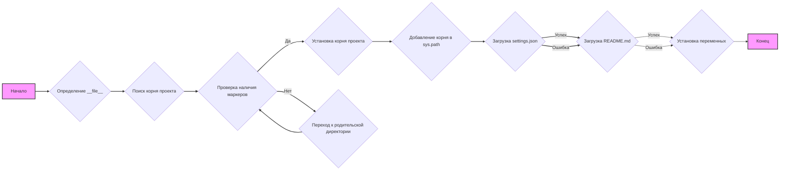
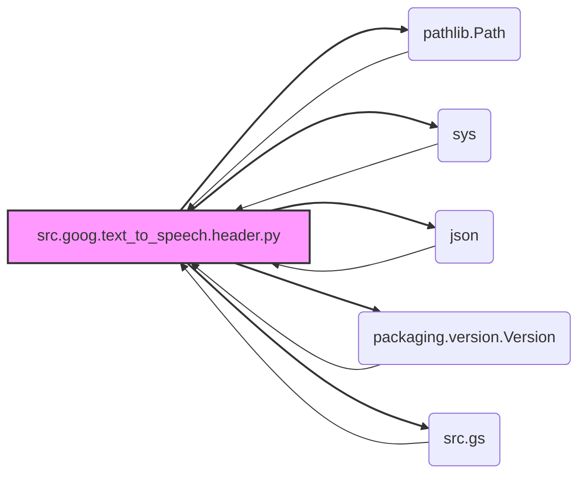

## Анализ кода `hypotez/src/goog/text_to_speech/header.py`

### 1. <алгоритм>

**Блок-схема:**

**Пояснения к блок-схеме:**

1.  **Начало**: Программа начинает выполнение скрипта.
2.  **Определение `__file__`**: Определяется путь к текущему файлу.
3.  **Поиск корня проекта**: Запускается функция `set_project_root()` для определения корневой директории проекта.
4.  **Проверка наличия маркеров**: Функция `set_project_root()` проверяет, есть ли в текущей директории или ее родительских директориях файлы-маркеры (например, `pyproject.toml`, `requirements.txt`, `.git`).
    *   **Пример:** Если текущий файл находится в `hypotez/src/goog/text_to_speech/header.py`, а файл `pyproject.toml` в `hypotez`, то корневой директорией будет `hypotez`.
5.  **Установка корня проекта**: Если маркер найден, корневая директория сохраняется.
6.  **Переход к родительской директории**: Если маркер не найден, осуществляется переход к родительской директории.
7. **Добавление корня в `sys.path`**: Корневая директория добавляется в список путей поиска модулей `sys.path`.
8. **Загрузка `settings.json`**: Попытка загрузки данных из файла `settings.json` для получения параметров проекта.
   *   **Пример:** Если `settings.json` содержит `{"project_name": "my_project", "version": "1.0.0"}`, то переменные `__project_name__` и `__version__` получат эти значения.
9.  **Загрузка `README.md`**: Попытка загрузки содержимого из файла `README.md`.
10. **Установка переменных**: Переменные проекта, такие как `__project_name__`, `__version__`, `__doc__` и другие, устанавливаются на основе данных из `settings.json` и `README.md`.
11. **Конец**: Завершение выполнения скрипта.

### 2. <mermaid>

**Пояснения к диаграмме:**

*   `src.goog.text_to_speech.header.py`: Основной скрипт, который импортирует другие модули.
*   `pathlib.Path`: Модуль для работы с путями файловой системы. Используется в функции `set_project_root`.
*   `sys`: Модуль для доступа к системным переменным, используется для добавления корня проекта в `sys.path`.
*   `json`: Модуль для работы с JSON, используется для чтения `settings.json`.
*   `packaging.version.Version`: Модуль для работы с версиями (хотя в коде он не используется).
*   `src.gs`: Пакет `src.gs`, который, предположительно, содержит общие переменные и функции для проекта, в данном коде используется для получения пути к корню проекта (`gs.path.root`).

Стрелки указывают зависимости: модуль `header.py` импортирует все перечисленные модули.

### 3. <объяснение>

#### Импорты

*   **`sys`**: Используется для работы с системными переменными и функциями, в частности для добавления пути к корню проекта в список путей поиска модулей (`sys.path`). Это позволяет импортировать модули из проекта, не устанавливая его.
*   **`json`**: Используется для работы с JSON-данными, в частности для загрузки настроек проекта из файла `settings.json`.
*   **`packaging.version.Version`**:  Импортируется, но фактически не используется в коде. Предназначен для сравнения версий, возможно, для последующего использования.
*   **`pathlib.Path`**:  Предоставляет удобный способ работы с путями в файловой системе, включая создание, проверку существования и другие манипуляции с путями.
*   **`src.gs`**:  Импортируется из локального пакета `src`. Предположительно, это модуль, предоставляющий общие ресурсы, как например, путь к корню проекта (`gs.path.root`).

#### Классы

В данном коде нет явного определения классов.

#### Функции

*   **`set_project_root(marker_files: tuple = ('pyproject.toml', 'requirements.txt', '.git')) -> Path`**:
    *   **Аргументы**:
        *   `marker_files`: Кортеж строк, представляющих имена файлов или каталогов, которые используются для идентификации корневой директории проекта.
    *   **Возвращаемое значение**:
        *   `Path`:  Объект `Path`, представляющий путь к корневой директории проекта. Если маркеры не найдены, то возвращает путь к директории, где расположен текущий файл.
    *   **Назначение**: Находит корневую директорию проекта, начиная от директории текущего файла и двигаясь вверх по иерархии каталогов, пока не будет найдена директория, содержащая один из указанных маркеров. Возвращает объект `Path` к корневой директории.
    *   **Примеры**:
        *   Если проект находится в каталоге `hypotez`, а `pyproject.toml` лежит в этой директории, то функция вернёт `Path` к `hypotez`.
        *   Если маркеры не найдены, то вернётся путь к директории, где находится `header.py`.

#### Переменные

*   `__root__`: `Path` (объект `pathlib.Path`) - путь к корневой директории проекта, используется для доступа к файлам проекта.
*   `settings`: `dict` - словарь, который содержит настройки проекта, загруженные из файла `settings.json`.
*   `doc_str`: `str` - строка, которая содержит содержание файла `README.md`.
*   `__project_name__`: `str` - название проекта, извлекается из файла `settings.json`, по умолчанию `hypotez`.
*   `__version__`: `str` - версия проекта, извлекается из файла `settings.json`, по умолчанию пустая строка.
*   `__doc__`: `str` - описание проекта, извлекается из файла `README.md`, по умолчанию пустая строка.
*   `__details__`: `str` -  пустая строка, не используется в коде, может быть для последующего использования.
*   `__author__`: `str` - автор проекта, извлекается из файла `settings.json`, по умолчанию пустая строка.
*    `__copyright__`: `str` - авторское право проекта, извлекается из файла `settings.json`, по умолчанию пустая строка.
*   `__cofee__`: `str` - текст для призыва пользователя к "угощению разработчика", извлекается из файла `settings.json`, по умолчанию "Treat the developer to a cup of coffee for boosting enthusiasm in development: https://boosty.to/hypo69".
*   `MODE`: `str` - режим работы, по умолчанию `dev`, может быть использована для различных целей в коде.

#### Потенциальные ошибки и области для улучшения

*   **Обработка ошибок:** При загрузке `settings.json` и `README.md` используется `try...except`, но в случае ошибки просто ставится `...` без какой-либо обработки. Возможно, стоит выводить предупреждение или устанавливать значения по умолчанию.
*   **Использование `packaging.version.Version`**:  Импорт `packaging.version.Version`,  не используется в этом файле, можно удалить.
*   **Опечатки**: В имени переменной `__copyright__` есть опечатка (`copyrihgnt`).
*   **Жестко закодированные пути**: Пути к `settings.json` и `README.md` жестко закодированы как `gs.path.root / 'src' /  'settings.json'` и `'gs.path.root / 'src' /  'README.MD'`. Если структура каталогов изменится, код сломается.
*   **Глобальные переменные**: Глобальные переменные, такие как `settings`, `doc_str` и другие, могут усложнить поддержку и отладку. Возможно, следует использовать класс для хранения этих данных.
*   **Отсутствие документации:** Не хватает документации для некоторых переменных, например, для переменной `MODE`.

#### Взаимосвязи с другими частями проекта

*   Данный файл зависит от модуля `src.gs`, который, судя по всему, предоставляет общую функциональность, такую как путь к корню проекта.
*   Файл использует `settings.json`, который задаёт настройки проекта.
*   Файл использует `README.MD` для описания проекта.
*   Также, данный файл устанавливает `sys.path`, что влияет на импорт модулей в других частях проекта.

В целом, этот файл представляет собой модуль инициализации, который устанавливает переменные проекта и добавляет путь к его корню в список путей поиска модулей.