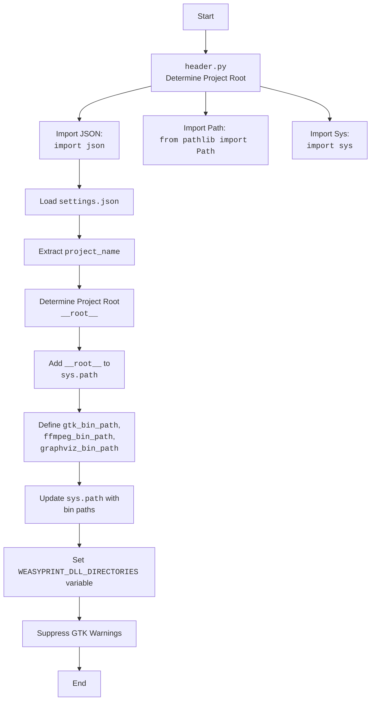

## АНАЛИЗ КОДА

### <алгоритм>

1. **Загрузка настроек из `settings.json`**:
   - Открывает файл `settings.json` в режиме чтения.
   - Загружает JSON-данные из файла в переменную `settings`.
   - Извлекает значение ключа `project_name` из `settings`. Если ключ отсутствует, устанавливает значение по умолчанию `hypotez`.
   - *Пример:* `settings.json` содержит `{"project_name": "my_project"}`. Тогда `project_name` будет равно `my_project`.

2. **Определение корневого каталога проекта (`__root__`)**:
    - Получает текущий рабочий каталог с помощью `Path.cwd()`.
    - Преобразует путь в абсолютный с помощью `resolve()`.
    - Находит индекс родительского каталога, который соответствует имени проекта `project_name` (например, `hypotez`).
    - Используя этот индекс, определяет корневой каталог проекта.
     - *Пример:* Текущий каталог `/home/user/projects/hypotez/src/gui/context_menu`. Тогда `__root__` будет равен `/home/user/projects/hypotez`.
    
3. **Добавление корневого каталога в `sys.path`**:
    - Добавляет корневой каталог проекта в `sys.path`, чтобы можно было импортировать модули из этого каталога.
    - Преобразует `__root__` в строку перед добавлением в `sys.path`.

4. **Определение путей к исполняемым файлам (`gtk_bin_path`, `ffmpeg_bin_path`, `graphviz_bin_path`)**:
   - Создает объекты `Path` для путей к каталогам, содержащим исполняемые файлы GTK, FFmpeg и Graphviz, относительно корневого каталога проекта.
   - *Пример:*  `gtk_bin_path` будет равен `/home/user/projects/hypotez/bin/gtk/gtk-nsis-pack/bin`.

5. **Обновление переменной окружения `PATH`**:
   - Создает список `paths_to_add`, содержащий пути к исполняемым файлам.
   - Получает текущие пути из `sys.path`.
   - Проверяет, есть ли каждый путь из `paths_to_add` в текущих путях, если отсутствует - добавляет путь в начало `sys.path`.

6.  **Установка переменной окружения `WEASYPRINT_DLL_DIRECTORIES`**:
    - Определяет переменную `sys_path_env_var` равную `"WEASYPRINT_DLL_DIRECTORIES"`.
    - Проверяет, есть ли этот путь в `sys.path`.
    - Если путь не найден, он добавляется в начало `sys.path`.
    - *Пример:*  `gtk_bin_path` добавляется в `sys.path`, если отсутствует.

7. **Подавление предупреждений GTK**:
    - Импортирует модуль `warnings`.
    - Использует `warnings.filterwarnings()` для подавления предупреждений категории `UserWarning`.

### <mermaid>
```mermaid
flowchart TD
    Start --> LoadSettings[Load settings.json]
    LoadSettings --> ExtractProjectName[Extract project_name]
    ExtractProjectName --> DetermineRootPath[Determine project root (__root__)]
    DetermineRootPath --> AddRootToSysPath[Add __root__ to sys.path]
    AddRootToSysPath --> DefineBinPaths[Define bin paths (gtk, ffmpeg, graphviz)]
    DefineBinPaths --> UpdateSysPath[Update sys.path with bin paths if missing]
    UpdateSysPath --> SetWeasyPrintPath[Set WEASYPRINT_DLL_DIRECTORIES]
    SetWeasyPrintPath --> SuppressGTKWarnings[Suppress GTK warnings]
    SuppressGTKWarnings --> End

```



### <объяснение>

**Импорты:**

-   `json`: Используется для работы с JSON-файлами, в частности для загрузки настроек проекта из файла `settings.json`.
-   `sys`: Предоставляет доступ к некоторым переменным и функциям, которые взаимодействуют с интерпретатором Python. В данном случае используется для изменения `sys.path` (путей, по которым Python ищет модули), а также для установки переменных окружения.
-   `pathlib.Path`: Предоставляет удобный способ работы с путями к файлам и каталогам, позволяя строить пути более читаемым и платформонезависимым способом.

**Классы:**

-   `pathlib.Path`: Используется для создания объектов, представляющих пути к файлам и каталогам. Методы `cwd()`, `resolve()`, `parts`, `index()`, `parents`, `/` позволяют удобно управлять путями.

**Функции:**

-   `json.load(file)`: Загружает данные из JSON-файла.
-   `sys.path.append(path)`: Добавляет путь `path` в список путей поиска модулей `sys.path`.
-  `Path.cwd()`: Возвращает объект `Path`, представляющий текущий рабочий каталог.
-  `Path.resolve()`: Возвращает абсолютный путь, нормализуя путь, убирая относительные компоненты (`.` , `..`)
-  `Path.parents`: Возвращает объект, который позволяет итерироваться по родительским каталогам.
-  `Path.parts`: Возвращает кортеж строк представляющий каждый компонент пути.
- `sys.path.insert(index, path)`: Вставляет путь `path` в список `sys.path` по индексу `index`.
-  `warnings.filterwarnings("ignore", category=UserWarning)`: Подавляет вывод предупреждений определенной категории.

**Переменные:**

-   `settings_file`: Файл `settings.json`, открытый для чтения.
-   `settings`: Словарь, содержащий загруженные из `settings.json` настройки.
-   `project_name`: Строка, представляющая имя проекта. Загружается из `settings.json` или устанавливается по умолчанию (`hypotez`).
-   `__root__`: Объект `Path`, представляющий абсолютный путь к корневому каталогу проекта.
-   `gtk_bin_path`: Объект `Path`, представляющий путь к каталогу с исполняемыми файлами GTK.
-   `ffmpeg_bin_path`: Объект `Path`, представляющий путь к каталогу с исполняемыми файлами FFmpeg.
-   `graphviz_bin_path`: Объект `Path`, представляющий путь к каталогу с исполняемыми файлами Graphviz.
-   `paths_to_add`: Список объектов `Path` - путей к каталогам, которые нужно добавить в `sys.path`.
-   `current_paths`: Множество, содержащее пути, уже присутствующие в `sys.path`.
-   `bin_path`: Итератор по `paths_to_add`, объект `Path`, представляющий путь к одному из bin.
-  `sys_path_env_var`: Строка, имя переменной среды для WeasyPrint.

**Цепочка взаимосвязей с другими частями проекта:**

-   Этот файл является частью GUI и используется для настройки окружения, необходимого для работы приложения.
-   Он определяет корневой каталог проекта и пути к исполняемым файлам GTK, FFmpeg и Graphviz, что позволяет использовать их из любого модуля.
-   Использует `settings.json`, в котором может быть указан `project_name`.

**Потенциальные ошибки и области для улучшения:**

-   **Обработка ошибок**: Код не обрабатывает исключения, которые могут возникнуть при открытии или чтении `settings.json`, либо при попытке определения корня проекта.
-   **Использование переменных среды**: Пути к исполняемым файлам можно было бы задавать через переменные среды, что сделало бы конфигурацию более гибкой.
-   **Проверка существования файлов**: Не проверяется существование каталогов, которые добавляются в `sys.path`, что может привести к ошибкам при запуске приложения.
-  **Избыточность кода**:`sys_path_env_var` можно было бы сделать константой или добавить в `settings.json`.
-  **Повторение в описаниях:** Есть повторения в комментариях, например, `:platform:` и `:synopsis:`, которые не несут полезной информации.

**Заключение**
Код выполняет настройку путей к исполняемым файлам GTK, FFmpeg и Graphviz, а также определяет корневой каталог проекта. Код можно улучшить, добавив обработку ошибок, используя переменные среды и проверяя существование каталогов перед добавлением их в `sys.path`.