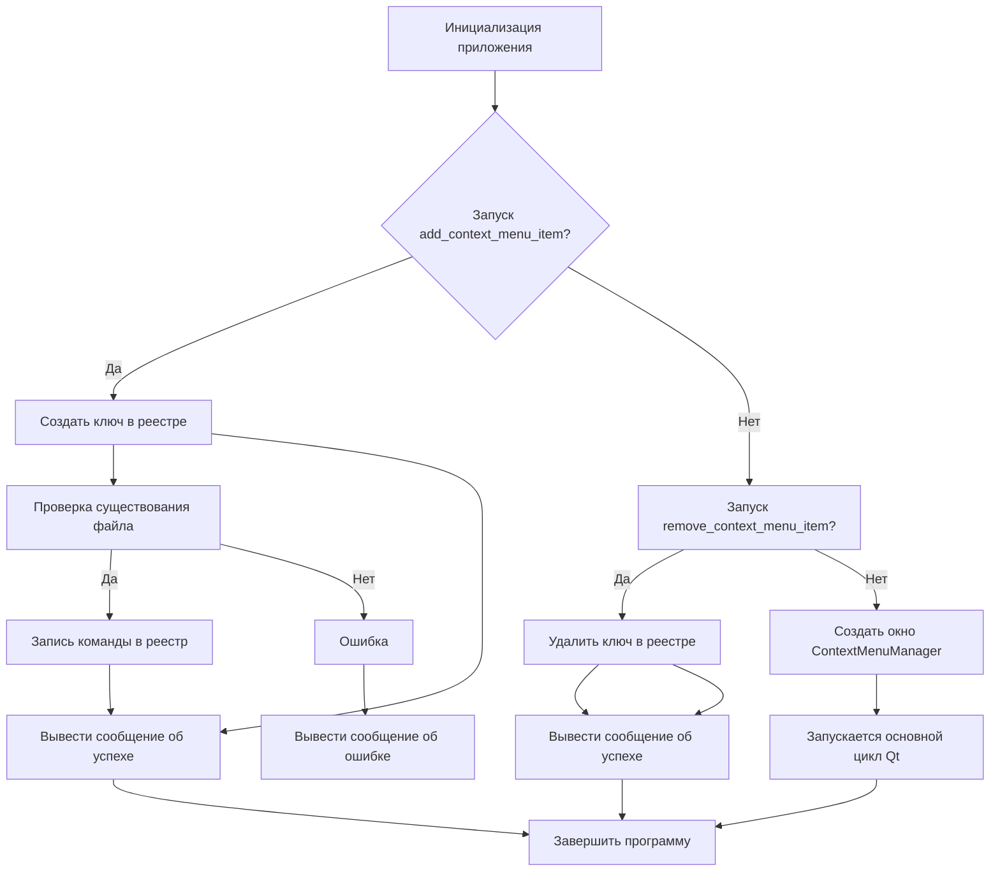
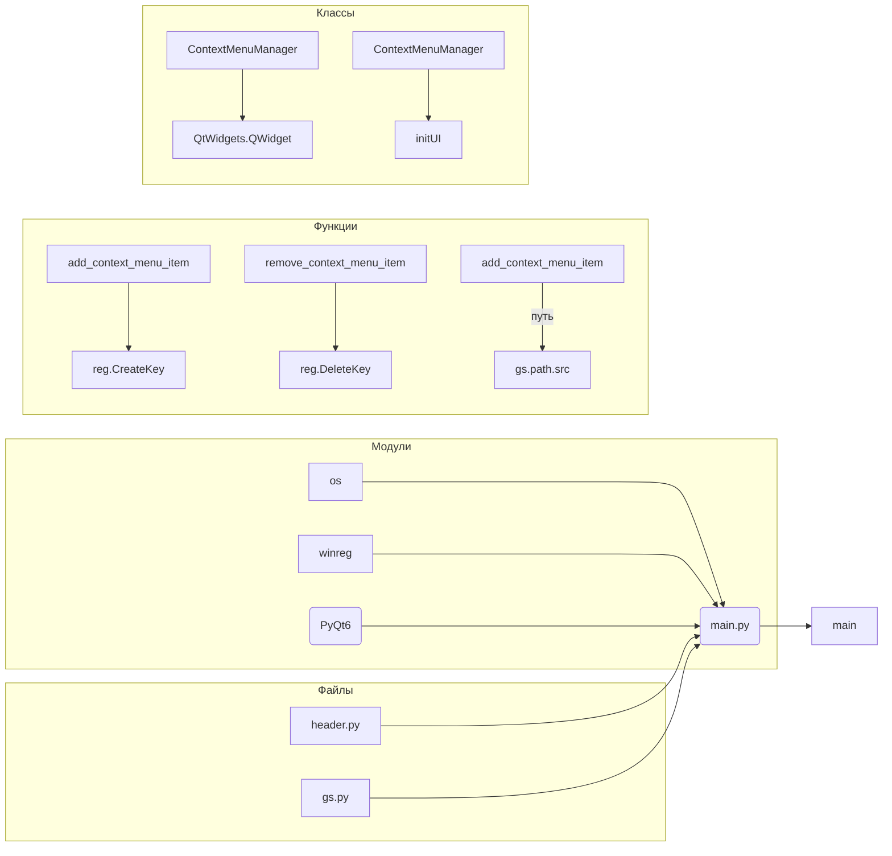

# <input code>

```python
## \file hypotez/src/gui/context_menu/qt6/main.py
# -*- coding: utf-8 -*-\
#! venv/Scripts/python.exe
#! venv/bin/python/python3.12

"""
.. module: src.gui.context_menu.qt6 
	:platform: Windows, Unix
	:synopsis:

"""
MODE = 'dev'


"""
	:platform: Windows, Unix
	:synopsis:

"""


"""
	:platform: Windows, Unix
	:synopsis:

"""


"""
  :platform: Windows, Unix

"""
"""
  :platform: Windows, Unix
  :platform: Windows, Unix
  :synopsis:
"""MODE = 'dev'
  
""" module: src.gui.context_menu.qt6 """


"""Module to add or remove context menu items for the desktop and folder background using PyQt6.

This module provides functions to add or remove a custom context menu item called 
'hypo AI assistant' for the background of directories and the desktop in Windows Explorer.
It uses the Windows Registry to achieve this, with paths and logic implemented to target
the right-click menu on empty spaces (not on files or folders).
"""

import winreg as reg  # Module for interacting with Windows Registry
import os  # Module for OS path manipulation and checks
from PyQt6 import QtWidgets  # Module for GUI creation with PyQt6

import header  # Custom import, assuming it initializes settings or constants
from src import gs  # Custom import, likely for path settings or project structure


def add_context_menu_item():
    """Adds a context menu item to the desktop and folder background.

    This function creates a registry key under 'HKEY_CLASSES_ROOT\Directory\Background\shell' 
    to add a menu item named 'hypo AI assistant' to the background context menu in Windows Explorer.
    The item runs a Python script when selected.

    Registry Path Details:
        - `key_path`: Directory\Background\shell\hypo_AI_assistant
            This path adds the context menu item to the background of folders and 
            the desktop, allowing users to trigger it when right-clicking on empty space.
        
        - `command_key`: Directory\Background\shell\hypo_AI_assistant\command
            This subkey specifies the action for the context menu item and links it to a script 
            or command (in this case, a Python script).
    
    Raises:
        Displays an error message if the script file does not exist.
    """
    
    key_path = r"Directory\\Background\\shell\\hypo_AI_assistant"

    try:
        with reg.CreateKey(reg.HKEY_CLASSES_ROOT, key_path) as key:
            reg.SetValue(key, "", reg.REG_SZ, "hypo AI assistant")  # Display name
            command_key = rf"{key_path}\\command"
            with reg.CreateKey(reg.HKEY_CLASSES_ROOT, command_key) as command:
                command_path = gs.path.src / 'gui' / 'context_menu' / 'main.py'
                if not os.path.exists(command_path):
                    QtWidgets.QMessageBox.critical(None, "Ошибка", f"Файл {command_path} не найден.")
                    return
                reg.SetValue(command, "", reg.REG_SZ, f"python \\"{command_path}\\" \\"%1\\"")
        QtWidgets.QMessageBox.information(None, "Успех", "Пункт меню успешно добавлен!")
    except Exception as ex:
        QtWidgets.QMessageBox.critical(None, "Ошибка", f"Ошибка: {ex}")


def remove_context_menu_item():
    """Removes the 'hypo AI assistant' context menu item."""
    key_path = r"Directory\\Background\\shell\\hypo_AI_assistant"
    try:
        reg.DeleteKey(reg.HKEY_CLASSES_ROOT, key_path)
        QtWidgets.QMessageBox.information(None, "Успех", "Пункт меню успешно удален!")
    except FileNotFoundError:
        QtWidgets.QMessageBox.warning(None, "Предупреждение", "Пункт меню не найден.")
    except Exception as e:
        QtWidgets.QMessageBox.critical(None, "Ошибка", f"Ошибка: {e}")


class ContextMenuManager(QtWidgets.QWidget):
    """Main application window for managing the custom context menu item."""

    def __init__(self):
        super().__init__()
        self.initUI()

    def initUI(self):
        self.setWindowTitle("Управление контекстным меню")
        layout = QtWidgets.QVBoxLayout()
        add_button = QtWidgets.QPushButton("Добавить пункт меню")
        add_button.clicked.connect(add_context_menu_item)
        layout.addWidget(add_button)
        remove_button = QtWidgets.QPushButton("Удалить пункт меню")
        remove_button.clicked.connect(remove_context_menu_item)
        layout.addWidget(remove_button)
        exit_button = QtWidgets.QPushButton("Выход")
        exit_button.clicked.connect(self.close)
        layout.addWidget(exit_button)
        self.setLayout(layout)


if __name__ == "__main__":
    app = QtWidgets.QApplication([])
    window = ContextMenuManager()
    window.show()
    app.exec()
```

# <algorithm>

**Блок-схема (пример)**



**Пример:**

Пользователь нажимает кнопку "Добавить пункт меню".  `add_context_menu_item` вызывается.  Проверяется существование файла, затем создаются ключи в реестре, записывается команда, вывод ошибки или сообщения об успехе. После чего, выполняется завершение программы.

**Передача данных:**

Функции `add_context_menu_item` и `remove_context_menu_item` получают данные из `gs.path.src` и записывают данные в Windows реестр. Класс `ContextMenuManager` отвечает за создание интерфейса и реагирует на нажатия кнопок, вызывая соответствующие функции.


# <mermaid>



**Объяснение диаграммы:**

- **Модули:** Показывают зависимости от стандартных модулей Python (`os`, `winreg`, `PyQt6`).
- **Файлы:** Иллюстрируют зависимость от пользовательских модулей (`header.py`, `gs.py`).
- **Функции:** `add_context_menu_item` использует `reg.CreateKey`, а `remove_context_menu_item` использует `reg.DeleteKey`. Обращение к `gs.path.src`.
- **Классы:** `ContextMenuManager` наследовается от `QtWidgets.QWidget`.  `initUI` - метод инициализации пользовательского интерфейса.
- **main:**  Точка входа в программу.

# <explanation>

**Импорты:**

- `winreg`: Модуль для взаимодействия с Windows Registry, необходимый для изменения реестра.
- `os`: Модуль для работы с файловой системой, используется для проверки существования файла.
- `QtWidgets`: Модуль PyQt6 для создания графического интерфейса.
- `header`:  Предполагается, что содержит константы или настройки, необходимые для работы скрипта.
- `gs`: Модуль из пакета `src`, вероятно, содержит переменные, связанные с путями к файлам.  Это ключевой модуль для понимания архитектуры, он предоставляет данные о расположении ресурсов.


**Классы:**

- `ContextMenuManager`: Главный класс приложения, создаёт и управляет интерфейсом для добавления/удаления пункта меню.

**Функции:**

- `add_context_menu_item()`: Добавляет пункт меню в контекстное меню.  Важна проверка существования файла (`command_path`), которая предотвращает ошибку, если файл отсутствует.
- `remove_context_menu_item()`: Удаляет пункт меню из контекстного меню. Обрабатывает ошибку `FileNotFoundError`, если пункт меню не найден.
- `initUI()`: Метод инициализации интерфейса приложения (`ContextMenuManager`).


**Переменные:**

- `MODE`: Переменная, вероятно, для определения режима работы приложения ('dev' в данном случае).
- `key_path`, `command_key`: Переменные, хранящие пути к записям в реестре.
- `command_path`:  Путь к Python-скрипту, который будет запущен при нажатии пункта меню.


**Возможные ошибки и улучшения:**

- **Обработка исключений:**  В функциях `add_context_menu_item` и `remove_context_menu_item` обработка исключений более детальная, но можно добавить `except Exception as e: print(e)` для вывода полной ошибки в консоль.
- **Локализация:** При выводе сообщений об ошибках и успехе рекомендуется использовать локализованные сообщения.
- **Взаимодействие с другими модулями:**  Для более четкого понимания, как взаимодействует данный скрипт с другими частями проекта, необходимо рассмотреть модуль `gs`.  Знание содержимого `gs.path.src` очень важно для понимания структуры и логики проекта.
- **Использование констант:**  Вместо магических чисел (например, `reg.REG_SZ`) следует использовать константы, определённые в `header.py` или `gs.py`, для повышения читаемости и модифицируемости кода.


**Цепочка взаимосвязей:**

`gui/context_menu/qt6/main.py` использует `src/gs.py` для получения пути к скрипту, который будет запущен при выборе пункта меню.  `src/gs.py`, вероятно, предоставляет общую функциональность для работы с файлами и ресурсами проекта.  `header.py` (если существует) содержит конфигурационные переменные и константы, необходимые для работы программы.