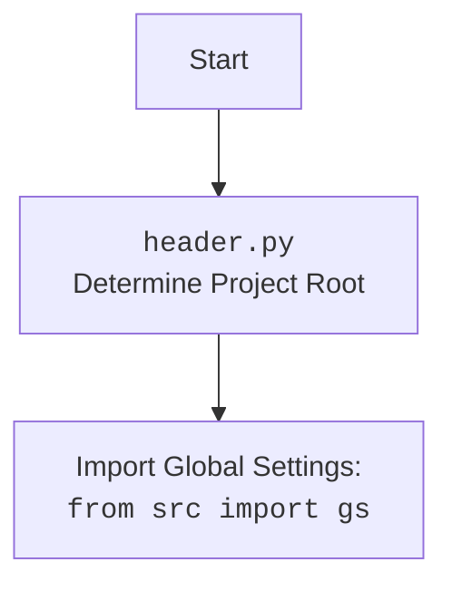

## ИНСТРУКЦИЯ:

Анализируй предоставленный код подробно и объясни его функциональность. Ответ должен включать три раздела:  

1.  **<алгоритм>**: Опиши рабочий процесс в виде пошаговой блок-схемы, включая примеры для каждого логического блока, и проиллюстрируй поток данных между функциями, классами или методами.  
2.  **<mermaid>**: Напиши код для диаграммы в формате `mermaid`, проанализируй и объясни все зависимости, 
    которые импортируются при создании диаграммы. 
    **ВАЖНО!** Убедитесь, что все имена переменных, используемые в диаграмме `mermaid`, 
    имеют осмысленные и описательные имена. Имена переменных вроде `A`, `B`, `C`, и т.д., не допускаются!  
    
    **Дополнительно**: Если в коде есть импорт `import header`, добавьте блок `mermaid` flowchart, объясняющий `header.py`:\
    ```mermaid
    flowchart TD
        Start --> Header[<code>header.py</code><br> Determine Project Root]
    
        Header --> import[Import Global Settings: <br><code>from src import gs</code>] 
    ```

3.  **<объяснение>**: Предоставьте подробные объяснения:  
    -   **Импорты**: Их назначение и взаимосвязь с другими пакетами `src.`.  
    -   **Классы**: Их роль, атрибуты, методы и взаимодействие с другими компонентами проекта.  
    -   **Функции**: Их аргументы, возвращаемые значения, назначение и примеры.  
    -   **Переменные**: Их типы и использование.  
    -   Выделите потенциальные ошибки или области для улучшения.  

Дополнительно, постройте цепочку взаимосвязей с другими частями проекта (если применимо).  

Это обеспечивает всесторонний и структурированный анализ кода.
## Формат ответа: `.md` (markdown)
**КОНЕЦ ИНСТРУКЦИИ**

## <алгоритм>
```mermaid
graph LR
    Start[Начало] --> AddContextMenu[add_context_menu_item()]
    AddContextMenu -- "Создать ключ реестра" --> CreateRegistryKey[reg.CreateKey(HKEY_CLASSES_ROOT, key_path)]
    CreateRegistryKey -- "Задать имя элемента меню" --> SetMenuName[reg.SetValue(key, "", reg.REG_SZ, "hypo AI assistant")]
    SetMenuName -- "Создать под-ключ для команды" --> CreateCommandKey[reg.CreateKey(HKEY_CLASSES_ROOT, command_key)]
    CreateCommandKey -- "Проверить путь к скрипту" --> CheckScriptPath[os.path.exists(command_path)]
    CheckScriptPath -- "Скрипт существует" --> SetCommandValue[reg.SetValue(command, "", reg.REG_SZ, command_string)]
    SetCommandValue -- "Сообщение об успехе" --> SuccessMessageAdd[QtWidgets.QMessageBox.information("Успех")]
    CheckScriptPath -- "Скрипт не существует" --> ErrorMessageScriptNotFound[QtWidgets.QMessageBox.critical("Ошибка", "Файл не найден.")]
    ErrorMessageScriptNotFound --> End
    SuccessMessageAdd --> End
    CreateRegistryKey -- "Ошибка при создании ключа" --> ErrorMessageRegistry[QtWidgets.QMessageBox.critical("Ошибка")]
    ErrorMessageRegistry --> End
    
    Start --> RemoveContextMenu[remove_context_menu_item()]
    RemoveContextMenu -- "Удалить ключ реестра" --> DeleteRegistryKey[reg.DeleteKey(HKEY_CLASSES_ROOT, key_path)]
    DeleteRegistryKey -- "Сообщение об успехе" --> SuccessMessageRemove[QtWidgets.QMessageBox.information("Успех")]
    SuccessMessageRemove --> End
    DeleteRegistryKey -- "Ключ не найден" --> WarningMessageKeyNotFound[QtWidgets.QMessageBox.warning("Предупреждение", "Пункт меню не найден")]
    WarningMessageKeyNotFound --> End
    DeleteRegistryKey -- "Ошибка удаления ключа" --> ErrorMessageRegistryRemove[QtWidgets.QMessageBox.critical("Ошибка")]
    ErrorMessageRegistryRemove --> End
    
    Start --> ContextMenuManagerInit[ContextMenuManager.__init__()]
     ContextMenuManagerInit --> InitUI[initUI()]
    InitUI -- "Создание кнопок" --> CreateButtons[QtWidgets.QPushButton()]
     CreateButtons -- "Добавить пункт" --> connectAdd[add_button.clicked.connect(add_context_menu_item)]
     CreateButtons -- "Удалить пункт" --> connectRemove[remove_button.clicked.connect(remove_context_menu_item)]
     CreateButtons -- "Выход" --> connectExit[exit_button.clicked.connect(self.close)]
     connectAdd --> AddContextMenu
     connectRemove --> RemoveContextMenu
     connectExit --> End
    
     Start --> QApplicationInit[if __name__ == "__main__"]
     QApplicationInit --> CreateApp[QtWidgets.QApplication([])]
     CreateApp --> CreateMainWindow[ContextMenuManager()]
     CreateMainWindow --> DisplayWindow[window.show()]
     DisplayWindow --> RunApp[app.exec()]
     RunApp --> End
    
    End[Конец]
  
    style Start fill:#f9f,stroke:#333,stroke-width:2px
    style End fill:#ccf,stroke:#333,stroke-width:2px
```

**Примеры для блоков:**

*   **`add_context_menu_item()`:**
    *   **`reg.CreateKey(reg.HKEY_CLASSES_ROOT, key_path)`:** Создает ключ `Directory\Background\shell\hypo_AI_assistant` в реестре Windows.
    *   **`reg.SetValue(key, "", reg.REG_SZ, "hypo AI assistant")`:** Задает имя элемента контекстного меню "hypo AI assistant".
    *   **`command_path = gs.path.src / 'gui' / 'context_menu' / 'main.py'`**:  Пусть путь к файлу `main.py` будет  `C:\myproject\src\gui\context_menu\main.py`.
    *   **`reg.SetValue(command, "", reg.REG_SZ, f"python \"{command_path}\" \"%1\"")`:** Задает команду для запуска скрипта `python "C:\myproject\src\gui\context_menu\main.py" "%1"`.
*   **`remove_context_menu_item()`:**
    *   **`reg.DeleteKey(reg.HKEY_CLASSES_ROOT, key_path)`:** Пытается удалить ключ `Directory\Background\shell\hypo_AI_assistant` из реестра Windows.
*  **`ContextMenuManager`:**
    *   Создает окно с заголовком "Управление контекстным меню".
    *   Создает три кнопки: "Добавить пункт меню", "Удалить пункт меню" и "Выход".
    *   При нажатии на кнопку "Добавить пункт меню" вызывается функция `add_context_menu_item()`.
    *   При нажатии на кнопку "Удалить пункт меню" вызывается функция `remove_context_menu_item()`.
    *   При нажатии на кнопку "Выход" окно закрывается.
*   **`if __name__ == "__main__":`:**
    *   Создает экземпляр приложения `QtWidgets.QApplication`.
    *   Создает и отображает главное окно `ContextMenuManager`.
    *   Запускает цикл обработки событий приложения `app.exec()`.

## <mermaid>
```mermaid
flowchart TD
    Start[<code>main.py</code>] --> import_modules[Import Modules]
    
     import_modules --> winreg_import[<code>import winreg as reg</code> <br>Windows Registry Interaction]
     import_modules --> os_import[<code>import os</code> <br>OS Path Manipulation]
    import_modules --> pyqt_import[<code>from PyQt6 import QtWidgets</code> <br>GUI Creation]
      import_modules --> header_import[<code>import header</code> <br>Project Settings]
     import_modules --> gs_import[<code>from src import gs</code> <br>Project Path Settings]
     
    
     import_modules --> add_menu[<code>add_context_menu_item()</code>]
    add_menu --> create_key_add[<code>reg.CreateKey()</code><br> Create Registry Key]
      create_key_add --> set_menu_name[<code>reg.SetValue()</code><br>Set Menu Item Name]
        set_menu_name --> create_command_key[<code>reg.CreateKey()</code><br>Create Command Subkey]
      create_command_key --> check_script_path[<code>os.path.exists()</code><br>Check Script Exists]
      check_script_path -- Script Exists --> set_command_value[<code>reg.SetValue()</code><br>Set Command to Execute]
       set_command_value --> success_message_add[<code>QtWidgets.QMessageBox.information()</code><br>Show Success Message]
       check_script_path -- Script Not Exists --> error_message_script_not_found[<code>QtWidgets.QMessageBox.critical()</code><br>Show Error Message]
     create_key_add -- Error --> error_message_registry_add[<code>QtWidgets.QMessageBox.critical()</code><br>Show Registry Error Message]
     
    import_modules --> remove_menu[<code>remove_context_menu_item()</code>]
    remove_menu --> delete_key_remove[<code>reg.DeleteKey()</code><br>Delete Registry Key]
    delete_key_remove -- Success --> success_message_remove[<code>QtWidgets.QMessageBox.information()</code><br>Show Success Message]
     delete_key_remove -- Key Not Found --> warning_message_key_not_found[<code>QtWidgets.QMessageBox.warning()</code><br>Show Warning Message]
     delete_key_remove -- Error --> error_message_registry_remove[<code>QtWidgets.QMessageBox.critical()</code><br>Show Registry Error Message]
     
   import_modules --> ContextMenuManagerClass[<code>class ContextMenuManager</code>]
   ContextMenuManagerClass --> init_method[<code>__init__()</code>]
     init_method --> init_ui_method[<code>initUI()</code>]
     init_ui_method --> create_add_button[<code>QtWidgets.QPushButton("Добавить пункт меню")</code>]
     create_add_button --> connect_add_button[<code>add_button.clicked.connect(add_context_menu_item)</code>]
     connect_add_button --> add_menu
     init_ui_method --> create_remove_button[<code>QtWidgets.QPushButton("Удалить пункт меню")</code>]
      create_remove_button --> connect_remove_button[<code>remove_button.clicked.connect(remove_context_menu_item)</code>]
      connect_remove_button --> remove_menu
      init_ui_method --> create_exit_button[<code>QtWidgets.QPushButton("Выход")</code>]
       create_exit_button --> connect_exit_button[<code>exit_button.clicked.connect(self.close)</code>]

    import_modules --> main_execution[<code>if __name__ == "__main__"</code>]
    main_execution --> create_app[<code>QtWidgets.QApplication([])</code>]
    create_app --> create_window[<code>ContextMenuManager()</code>]
     create_window --> show_window[<code>window.show()</code>]
    show_window --> run_app_event_loop[<code>app.exec()</code>]


    classDef external fill:#f9f,stroke:#333,stroke-width:2px
    classDef internal fill:#ccf,stroke:#333,stroke-width:2px
    
    class winreg_import external;
    class os_import external;
    class pyqt_import external;
    class header_import internal;
    class gs_import internal;
     class add_menu internal;
      class remove_menu internal;
      class ContextMenuManagerClass internal;
      class main_execution internal;
      class error_message_script_not_found internal;
       class set_command_value internal;
    class  success_message_add internal;
    class  create_key_add internal;
     class check_script_path internal;
    class success_message_remove internal;
        class warning_message_key_not_found internal;
        class error_message_registry_add internal;
         class error_message_registry_remove internal;
       class init_method internal;
       class init_ui_method internal;
         class create_add_button internal;
          class create_remove_button internal;
           class create_exit_button internal;
           class connect_add_button internal;
             class connect_remove_button internal;
               class connect_exit_button internal;
          class set_menu_name internal;
          class create_command_key internal;
         class delete_key_remove internal;
     class create_app internal;
      class create_window internal;
       class show_window internal;
        class run_app_event_loop internal;


```


**Зависимости `mermaid`:**
*   **`winreg as reg`**: Модуль `winreg` используется для взаимодействия с реестром Windows. Это необходимо для создания и удаления элементов контекстного меню.
*   **`os`**: Модуль `os` предоставляет функции для работы с операционной системой, включая проверки существования файлов, что используется для проверки наличия скрипта, который будет запускаться из контекстного меню.
*   **`PyQt6.QtWidgets`**: Модуль `QtWidgets` из библиотеки PyQt6 используется для создания графического интерфейса, включая окна, кнопки и сообщения.
*   **`header`**:  Предположительно, это пользовательский модуль, который инициализирует общие настройки или константы проекта.
*  **`from src import gs`**: Это пользовательский модуль, который, вероятно, содержит глобальные настройки проекта, такие как пути к директориям.

## <объяснение>
### Импорты:
*   **`import winreg as reg`**:
    *   **Назначение**: Этот модуль предоставляет функции для работы с реестром Windows. Реестр используется для хранения настроек и конфигураций системы, включая контекстные меню.
    *   **Взаимосвязь с `src`**:  Непосредственно не связан с пакетами `src`, но необходим для изменения конфигурации ОС, на которой работает приложение из `src`.
*   **`import os`**:
    *   **Назначение**:  Предоставляет функции для взаимодействия с операционной системой, например, для проверки существования файлов.
    *   **Взаимосвязь с `src`**: Используется для проверки пути к файлу, находящегося в структуре каталогов проекта `src`.
*   **`from PyQt6 import QtWidgets`**:
    *   **Назначение**: Импортирует модуль `QtWidgets` из библиотеки PyQt6, который используется для создания графического интерфейса (GUI), окон, кнопок и всплывающих окон.
    *   **Взаимосвязь с `src`**: Это один из основных компонентов, необходимых для создания пользовательского интерфейса, который взаимодействует с другими модулями проекта. GUI находится в пакете `src.gui`.
*    **`import header`**:
     *   **Назначение**:  Предположительно, это пользовательский модуль, который инициализирует общие настройки или константы проекта.
     *   **Взаимосвязь с `src`**: Необходим для получения общих настроек проекта из пакета `src`.
*   **`from src import gs`**:
    *   **Назначение**:  Импортирует модуль `gs` из пакета `src`, который вероятно содержит глобальные настройки проекта, такие как пути к файлам и директориям.
    *   **Взаимосвязь с `src`**:  Этот модуль играет ключевую роль в определении путей к файлам в рамках структуры проекта `src`.

### Классы:
*   **`class ContextMenuManager(QtWidgets.QWidget)`**:
    *   **Роль**: Главный класс для управления пользовательским интерфейсом, который управляет добавлением и удалением элемента контекстного меню. Наследуется от `QtWidgets.QWidget`, являясь базовым виджетом Qt.
    *   **Атрибуты**: Нет явных атрибутов, кроме унаследованных от `QtWidgets.QWidget`.
    *   **Методы**:
        *   `__init__(self)`: Конструктор класса, вызывает метод `initUI` для инициализации пользовательского интерфейса.
        *   `initUI(self)`: Инициализирует пользовательский интерфейс, создавая кнопки "Добавить пункт меню", "Удалить пункт меню" и "Выход". Связывает нажатия кнопок с соответствующими функциями.
    *   **Взаимодействие**: Взаимодействует с `add_context_menu_item` и `remove_context_menu_item`, обрабатывая нажатия кнопок.

### Функции:
*   **`add_context_menu_item()`**:
    *   **Аргументы**: Нет.
    *   **Возвращаемое значение**: Нет.
    *   **Назначение**: Добавляет пункт "hypo AI assistant" в контекстное меню рабочего стола и папок через реестр Windows.
        * Создает ключ реестра по пути: `Directory\Background\shell\hypo_AI_assistant`.
        * Задает значение по умолчанию "hypo AI assistant" для созданного ключа, что является отображаемым именем пункта меню.
        * Создает под-ключ `command`, который определяет действие при выборе пункта меню.
        * Устанавливает значение для ключа `command`, указывая путь к Python-скрипту (`src\gui\context_menu\main.py`) для исполнения.
    *  **Примеры**:
        *  При выполнении: в контекстном меню Windows (при нажатии правой кнопки мыши на рабочем столе или в пустой области папки) появляется пункт "hypo AI assistant".
        *  При нажатии на пункт "hypo AI assistant": запускается указанный Python-скрипт.
*   **`remove_context_menu_item()`**:
    *   **Аргументы**: Нет.
    *   **Возвращаемое значение**: Нет.
    *   **Назначение**: Удаляет пункт "hypo AI assistant" из контекстного меню, удаляя соответствующий ключ реестра.
        * Удаляет ключ реестра `Directory\Background\shell\hypo_AI_assistant`.
    *   **Примеры**:
        *   При выполнении: удаляется пункт "hypo AI assistant" из контекстного меню Windows.
        *   При попытке удаления, когда пункт меню отсутствует: выводится предупреждающее сообщение.

### Переменные:
*  **`key_path`**: Строка, содержащая путь в реестре Windows, где находится ключ контекстного меню (`Directory\\Background\\shell\\hypo_AI_assistant`).
*   **`command_key`**: Строка, формирующая путь к ключу команды в реестре (`Directory\\Background\\shell\\hypo_AI_assistant\\command`).
*  **`command_path`**:  Путь к python скрипту который вызывается контекстным меню, сформированный на основе путей проекта из `gs` (`gs.path.src / 'gui' / 'context_menu' / 'main.py'`).
*   **`add_button`**: Экземпляр `QtWidgets.QPushButton`, представляющий кнопку "Добавить пункт меню".
*   **`remove_button`**: Экземпляр `QtWidgets.QPushButton`, представляющий кнопку "Удалить пункт меню".
*   **`exit_button`**: Экземпляр `QtWidgets.QPushButton`, представляющий кнопку "Выход".
*   **`app`**: Экземпляр `QtWidgets.QApplication`, представляющий приложение Qt.
*   **`window`**: Экземпляр `ContextMenuManager`, представляющий главное окно приложения.

### Потенциальные ошибки и области для улучшения:

*   **Обработка ошибок**:
    *   Используется `try-except` для обработки ошибок при работе с реестром, что хорошо, но можно добавить более детальную обработку разных типов исключений `winreg.error`  для  информирования пользователя о конкретной проблеме.
    *   Отсутствует обработка ошибок при обращении к файловой системе (например, прав доступа).
*   **Безопасность**:
    *   Использование `os.path.exists` и  `f-string` для формирования пути не вызывает явных проблем с безопасностью в текущей реализации.
*   **Улучшения**:
    *   Реализовать возможность динамического изменения имени пункта контекстного меню.
    *  Добавить возможность настройки пути к исполняемому файлу (python скрипту).
*  **Зависимость от пути**:`command_path = gs.path.src / 'gui' / 'context_menu' / 'main.py'` - путь захардкоден, и зависит от того где запускается скрипт. Возможно, стоит сделать его параметризованным.
*   **Переносимость**:
    *   Код специфичен для Windows, так как использует модуль `winreg`. Для работы на других ОС потребуется переписывание логики добавления и удаления пунктов меню.

### Взаимосвязи с другими частями проекта:
*   **`src.gs`**: Используется для получения путей к директориям внутри проекта, что необходимо для определения пути к скрипту, который будет запускаться через контекстное меню.
*   **`header.py`**: Предположительно, этот файл инициализирует глобальные настройки, необходимые для работы всего проекта, хотя, конкретное применение в данном файле не показано.
*   **`src.gui`**: Этот модуль является частью пакета графического интерфейса (`gui`) проекта, что подразумевает более широкую структуру GUI, где данный модуль является лишь одной из частей.
*   **`src.gui.context_menu`**: Этот модуль находится в пакете `context_menu`, что указывает на возможное существование других модулей, связанных с управлением контекстными меню, но уже не для Windows Explorer.

Таким образом, код представляет собой небольшой инструмент, предназначенный для добавления и удаления кастомного пункта в контекстное меню Windows, с использованием библиотеки PyQt6 для создания простого GUI. Он имеет ряд потенциальных улучшений в плане обработки ошибок и переносимости на другие ОС.