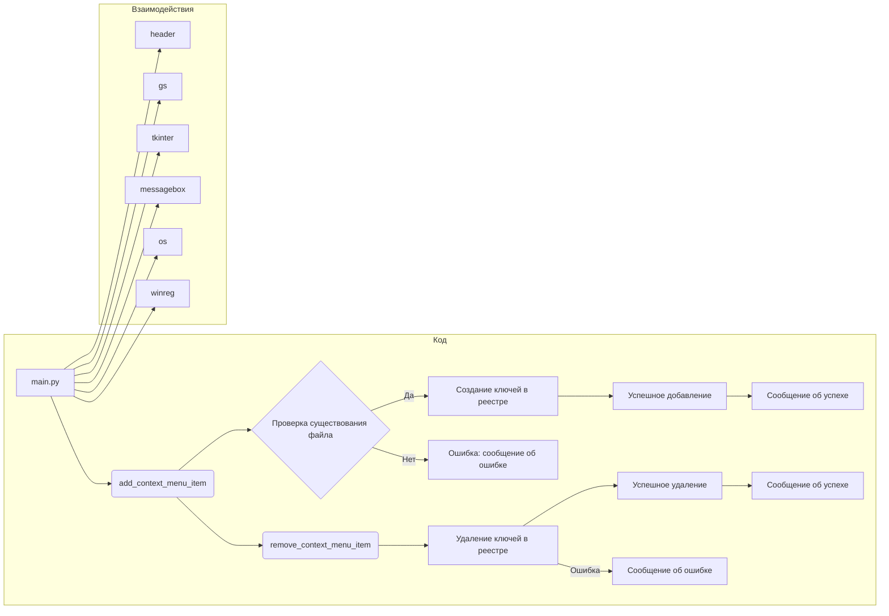

# <input code>

```python
## \file hypotez/src/gui/context_menu/tkinter/main.py
# -*- coding: utf-8 -*-
#! venv/Scripts/python.exe
#! venv/bin/python/python3.12

"""
.. module: src.gui.context_menu.tkinter 
	:platform: Windows, Unix
	:synopsis:

"""
MODE = 'dev'


"""
	:platform: Windows, Unix
	:synopsis:

"""


"""
	:platform: Windows, Unix
	:synopsis:

"""


"""
  :platform: Windows, Unix

"""
"""
  :platform: Windows, Unix
  :platform: Windows, Unix
  :synopsis:
"""MODE = 'dev'
  
""" module: src.gui.context_menu.tkinter """


"""Module to add or remove context menu items for the desktop and folder background.

This module provides functions to add or remove a custom context menu item called 
'hypo AI assistant' for the background of directories and the desktop in Windows Explorer.
It uses the Windows Registry to achieve this, with paths and logic implemented to target
the right-click menu on empty spaces (not on files or folders).
"""

import winreg as reg  # Module for interacting with Windows Registry
import os  # Module for OS path manipulation and checks
import tkinter as tk  # Module for GUI creation
from tkinter import messagebox  # Submodule for GUI message boxes

import header  # Custom import, assuming it initializes settings or constants
from src import gs  # Custom import, likely for path settings or project structure


def add_context_menu_item():
    """Adds a context menu item to the desktop and folder background.

    This function creates a registry key under 'HKEY_CLASSES_ROOT\\Directory\\Background\\shell' 
    to add a menu item named 'hypo AI assistant' to the background context menu in Windows Explorer.
    The item runs a Python script when selected.

    Registry Path Details:
        - `key_path`: Directory\\Background\\shell\\hypo_AI_assistant
            This path adds the context menu item to the background of folders and 
            the desktop, allowing users to trigger it when right-clicking on empty space.
        
        - `command_key`: Directory\\Background\\shell\\hypo_AI_assistant\\command
            This subkey specifies the action for the context menu item and links it to a script 
            or command (in this case, a Python script).
    
    Raises:
        Displays an error message if the script file does not exist.
    """

    key_path = r"Directory\\Background\\shell\\hypo_AI_assistant"

    try:
        with reg.CreateKey(reg.HKEY_CLASSES_ROOT, key_path) as key:
            reg.SetValue(key, "", reg.REG_SZ, "hypo AI assistant")
            command_key = rf"{key_path}\\command"
            with reg.CreateKey(reg.HKEY_CLASSES_ROOT, command_key) as command:
                command_path = gs.path.src / 'gui' / 'context_menu' / 'main.py'
                if not os.path.exists(command_path):
                    messagebox.showerror("Ошибка", f"Файл {command_path} не найден.")
                    return
                reg.SetValue(command, "", reg.REG_SZ, f"python \\"{command_path}\\" \\"%1\\"")
        messagebox.showinfo("Успех", "Пункт меню успешно добавлен!")
    except Exception as ex:
        messagebox.showerror("Ошибка", f"Ошибка: {ex}")


def remove_context_menu_item():
    """Removes the 'hypo AI assistant' context menu item."""
    key_path = r"Directory\\Background\\shell\\hypo_AI_assistant"

    try:
        reg.DeleteKey(reg.HKEY_CLASSES_ROOT, key_path)
        messagebox.showinfo("Успех", "Пункт меню успешно удален!")
    except FileNotFoundError:
        messagebox.showwarning("Предупреждение", "Пункт меню не найден.")
    except Exception as e:
        messagebox.showerror("Ошибка", f"Ошибка: {e}")


def create_gui():
    """Creates a simple GUI for managing the custom context menu item."""
    root = tk.Tk()
    root.title("Управление контекстным меню")

    add_button = tk.Button(root, text="Добавить пункт меню", command=add_context_menu_item)
    add_button.pack(pady=10)

    remove_button = tk.Button(root, text="Удалить пункт меню", command=remove_context_menu_item)
    remove_button.pack(pady=10)

    exit_button = tk.Button(root, text="Выход", command=root.quit)
    exit_button.pack(pady=10)

    root.mainloop()


if __name__ == "__main__":
    create_gui()
```

# <algorithm>

```mermaid
graph TD
    A[Пользователь запускает GUI] --> B{Выполняется ли функция create_gui()?};
    B -- Да --> C[Создается окно Tkinter];
    B -- Нет --> F(Ошибка запуска);
    C --> D[Создаются кнопки "Добавить" и "Удалить"];
    D --> E{Нажата ли кнопка "Добавить"};
    E -- Да --> G[Выполняется add_context_menu_item()];
    E -- Нет --> H{Нажата ли кнопка "Удалить"};
    H -- Да --> I[Выполняется remove_context_menu_item()];
    H -- Нет --> J[GUI остается активным];
    G --> K{Успешное добавление в реестр?};
    K -- Да --> L[Пользователю выдается сообщение об успехе];
    K -- Нет --> M[Пользователю выдается сообщение об ошибке];
    I --> N{Успешное удаление из реестра?};
    N -- Да --> O[Пользователю выдается сообщение об успехе];
    N -- Нет --> P[Пользователю выдается сообщение об ошибке];
    J --> Q[GUI ожидает нажатия кнопок];
    Q --> E;
    Q --> H;
```

Пример: Пользователь запускает приложение. Программа создает главное окно (C). Пользователь нажимает на кнопку "Добавить". Программа выполняет `add_context_menu_item()` (G). Программа проверяет существование файла (если файл не найден, выдается ошибка, иначе продолжается).  Происходит создание/обновление записей в реестре.  Если все прошло успешно, отображается сообщение об успехе.

# <mermaid>



**Объяснение зависимостей:**

* `main.py` зависит от модулей `header`, `gs`, `tkinter`, `messagebox`, `os`, `winreg` для работы.

# <explanation>

* **Импорты:**
    * `winreg`:  Обеспечивает взаимодействие с реестром Windows. Необходим для добавления и удаления элементов контекстного меню.
    * `os`: Предоставляет функции для работы с файлами и операционной системой, в том числе проверку существования файла.
    * `tkinter`: Библиотека для создания графического интерфейса пользователя (GUI). Используется для создания окна и кнопок.
    * `messagebox`: Подмодуль `tkinter` для отображения диалоговых окон с сообщениями об ошибках и успехе.
    * `header`:  Вероятно, содержит константы или настройки, используемые в этом модуле.
    * `src.gs`: Вероятно, модуль, содержащий пути к ресурсам или настройки проекта (например, путь к файлу `main.py` в `gs.path.src`).


* **Классы:**
    * Нет определенных классов, только функции.


* **Функции:**
    * `add_context_menu_item()`: Добавляет элемент контекстного меню в реестр Windows. Возвращаемых значений нет.  Обрабатывает возможные исключения.
    * `remove_context_menu_item()`: Удаляет элемент контекстного меню из реестра Windows. Возвращаемых значений нет. Обрабатывает случаи, когда элемент не найден.
    * `create_gui()`: Создает графический интерфейс с кнопками для добавления и удаления элементов контекстного меню.  Вызывает другие функции.


* **Переменные:**
    * `MODE`: Вероятно, содержит строку, обозначающую режим работы (например, 'dev' или 'prod').
    * `key_path`: Путь к ключу в реестре Windows для элемента контекстного меню.
    * `command_path`: Путь к скрипту Python, который будет выполняться при выборе элемента контекстного меню.

* **Возможные ошибки/улучшения:**
    * **Проверка файла:**  Проверка существования `command_path` - важный шаг, но стоит добавить проверку типа файла (чтобы убедиться, что это исполняемый скрипт Python).
    * **Обработка ошибок:** Более подробная обработка ошибок (например, `FileNotFoundError`) с указанием, какой именно файл не найден.
    * **Безопасность:**  В строке `reg.SetValue(command, "", reg.REG_SZ, f"python \\"{command_path}\\" \\"%1\\"")` не происходит экранирование символов, которые могли бы содержаться в `command_path`. Если путь к скрипту содержит пробелы или другие спецсимволы, это может привести к ошибкам. Стоит использовать `subprocess` для запуска скрипта, чтобы избежать проблем с экранированием.
    * **Детализация обработчика ошибок:** В обработчике исключений не достаточно информации о произошедшем, стоит ловить конкретные типы исключений (например, `FileNotFoundError`, `WindowsError`).


**Цепочка взаимосвязей:**
Пользователь взаимодействует с GUI (`create_gui()`), затем, в зависимости от выбора пользователя вызываются `add_context_menu_item()` или `remove_context_menu_item()`, которые взаимодействуют с реестром Windows (`winreg`) для изменения контекстного меню.  Модуль `gs` скорее всего определяет пути внутри проекта,  а `header` предоставляет любые дополнительные константы или настройки для всего проекта.