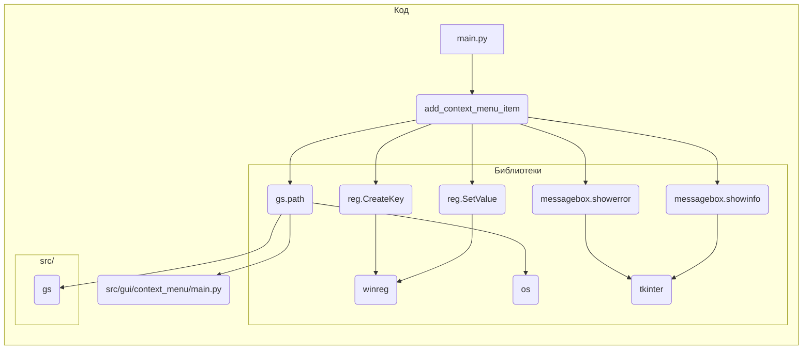

# <input code>

```python
## \file hypotez/src/gui/context_menu/tkinter/main.py
# -*- coding: utf-8 -*-\
#! venv/Scripts/python.exe
#! venv/bin/python/python3.12

"""
.. module: src.gui.context_menu.tkinter 
	:platform: Windows, Unix
	:synopsis:

"""
MODE = 'dev'


"""
	:platform: Windows, Unix
	:synopsis:

"""


"""
	:platform: Windows, Unix
	:synopsis:

"""


"""
  :platform: Windows, Unix

"""
"""
  :platform: Windows, Unix
  :platform: Windows, Unix
  :synopsis:
"""MODE = 'dev'
  
""" module: src.gui.context_menu.tkinter """


"""Module to add or remove context menu items for the desktop and folder background.

This module provides functions to add or remove a custom context menu item called 
'hypo AI assistant' for the background of directories and the desktop in Windows Explorer.
It uses the Windows Registry to achieve this, with paths and logic implemented to target
the right-click menu on empty spaces (not on files or folders).
"""

import winreg as reg  # Module for interacting with Windows Registry
import os  # Module for OS path manipulation and checks
import tkinter as tk  # Module for GUI creation
from tkinter import messagebox  # Submodule for GUI message boxes

import header  # Custom import, assuming it initializes settings or constants
from src import gs  # Custom import, likely for path settings or project structure

def add_context_menu_item():
    """Adds a context menu item to the desktop and folder background.

    This function creates a registry key under 'HKEY_CLASSES_ROOT\Directory\Background\shell' 
    to add a menu item named 'hypo AI assistant' to the background context menu in Windows Explorer.
    The item runs a Python script when selected.

    Registry Path Details:
        - `key_path`: Directory\Background\shell\hypo_AI_assistant
            This path adds the context menu item to the background of folders and 
            the desktop, allowing users to trigger it when right-clicking on empty space.
        
        - `command_key`: Directory\Background\shell\hypo_AI_assistant\command
            This subkey specifies the action for the context menu item and links it to a script 
            or command (in this case, a Python script).
    
    Raises:
        Displays an error message if the script file does not exist.
    """

    key_path = r"Directory\\Background\\shell\\hypo_AI_assistant"

    try:
        with reg.CreateKey(reg.HKEY_CLASSES_ROOT, key_path) as key:
            reg.SetValue(key, "", reg.REG_SZ, "hypo AI assistant")
            command_key = rf"{key_path}\\command"
            with reg.CreateKey(reg.HKEY_CLASSES_ROOT, command_key) as command:
                command_path = gs.path.src / 'gui' / 'context_menu' / 'main.py'
                if not os.path.exists(command_path):
                    messagebox.showerror("Ошибка", f"Файл {command_path} не найден.")
                    return
                reg.SetValue(command, "", reg.REG_SZ, f"python \\"{command_path}\\" \\"%1\\"")
        messagebox.showinfo("Успех", "Пункт меню успешно добавлен!")
    except Exception as ex:
        messagebox.showerror("Ошибка", f"Ошибка: {ex}")

def remove_context_menu_item():
    # ... (same as before)

def create_gui():
    # ... (same as before)

if __name__ == "__main__":
    create_gui()
```

# <algorithm>

```mermaid
graph TD
    A[Пользователь запускает программу] --> B{Создать GUI};
    B --> C[Создать кнопку "Добавить"];
    B --> D[Создать кнопку "Удалить"];
    B --> E[Создать кнопку "Выход"];
    C --> F[Обработать клик "Добавить"];
    D --> G[Обработать клик "Удалить"];
    E --> H[Завершить программу];

    F --> I[Получить путь к скрипту из gs.path.src];
    I --> J{Файл существует?};
    J -- Да --> K[Создать ключ в реестре с командой для запуска скрипта];
    J -- Нет --> L[Показать ошибку и выйти];
    K --> M[Показать сообщение об успехе];
    G --> N[Удалить ключ из реестра];
    N --> O[Показать сообщение об успехе];

    subgraph "Обработка ошибок"
        F --> P[Обработка ошибок при работе с реестром];
        P --> Q[Показать ошибку пользователю];
    end
```

Примеры данных:

*   **Пользователь**:  Вводит действие (добавить или удалить)
*   **gs.path.src**:  `/home/user/hypotez/src/` (пример пути)
*   **command_path**: `/home/user/hypotez/src/gui/context_menu/main.py` (если такой файл есть)

Данные передаются между функциями и классами через аргументы и возвращаемые значения.


# <mermaid>



# <explanation>

**Импорты:**

*   `winreg`: Модуль для взаимодействия с реестром Windows.  Он необходим для создания и изменения ключей в реестре. Связь с пакетами Python стандартна.
*   `os`: Модуль для работы с файловой системой.  Используется для проверки существования файлов. Связь с пакетами Python стандартна.
*   `tkinter`: Модуль для создания графического интерфейса пользователя (GUI). Используется для создания окон и кнопок. Связь с пакетами Python стандартна.
*   `messagebox`: Подмодуль `tkinter` для вывода диалоговых окон (например, сообщений об ошибках). Связь с пакетами Python стандартна.
*   `header`:  Кастомизированный импорт, вероятно, содержит константы или настройки для приложения. Связь внутри проекта.
*   `src.gs`: Кастомизированный импорт, предполагается, содержит классы и функции для работы с путями или структурой проекта. Связь внутри проекта.


**Классы:**

В коде нет явных классов, но используется `tk.Tk()` для создания главного окна приложения.  `Tk` класс из `tkinter`.

**Функции:**

*   `add_context_menu_item()`: Добавляет пункт контекстного меню в реестр.
    *   Аргументы: Нет.
    *   Возвращаемые значения: Нет.
    *   Логика: Создает ключи в реестре для пункта меню и задает команду для выполнения скрипта при нажатии. Важно, что она использует `gs.path.src` для определения пути к скрипту, который будет выполнен, что указывает на зависимость от `gs`. Проверяет существование этого файла. Выводит сообщения об ошибках и успехе, используя диалоговые окна `messagebox`.
*   `remove_context_menu_item()`: Удаляет пункт контекстного меню из реестра.  Логика аналогична `add_context_menu_item()`, но выполняет удаление ключа.
*   `create_gui()`: Создает и отображает графический интерфейс.
    *   Аргументы: Нет.
    *   Возвращаемые значения: Нет.
    *   Логика: Создает главное окно приложения, кнопки "Добавить", "Удалить", "Выход".  При нажатии на кнопки вызываются соответствующие функции.

**Переменные:**

*   `key_path`: Строковая переменная, хранящая путь к ключу в реестре, где хранятся настройки меню.
*   `command_path`:  Хранит путь к скрипту, который будет запущен.

**Возможные ошибки и улучшения:**

*   **Обработка ошибок:**  В функциях присутствует `try...except` для обработки ошибок при работе с реестром. Это хорошо, но можно добавить более подробную информацию об ошибках в сообщения, чтобы легче было отлаживать.
*   **Обработка путей:** Путь к скрипту  `gs.path.src / 'gui' / 'context_menu' / 'main.py'` должен быть проверен и отформатирован корректнее. Возможна ошибка, если `gs.path.src` не содержит корректный путь.
*   **Управление зависимостями:**  Код сильно зависит от модуля `gs`. Нужно четко документировать его функциональность и интерфейс, чтобы не зависеть от реализации `gs` в будущем.
*   **Локализация:**  Код следует локализовать (перевести на разные языки), особенно сообщения об ошибках и успехе.
*   **Обработка ввода:** Необходимо добавить проверку, что пользователь вводит корректный путь к скрипту (в будущем), а также проверку, что этот файл существует до вызова.

**Взаимосвязи с другими частями проекта:**

Код напрямую использует модуль `gs` из пакета `src`, что указывает на его зависимость от других компонентов проекта.  Необходимо знать, как `gs` определяет путь к скрипту, который будет запущен, и какие настройки он предоставляет.