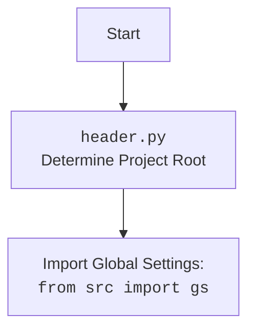

## <алгоритм>

1.  **Начало**: Выполняется скрипт `main.py`.
2.  **Импорт модулей**:
    *   Импортируется `winreg` для работы с реестром Windows.
    *   Импортируется `os` для операций с путями.
    *   Импортируется `tkinter` для создания GUI.
    *   Импортируется `messagebox` из `tkinter` для отображения сообщений.
    *   Импортируется `header` (предположительно, для инициализации настроек проекта)
        ```python
        import header
        ```
    *   Импортируется `gs` (глобальные настройки), вероятно, для путей проекта.
        ```python
        from src import gs
        ```
3.  **Определение функции `add_context_menu_item`**:
    *   Определяется путь в реестре `key_path` для нового пункта контекстного меню: `"Directory\\Background\\shell\\hypo_AI_assistant"`.
    *   Создается ключ реестра по `key_path` с помощью `reg.CreateKey`.
    *   Устанавливается имя отображения пункта меню: `"hypo AI assistant"`.
    *   Определяется путь для подключа `command_key`: `"{key_path}\\command"`.
    *   Создается подключ `command_key` с помощью `reg.CreateKey`.
    *   Определяется путь к исполняемому скрипту `command_path` c помощью `gs.path`
        ```python
        command_path = gs.path.src / 'gui' / 'context_menu' / 'main.py'
        ```
    *   Проверяется, существует ли файл скрипта. Если нет - выводится сообщение об ошибке.
    *   Устанавливается значение параметра реестра для выполнения скрипта при клике на пункт контекстного меню: `f"python \"{command_path}\" \"%1\""`.
        `%1` - аргумент, который передается в скрипт.
    *   Выводится сообщение об успешном добавлении пункта меню.
    *   Если возникает исключение, выводится сообщение об ошибке.
4.  **Определение функции `remove_context_menu_item`**:
    *   Определяется путь в реестре `key_path` для удаления пункта контекстного меню: `"Directory\\Background\\shell\\hypo_AI_assistant"`.
    *   Пытается удалить ключ реестра по `key_path` с помощью `reg.DeleteKey`.
    *   Выводится сообщение об успешном удалении пункта меню.
    *   Если ключ не найден, выводится предупреждение.
    *   Если возникает исключение, выводится сообщение об ошибке.
5.  **Определение функции `create_gui`**:
    *   Создается основное окно `root` с помощью `tk.Tk()`.
    *   Устанавливается заголовок окна: `"Управление контекстным меню"`.
    *   Создается кнопка `add_button` для добавления пункта меню, при нажатии вызывается `add_context_menu_item()`.
    *   Создается кнопка `remove_button` для удаления пункта меню, при нажатии вызывается `remove_context_menu_item()`.
    *   Создается кнопка `exit_button` для выхода, при нажатии вызывается `root.quit()`.
    *   Запускается главный цикл GUI `root.mainloop()`.
6.  **Условие `if __name__ == "__main__":`**:
    *   Если скрипт запущен напрямую (не импортирован как модуль), вызывается функция `create_gui()` для запуска GUI.
7.  **Конец**: Программа завершает работу при закрытии окна GUI.

## <mermaid>

```mermaid
flowchart TD
    Start[Start] --> ImportModules[Импорт модулей];
    
    ImportModules --> winreg_import[import winreg as reg];
    ImportModules --> os_import[import os];
    ImportModules --> tkinter_import[import tkinter as tk];
    ImportModules --> messagebox_import[from tkinter import messagebox];
    ImportModules --> header_import[import header];
    ImportModules --> gs_import[from src import gs];
    
    ImportModules --> add_context_menu_item_def[def add_context_menu_item()];
    add_context_menu_item_def --> SetKeyPath_add[key_path = r"Directory\\Background\\shell\\hypo_AI_assistant"];
    SetKeyPath_add --> CreateKey_add[reg.CreateKey(HKEY_CLASSES_ROOT, key_path)];
    CreateKey_add --> SetValue_Name[reg.SetValue(key, "", REG_SZ, "hypo AI assistant")];
    SetValue_Name --> CreateCommandKey_add[command_key = rf"{key_path}\\command"];
    CreateCommandKey_add --> CreateKey_command[reg.CreateKey(HKEY_CLASSES_ROOT, command_key)];
    CreateKey_command --> command_path_def[command_path = gs.path.src / 'gui' / 'context_menu' / 'main.py'];
     command_path_def --> FileExists_check[if not os.path.exists(command_path)];
       FileExists_check -- File not found --> ShowError_not_found[messagebox.showerror("Ошибка", ...)];
    FileExists_check -- File exists --> SetValue_command[reg.SetValue(command, "", REG_SZ, f"python \\"{command_path}\\" \\"%1\\"")];
    SetValue_command --> ShowSuccess_add[messagebox.showinfo("Успех", "Пункт меню успешно добавлен!")];
    CreateKey_add --> Exception_add[Exception handling];
    Exception_add --> ShowError_exception[messagebox.showerror("Ошибка", f"Ошибка: {ex}")];
    ShowSuccess_add --> End_add[End add_context_menu_item];
    ShowError_exception --> End_add;

     ImportModules --> remove_context_menu_item_def[def remove_context_menu_item()];
    remove_context_menu_item_def --> SetKeyPath_remove[key_path = r"Directory\\Background\\shell\\hypo_AI_assistant"];
    SetKeyPath_remove --> DeleteKey_remove[reg.DeleteKey(HKEY_CLASSES_ROOT, key_path)];
    DeleteKey_remove --> ShowSuccess_remove[messagebox.showinfo("Успех", "Пункт меню успешно удален!")];
    DeleteKey_remove --> FileNotFoundError_remove[FileNotFoundError handling];
    FileNotFoundError_remove --> ShowWarning_remove[messagebox.showwarning("Предупреждение", "Пункт меню не найден.")];
     DeleteKey_remove --> Exception_remove[Exception handling];
    Exception_remove --> ShowError_remove[messagebox.showerror("Ошибка", f"Ошибка: {e}")];
    ShowSuccess_remove --> End_remove[End remove_context_menu_item];
     ShowWarning_remove --> End_remove;
    ShowError_remove --> End_remove;


    ImportModules --> create_gui_def[def create_gui()];
    create_gui_def --> CreateRoot_gui[root = tk.Tk()];
    CreateRoot_gui --> SetTitle_gui[root.title("Управление контекстным меню")];
    SetTitle_gui --> CreateAddButton_gui[add_button = tk.Button(root, command=add_context_menu_item)];
    CreateAddButton_gui --> CreateRemoveButton_gui[remove_button = tk.Button(root, command=remove_context_menu_item)];
    CreateRemoveButton_gui --> CreateExitButton_gui[exit_button = tk.Button(root, command=root.quit)];
    CreateExitButton_gui --> RunMainloop_gui[root.mainloop()];
     RunMainloop_gui --> End_gui[End create_gui];

    ImportModules --> IfMain[if __name__ == "__main__":];
    IfMain --> Call_create_gui[create_gui()];
    Call_create_gui --> End[End Program];
    End_add --> IfMain
     End_remove --> IfMain
    End_gui --> IfMain
```



## <объяснение>

**Импорты:**

*   `winreg as reg`: Модуль для взаимодействия с реестром Windows. Позволяет создавать, изменять и удалять записи в реестре, что необходимо для добавления и удаления пунктов контекстного меню.
*   `os`: Модуль для работы с операционной системой, в основном используется для проверки существования файла по заданному пути.
*   `tkinter as tk`: Модуль для создания графического интерфейса. Используется для отображения окон с кнопками и сообщениями.
*   `messagebox` from `tkinter`: Модуль для отображения стандартных диалоговых окон, таких как сообщения об ошибках, предупреждения и информационные сообщения.
*   `header`: Пользовательский модуль (скорее всего, `header.py` в каталоге проекта) для определения корня проекта и инициализации глобальных настроек.
*   `from src import gs`: Пользовательский модуль, вероятно, содержащий глобальные настройки и переменные, включая пути к файлам проекта.

**Классы:**

В данном коде используются классы из стандартных библиотек `winreg` и `tkinter`.
* `winreg`: неявно используются классы `HKEY_CLASSES_ROOT`, `REG_SZ` для работы с реестром Windows.
* `tkinter.Tk`: создание главного окна приложения.
* `tkinter.Button`: создание кнопок для графического интерфейса.

**Функции:**

*   `add_context_menu_item()`:
    *   **Назначение**: Добавляет пункт контекстного меню "hypo AI assistant" в фон папок и рабочего стола Windows.
    *   **Логика**:
        *   Определяет путь к реестру, где будет создан пункт меню.
        *   Создает ключи реестра и устанавливает значение (отображаемое имя) пункта меню.
        *   Определяет путь к скрипту Python, который будет выполняться при выборе пункта меню, и проверяет его существование.
        *   Устанавливает команду для выполнения скрипта Python.
        *   Отображает сообщение об успешном добавлении пункта меню или об ошибке.
    *   **Пример**: При вызове создается новый пункт в контекстном меню по правому клику на пустом месте в папке, который запускает скрипт `src/gui/context_menu/main.py`.
*   `remove_context_menu_item()`:
    *   **Назначение**: Удаляет пункт контекстного меню "hypo AI assistant".
    *   **Логика**:
        *   Определяет путь к реестру, где расположен пункт меню.
        *   Пытается удалить ключ реестра.
        *   Отображает сообщение об успешном удалении пункта меню, предупреждение, если пункт меню не найден, или сообщение об ошибке.
    *   **Пример**: При вызове удаляет ранее созданный пункт контекстного меню.
*   `create_gui()`:
    *   **Назначение**: Создает графический интерфейс для управления пунктом меню.
    *   **Логика**:
        *   Создает главное окно с заголовком "Управление контекстным меню".
        *   Создает кнопки "Добавить пункт меню", "Удалить пункт меню" и "Выход", каждая из которых вызывает соответствующую функцию.
        *   Запускает основной цикл обработки событий GUI.
    *   **Пример**: Запускает окно с тремя кнопками, через которое можно управлять контекстным меню.

**Переменные:**

*   `key_path`: Строка, представляющая путь к ключу реестра для пункта контекстного меню.
*   `command_key`: Строка, представляющая путь к ключу реестра для команды, выполняемой при клике на пункт меню.
*   `command_path`: Строка, представляющая путь к скрипту Python, который должен быть выполнен.
*   `root`: Экземпляр класса `tk.Tk`, представляющий главное окно GUI.
*   `add_button`, `remove_button`, `exit_button`: Экземпляры класса `tk.Button`, представляющие кнопки в GUI.

**Цепочка взаимосвязей:**

*   Модуль `header` (предположительно, `header.py`) инициализирует корень проекта.
*   `gs` использует данные из `header` и предоставляет доступ к путям проекта, включая путь к скрипту, который будет запускаться через контекстное меню.
*   `add_context_menu_item` использует `gs` для получения пути к скрипту.
*   `create_gui` создает пользовательский интерфейс для вызова `add_context_menu_item` и `remove_context_menu_item`.
*   `winreg` используется для взаимодействия с реестром, что необходимо для добавления и удаления элементов контекстного меню.
*   `os.path.exists` используется для проверки наличия скрипта по указанному пути.

**Потенциальные ошибки и улучшения:**

*   **Обработка ошибок**: Добавление более подробной обработки ошибок, например, проверка прав доступа к реестру.
*   **Платформозависимость**: Код предназначен только для Windows. Для других ОС нужно будет написать отдельную реализацию.
*   **Улучшение GUI**: Можно добавить дополнительные функции, такие как настройка отображаемого имени пункта меню или выбор скрипта для запуска.
*   **Локализация**: Заменить строки на русском языке на интернационализированные строки или предоставить возможность перевода.
*   **Безопасность**: Можно усилить проверку путей и команд на предмет наличия вредоносного кода.

**Дополнительно:**

*   В коде используется `f"python \"{command_path}\" \"%1\""`, где `"%1"` это аргумент, который Windows передает в исполняемый файл. Это путь к текущей папке, из которой был вызван контекстный меню, что может быть полезно для дальнейшей обработки в скрипте.
*   Код предназначен для модификации системных настроек (реестра), поэтому требует осторожности и прав администратора для корректной работы.