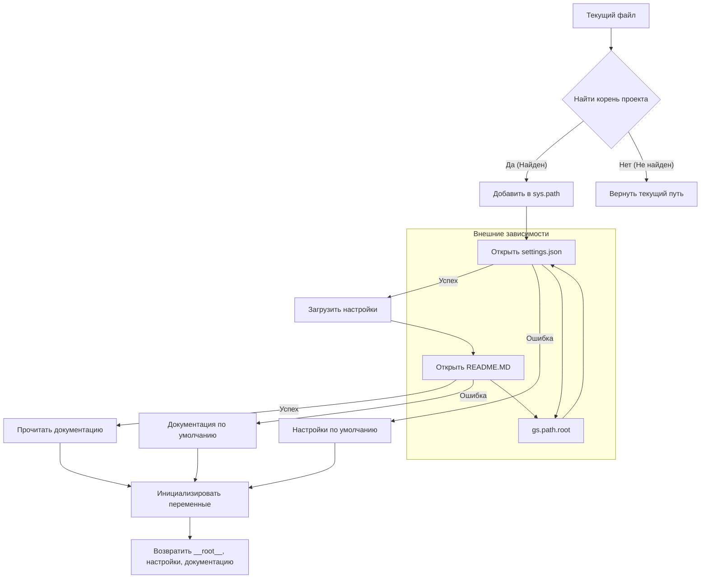

# <input code>

```python
## \file hypotez/src/gui/header.py
# -*- coding: utf-8 -*-\n#! venv/Scripts/python.exe
#! venv/bin/python/python3.12
"""
.. module: src.gui 
	:platform: Windows, Unix
	:synopsis:

"""
MODE = 'dev'

"""
	:platform: Windows, Unix
	:synopsis:

"""


"""
	:platform: Windows, Unix
	:synopsis: Модуль определяющий корневой путь к проекту. Все импорты строятся относительно этого пути.
    :TODO: В дальнейшем перенести в системную переменную

"""

import sys
import json
from packaging.version import Version

from pathlib import Path
def set_project_root(marker_files=('pyproject.toml', 'requirements.txt', '.git')) -> Path:
    """
    Finds the root directory of the project starting from the current file's directory,
    searching upwards and stopping at the first directory containing any of the marker files.

    Args:
        marker_files (tuple): Filenames or directory names to identify the project root.
    
    Returns:
        Path: Path to the root directory if found, otherwise the directory where the script is located.
    """
    __root__:Path
    current_path:Path = Path(__file__).resolve().parent
    __root__ = current_path
    for parent in [current_path] + list(current_path.parents):
        if any((parent / marker).exists() for marker in marker_files):
            __root__ = parent
            break
    if __root__ not in sys.path:
        sys.path.insert(0, str(__root__))
    return __root__


# Get the root directory of the project
__root__ = set_project_root()
"""__root__ (Path): Path to the root directory of the project"""

from src import gs

settings:dict = None
try:
    with open(gs.path.root / 'src' /  'settings.json', 'r') as settings_file:
        settings = json.load(settings_file)
except (FileNotFoundError, json.JSONDecodeError):
    ...

doc_str:str = None
try:
    with open(gs.path.root / 'src' /  'README.MD', 'r') as settings_file:
        doc_str = settings_file.read()
except (FileNotFoundError, json.JSONDecodeError):
    ...


__project_name__ = settings.get("project_name", 'hypotez') if settings  else 'hypotez'
__version__: str = settings.get("version", '')  if settings  else ''
__doc__: str = doc_str if doc_str else ''
__details__: str = ''
__author__: str = settings.get("author", '')  if settings  else ''
__copyright__: str = settings.get("copyrihgnt", '')  if settings  else ''
__cofee__: str = settings.get("cofee", "Treat the developer to a cup of coffee for boosting enthusiasm in development: https://boosty.to/hypo69")  if settings  else "Treat the developer to a cup of coffee for boosting enthusiasm in development: https://boosty.to/hypo69"
```

# <algorithm>

**Алгоритм** работы `header.py` можно представить следующей блок-схемой:

1. **Получение корневого пути:** Функция `set_project_root` ищет корневой каталог проекта, начиная с текущего файла и идя вверх по дереву каталогов. Проверяет наличие файлов `pyproject.toml`, `requirements.txt` или `.git` в каждом родительском каталоге.
2. **Добавление корневого пути в `sys.path`:** Если корневой путь не находится в `sys.path`, то он добавляется в него для корректного импорта модулей из других директорий проекта.
3. **Чтение настроек:** Из файла `settings.json` в корневой директории проекта считываются настройки проекта.
4. **Чтение документации:** Из файла `README.MD` в корневой директории проекта считывается текст документации.
5. **Инициализация переменных:**  Создаются переменные, содержащие данные из настроек проекта, документации или заданные по умолчанию.
6. **Обработка ошибок:** Используются `try...except` блоки для перехвата возможных ошибок (`FileNotFoundError`, `json.JSONDecodeError`), связанных с чтением файлов.


**Примеры:**
* Если `pyproject.toml` найдет в директории `C:\Projects\myproject`, то `__root__` будет равно `C:\Projects\myproject`.
* Если `settings.json` не найден, `settings` останется `None`, и значения по умолчанию будут использованы.

**Передача данных:**
* Результат работы `set_project_root` – путь к корню (`__root__`) передается далее ко всем последующим операциям.
* Настройки из `settings.json` передаются по умолчанию через словарь `settings`.
* Текст документации из `README.MD` передается в `__doc__`.

# <mermaid>



**Объяснение диаграммы:**

* **Внешние зависимости:** Модуль `gs` содержит информацию о путях, что позволяет работать с файлами проекта. Связь показана через `gs.path.root`, обозначающую доступ к корневому каталогу проекта.
* **Обработка ошибок:** Диаграмма показывает блоки `try...except` для обработки `FileNotFoundError` и `json.JSONDecodeError` при чтении файлов.
* **Поток данных:** Показана последовательность операций и передача данных между функциями и переменными.


# <explanation>

**Импорты:**

* `sys`: Предоставляет доступ к системным переменным, в данном случае – к пути поиска модулей (`sys.path`).
* `json`: Используется для работы с файлами в формате JSON (чтение и парсинг настроек).
* `packaging.version`:  Используется, вероятно, для работы с версиями, хотя прямо не используется в данном коде. Возможно, понадобится в дальнейшем.
* `pathlib`: Для работы с путями к файлам в удобной объектно-ориентированной форме.


**Классы:**

* Нет определенных классов.  Код использует модули Python, которые предлагают встроенные типы данных и функции.

**Функции:**

* `set_project_root(marker_files)`:  Находит корневой каталог проекта, начиная с текущего файла и поднимаясь вверх по дереву каталогов.  Возвращает путь к корневому каталогу. Аргумент `marker_files` позволяет указать файлы/директории, которые должны быть в корневом каталоге проекта.  Этот метод предоставляет гибкость в выборе маркеров корневого каталога.

**Переменные:**

* `__root__`: Тип `Path`. Содержит путь к корневому каталогу проекта.
* `settings`: Тип `dict`. Содержит настройки проекта, загруженные из `settings.json`.
* `doc_str`: Тип `str`. Содержит текст документации, загруженный из `README.MD`.
* `__project_name__`, `__version__`, `__doc__`, `__details__`, `__author__`, `__copyright__`, `__cofee__`:  Тип `str`. Переменные, содержащие информацию о проекте, взятые из `settings.json` или значения по умолчанию.

**Возможные ошибки или области для улучшений:**

* **Обработка ошибок:**  Обработка ошибок (except блоки) в чтении `settings.json` и `README.MD` – хорошая практика, но не проверяется, если файл не содержит JSON-формат, или он пустой. Можно добавить более подробные сообщения об ошибках (например, в лог файл) для лучшей диагностики проблем.
* **Дополнительно:**  Улучшить обработку путей, особенно с учетом возможных проблем с переходом между платформами (Windows, Unix).
* **Документация:**  Добавить более подробную документацию к функциям и классам для лучшего понимания их использования.
* **Глобальные переменные:** Использование глобальных переменных `__root__`, `settings`, `doc_str` снижает читабельность кода и может привести к неожиданному поведению при использовании в других модулях. Возможно, лучше было бы использовать значения, возвращаемые функциями.

**Связь с другими частями проекта:**

Функция `set_project_root` жизненно необходима для того, чтобы импорт работы с настройками проекта (`gs`) и других модулей осуществлялся корректно.  Модуль `gs` (скорее всего, `src/gs.py`) определяет пути к ресурсам проекта, таким образом, реализует контекст, в котором работают переменные `gs.path.root`, `settings.json` и `README.MD`.  Целостность кода, написанного в `gui/header.py`, сильно зависит от корректного функционирования модуля `gs`.