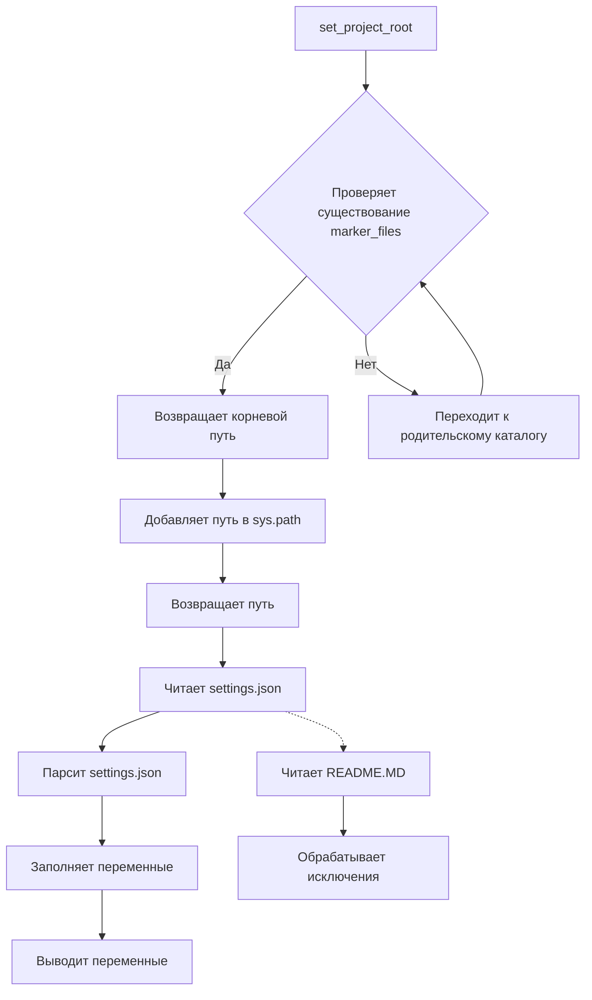

```MD
# Анализ кода из файла hypotez/src/gui/header.py

## <input code>

```python
## \file hypotez/src/gui/header.py
# -*- coding: utf-8 -*-\n#! venv/Scripts/python.exe
#! venv/bin/python/python3.12
"""
.. module: src.gui 
	:platform: Windows, Unix
	:synopsis:

"""
MODE = 'dev'

"""
	:platform: Windows, Unix
	:synopsis:

"""


"""
	:platform: Windows, Unix
	:synopsis: Модуль определяющий корневой путь к проекту. Все импорты строятся относительно этого пути.
    :TODO: В дальнейшем перенести в системную переменную

"""

import sys
import json
from packaging.version import Version
from pathlib import Path
def set_project_root(marker_files=('pyproject.toml', 'requirements.txt', '.git')) -> Path:
    """
    Finds the root directory of the project starting from the current file's directory,
    searching upwards and stopping at the first directory containing any of the marker files.

    Args:
        marker_files (tuple): Filenames or directory names to identify the project root.
    
    Returns:
        Path: Path to the root directory if found, otherwise the directory where the script is located.
    """
    __root__:Path
    current_path:Path = Path(__file__).resolve().parent
    __root__ = current_path
    for parent in [current_path] + list(current_path.parents):
        if any((parent / marker).exists() for marker in marker_files):
            __root__ = parent
            break
    if __root__ not in sys.path:
        sys.path.insert(0, str(__root__))
    return __root__


# Get the root directory of the project
__root__ = set_project_root()
"""__root__ (Path): Path to the root directory of the project"""

from src import gs

settings:dict = None
try:
    with open(gs.path.root / 'src' / 'settings.json', 'r') as settings_file:
        settings = json.load(settings_file)
except (FileNotFoundError, json.JSONDecodeError):
    ...

doc_str:str = None
try:
    with open(gs.path.root / 'src' / 'README.MD', 'r') as settings_file:
        doc_str = settings_file.read()
except (FileNotFoundError, json.JSONDecodeError):
    ...


__project_name__ = settings.get("project_name", 'hypotez') if settings  else 'hypotez'
__version__: str = settings.get("version", '')  if settings  else ''
__doc__: str = doc_str if doc_str else ''
__details__: str = ''
__author__: str = settings.get("author", '')  if settings  else ''
__copyright__: str = settings.get("copyrihgnt", '')  if settings  else ''
__cofee__: str = settings.get("cofee", "Treat the developer to a cup of coffee for boosting enthusiasm in development: https://boosty.to/hypo69")  if settings  else "Treat the developer to a cup of coffee for boosting enthusiasm in development: https://boosty.to/hypo69"
```

## <algorithm>

**Шаг 1:** Определение корневого каталога проекта (`set_project_root`)

*   Начинается с текущего каталога файла.
*   Итерируется по родительским каталогам.
*   Проверяет существование файлов-маркеров (`pyproject.toml`, `requirements.txt`, `.git`).
*   Если найден маркер, возвращает родительский каталог.
*   Добавляет найденный путь в `sys.path`.
*   Возвращает найденный путь (`__root__`).


**Пример:** Если файл находится в `hypotez/src/gui/header.py`, и `hypotez` - корневой каталог, функция вернет `Path('hypotez')`.

**Шаг 2:** Чтение настроек (`settings.json`) и документации (`README.MD`)

*   Используется `gs.path.root` для получения пути к корневому каталогу проекта.
*   Открывает `settings.json` в режиме чтения.
*   Парсит `settings.json` с помощью `json.load()`.
*   Обрабатывает возможные исключения (`FileNotFoundError`, `json.JSONDecodeError`).
*   Аналогично, выполняет чтение файла `README.MD`.

**Шаг 3:** Получение метаданных из настроек

*   Извлекает значения из словаря `settings` или использует значения по умолчанию.
*   Заполняет переменные `__project_name__`, `__version__`, `__doc__`, `__details__`, `__author__`, `__copyright__`, `__cofee__` данными из настроек или значениями по умолчанию.


## <mermaid>



## <explanation>

**Импорты:**

*   `sys`: предоставляет доступ к системным переменным, в частности `sys.path` для управления путями поиска модулей.
*   `json`: для работы с файлами JSON.
*   `packaging.version`: для работы с версиями пакетов.
*   `pathlib`: для работы с путями к файлам.
*   `gs`:  предполагается, что это модуль, который предоставляет доступ к различным ресурсам проекта (например, к `gs.path.root` для получения корневого пути).  Нужно дополнительное контекстное описание модуля `gs`.

**Классы:**

Нет явных классов в данном коде.

**Функции:**

*   `set_project_root(marker_files)`: находит корневой каталог проекта, начиная с текущего файла и поднимаясь по родительским каталогам, пока не найдёт каталог, содержащий один из файлов-маркеров.

**Переменные:**

*   `MODE`: строковая переменная, содержащая режим работы (вероятно, 'dev' или 'prod').
*   `__root__`: путь к корневому каталогу проекта (тип `pathlib.Path`).
*   `settings`: словарь, содержащий настройки проекта, загруженные из файла `settings.json`.
*   `doc_str`: содержимое файла `README.MD`.
*   `__project_name__`, `__version__`, `__doc__`, `__details__`, `__author__`, `__copyright__`, `__cofee__`: строки, содержащие соответствующие данные из файла `settings.json`.


**Возможные ошибки/улучшения:**

*   **Обработка ошибок:** Используется блок `try...except`, но в нём не выполняется никаких действий при возникновении ошибок, кроме игнорирования ошибки.  В реальном коде необходимо выводить предупреждения или обрабатывать эти исключения более подходящим способом (например, при невозможности найти `settings.json` или `README.MD` выводить соответствующее сообщение об ошибке).
*   **Глобальные переменные:** Использование глобальных переменных вроде `__root__`, `settings`, `doc_str` может привести к проблемам с отладкой и пониманием кода, если код будет расширяться. В будущем стоит рассмотреть использование класса для encapsulating этих данных, с подходящими методами для доступа.
*   **Модуль gs:**  Необходимо описание модуля `gs` и его взаимосвязей, чтобы полностью понять работу кода.


**Взаимосвязи с другими частями проекта:**

Модуль `header.py` определяет корневой путь проекта, используемый в других модулях, таких как `gs`.  `settings.json` и `README.MD` используются для получения метаданных о проекте, что позволяет другим частям проекта (например, интерфейсам) отображать эту информацию.  Без контекста `gs` сложно проследить все взаимосвязи.