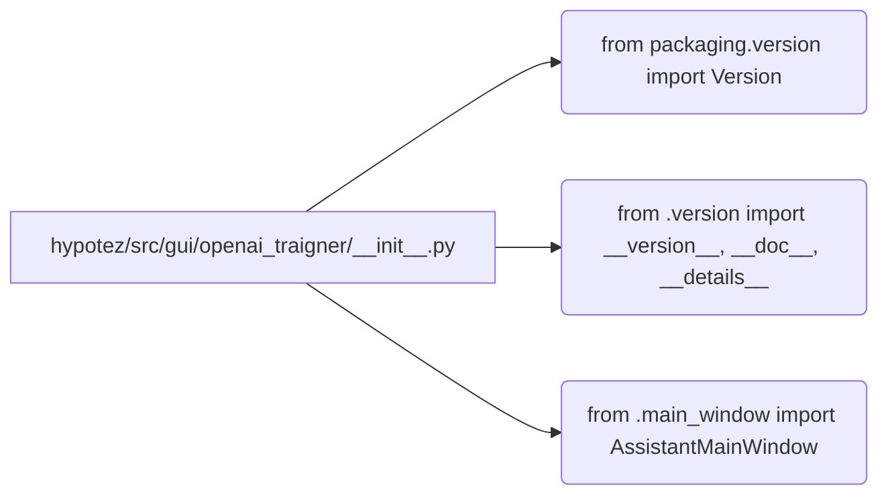

# <input code>

```python
## \file hypotez/src/gui/openai_trаigner/__init__.py
# -*- coding: utf-8 -*-\
#! venv/Scripts/python.exe
#! venv/bin/python/python3.12

"""
.. module: src.gui.openai_trаigner 
	:platform: Windows, Unix
	:synopsis:

"""
MODE = 'dev'

"""
	:platform: Windows, Unix
	:synopsis:

"""


"""
	:platform: Windows, Unix
	:synopsis:

"""


"""
  :platform: Windows, Unix

"""
"""
  :platform: Windows, Unix
  :platform: Windows, Unix
  :synopsis:
"""MODE = 'dev'
  
""" module: src.gui.openai_trаigner """


""" @namespace src.fast_api """


""" """
...

from packaging.version import Version
from .version import __version__, __doc__, __details__   

from .main_window import AssistantMainWindow
```

# <algorithm>

Алгоритм работы данного файла сводится к импорту модулей и констант.  Нет сложных логических операций, только инициализация.  Пошаговая блок-схема не требуется.

# <mermaid>



**Объяснение диаграммы:**

Файл `hypotez/src/gui/openai_trаigner/__init__.py` импортирует модули из своего же пакета `__version__`, `__doc__`, `__details__` (скорее всего, содержащий информацию о версии и документацию), а также `AssistantMainWindow` (вероятно, класс, представляющий главное окно приложения).  Импорты из `packaging.version` обеспечивают функциональность работы с версиями.

# <explanation>

**Импорты:**

- `from packaging.version import Version`: Импортирует класс `Version` из модуля `packaging.version`. Этот модуль, скорее всего, используется для работы с версиями пакетов Python.  `Version` нужен для сравнения или анализа версий.
- `from .version import __version__, __doc__, __details__`: Импортирует переменные `__version__`, `__doc__`, `__details__` из модуля `version.py` в том же каталоге (`./version`). Эти переменные, вероятно, содержат информацию о версии модуля, документацию и дополнительные детали.  Связь:  `src.gui.openai_trаigner` использует информацию о версии и документацию, определенную в файле `version.py`.
- `from .main_window import AssistantMainWindow`: Импортирует класс `AssistantMainWindow` из модуля `main_window.py` в том же каталоге (`./main_window`).  Этот класс, скорее всего, представляет главное окно графического интерфейса пользователя (GUI) для OpenAI trainer. Связь:  `src.gui.openai_trаigner` использует этот класс, чтобы создать пользовательский интерфейс.


**Переменные:**

- `MODE = 'dev'`: Глобальная переменная, устанавливающая режим работы. Вероятно, используется для различия между режимами разработки (`dev`) и релизного режима.  В данном файле этот параметр, скорее всего, просто определен для передачи в другие части кода, но не активно используется.

**Классы:**

- `AssistantMainWindow`: Класс, представляющий главное окно OpenAI trainer.  Подробности о его атрибутах и методах отсутствуют, поскольку исходный код файла `main_window.py` не предоставлен.


**Функции:**

Нет функций, только импорты и переменные.


**Возможные ошибки и улучшения:**

- **Отсутствует документация:**  Комментарии `"""docstrings"""` очень важны, но не заполнены.  Необходимо добавить более подробные описания функций и переменных.
- **Недостаточно информации:** Непонятно, как используется `MODE = 'dev'`, нет примеров использования других импортированных элементов.
- **Отсутствие обработчиков ошибок:** Для корректной работы необходимо наличие проверок на валидность данных и обработку исключений.
- **Не ясен путь venv/bin/python/python3.12:**  Это нетипичный путь.  В Linux/macOS `python3.12` - это обычно сам интерпретатор Python.   Скорее всего,  следует изменить это на корректный путь запуска Python.


**Цепочка взаимосвязей:**

`src.gui.openai_trаigner`  импортирует классы и переменные из подмодулей `version.py` и `main_window.py`.  Связь с другими частями проекта зависит от того, где и как используются эти элементы.  Предположительно, этот модуль является частью большего проекта, который использует  GUI, связанный с  OpenAI trainer.