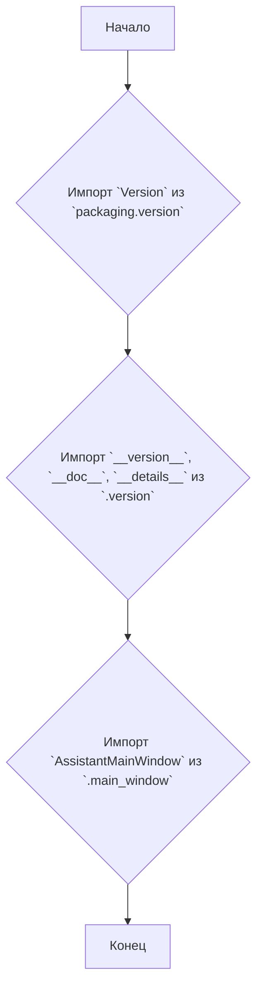
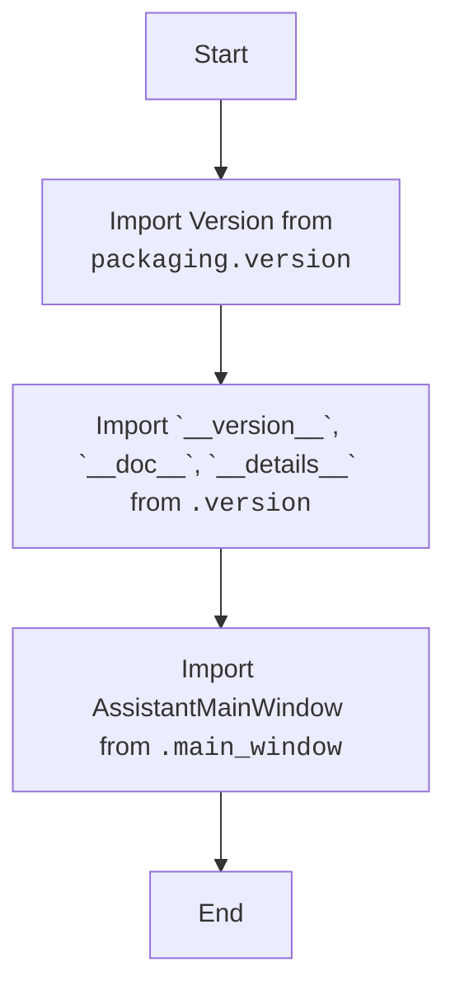

## АНАЛИЗ КОДА: `hypotez/src/gui/openai_trаigner/__init__.py`

### 1. <алгоритм>
Файл `__init__.py` в Python обычно используется для инициализации пакета. В данном случае, он служит для обозначения директории `openai_trainer` как пакета и для импорта необходимых компонентов.

**Блок-схема:**



**Примеры:**

*   **Импорт `Version` из `packaging.version`**:
    ```python
    from packaging.version import Version
    ```
    Используется для работы с версиями программного обеспечения.
*   **Импорт `__version__`, `__doc__`, `__details__` из `.version`**:
    ```python
    from .version import __version__, __doc__, __details__
    ```
    Импортирует переменные для хранения информации о версии, документации и деталях пакета.
*   **Импорт `AssistantMainWindow` из `.main_window`**:
    ```python
    from .main_window import AssistantMainWindow
    ```
    Импортирует класс главного окна приложения, который, вероятно, является основным компонентом пользовательского интерфейса.

### 2. <mermaid>


**Объяснение диаграммы `mermaid`:**

1.  **`Start`**: Начальная точка процесса.
2.  **`ImportVersionFromPackaging`**: Импортирует класс `Version` из библиотеки `packaging.version`. Эта библиотека используется для сравнения версий.
3.  **`ImportVersionInfo`**: Импортирует переменные `__version__`, `__doc__`, и `__details__` из модуля `.version`. Эти переменные, вероятно, хранят информацию о версии текущего пакета, документацию и другие детали.
4.  **`ImportAssistantMainWindow`**: Импортирует класс `AssistantMainWindow` из модуля `.main_window`. Это, вероятно, основной класс графического интерфейса пользователя (GUI).
5.  **`End`**: Конечная точка процесса.

### 3. <объяснение>
#### Импорты:

*   `from packaging.version import Version`:
    *   **Назначение:** Импортирует класс `Version` из библиотеки `packaging.version`. Эта библиотека используется для работы с версиями программного обеспечения.
    *   **Взаимосвязь с `src.`:** Эта библиотека является сторонней и не относится напрямую к пакетам `src`. Она используется для стандартизации обработки версий.
*   `from .version import __version__, __doc__, __details__`:
    *   **Назначение:** Импортирует переменные `__version__` (версия), `__doc__` (документация) и `__details__` (детали) из модуля `version.py` текущего пакета.
    *   **Взаимосвязь с `src.`:** Указывает на внутренний модуль пакета `openai_trainer`, содержащий метаданные. Это обычная практика для хранения информации о версии пакета.
*   `from .main_window import AssistantMainWindow`:
    *   **Назначение:** Импортирует класс `AssistantMainWindow` из модуля `main_window.py` текущего пакета. Этот класс, вероятно, представляет главное окно приложения.
    *   **Взаимосвязь с `src.`:** Указывает на внутренний модуль пакета `openai_trainer`, который содержит основной GUI.

#### Классы:
В данном файле классы не определяются, но импортируется `AssistantMainWindow`.
*   `AssistantMainWindow`:
    *   **Роль:** Вероятно, класс, отвечающий за создание и управление главным окном графического интерфейса приложения.
    *   **Атрибуты и методы:** Будут определены в `main_window.py`. (Требуется анализ файла `main_window.py`).
    *   **Взаимодействие:** Скорее всего, является центральным элементом GUI, который взаимодействует с другими компонентами пакета `openai_trainer`.

#### Функции:
Функции в данном файле не определены.

#### Переменные:
*   `__version__`:
    *   **Тип:** Строка.
    *   **Использование:** Хранит версию пакета. Используется для контроля версий, отображения информации о версии.
*    `__doc__`:
    *   **Тип:** Строка.
    *   **Использование:** Хранит документацию пакета. Используется для описания пакета.
*    `__details__`:
    *   **Тип:** Строка.
    *   **Использование:** Хранит дополнительную информацию о пакете.

#### Потенциальные ошибки и области для улучшения:
*   В файле много закомментированных пустых строк. Возможно, стоит их удалить.
*   Непонятно, как будут использоваться импортированные переменные, в особенности `__doc__` и `__details__`.
*   Отсутствует обработка исключений.
*   Не хватает комментариев и документации.

#### Цепочка взаимосвязей:
1.  `__init__.py` импортирует:
    *   `Version` из `packaging.version`.
    *   `__version__`, `__doc__`, `__details__` из `.version`.
    *   `AssistantMainWindow` из `.main_window`.
2.  `packaging.version` - сторонняя библиотека, не связанная с `src`, но используемая для управления версиями.
3.  `.version` - внутренний модуль текущего пакета (`openai_trainer`).
4.  `.main_window` - внутренний модуль текущего пакета, содержащий логику главного окна.
5.  Используя `AssistantMainWindow`, `__init__.py` вероятно, делает его доступным при импорте пакета `openai_trainer` из других частей проекта.