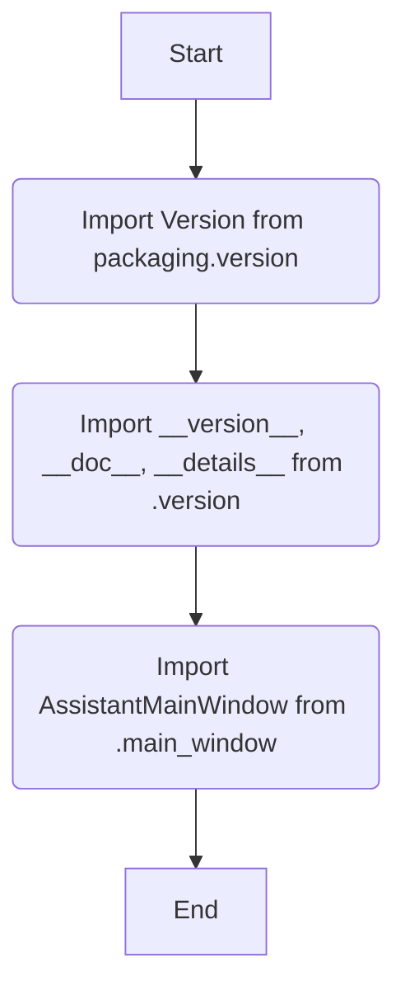

## Анализ кода `src/gui/openai_trаigner/__init__.py`

### 1. <алгоритм>
1.  **Импорт библиотек:**
    *   Импортируется `Version` из библиотеки `packaging.version`.
        *   _Пример_: `from packaging.version import Version` - импорт класса для работы с версиями.
2.  **Импорт из локальных модулей:**
    *   Импортируются `__version__`, `__doc__`, `__details__` из модуля `.version`.
        *   _Пример_: `from .version import __version__, __doc__, __details__` - импорт информации о версии и деталях проекта.
    *   Импортируется `AssistantMainWindow` из модуля `.main_window`.
        *   _Пример_: `from .main_window import AssistantMainWindow` - импорт основного окна приложения.
3. **Конец:** Завершение инициализации пакета `src.gui.openai_trаigner`.

### 2. <mermaid>

**Объяснение зависимостей `mermaid`:**

*   `A`: Начало процесса.
*   `B`: Импорт класса `Version` из библиотеки `packaging.version`.
    *   `packaging.version`: Внешняя библиотека для работы с версиями.
*   `C`: Импорт переменных `__version__`, `__doc__`, и `__details__` из локального модуля `.version`.
    *   `.version`: Локальный модуль, содержащий информацию о версии пакета и его документацию.
*   `D`: Импорт класса `AssistantMainWindow` из локального модуля `.main_window`.
    *   `.main_window`: Локальный модуль, содержащий определение главного окна приложения.
*   `E`: Завершение процесса.

### 3. <объяснение>

**Импорты:**

*   `from packaging.version import Version`:
    *   **Назначение:** Импортирует класс `Version` из библиотеки `packaging.version`, который используется для сравнения и работы с версиями программного обеспечения.
    *   **Взаимосвязь с другими пакетами `src`:**  Используется для управления версиями, но не имеет прямой связи с остальными частями проекта `src`, но является важным аспектом для управления релизом приложения.

*   `from .version import __version__, __doc__, __details__`:
    *   **Назначение:** Импортирует переменные, содержащие информацию о версии (`__version__`), документацию (`__doc__`), и дополнительные сведения (`__details__`) о пакете. Модуль `.version` должен быть расположен в той же директории, что и `__init__.py`.
    *   **Взаимосвязь с другими пакетами `src`:**  Внутри проекта, модуль `src.gui.openai_trаiner` содержит информацию о своей версии и документацию.

*   `from .main_window import AssistantMainWindow`:
    *   **Назначение:** Импортирует класс `AssistantMainWindow`, который, вероятно, является основным окном пользовательского интерфейса для приложения-тренажера OpenAI. Модуль `.main_window` должен быть расположен в той же директории, что и `__init__.py`.
    *   **Взаимосвязь с другими пакетами `src`:** Является частью GUI, и обеспечивает интерфейс для взаимодействия с пользователем.

**Классы:**

*   `AssistantMainWindow`:
    *   **Роль:** Основное окно приложения, отвечающее за визуальное представление и взаимодействие с пользователем.
    *   **Атрибуты и методы:**  Точные атрибуты и методы не видны из этого кода, но предположительно будет содержать кнопки, поля ввода, вывода и логику для управления тренировкой моделей OpenAI.
    *   **Взаимодействие с другими компонентами:**  Этот класс будет взаимодействовать с другими компонентами `src` через их интерфейсы.

**Функции:**

*   В данном коде функции явно не определены. Логика  инициализации пакета ограничивается импортом необходимых классов, переменных и констант.

**Переменные:**

*   `__version__`: Строка, содержащая текущую версию пакета.
*   `__doc__`: Строка, содержащая документацию пакета.
*   `__details__`: Строка, содержащая дополнительные детали пакета.

**Потенциальные ошибки и области для улучшения:**

*   Отсутствие подробных комментариев в начале файла.  Рекомендуется добавить более детальное описание модуля и его назначения.
*   В коде есть много пустых docstring, которые нужно удалить.
*   Необходим файл `src/gui/openai_trаiner/version.py`, который будет определять переменные `__version__`, `__doc__`, и `__details__` для того чтобы проект был корректным.
*   Аналогично нужно проверить наличие `src/gui/openai_trаiner/main_window.py`

**Цепочка взаимосвязей с другими частями проекта:**

1.  **`src.gui.openai_trаiner`**:
    *   Этот пакет служит точкой входа для запуска GUI.
2.  **`src.gui.openai_trаiner.version`**:
    *   Предоставляет информацию о версии для текущего пакета.
3.  **`src.gui.openai_trаiner.main_window`**:
    *   Содержит класс, который управляет главным окном приложения и обеспечивает пользовательский интерфейс.

В целом, данный код выполняет роль инициализации пакета `src.gui.openai_trаiner`, импортируя необходимые зависимости и подготавливая среду для запуска графического интерфейса.