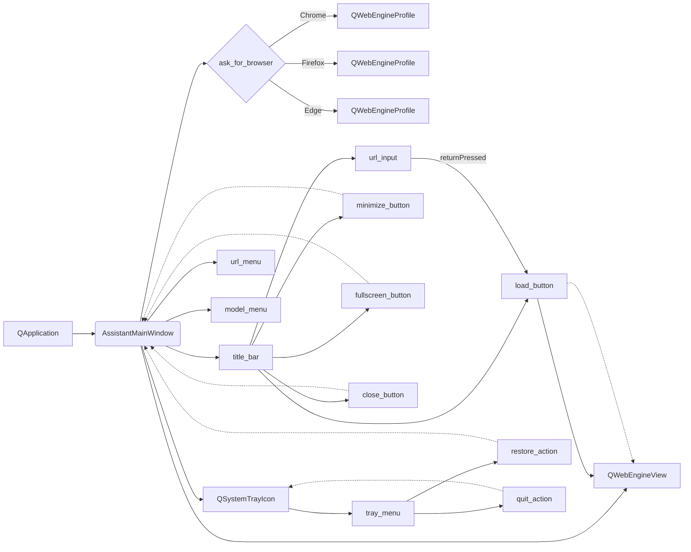

```MD
# <input code>

```python
## \file hypotez/src/gui/openai_trаigner/main.py
# -*- coding: utf-8 -*-
#! venv/Scripts/python.exe
#! venv/bin/python/python3.12

"""
.. module: src.gui.openai_trаigner 
	:platform: Windows, Unix
	:synopsis:
"""
MODE = 'dev'


"""
	:platform: Windows, Unix
	:synopsis:
"""


"""
	:platform: Windows, Unix
	:synopsis:
"""


"""
  :platform: Windows, Unix
"""
"""
  :platform: Windows, Unix
  :platform: Windows, Unix
  :synopsis:
"""MODE = 'dev'
  
""" module: src.gui.openai_trаigner """


import sys
import os
from PyQt6.QtCore import Qt, QUrl
from PyQt6.QtGui import QIcon, QAction
from PyQt6.QtWidgets import (
    QApplication, QMainWindow, QSystemTrayIcon, QMenu, QPushButton,
    QVBoxLayout, QHBoxLayout, QWidget, QLineEdit, QMessageBox
)
from PyQt6.QtWebEngineWidgets import QWebEngineView
from PyQt6.QtWebEngineCore import QWebEngineProfile
```

# <algorithm>

**Пошаговая блок-схема:**

1. **Инициализация приложения PyQt:**
   - Создается `QApplication`.
   - `app.setQuitOnLastWindowClosed(False)`:  приложение не закрывается при закрытии последнего окна, а переходит в трей.
   - Создается `AssistantMainWindow`.

2. **Инициализация окна `AssistantMainWindow`:**
   - Устанавливаются размеры окна.
   - Вызывается `ask_for_browser()` для выбора браузера по умолчанию.
   - Создается профиль браузера (`QWebEngineProfile`) на основе выбора.
   - Создается `QWebEngineView` для отображения веб-страниц.
   - Создаются элементы пользовательского интерфейса (кнопки, поля ввода, меню):
     - Верхняя панель инструментов (`title_bar`) с полями ввода URL, кнопками загрузки, минимизации, полноэкранного режима и закрытия.
     - Браузер (`browser`) для отображения веб-страниц.
   - Создается `QSystemTrayIcon` для иконки в системном трее.
   - Создаются контекстные меню для иконки в трее и меню сервисов Google и выбора модели.

3. **Установка layout:**
   - `QHBoxLayout` для верхней панели (`title_bar`).
   - `QVBoxLayout` для основного окна.
   - Центральный виджет `QWidget` с установленным layout.

4. **Создание и установка меню:**
   - Меню выбора сервисов Google (`url_menu`).
   - Меню выбора моделей (`model_menu`).
   - Добавление пунктов меню в `url_menu` и `model_menu` для загрузки соответствующих страниц.

5. **Подключение сигналов к слотам:**
   - Кнопка загрузки URL (`load_button`) связана с методом `load_url()`.
   - Кнопки минимизации, максимизации и закрытия связаны с методами.
   - Кнопки меню сервисов Google и моделей связаны с `load_url()` для загрузки URL-адресов.
   - Пункты контекстного меню в трее связаны с методами `showNormal()` и `quit_app()`.
   - Поле ввода URL (`url_input`) связано с методом `load_url()` через `returnPressed`.

6. **Метод `ask_for_browser`:**
   - Показывается диалоговое окно для выбора браузера.
   - Возвращает выбранный браузер.

7. **Метод `load_url`:**
   - Загружает URL-адрес в браузер.
   - Добавляет "http://" перед URL, если это необходимо.

8. **Метод `hide_to_tray`:**
   - Скрывает главное окно.

9. **Метод `quit_app`:**
   - Скрывает иконку в трее.
   - Выходит из приложения.


# <mermaid>



# <explanation>

**Импорты:**

- `sys`, `os`: Стандартные модули Python для работы с системой (например, выходом из приложения, взаимодействием с файловой системой).
- `Qt`, `QUrl`, `QIcon`, `QAction`, ...: Модули из PyQt6, для создания графического интерфейса (окна, кнопки, меню и т.д.).
- `QWebEngineView`, `QWebEngineProfile`: Модули PyQt6 для работы с веб-браузером. Связаны с отображением веб-страниц в приложении.
- Все импорты из `PyQt6` находятся в пространстве имен `PyQt6`.


**Классы:**

- `AssistantMainWindow`: Главный класс приложения, наследуется от `QMainWindow`. Отвечает за создание и управление окном приложения, включая UI-элементы, обработку событий и работу с браузером.
  - `__init__`: Конструктор класса, инициализирует окно, браузер, UI-элементы, системный трей и меню.  `ask_for_browser` запрашивает браузер по умолчанию.  `load_url` загружает веб-страницы.  `hide_to_tray` скрывает главное окно в трее. `quit_app` закрывает приложение.
  - `closeEvent`: Переопределенный метод для обработки события закрытия окна. Переводит окно в скрытый режим.
  - `ask_for_browser`: Запрашивает у пользователя выбор браузера по умолчанию из списка.
  - `load_url`: Загружает URL в браузер.
  - `hide_to_tray`: Скрывает главное окно и отображает иконку в трее.
  - `quit_app`: Завершает работу приложения.


**Функции:**

- `ask_for_browser`: Возвращает строку, представляющую выбранный браузер.
- `load_url`: Загружает URL в браузер.
- `hide_to_tray`: Скрывает окно, показывает иконку в трее.
- `quit_app`: Завершает работу приложения.


**Переменные:**

- `MODE`: Строковая переменная, вероятно, используемая для выбора режима работы приложения (например, разработка или производство).
- `profile`: Объект `QWebEngineProfile`, используемый для настройки браузера.
- `browser`: Объект `QWebEngineView` для отображения веб-страниц.
- `url_input`: Объект `QLineEdit` для ввода URL-адреса.
- Другие переменные: `tray_icon`, `url_menu`, `model_menu`, etc. - представляют различные компоненты UI и контекстные меню.


**Возможные ошибки и улучшения:**

- Жесткая кодировка путей к профилям браузеров: может потребоваться динамическое определение путей.
- Отсутствие валидации URL в `load_url`:  Необходимо проверять корректность вводимого URL-адреса, чтобы избежать ошибок.
- Недокументированные URL для `Gemini` и `Claude`:  Нужно добавить реальные URL-адреса этих моделей.
-  Можно добавить обработку ошибок при работе с браузером, а также более дружественный пользовательский интерфейс.  Отображение загрузки.

**Взаимосвязи с другими частями проекта:**

- Код, вероятно, часть графического интерфейса для взаимодействия с OpenAI, Gemini или Claude API.  Поэтому он тесно связан с модулями, отвечающими за работу с этими API. Не хватает информации о том, как данные передаются в эти модули.