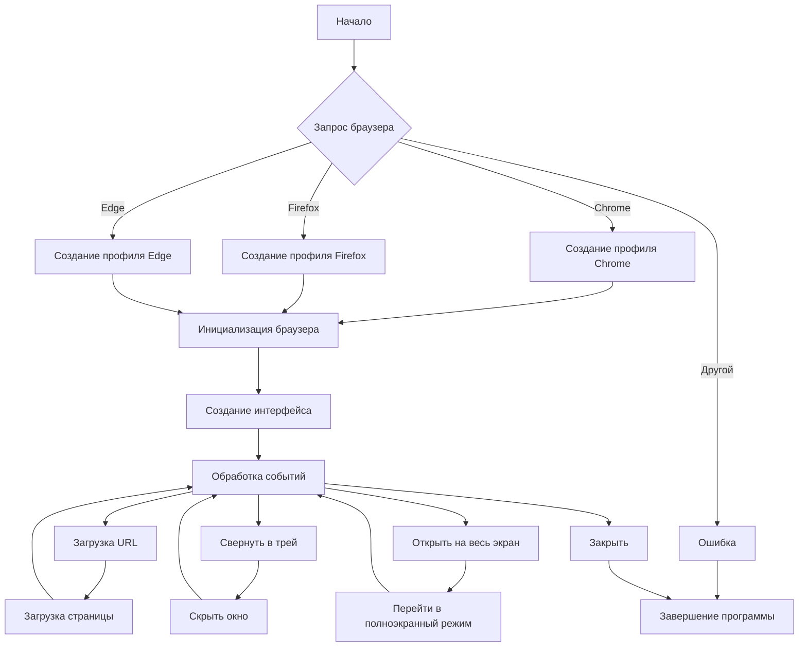

# <input code>

```python
## \file hypotez/src/gui/openai_trаigner/main.py
# -*- coding: utf-8 -*-
#! venv/Scripts/python.exe
#! venv/bin/python/python3.12

"""
.. module:: src.gui.openai_trаigner 
	:platform: Windows, Unix
	:synopsis:

"""
MODE = 'dev'


"""
	:platform: Windows, Unix
	:synopsis:

"""


"""
	:platform: Windows, Unix
	:synopsis:

"""


"""
  :platform: Windows, Unix

"""
"""
  :platform: Windows, Unix
  :platform: Windows, Unix
  :synopsis:
"""MODE = 'dev'
  
""" module: src.gui.openai_trаigner """


import sys
import os
from PyQt6.QtCore import Qt, QUrl
from PyQt6.QtGui import QIcon, QAction
from PyQt6.QtWidgets import (
    QApplication, QMainWindow, QSystemTrayIcon, QMenu, QPushButton,
    QVBoxLayout, QHBoxLayout, QWidget, QLineEdit, QMessageBox
)
from PyQt6.QtWebEngineWidgets import QWebEngineView
from PyQt6.QtWebEngineCore import QWebEngineProfile

class AssistantMainWindow(QMainWindow):
    def __init__(self):
        super().__init__()

        # Убираем максимизацию, чтобы пользователь мог изменять размер окна
        self.setWindowFlags(Qt.WindowType.Window | Qt.WindowType.WindowCloseButtonHint)

        # Устанавливаем размеры на 3/4 экрана
        screen_geometry = QApplication.primaryScreen().geometry()
        width = int(screen_geometry.width() * 0.75)
        height = int(screen_geometry.height() * 0.75)
        self.setGeometry((screen_geometry.width() - width) // 2,
                         (screen_geometry.height() - height) // 2,
                         width, height)

        # Запрос браузера по умолчанию
        browser_choice = self.ask_for_browser()

        # Создание профиля для выбранного браузера
        if browser_choice == 'Chrome':
            profile_path = os.path.expanduser("~\\AppData\\Local\\Google\\Chrome\\User Data\\Default")
        elif browser_choice == 'Firefox':
            profile_path = os.path.expanduser("~\\AppData\\Roaming\\Mozilla\\Firefox\\Profiles")
        elif browser_choice == 'Edge':
            profile_path = os.path.expanduser("~\\AppData\\Local\\Microsoft\\Edge\\User Data\\Default")
        else:
            QMessageBox.warning(self, "Ошибка", "Браузер не поддерживается.")
            sys.exit()

        self.profile = QWebEngineProfile(profile_path)
        self.browser = QWebEngineView(self)
        self.browser.setPage(self.profile.defaultProfile().createDefaultPage())

        # ... (остальной код)
```

# <algorithm>

**Блок-схема алгоритма**



**Пример:** Пользователь выбирает браузер Chrome. Алгоритм переходит по ветке `Chrome`, создает профиль Chrome, инициализирует браузер, создает интерфейс с элементами (URL-строка, кнопки), обрабатывает события нажатия на кнопки (загрузка URL, свернуть в трей),  и затем загружает страницу, указанную в URL.


# <mermaid>

```mermaid
graph LR
    subgraph "PyQt6"
        A[QApplication] --> B(QMainWindow);
        B --> C{AssistantMainWindow};
        C --> D[QWebEngineView];
        C --> E[QSystemTrayIcon];
        C --> F[QLineEdit];
        C --> G[QPushButton];
        C --> H[QMenu];
        D --> I(QWebEngineProfile);
    end
    subgraph "sys"
        B -- sys.argv --> A
    end
    subgraph "os"
        C --> J(os.path.expanduser)
    end
    subgraph "QUrl"
        C --> K(QUrl)
    end
    subgraph "QIcon, QAction"
        C --> L[QIcon,QAction]
    end
    subgraph "QMessageBox"
        C --> M(QMessageBox)
    end
    I --> O(defaultProfile);
    D --> P(setUrl);
    P --> Q(createDefaultPage);
    C -.> R(ask_for_browser);
    R --> S(QMessageBox);
    R -.> T(if/else);
    T --> U;
```

**Объяснение диаграммы:**

Диаграмма показывает зависимости между основными компонентами приложения, основанными на PyQt6 и Python.  `QApplication` управляет приложением, `QMainWindow` - основным окном. `AssistantMainWindow` - пользовательский класс, который расширяет `QMainWindow`.  `QWebEngineView` отвечает за отображение веб-страниц, а `QSystemTrayIcon` - за иконку в системном трее.  `QLineEdit` отображает текстовое поле, а `QPushButton` отвечает за кнопки.  `QMenu` реализует контекстное меню.  `QWebEngineProfile` необходим для работы с профилем браузера. `os` используется для работы с файлами и каталогами,  `QMessageBox` для вывода сообщений пользователю.  `QUrl` - для работы с URL.  `QIcon, QAction` - для управления иконами и действиями в меню.


# <explanation>

**Импорты:**

- `sys`, `os`: Стандартные модули Python для работы со средой выполнения и файловой системой.
- `PyQt6`: Библиотека для создания графического интерфейса пользователя (GUI).  Импортируются необходимые классы для создания окон, кнопок, меню, браузера и т.д.  Связь с `src` заключается в том, что  файловая структура проекта предполагает  организацию кода в модулях (файлах) в иерархии.


**Классы:**

- `AssistantMainWindow`: Главный класс приложения, расширяющий `QMainWindow`.  Он отвечает за создание и управление графическим интерфейсом, взаимодействием с браузером и системным треем.  Атрибуты: `browser`, `profile`, `tray_icon`, `url_input`, `load_button`, `minimize_button` и т.д.  Методы: `__init__`, `ask_for_browser`, `load_url`, `hide_to_tray`, `quit_app`, `closeEvent`.


**Функции:**

- `ask_for_browser()`: Запрашивает у пользователя выбранный браузер. Возвращает строку с названием браузера (`Chrome`, `Firefox`, `Edge`).
- `load_url(url=None)`: Загружает URL-адрес в браузер. Если `url` не передан, то берет его из поля `url_input`.  Проверяет наличие префикса `http://`.


**Переменные:**

- `MODE`:  Переменная, вероятно, определяет режим работы приложения (например, `dev` или `prod`).
- `browser_choice`: Хранит выбранный пользователем браузер.
- `profile_path`: Путь к профилю браузера.


**Возможные ошибки и улучшения:**

- **Обработка ошибок:** Код не обрабатывает все возможные исключения (например, если профиль браузера не найден или не поддерживается). Добавьте проверку `os.path.exists(profile_path)` для предотвращения ошибок.
- **Локализация:**  Добавьте локализованный текст для сообщений и меню (например, используя `QTranslator`).
- **Универсальность:**  Код ориентирован на конкретные браузеры (Chrome, Firefox, Edge). Возможно, стоит использовать более общий подход для работы с профилями разных браузеров.

**Цепочка взаимосвязей:**

Приложение `AssistantMainWindow` использует `QWebEngineView` для отображения веб-страниц.  Выбор браузера влияет на то, какие профили будут использоваться. Приложение `AssistantMainWindow` использует `QSystemTrayIcon` для создания системного трея, предоставляя пользователю возможность минимизировать его.  Приложение использует модули PyQt6 и  Python-модули `sys` и `os`.

**Общее:**

Код реализует простой веб-браузер с возможностью свертывания в системный трей. Приложение эффективно использует PyQt6 для создания графического интерфейса, но можно улучшить обработку ошибок и сделать его более универсальным для различных браузеров.