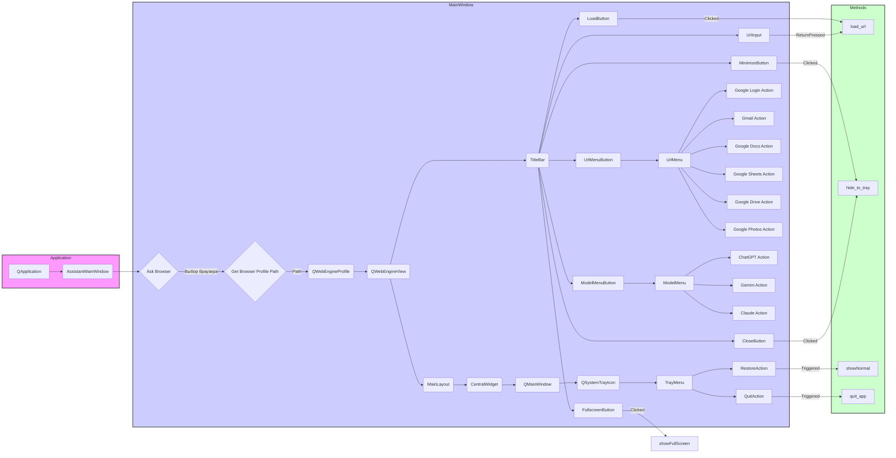

## Анализ кода `hypotez/src/gui/openai_trаiner/main.py`

### 1. `<алгоритм>`

1.  **Инициализация приложения:**
    *   Создается экземпляр `QApplication`, который управляет жизненным циклом приложения.
    *   Устанавливается параметр `setQuitOnLastWindowClosed(False)`, чтобы приложение не закрывалось при закрытии последнего окна и оставалось в системном трее.
    *   Создается экземпляр главного окна `AssistantMainWindow`.
    *   Главное окно отображается на экране.
    *   Приложение входит в главный цикл обработки событий.
2.  **Инициализация главного окна `AssistantMainWindow`:**
    *   Устанавливаются флаги окна: окно не может быть развернуто на полный экран, но его можно закрыть.
    *   Вычисляются и устанавливаются размеры окна равные 3/4 размера экрана.
    *   Запрашивается у пользователя браузер по умолчанию (`Chrome`, `Firefox` или `Edge`).
    *   Определяется путь к профилю пользователя браузера на основе выбранного варианта.
    *   Создается профиль браузера `QWebEngineProfile` и виджет `QWebEngineView` для отображения веб-страниц.
    *   Создается верхняя панель `title_bar` для кнопок управления.
    *   Создаются элементы управления для панели:
        *   `QLineEdit` для ввода URL.
        *   `QPushButton` для загрузки URL.
        *   `QPushButton` для сворачивания в трей.
        *   `QPushButton` для разворачивания на весь экран.
        *   `QPushButton` для закрытия окна.
        *   `QPushButton` для выпадающего меню сервисов Google.
        *   `QPushButton` для выпадающего меню выбора моделей.
    *   Создается выпадающее меню `url_menu` с действиями для перехода к сервисам Google.
        *   Действие `Google Login` ведет на `https://accounts.google.com/`.
        *   Действие `Gmail` ведет на `https://mail.google.com/`.
        *   Действие `Google Docs` ведет на `https://docs.google.com/`.
        *   Действие `Google Sheets` ведет на `https://sheets.google.com/`.
        *   Действие `Google Drive` ведет на `https://drive.google.com/`.
        *   Действие `Google Photos` ведет на `https://photos.google.com/`.
    *   Создается выпадающее меню `model_menu` с действиями для перехода к различным моделям.
        *   Действие `ChatGPT` ведет на `https://chat.openai.com/`.
        *   Действие `Gemini` ведет на `https://gemini.example.com/`.
        *   Действие `Claude` ведет на `https://claude.example.com/`.
    *   Все виджеты и кнопки размещаются на главном макете окна и панели управления.
    *   Создается и настраивается системный трей `QSystemTrayIcon` и его контекстное меню.
3.  **Обработка событий:**
    *   При нажатии на кнопку "Загрузить" или клавишу `Enter` в поле ввода URL вызывается метод `load_url()`, который загружает указанный URL в `QWebEngineView`.
        *   Если URL не начинается с `http`, добавляется `http://` в начало.
    *   При нажатии кнопки "Свернуть в трей" вызывается метод `hide_to_tray()`, который скрывает окно.
    *   При выборе "Восстановить" из контекстного меню трея вызывается метод `showNormal()`, который восстанавливает окно.
    *   При выборе "Выход" из контекстного меню трея вызывается метод `quit_app()`, который закрывает приложение.
    *   При закрытии окна через кнопку "X" вызывается переопределенный метод `closeEvent()`, который игнорирует закрытие окна и вызывает `hide_to_tray()`.

### 2. `<mermaid>`

**Описание:**

*   **QApplication (A):** Ядро приложения PyQt, управляет его жизненным циклом.
*   **AssistantMainWindow (B):** Главное окно приложения, содержит все элементы интерфейса и логику.
*   **Ask Browser (C):** Метод, который запрашивает у пользователя браузер по умолчанию.
*  **Get Browser Profile Path (D):** Метод получает путь к профилю выбранного браузера.
*   **QWebEngineProfile (E):** Профиль для браузера, позволяет загружать настройки.
*   **QWebEngineView (F):** Виджет для отображения веб-страниц.
*   **TitleBar (G):** Виджет верхней панели с элементами управления.
*   **UrlInput (H):** Поле для ввода URL.
*   **LoadButton (I):** Кнопка для загрузки URL.
*   **MinimizeButton (J):** Кнопка для сворачивания окна в трей.
*  **FullscreenButton (K):** Кнопка для открытия окна на весь экран.
*   **CloseButton (L):** Кнопка для закрытия окна (минимизирует в трей).
*   **UrlMenuButton (M):** Кнопка, открывающая меню URL.
*   **ModelMenuButton (N):** Кнопка, открывающая меню моделей.
*   **UrlMenu (O):** Меню с действиями для перехода к сервисам Google.
*   **Google Login Action (P), Gmail Action (Q), Google Docs Action (R), Google Sheets Action (S), Google Drive Action (T), Google Photos Action (U):** Действия для перехода к различным сервисам Google.
*   **ModelMenu (V):** Меню с действиями для перехода к различным моделям.
*   **ChatGPT Action (W), Gemini Action (X), Claude Action (Y):** Действия для перехода к различным моделям.
*   **MainLayout (Z):** Основной макет окна.
*   **CentralWidget (AA):** Центральный виджет, который устанавливает макет.
*   **QMainWindow (BB):** Базовый класс для главного окна.
*   **QSystemTrayIcon (CC):** Иконка в системном трее.
*   **TrayMenu (DD):** Контекстное меню для иконки в трее.
*   **RestoreAction (EE):** Действие для восстановления окна из трея.
*   **QuitAction (FF):** Действие для закрытия приложения из трея.
*   **load_url:** Метод для загрузки URL в QWebEngineView.
*   **hide_to_tray:** Метод для скрытия окна в трей.
*   **showNormal:** Метод для восстановления окна.
*   **quit_app:** Метод для закрытия приложения.

**Зависимости:**

*   `QApplication` управляет всем приложением.
*   `AssistantMainWindow` создает главное окно и все его виджеты.
*   `QWebEngineProfile` и `QWebEngineView` обеспечивают отображение веб-страниц.
*   `QSystemTrayIcon` и `QMenu` создают функциональность трея.
*   Все виджеты (кнопки, поля ввода) и макеты `QHBoxLayout` и `QVBoxLayout` управляют структурой интерфейса.
*   `QMainWindow` является базовым классом для главного окна.
*   Связь между виджетами и методами осуществляется через сигналы и слоты (`clicked.connect`, `returnPressed.connect`).

### 3. `<объяснение>`

**Импорты:**

*   `sys`: Используется для взаимодействия с интерпретатором Python (например, для выхода из приложения через `sys.exit()`).
*   `os`: Предоставляет функции для работы с операционной системой (например, для получения пути к папке профиля пользователя с помощью `os.path.expanduser()`).
*   `PyQt6.QtCore.Qt`, `PyQt6.QtCore.QUrl`:
    *   `Qt` содержит константы, используемые для настройки окна (например, `Qt.WindowType.Window` для создания обычного окна).
    *   `QUrl` используется для представления URL-адресов и их загрузки в `QWebEngineView`.
*   `PyQt6.QtGui.QIcon`, `PyQt6.QtGui.QAction`:
    *   `QIcon` используется для создания иконок для кнопок и системного трея.
    *   `QAction` используется для создания действий в меню, которые связаны с определенными функциями.
*   `PyQt6.QtWidgets.QApplication`, `PyQt6.QtWidgets.QMainWindow`, `PyQt6.QtWidgets.QSystemTrayIcon`, `PyQt6.QtWidgets.QMenu`, `PyQt6.QtWidgets.QPushButton`, `PyQt6.QtWidgets.QVBoxLayout`, `PyQt6.QtWidgets.QHBoxLayout`, `PyQt6.QtWidgets.QWidget`, `PyQt6.QtWidgets.QLineEdit`, `PyQt6.QtWidgets.QMessageBox`:
    *   Это набор классов для создания пользовательского интерфейса с помощью PyQt6, включая:
        *   `QApplication`: Управляет жизненным циклом приложения.
        *   `QMainWindow`: Базовый класс для главного окна.
        *   `QSystemTrayIcon`: Обеспечивает отображение иконки в системном трее.
        *   `QMenu`: Создает выпадающие меню.
        *   `QPushButton`: Создает кнопки.
        *   `QVBoxLayout` и `QHBoxLayout`: Управляют размещением виджетов вертикально и горизонтально соответственно.
        *   `QWidget`: Базовый класс для всех виджетов.
        *   `QLineEdit`: Поле для ввода текста (URL).
        *   `QMessageBox`: Показывает диалоговые окна для сообщений пользователю.
*   `PyQt6.QtWebEngineWidgets.QWebEngineView`:
    *   Предоставляет виджет для отображения веб-страниц.
*    `PyQt6.QtWebEngineCore.QWebEngineProfile`:
    *   Управляет профилями браузера `QWebEngineView`.

**Классы:**

*   `AssistantMainWindow(QMainWindow)`:
    *   **Роль:** Главное окно приложения, содержащее все элементы интерфейса и логику.
    *   **Атрибуты:**
        *   `profile` (`QWebEngineProfile`): Профиль пользователя браузера.
        *   `browser` (`QWebEngineView`): Виджет для отображения веб-страниц.
        *   `title_bar` (`QWidget`): Виджет верхней панели.
        *   `url_input` (`QLineEdit`): Поле для ввода URL.
        *   `load_button` (`QPushButton`): Кнопка для загрузки URL.
        *   `minimize_button` (`QPushButton`): Кнопка для сворачивания окна в трей.
        *   `fullscreen_button` (`QPushButton`): Кнопка для разворачивания окна на весь экран.
        *   `close_button` (`QPushButton`): Кнопка для закрытия окна (минимизирует в трей).
        *   `tray_icon` (`QSystemTrayIcon`): Иконка в системном трее.
        *   `url_menu` (`QMenu`): Меню для выбора URL.
        *   `model_menu` (`QMenu`): Меню для выбора модели.
        *   `url_button` (`QPushButton`): Кнопка, открывающая меню URL.
        *   `model_button` (`QPushButton`): Кнопка, открывающая меню моделей.
    *   **Методы:**
        *   `__init__(self)`: Инициализирует окно, настраивает размеры, элементы управления, и системный трей.
        *   `ask_for_browser(self)`: Запрашивает у пользователя браузер по умолчанию.
        *   `load_url(self, url: str = None)`: Загружает URL в `QWebEngineView`.
        *   `hide_to_tray(self)`: Скрывает окно и показывает иконку в трее.
        *   `quit_app(self)`: Закрывает приложение.
        *   `closeEvent(self, event)`: Переопределенный метод для обработки события закрытия окна.

**Функции:**

*   `ask_for_browser(self)`:
    *   **Аргументы:** `self` (ссылка на экземпляр `AssistantMainWindow`).
    *   **Возвращает:** Выбранный пользователем браузер (`str`) или `None`, если пользователь ничего не выбрал.
    *   **Назначение:** Отображает диалоговое окно для выбора браузера по умолчанию.
*   `load_url(self, url: str = None)`:
    *   **Аргументы:** `self` (ссылка на экземпляр `AssistantMainWindow`), `url` (опциональный URL для загрузки, по умолчанию `None`).
    *   **Возвращает:** Ничего.
    *   **Назначение:** Загружает указанный URL в `QWebEngineView`, добавляя `http://`, если URL не начинается с `http`.
*   `hide_to_tray(self)`:
    *   **Аргументы:** `self` (ссылка на экземпляр `AssistantMainWindow`).
    *   **Возвращает:** Ничего.
    *   **Назначение:** Скрывает главное окно и оставляет приложение запущенным в системном трее.
*   `quit_app(self)`:
    *   **Аргументы:** `self` (ссылка на экземпляр `AssistantMainWindow`).
    *   **Возвращает:** Ничего.
    *   **Назначение:** Закрывает приложение, скрывая иконку в трее и завершая работу главного цикла.
*   `closeEvent(self, event)`:
    *   **Аргументы:** `self` (ссылка на экземпляр `AssistantMainWindow`), `event` (`QCloseEvent`).
    *   **Возвращает:** Ничего.
    *   **Назначение:** Переопределенный метод для обработки события закрытия окна; игнорирует стандартное закрытие и вызывает `hide_to_tray()` для скрытия окна в трей.

**Переменные:**

*   `MODE` (`str`): Устанавливает режим работы приложения, в данном случае `"dev"`.
*   `app` (`QApplication`): Экземпляр QApplication для управления приложением.
*   `window` (`AssistantMainWindow`): Экземпляр главного окна приложения.
*   `profile_path` (`str`): Путь к профилю браузера пользователя.
*   `browser_choice` (`str`): Выбор пользователя браузера по умолчанию.
*   `width` (`int`): Ширина главного окна.
*   `height` (`int`): Высота главного окна.
*   `central_widget` (`QWidget`): Центральный виджет для размещения главного макета.
*   `main_layout` (`QVBoxLayout`): Главный вертикальный макет окна.
*   `title_bar_layout` (`QHBoxLayout`): Горизонтальный макет для верхней панели.
*  `tray_menu` (`QMenu`): Контекстное меню для системного трея.
*  `restore_action` (`QAction`): Действие "Восстановить" в меню трея.
* `quit_action` (`QAction`): Действие "Выход" в меню трея.
*  `google_login_action`, `gmail_action`, `google_docs_action`, `google_sheets_action`, `google_drive_action`, `google_photos_action` (`QAction`):  Действия для перехода к различным сервисам Google.
*  `chatgpt_action`, `gemini_action`, `claude_action` (`QAction`): Действия для перехода к различным моделям.
*  `url_menu`, `model_menu` (`QMenu`): Меню для выбора URL и моделей.
*  `choices` (`list`):  Список выбора браузера.
*  `choice`, `ok`: (`str`, `bool`):  Переменные для выбора браузера.

**Потенциальные ошибки и области для улучшения:**

1.  **Жестко закодированные пути к профилям браузеров:** Пути к профилям браузеров жестко закодированы для Windows. Это нужно сделать более гибким, чтобы программа работала и на других операционных системах. Нужно добавить проверку ОС.
2.  **Отсутствие обработки ошибок:** В коде отсутствует обработка потенциальных ошибок, таких как ввод некорректного URL или неверный путь к профилю пользователя.
3.  **Отсутствие валидации URL:** Не проверяется корректность введенного пользователем URL, что может привести к ошибкам при загрузке.
4.  **Заглушки для Gemini и Claude:** URL для Gemini и Claude являются заглушками, они должны быть заменены на реальные URL.
5.  **Ограниченная поддержка браузеров:** Поддерживаются только три браузера, можно расширить этот список.
6.  **Отсутствие настроек:** Можно добавить возможность сохранения и загрузки пользовательских настроек.
7.  **Стиль кода:** Код можно улучшить, следуя стандарту PEP8 (например, длина строк, пробелы, импорты).

**Взаимосвязь с другими частями проекта:**

Этот файл является частью графического интерфейса (`gui`) проекта и содержит основную логику для создания и управления окном, отображающим веб-страницы. Он взаимодействует напрямую с библиотеками PyQt6 для создания интерфейса и отображения веб-контента.

**Цепочка взаимосвязей:**

1.  **`main.py`** (`src/gui/openai_trаiner/main.py`) — Основной файл GUI, который создает и управляет главным окном приложения, используя виджеты и профили браузеров из PyQt6.
2.  **PyQt6** — Внешняя библиотека, предоставляющая функциональность для создания GUI, обработки событий и отображения веб-контента.
3.  **Операционная система** — Обеспечивает функционирование приложения, включая доступ к файловой системе, системному трею и запуску процессов.
4.  **Пользователь** — Взаимодействует с GUI, вводит URL, нажимает кнопки, выбирает сервисы и модели.