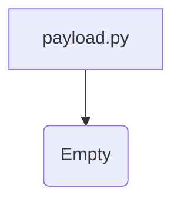

1. **<input code>**

```python
## \file hypotez/src/gui/openai_trаigner/payload.py
# -*- coding: utf-8 -*-\
#! venv/Scripts/python.exe
#! venv/bin/python/python3.12

"""
.. module: src.gui.openai_trаigner 
	:platform: Windows, Unix
	:synopsis:

"""
MODE = 'dev'

"""
	:platform: Windows, Unix
	:synopsis:

"""


"""
	:platform: Windows, Unix
	:synopsis:

"""


"""
  :platform: Windows, Unix

"""
"""
  :platform: Windows, Unix
  :platform: Windows, Unix
  :synopsis:
"""MODE = 'dev'
  
""" module: src.gui.openai_trаigner """
```

2. **<algorithm>**

Данный код не содержит логики. Он представляет собой пустой файл с комментариями, документацией и константой MODE.  Блок-схема будет пустой. Данные не передаются между функциями или классами, так как их нет.

3. **<mermaid>**



4. **<explanation>**

* **Импорты:**  В коде отсутствуют импорты.

* **Классы:**  Отсутствуют классы.

* **Функции:** Отсутствуют функции.

* **Переменные:** Единственная переменная - `MODE` (строка 'dev'). Она определена глобально и не используется в текущем файле.

* **Возможные ошибки или области для улучшений:** Файл пустой, не содержит функциональности.  Необходимо добавить код для выполнения специфических задач, связанных с обучением модели OpenAI. Без реализации  `payload.py` не будет выполнять никакой работы.

* **Взаимосвязи с другими частями проекта:**  Без кода трудно определить, как `payload.py` связан с другими частями проекта.  Можно предположить, что этот файл предназначен для подготовки данных или параметров, которые будут использоваться другими частями программы (например, для обучения модели OpenAI).  Без конкретного кода сложно сказать точно.


**Выводы:**

Файл `payload.py`  представляет собой пока не реализованный  пустой модуль, скорее всего, предназначенный для обработки данных, необходимых для обучения модели OpenAI.  Он нуждается в конкретной логике, методах и классах для выполнения своей задачи.  Дополнительные комментарии скорее всего служат для документации и описания будущей функциональности.