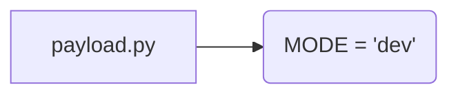

# <input code>

```python
## \file hypotez/src/gui/openai_trаigner/payload.py
# -*- coding: utf-8 -*-\
#! venv/Scripts/python.exe
#! venv/bin/python/python3.12

"""
.. module: src.gui.openai_trаigner 
	:platform: Windows, Unix
	:synopsis:

"""
MODE = 'dev'

"""
	:platform: Windows, Unix
	:synopsis:

"""


"""
	:platform: Windows, Unix
	:synopsis:

"""


"""
  :platform: Windows, Unix

"""
"""
  :platform: Windows, Unix
  :platform: Windows, Unix
  :synopsis:
"""MODE = 'dev'
  
""" module: src.gui.openai_trаigner """


```

# <algorithm>

Этот код представляет собой фрагмент Python-скрипта, скорее всего,  часть более крупного проекта. Алгоритм в нём отсутствует, т.к. нет инструкций для обработки данных.  Код состоит из комментариев, констант `MODE` и пустых строк.  Данные не передаются между функциями, классами или методами в этом фрагменте.


# <mermaid>



# <explanation>

Этот фрагмент кода не содержит какой-либо реализуемой логики. Он состоит из:

* **Документационных строк (docstrings):**  Многострочные комментарии, начинающиеся с `"""` и `"""`,  применяемые для  документирования кода.  Они описывают модуль `src.gui.openai_trаigner` и другие части  кода (хотя  не совсем корректно), но не содержат инструкций.
* **Переменная `MODE`:**  Определяет строковую переменную `MODE` с значением `'dev'`. Скорее всего, эта переменная используется для определения режима работы приложения (например, "разработки", "производства" и т.д.).

**Импорты:**  В данном фрагменте кода отсутствуют импорты.

**Классы:** Нет определенных классов.

**Функции:** Нет определенных функций.


**Переменные:**  Есть одна переменная `MODE` типа `str`.


**Возможные ошибки или области для улучшений:**

* **Недостаток логики:** Код не выполняет никаких действий. Нужно добавить код, описывающий действия.
* **Неясные комментарии:** Некоторые комментарии несут не полную информацию.  

**Взаимосвязи с другими частями проекта:**

Без дополнительных фрагментов кода сложно судить о взаимосвязях с другими частями проекта. Предполагается, что `src.gui.openai_trаigner` содержит код для взаимодействия с OpenAI API или для обучения моделей. `MODE` может определять какие данные используются в процессе обучения.


**Вывод:**

Фрагмент кода представляет собой  пустой шаблон или начальный фрагмент для будущего кода. Он содержит  документацию,  но не функциональность.  Для анализа поведения кода необходимы дополнительные фрагменты кода, в которых эта переменная используется.