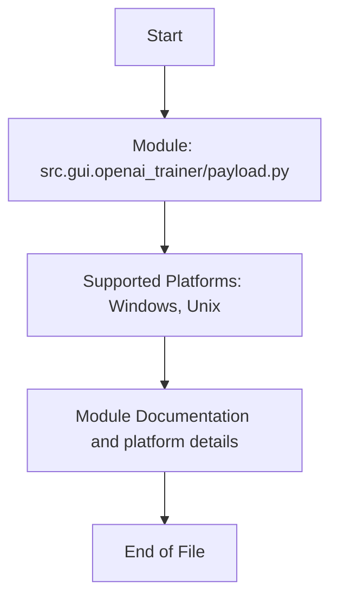

## Анализ кода `hypotez/src/gui/openai_trаigner/payload.py`

### 1. <алгоритм>

Файл `payload.py` является частью пакета `src.gui.openai_trаigner` и предназначен для работы в среде Windows и Unix. Он содержит только комментарии и не имеет исполняемого кода.

**Пошаговая блок-схема (упрощенная, так как нет реального кода):**

```
Start --> Module Definition[Начало модуля src.gui.openai_trаiner/payload.py]
Module Definition --> OS Platform[Поддержка Windows и Unix]
OS Platform --> Docstrings[Документация с описанием модуля и платформ]
Docstrings --> End[Конец файла]
```

**Поток данных:**

В данном файле нет потока данных, так как он не содержит исполняемого кода.

### 2. <mermaid>



**Объяснение:**

- `Start`: Начало процесса анализа.
- `ModuleDefinition`:  Обозначает определение модуля `payload.py`  в пакете `src.gui.openai_trаiner`.
- `SupportedPlatforms`:  Указывает, что модуль предназначен для работы на платформах Windows и Unix.
- `ModuleDocumentation`:  Представляет блок документации, который содержит  описание модуля и платформ.
- `End`: Конец анализа файла.

В данном коде нет импортов, поэтому  дополнительный `mermaid` flowchart для `header.py` не требуется.

### 3. <объяснение>

**Импорты:**

В данном файле импорты отсутствуют.

**Классы:**

В данном файле нет классов.

**Функции:**

В данном файле нет функций.

**Переменные:**

В данном файле нет переменных.

**Объяснения:**

- Файл `payload.py` является частью графического интерфейса (GUI) для OpenAI Trainer. Судя по названию, он, вероятно, будет использоваться для хранения данных, необходимых для работы или передачи данных.
- В текущем состоянии файл содержит только заголовочные комментарии и не содержит никакого исполняемого кода, что может означать его предварительное создание или заглушку. 
-  Файл предназначен для работы как в средах Windows, так и Unix, что означает, что он должен быть совместим с разными операционными системами.
- Отсутствие исполняемого кода делает анализ этого файла простым, но он не позволяет оценить его функциональность в контексте остальной части проекта.
- Данный файл необходимо будет доработать.

**Взаимосвязь с другими частями проекта:**

- Предположительно, этот файл взаимодействует с другими частями графического интерфейса `src.gui`. В будущем он может быть связан с модулями для обучения моделей OpenAI или обработки данных.
-  В данный момент нет конкретной связи с другими частями проекта, но, учитывая расположение в `src/gui/openai_trаiner`, можно предположить, что файл будет играть важную роль в формировании `payload` для обучения.

**Потенциальные ошибки и области для улучшения:**

- **Отсутствие кода**: Основной недостаток — отсутствие какого-либо кода. В текущем виде файл не выполняет никакой полезной функции.
- **Неясность назначения**: Необходимо добавить конкретный код, определяющий, какие данные он должен содержать и обрабатывать.

**Цепочка взаимосвязей:**
1.  `src/gui/openai_trаiner`:  `payload.py` является частью этого пакета, который, предположительно, отвечает за создание и управление пользовательским интерфейсом для обучения моделей OpenAI. 
2.  Ожидается, что `payload.py` будет взаимодействовать с другими модулями внутри `src/gui/openai_trаiner`, а также с другими частями проекта, например, с модулями, отвечающими за обучение моделей.
3.  Использует глобальные настройки проекта через  `src.gs`, хотя это неявно видно в текущем коде.