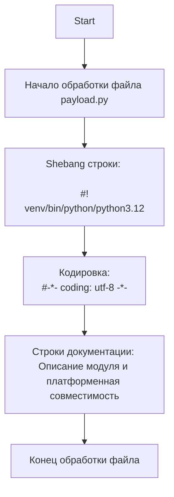
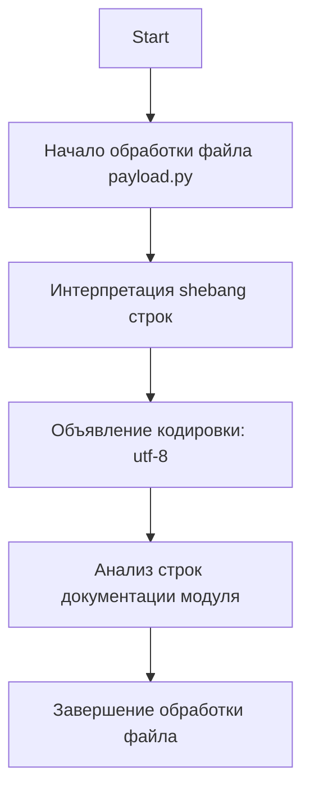

## АНАЛИЗ КОДА `hypotez/src/gui/openai_trаigner/payload.py`

### 1. <алгоритм>

Файл `payload.py` в текущем виде представляет собой шаблон с метаданными и строками документации. Он не содержит исполняемого кода, функций или классов. Алгоритмически, его можно представить следующим образом:

1.  **Начало**: Файл `payload.py` интерпретируется интерпретатором Python.
2.  **Заголовок**: Файл содержит shebang-строки, указывающие на путь к интерпретатору Python. Эти строки используются для запуска скрипта как исполняемого файла в Unix-подобных системах.
3.  **Кодировка**: Указана кодировка файла как `utf-8`.
4.  **Документация**: Файл содержит строки документации (docstrings), описывающие модуль `src.gui.openai_trаigner` и его платформенную совместимость (Windows, Unix). Эти строки предназначены для документирования и не влияют на выполнение программы.
5.  **Конец**: Интерпретация файла завершается.

### 2. <mermaid>

**Объяснение `mermaid` диаграммы:**

1. **`Start`**: Начальная точка процесса, означающая начало интерпретации файла `payload.py`.
2. **`FileProcessing`**: Обозначает начало процесса обработки файла Python.
3. **`ShebangLines`**: Представляет интерпретацию shebang-строк, которые определяют путь к интерпретатору Python. Эти строки позволяют запускать скрипт как исполняемый файл в Unix-подобных системах.
4. **`EncodingDeclaration`**: Показывает декларацию кодировки файла, которая устанавливается как `utf-8`, обеспечивая правильную обработку символов.
5. **`Docstrings`**: Описывает процесс анализа строк документации (docstrings), которые содержат метаданные о модуле.
6. **`End`**: Конечная точка процесса, означающая завершение интерпретации файла.

В данном случае, отсутствуют импорты, которые бы требовали отдельного анализа.

### 3. <объяснение>

**Импорты:**

В файле `payload.py` отсутствуют какие-либо импорты. Это означает, что файл на данный момент не зависит от других модулей или пакетов в проекте.

**Классы:**

В файле `payload.py` не определены никакие классы.

**Функции:**

В файле `payload.py` не определены никакие функции.

**Переменные:**

В файле `payload.py` не определены никакие переменные.

**Объяснение:**

Файл `payload.py` на текущий момент представляет собой пустой файл, содержащий только метаданные и строки документации. Он не выполняет никаких вычислительных или логических действий. Основная роль такого файла — служить шаблоном или placeholder для дальнейшего наполнения кодом, который будет использоваться для обучения модели OpenAI в графическом интерфейсе.

**Потенциальные ошибки или области для улучшения:**

1.  **Отсутствие функциональности:** Файл в текущем виде не выполняет никакой полезной работы. Он должен быть расширен кодом для обработки данных, взаимодействия с OpenAI API, и управления состоянием обучения модели.
2.  **Закомментированные строки:** Shebang-строки могут быть закомментированы, если не требуется запускать скрипт как исполняемый файл, и можно их убрать если это не требуется.
3.  **Строки документации:** Строки документации можно сделать более информативными, например, добавить описание предназначения модуля.

**Взаимосвязи с другими частями проекта:**

Так как файл пустой, нет прямых взаимосвязей. Однако, в контексте проекта, он, скорее всего, должен взаимодействовать с другими модулями в пакете `src.gui`, отвечающими за построение GUI, и с модулями в пакете `src`, отвечающими за обучение моделей OpenAI. Он будет выступать в качестве контейнера для данных, которые будут передаваться между этими компонентами.

**Общая цепочка:**
Предположительно, `payload.py` будет частью workflow, который выглядит следующим образом:
1.  GUI отправляет запрос на обучение или другие операции с моделью.
2.  Данные из GUI (параметры обучения, данные для обучения) попадают в `payload.py`.
3.  `payload.py` обрабатывает и передает эти данные в соответствующие модули для обучения.
4.  Результаты работы передаются обратно в GUI для отображения.

Необходимо наполнить файл `payload.py` кодом, чтобы его можно было использовать в workflow.