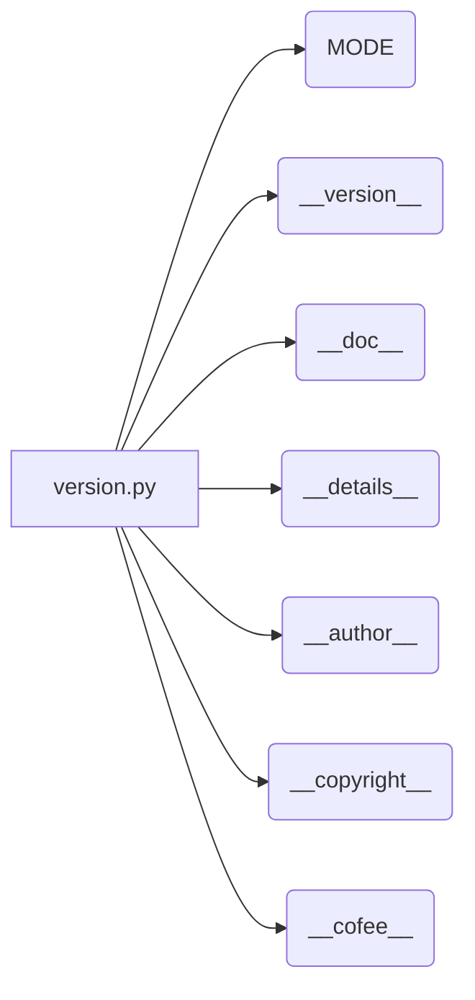

# <input code>

```python
## \file hypotez/src/gui/openai_trаigner/version.py
# -*- coding: utf-8 -*-
#! venv/Scripts/python.exe
#! venv/bin/python/python3.12

"""
.. module: src.gui.openai_trаigner 
	:platform: Windows, Unix
	:synopsis:

"""
MODE = 'dev'

"""
	:platform: Windows, Unix
	:synopsis:

"""


"""
	:platform: Windows, Unix
	:synopsis:

"""


"""
  :platform: Windows, Unix

"""
"""
  :platform: Windows, Unix
  :platform: Windows, Unix
  :synopsis:
"""MODE = 'dev'
  
""" module: src.gui.openai_trаigner """


__version__: str = 'v1.1'
__doc__: str = ''
__details__: str = ''
__author__: str = 'hypo69'
__copyright__: str = """
## License

Copyright (c) 2024 hypo69

This project is licensed under the MIT License. See the [MIT License](https://opensource.org/licenses/MIT) for details.

Commercial use of the code is prohibited without prior permission from the authors.
"""
__cofee__: str = "Treat the developer to a cup of coffee for boosting enthusiasm in development: https://boosty.to/hypo69"
```

# <algorithm>

Этот код представляет собой файл `version.py`, который содержит константы, описывающие версию, автора и лицензию проекта.  Алгоритм работы крайне прост – просто объявление переменных.  Данные не перемещаются между функциями или классами.

# <mermaid>



# <explanation>

**Импорты:**
Файл `version.py` не содержит импортов. Это типичный файл, содержащий константы, описывающие проект.

**Классы:**
В файле отсутствуют классы. Он содержит только константные переменные (строковые литералы).

**Функции:**
Нет функций.

**Переменные:**
`MODE`, `__version__`, `__doc__`, `__details__`, `__author__`, `__copyright__`, `__cofee__` - строковые константы, которые описывают различные атрибуты проекта.  Они используются для хранения метаданных (версия, автор, лицензия и т.п.), что важно для документирования и управления проектом.

**Возможные ошибки или области для улучшений:**

* **Непоследовательность в документации:** В коде присутствуют многочисленные строки документации, но не все из них оформлены одинаково и нет согласованности в их использовании.  Стоит придерживаться какого-либо стандарта, например, docstrings.
* **Многократное определение MODE:** Появляется несколько раз в разных местах документации.  Стоит стандартизировать и использовать переменную `MODE` в одном месте и использовать в других частях проекта.
* **Имя файла:** Имя файла `openai_trаigner/version.py` содержит не стандартную кодировку (неправильно набран символ 'а').  Следует использовать правильную кодировку имени файла.

**Взаимосвязи с другими частями проекта:**

Этот файл `version.py` служит источником информации о версии, авторе и т.д. для других модулей проекта.  В основном, эта информация используется для  документации и контроля версий.  Его `__version__` могут быть использованы, например, в скриптах `setup.py`,  для автоматической сборки библиотек или в документации проекта.  Файл `version.py` находится в директории `hypotez/src/gui/openai_trаigner/`. Это указывает на то, что он связан с пользовательским интерфейсом (GUI) и обучением модели OpenAI.