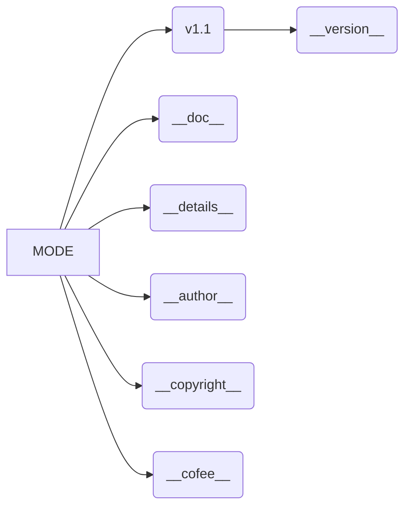

# <input code>

```python
## \file hypotez/src/gui/openai_trаigner/version.py
# -*- coding: utf-8 -*-
#! venv/Scripts/python.exe
#! venv/bin/python/python3.12

"""
.. module: src.gui.openai_trаigner 
	:platform: Windows, Unix
	:synopsis:

"""
MODE = 'dev'

"""
	:platform: Windows, Unix
	:synopsis:

"""


"""
	:platform: Windows, Unix
	:synopsis:

"""


"""
  :platform: Windows, Unix

"""
"""
  :platform: Windows, Unix
  :platform: Windows, Unix
  :synopsis:
"""MODE = 'dev'
  
""" module: src.gui.openai_trаigner """


__version__: str = 'v1.1'
__doc__: str = ''
__details__: str = ''
__author__: str = 'hypo69'
__copyright__: str = """
## License

Copyright (c) 2024 hypo69

This project is licensed under the MIT License. See the [MIT License](https://opensource.org/licenses/MIT) for details.

Commercial use of the code is prohibited without prior permission from the authors.
"""
__cofee__: str = "Treat the developer to a cup of coffee for boosting enthusiasm in development: https://boosty.to/hypo69"
```

# <algorithm>

Этот код не содержит алгоритма в привычном понимании. Он определяет константы, строки документации и метаданные, относящиеся к модулю `src.gui.openai_trаigner`.  Данные не перемещаются между функциями или классами.  Все элементы представляют собой константы и текстовые значения.

# <mermaid>



# <explanation>

Этот файл `version.py` содержит константы и строковые значения, которые обычно используются для метаданных о модуле `src.gui.openai_trаigner`.  Он не содержит функций или классов, выполняющих операции.

**Импорты:**  Файл не содержит импортов.  Он работает автономно, определяет локальные переменные.

**Классы:**  Нет классов.

**Функции:**  Нет функций.

**Переменные:**
* `MODE`:  Строковая переменная, вероятно, используемая для определения режима работы (например, 'dev', 'prod').
* `__version__`, `__doc__`, `__details__`, `__author__`, `__copyright__`, `__cofee__`:  Строковые переменные, используемые для хранения информации о версии, документации, авторе и т.д.  Эти переменные следуют соглашению об именовании, которое используется для определения метаданных Python.

**Возможные ошибки или области для улучшений:**

* **Недостаточная документация:** Несмотря на строковые комментарии, код нуждается в более подробной документации, которая описывала бы *как* эти переменные используются в других частях проекта.
* **Дублирование кода:** Повторение `MODE = 'dev'` может быть устранен переместив определение в общий файл конфигурации.
* **Использование переменной `__version__`:** Лучше использовать пакет `packaging` или `setuptools`, для автоматического определения версии, которая будет содержаться в `setup.py` или `pyproject.toml` и будет обновляться автоматически.

**Цепочка взаимосвязей:**

Этот файл предоставляет метаданные для модуля `src.gui.openai_trаigner`. Вероятно, эти метаданные используются другими частями проекта, например, при установке пакета или генерировании документации.  Взаимосвязь может быть косвенной: модуль `src.gui.openai_trаigner` сам может импортировать или использовать значения из файла `version.py`.