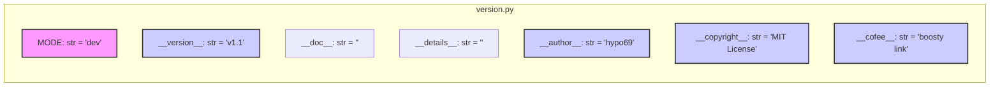

## Анализ кода `hypotez/src/gui/openai_trаigner/version.py`

### 1. <алгоритм>

1. **Инициализация константы `MODE`**:
   - Присваивается строка `'dev'`.
   - **Пример**: ``.
   - Это значение используется для определения режима работы приложения (например, dev, prod).
2. **Определение версии `__version__`**:
   - Присваивается строка `'v1.1'`.
   - **Пример**: `__version__ = 'v1.1'`.
   - Используется для отслеживания версий приложения.
3. **Инициализация `__doc__`**:
   - Присваивается пустая строка `''`.
   - **Пример**: `__doc__ = ''`.
   - Может использоваться для хранения документации модуля.
4. **Инициализация `__details__`**:
    - Присваивается пустая строка `''`.
    - **Пример**: `__details__ = ''`.
    - Может использоваться для хранения дополнительных деталей о модуле.
5. **Инициализация `__author__`**:
   - Присваивается строка `'hypo69'`.
   - **Пример**: `__author__ = 'hypo69'`.
   - Используется для указания автора модуля.
6. **Инициализация `__copyright__`**:
   - Присваивается многострочная строка, содержащая информацию об авторских правах и лицензии (MIT).
   - **Пример**: `__copyright__ = """..."""`.
   - Используется для предоставления информации о правах и условиях использования.
7. **Инициализация `__cofee__`**:
   - Присваивается строка с ссылкой на Boosty для поддержки разработчика.
   - **Пример**: `__cofee__ = "..."`.
   - Используется для предоставления пользователям возможности поддержать автора.

### 2. <mermaid>



**Описание зависимостей:**

В данном коде отсутствуют явные импорты. Все объявленные переменные (`MODE`, `__version__`, `__doc__`, `__details__`, `__author__`, `__copyright__`, `__cofee__`) являются строками и используются для хранения метаданных о модуле и проекте. Нет зависимостей от других модулей или классов.

### 3. <объяснение>

**Импорты:**

-   В данном файле нет импортов. Это файл, предназначенный для хранения версии и метаданных проекта.

**Классы:**

-   В данном файле нет классов.

**Функции:**

-   В данном файле нет функций.

**Переменные:**

*   `MODE`:
    *   Тип: `str`.
    *   Значение: `'dev'`.
    *   Назначение: Определяет режим работы приложения. Значение `'dev'` указывает на режим разработки.
    *   Использование: Может использоваться в других частях проекта для условного выполнения кода (например, для логирования, отладки).
    *   Пример:
        ```python
        if MODE == 'dev':
            print("Режим разработки")
        ```
*   `__version__`:
    *   Тип: `str`.
    *   Значение: `'v1.1'`.
    *   Назначение: Версия текущего модуля или приложения.
    *   Использование: Используется для отслеживания версий и может отображаться в пользовательском интерфейсе.
    *   Пример:
        ```python
        print(f"Версия: {__version__}")
        ```
*   `__doc__`:
    *   Тип: `str`.
    *   Значение: `''` (пустая строка).
    *   Назначение: Документация модуля. В данном случае пустая, но может быть заполнена описанием модуля.
    *   Использование: Может быть использована для генерации документации проекта.
*   `__details__`:
    *   Тип: `str`.
    *   Значение: `''` (пустая строка).
    *   Назначение: Дополнительные детали о модуле. В данном случае пустая.
    *   Использование: Может быть использована для хранения дополнительных сведений о модуле.
*   `__author__`:
    *   Тип: `str`.
    *   Значение: `'hypo69'`.
    *   Назначение: Имя автора модуля.
    *   Использование: Может использоваться в информационных сообщениях или для атрибуции кода.
*   `__copyright__`:
    *   Тип: `str`.
    *   Значение: Многострочная строка, содержащая информацию о авторских правах и лицензии.
    *   Назначение: Информация об авторском праве и условиях лицензии MIT.
    *   Использование: Предоставляет юридическую информацию об использовании кода.
*   `__cofee__`:
    *   Тип: `str`.
    *   Значение: Строка, содержащая ссылку на Boosty.
    *   Назначение: Ссылка для поддержки разработчика.
    *   Использование: Предоставляет пользователям возможность финансово поддержать автора проекта.

**Потенциальные ошибки и области для улучшения:**

*   **Отсутствие документации:** Переменные `__doc__` и `__details__` в настоящее время пустые. Хорошей практикой является добавление описания модуля в `__doc__`, а также любой дополнительной информации в `__details__`.
*   **Многократное определение MODE:** Переменная `MODE` определена дважды, что избыточно. Рекомендуется оставить только одно определение.
*   **Неуместные docstring:** В файле присутствуют docstring, которые не относятся к содержанию файла и являются лишними.
*   **Не консистентность комментариев:** Файл содержит различные типы комментариев (обычные `##` и docstrings), что может приводить к путанице.
*   **Зависимости от других частей проекта:** В файле нет явных зависимостей, но он предоставляют метаданные, которые могут использоваться в других частях проекта.
*   **Неясное значение `__details__`:** Не ясно, какая именно информация должна быть размещена в `__details__`.

**Взаимосвязь с другими частями проекта:**

Этот файл предназначен для предоставления информации о версии, авторстве и лицензии приложения.  Другие части проекта могут импортировать эти переменные, чтобы отображать их в пользовательском интерфейсе или использовать для отслеживания версий.

Например, в файле `src/gui/main_window.py` может использоваться `version.py` следующим образом:

```python
from src.gui.openai_trаigner.version import __version__, __author__, __copyright__
# ...
print(f"Версия приложения: {__version__}")
print(f"Автор: {__author__}")
print(__copyright__)
```

Это позволит отображать текущую версию, автора и лицензионную информацию в окне приложения или в других частях GUI.