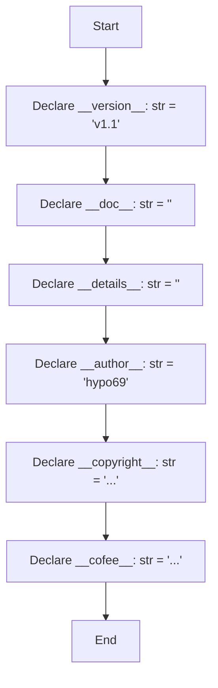

## Анализ кода `hypotez/src/gui/openai_trаigner/version.py`

### 1. <алгоритм>
Код `version.py` представляет собой файл, содержащий метаданные о версии и авторстве проекта. Алгоритм работы с этим файлом довольно прост: он просто объявляет набор строковых переменных, которые содержат информацию о версии, документации, деталях, авторе, лицензии и способах поддержки. Блок-схема выглядит следующим образом:



**Примеры:**

- `__version__: str = 'v1.1'` -  Определяет текущую версию программного обеспечения.
- `__author__: str = 'hypo69'` -  Указывает автора проекта.
- `__copyright__: str = """ ... """` -  Содержит информацию о лицензии и авторских правах.
- `__cofee__: str = "..."` - Содержит ссылку на поддержку разработчика.

### 2. <mermaid>
```mermaid
flowchart TD
    Start[Start] --> Version[__version__ = "v1.1"]
    Version --> Doc[__doc__ = ""]
    Doc --> Details[__details__ = ""]
    Details --> Author[__author__ = "hypo69"]
    Author --> Copyright[__copyright__ = "MIT License ..."]
    Copyright --> Coffee[__cofee__ = "Boosty link"]
    Coffee --> End[End]
```

**Объяснение:**

- **flowchart TD**: Определяет тип диаграммы как блок-схему, направленную сверху вниз.
- **Start**: Начальная точка диаграммы.
- **Version**: Переменная `__version__` содержит строковое значение версии проекта.
- **Doc**: Переменная `__doc__` представляет собой пустую строку, предназначенную для документации.
- **Details**: Переменная `__details__` хранит дополнительные детали проекта в виде пустой строки.
- **Author**: Переменная `__author__` содержит имя автора проекта.
- **Copyright**: Переменная `__copyright__` содержит текст лицензии и авторских прав.
- **Coffee**: Переменная `__cofee__` содержит ссылку для поддержки разработчика.
- **End**: Конечная точка диаграммы.

Диаграмма отражает последовательное объявление переменных, содержащих метаданные проекта.

### 3. <объяснение>
**Импорты:**
В данном коде нет импортов. Этот файл предназначен для хранения метаданных проекта и не зависит от других модулей.

**Классы:**
В этом файле нет классов.

**Функции:**
В этом файле нет функций.

**Переменные:**
- `__version__: str = 'v1.1'`
    - Тип: `str`
    - Назначение: Содержит версию текущего программного обеспечения.
- `__doc__: str = ''`
    - Тип: `str`
    - Назначение:  Предназначена для хранения документации модуля, но в данном случае пустая.
- `__details__: str = ''`
    - Тип: `str`
    - Назначение:  Предназначена для хранения дополнительных деталей о модуле, но в данном случае пустая.
- `__author__: str = 'hypo69'`
    - Тип: `str`
    - Назначение: Содержит имя автора проекта.
- `__copyright__: str = """..."""`
    - Тип: `str`
    - Назначение: Содержит информацию о лицензии и авторских правах. В данном случае текст включает ссылку на MIT лицензию и запрет на коммерческое использование без разрешения.
- `__cofee__: str = "..."`
    - Тип: `str`
    - Назначение: Содержит ссылку на страницу для поддержки разработчика через Boosty.

**Потенциальные ошибки или области для улучшения:**

1. **Отсутствие docstring**: Переменные `__doc__` и `__details__` являются пустыми строками. Для лучшей документации, возможно, стоит добавить краткое описание модуля в `__doc__` и какие-то специфические детали в `__details__`.
2. **Зависимость от ручного обновления**:  Версию (`__version__`) необходимо обновлять вручную. Было бы полезно интегрировать систему автоматического управления версиями.

**Цепочка взаимосвязей с другими частями проекта:**
Файл `version.py` обычно используется другими частями проекта для получения метаданных. Он может быть использован, например, для вывода версии в интерфейсе пользователя или при логировании.  Используя конструкцию  `from src.gui.openai_trаiner.version import __version__`  можно получить доступ к переменной версии.