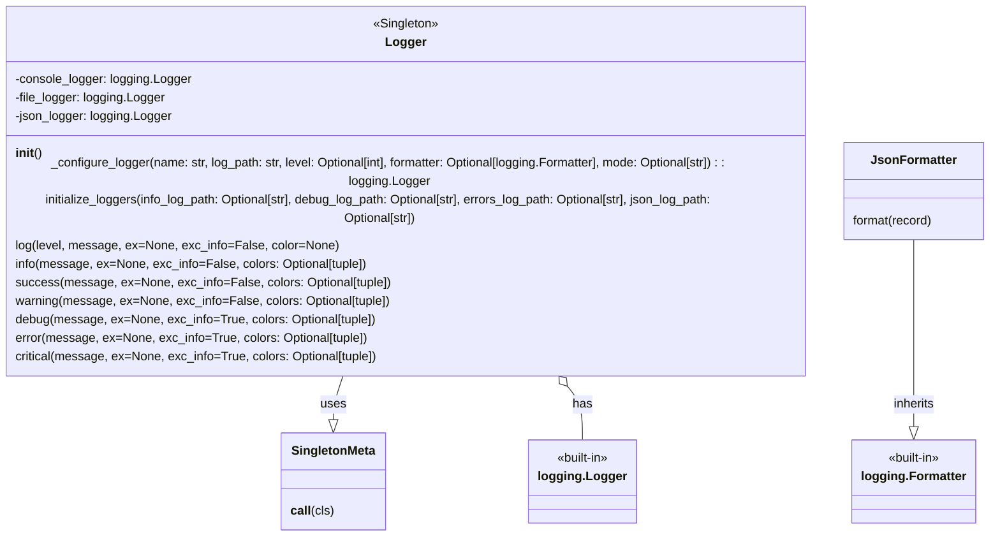

## <алгоритм>

1.  **Инициализация логгера**:
    *   Создается экземпляр класса `Logger`.
    *   Вызывается метод `initialize_loggers` с путями к файлам логов (`info_log_path`, `debug_log_path`, `errors_log_path`, `json_log_path`).
    *   Пример:
        ```python
        logger = Logger()
        logger.initialize_loggers(info_log_path='logs/info.log', debug_log_path='logs/debug.log', errors_log_path='logs/errors.log', json_log_path='logs/log.json')
        ```

2.  **Конфигурирование логгеров**:
    *   Для каждого типа логгера (консольный, файловый, JSON) внутри `initialize_loggers`, вызывается метод `_configure_logger`.
    *   `_configure_logger` настраивает параметры логгера:
        *   Имя логгера.
        *   Путь к файлу лога.
        *   Уровень логирования (по умолчанию `DEBUG`).
        *   Форматтер (по умолчанию стандартный, для JSON используется `JsonFormatter`).
        *   Режим файла (по умолчанию `'a'` для добавления).
    *   `_configure_logger` возвращает настроенный экземпляр `logging.Logger`.
    *   Пример:
        ```python
        def _configure_logger(name, log_path, level=logging.DEBUG, formatter=None, mode='a'):
            # ... настройка логгера ...
            return logger
        ```

3.  **Логирование сообщений**:
    *   Вызываются методы `info`, `success`, `warning`, `debug`, `error`, `critical` с сообщением (`message`) и дополнительными параметрами (исключение `ex`, информация об исключении `exc_info`, цвета `colors`).
    *   Каждый из этих методов вызывает метод `log`, передавая ему соответствующий уровень логирования (`logging.INFO`, `logging.DEBUG` и т.д.).
    *   Внутри `log` сообщение форматируется и выводится на консоль и/или в файл(ы) в зависимости от конфигурации.
    *   Пример:
        ```python
        logger.info("Сообщение INFO", colors=(colorama.Fore.GREEN, colorama.Back.BLACK))
        logger.error("Сообщение ERROR", ex=Exception("Пример ошибки"), exc_info=True, colors=(colorama.Fore.WHITE, colorama.Back.RED))
        ```
        *   **`logger.info(...)`**: Логирует информационное сообщение.
        *   **`logger.error(...)`**: Логирует сообщение об ошибке, включая информацию об исключении.

4.  **Форматирование сообщений**:
    *   Сообщения форматируются с использованием `logging.Formatter` или `JsonFormatter` для JSON логов.
    *   Если указаны цвета, сообщение выводится в консоль с использованием `colorama`.
    *   Пример:
        *   Стандартное форматирование: `%(asctime)s - %(levelname)s - %(message)s`
        *   JSON форматирование: `{"time": ..., "level": ..., "message": ..., "exception": ...}`

5.  **Singleton**:
    *   Метакласс `SingletonMeta` гарантирует, что у класса `Logger` будет только один экземпляр.

## <mermaid>



**Описание зависимостей:**

*   **`Logger`**: Основной класс логгера, который реализует singleton через `SingletonMeta` и управляет всеми операциями логирования.
*   **`SingletonMeta`**: Метакласс, обеспечивающий создание только одного экземпляра `Logger`.
*   **`logging.Logger`**: Стандартный класс логгера из библиотеки `logging`, используется для настройки и управления отдельными логгерами (консольный, файловый, JSON).
*   **`logging.Formatter`**: Базовый класс для форматирования логов.
*   **`JsonFormatter`**: Пользовательский класс для форматирования логов в JSON. Он наследует от `logging.Formatter`.
*   **`Logger` использует `SingletonMeta`** для реализации паттерна Singleton, гарантируя, что будет создан только один экземпляр логгера.
*   **`Logger` имеет отношение композиции к `logging.Logger`**, что означает, что `Logger` создает и управляет экземплярами `logging.Logger`.
*  **`JsonFormatter` наследует от `logging.Formatter`**, расширяя его функциональность для JSON форматирования.

## <объяснение>

**Импорты:**

*   `logging`: Стандартная библиотека Python для логирования. Используется для настройки и управления логированием сообщений.
*   `typing.Optional`: Используется для указания, что аргумент функции может быть `None`.
*   `colorama`: Используется для добавления цветного вывода в консоль. Внутри используется `colorama.Fore` и `colorama.Back` для указания цвета текста и фона.
*   `json`: Используется для форматирования логов в JSON.

**Классы:**

*   **`SingletonMeta`**:
    *   **Роль**: Метакласс, реализующий паттерн Singleton.
    *   **Атрибуты**: Нет.
    *   **Методы**:
        *   `__call__(cls)`: Переопределяет вызов класса, гарантируя, что будет создан только один экземпляр класса `Logger`.
    *   **Взаимодействие**: Используется как метакласс для `Logger`.
*   **`JsonFormatter`**:
    *   **Роль**: Форматирует логи в JSON.
    *   **Атрибуты**: Нет.
    *   **Методы**:
        *   `format(record)`: Форматирует запись лога в JSON строку, включая время, уровень, сообщение и информацию об исключении.
    *   **Взаимодействие**: Используется как форматтер для JSON логгера.
*   **`Logger`**:
    *   **Роль**: Основной класс логгера, предоставляющий методы для логирования сообщений на различных уровнях.
    *   **Атрибуты**:
        *   `console_logger`: Экземпляр `logging.Logger` для консольных логов.
        *   `file_logger`: Экземпляр `logging.Logger` для файловых логов.
        *   `json_logger`: Экземпляр `logging.Logger` для JSON логов.
    *   **Методы**:
        *   `__init__()`: Инициализирует атрибуты логгера пустыми значениями.
        *   `_configure_logger(name, log_path, level, formatter, mode)`: Настраивает и возвращает экземпляр `logging.Logger`.
        *   `initialize_loggers(info_log_path, debug_log_path, errors_log_path, json_log_path)`: Инициализирует все типы логгеров (консольный, файловый, JSON).
        *   `log(level, message, ex, exc_info, color)`: Основной метод для логирования сообщений.
        *   `info(message, ex, exc_info, colors)`: Логирует информационное сообщение.
        *   `success(message, ex, exc_info, colors)`: Логирует сообщение об успехе.
        *   `warning(message, ex, exc_info, colors)`: Логирует предупреждение.
        *   `debug(message, ex, exc_info, colors)`: Логирует отладочное сообщение.
        *   `error(message, ex, exc_info, colors)`: Логирует сообщение об ошибке.
        *   `critical(message, ex, exc_info, colors)`: Логирует критическое сообщение.
    *   **Взаимодействие**: Использует `SingletonMeta` для обеспечения единственного экземпляра, `logging` для настройки и управления логгерами, и `JsonFormatter` для JSON логов.

**Функции:**

*   **`_configure_logger(name, log_path, level, formatter, mode)`**:
    *   **Аргументы**:
        *   `name`: Имя логгера.
        *   `log_path`: Путь к файлу лога.
        *   `level`: Уровень логирования (по умолчанию `logging.DEBUG`).
        *   `formatter`: Форматтер (по умолчанию `None`).
        *   `mode`: Режим файла (по умолчанию `'a'`).
    *   **Возвращаемое значение**: Экземпляр `logging.Logger`.
    *   **Назначение**: Настраивает логгер с заданными параметрами, создает файловый обработчик (если указан `log_path`), добавляет его к логгеру и возвращает настроенный логгер.
    *   **Пример**:
        ```python
        _configure_logger(name='info', log_path='logs/info.log', level=logging.INFO)
        ```
*   **`initialize_loggers(info_log_path, debug_log_path, errors_log_path, json_log_path)`**:
    *   **Аргументы**:
        *   `info_log_path`: Путь к файлу информационных логов (опционально).
        *   `debug_log_path`: Путь к файлу отладочных логов (опционально).
        *   `errors_log_path`: Путь к файлу логов ошибок (опционально).
        *   `json_log_path`: Путь к файлу JSON логов (опционально).
    *   **Возвращаемое значение**: Нет.
    *   **Назначение**: Инициализирует все типы логгеров, вызывая `_configure_logger` для каждого из них.
    *   **Пример**:
        ```python
        initialize_loggers(info_log_path='logs/info.log', debug_log_path='logs/debug.log', errors_log_path='logs/errors.log', json_log_path='logs/log.json')
        ```
*   **`log(level, message, ex, exc_info, color)`**:
    *   **Аргументы**:
        *   `level`: Уровень логирования.
        *   `message`: Сообщение для логирования.
        *   `ex`: Исключение для логирования (опционально).
        *   `exc_info`: Включать ли информацию об исключении (по умолчанию `False`).
        *   `color`: Кортеж с цветами для консоли (опционально).
    *   **Возвращаемое значение**: Нет.
    *   **Назначение**: Логирует сообщение на заданном уровне с использованием консольного и файлового логгеров, а также json логгера если они инициализированы. Применяет форматирование цвета если color не None, а `exc_info=True` добавляет стек вызовов.
    *   **Пример**:
        ```python
         log(logging.INFO, "Сообщение", colors=(colorama.Fore.GREEN, colorama.Back.BLACK))
        ```
*   **`info(message, ex, exc_info, colors)`**:
    *   **Аргументы**:
        *   `message`: Сообщение для логирования.
        *   `ex`: Исключение для логирования (опционально).
        *   `exc_info`: Включать ли информацию об исключении (по умолчанию `False`).
        *   `colors`: Кортеж с цветами для консоли (опционально).
    *   **Возвращаемое значение**: Нет.
    *   **Назначение**: Логирует информационное сообщение, вызывая `log` с уровнем `logging.INFO`.
    *   **Пример**:
        ```python
        info("Сообщение", colors=(colorama.Fore.GREEN, colorama.Back.BLACK))
        ```
    * **`success(message, ex, exc_info, colors)`**: аналогично `info` но для успешных сообщений.
    * **`warning(message, ex, exc_info, colors)`**: аналогично `info` но для предупреждений.
    * **`debug(message, ex, exc_info, colors)`**: аналогично `info` но для отладочных сообщений. `exc_info` по умолчанию `True`.
    * **`error(message, ex, exc_info, colors)`**: аналогично `info` но для сообщений об ошибках. `exc_info` по умолчанию `True`.
    * **`critical(message, ex, exc_info, colors)`**: аналогично `info` но для критических сообщений. `exc_info` по умолчанию `True`.

**Переменные:**

*   `console_logger`: Экземпляр `logging.Logger` для консольных логов.
*   `file_logger`: Экземпляр `logging.Logger` для файловых логов.
*   `json_logger`: Экземпляр `logging.Logger` для JSON логов.

**Потенциальные ошибки и области для улучшения:**

*   **Обработка ошибок**: В методах `log`, `info`, `debug`, `error` и т. д. отсутствует явная обработка ошибок, которые могут возникнуть при логировании.
*   **Конфигурация**: Конфигурация путей логов задается как параметры функций, а не через конфигурационный файл или объект, что делает код менее гибким.
*   **Управление цветами**: Цвета задаются с помощью кортежей, что не всегда удобно. Можно использовать более читаемый формат (например, словарь).
*   **Расширяемость**: Добавление новых типов логов (например, для syslog) потребует изменения класса `Logger`. Можно рассмотреть использование более гибкой архитектуры.
*   **Зависимости**: Зависимость от `colorama` для цветного вывода может быть необязательной и зависеть от окружения. Можно реализовать механизм проверки наличия `colorama` и использовать его только если он установлен.

**Взаимосвязь с другими частями проекта:**

*   Этот модуль используется в других частях проекта для логирования сообщений на различных уровнях.
*   Предполагается, что другие модули импортируют класс `Logger` и используют его для логирования событий.