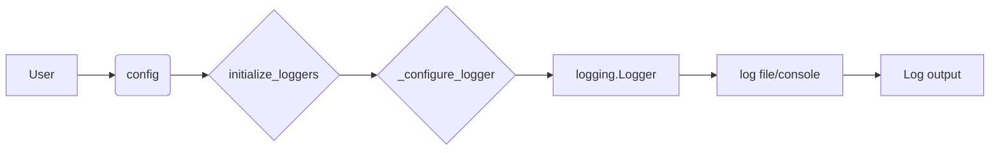

# <input code>

```rst
.. :module: src.logger
```
[Русский](https://github.com/hypo69/hypo/blob/master/src/logger/readme.ru.md)
### Documentation for the `src.logger` Module

The `src.logger` module provides a flexible logging system that supports console, file, and JSON logging. It utilizes the Singleton design pattern to ensure only a single instance of the logger is used across the application. The logger supports various log levels (e.g., `INFO`, `ERROR`, `DEBUG`) and includes colorized output for console logs. You can also customize the log output formats and control logging to different files.

---

### Classes:
- **SingletonMeta**: Metaclass that implements the Singleton design pattern for the logger.
- **JsonFormatter**: A custom formatter that outputs logs in JSON format.
- **Logger**: The main logger class that supports console, file, and JSON logging.

---

### Functions:

#### `__init__`
Initializes the Logger instance with placeholders for different logger types (console, file, and JSON).

#### `_configure_logger(name: str, log_path: str, level: Optional[int] = logging.DEBUG, formatter: Optional[logging.Formatter] = None, mode: Optional[str] = 'a') -> logging.Logger`
Configures and returns a logger instance.

**Parameters:**
- `name`: Name of the logger.
- `log_path`: Path to the log file.
- `level`: Logging level, e.g., `logging.DEBUG`. Default is `logging.DEBUG`.
- `formatter`: Custom formatter (optional).
- `mode`: File mode, e.g., `'a'` for append (default).

**Returns**: Configured `logging.Logger` instance.

#### `initialize_loggers(info_log_path: Optional[str] = '', debug_log_path: Optional[str] = '', errors_log_path: Optional[str] = '', json_log_path: Optional[str] = '')`
Initializes the loggers for console and file logging (info, debug, error, and JSON).

**Parameters:**
- `info_log_path`: Path for info log file (optional).
- `debug_log_path`: Path for debug log file (optional).
- `errors_log_path`: Path for error log file (optional).
- `json_log_path`: Path for JSON log file (optional).

#### `log(level, message, ex=None, exc_info=False, color=None)`
Logs a message at the specified level (e.g., `INFO`, `DEBUG`, `ERROR`) with optional exception and color formatting.

**Parameters:**
- `level`: Logging level (e.g., `logging.INFO`, `logging.DEBUG`).
- `message`: The log message.
- `ex`: Optional exception to log.
- `exc_info`: Whether to include exception information (default is `False`).
- `color`: Tuple with text and background colors for console output (optional).

#### `info(message, ex=None, exc_info=False, colors: Optional[tuple] = None)`
Logs an info message.

... (other functions)
```

# <algorithm>

The algorithm is described in the documentation itself.  It's a typical logging system that creates instances and manages log files for different levels. A crucial part is the SingletonMeta class that ensures only one instance exists.

**Steps:**

1. **Initialization (`__init__`):** The `Logger` object is created and sets up placeholders for different log types (console, file, JSON).  No actual logging happens yet.

2. **Configuration (`_configure_logger`):**  This function takes the logging level, file path, and other settings to create a `logging.Logger` object. The returned logger is associated with a specific output file and formatting.

3. **Initialization of loggers (`initialize_loggers`):**  This function takes optional file paths as input to configure loggers for different logging levels (info, debug, error, and JSON).   It calls `_configure_logger` for each needed log type.

4. **Logging (`log`, `info`, `success`, etc.):** These functions determine the log level (INFO, DEBUG, ERROR, etc.) and the message to be logged.  They also handle potential exceptions (`ex`) and color formatting (`color`). The actual logging to different files happens within the `logging` module.

**Example Data Flow:**

```
User Input -> config dict -> initialize_loggers -> _configure_logger -> logging.Logger -> log file(s) / console
```


# <mermaid>



**Dependencies Analysis:**

The `src.logger` module depends on the standard Python `logging` module and (likely) the `colorama` module (for colored output).  These dependencies are implicitly used through the `import` statements (though not explicitly listed in the documentation).


# <explanation>

**Imports:**

The module uses the standard Python `logging` module for its core logging functionality.  The `colorama` module (implied from the color options) is likely used for console color formatting.  The `typing` module (though not explicitly mentioned) is implied by the use of optional type hints (`Optional`).

**Classes:**

- **`SingletonMeta`**: This metaclass is used to enforce the Singleton design pattern, guaranteeing that only one instance of the Logger exists throughout the application. It's a common pattern for managing global resources.

- **`JsonFormatter`**: A custom formatter for creating JSON-formatted log messages, which allows for specialized handling of data.

- **`Logger`**: This is the central class for the logging system. It holds the configured loggers for various types (console, files, JSON). The `initialize_loggers` method handles the configuration and initialization of these loggers, making the log setup more manageable.

**Functions:**

- **`__init__`**: Initializes the `Logger` object, creating placeholders for console, file, and JSON loggers. It doesn't perform logging actions; it prepares the logger for later configuration.

- **`_configure_logger`**:  The core configuration function for a specific logger.  It's the backbone of handling file and format specifics.

- **`initialize_loggers`**: Configures and initializes the loggers. This method uses `_configure_logger` to create the necessary loggers for different log files (info, debug, error, JSON). It is responsible for setting up the various output targets.

- **`log` and other logging functions (`info`, `success`, `warning`, `debug`, `error`, `critical`):** These functions log messages at different levels.  They accept a message, optional exception data, and control over whether exception details are included in the log (`exc_info`).  Crucially, they handle color formatting (if specified) for console output. These functions perform the actual log output.


**Variables:**

- Configuration variables (`info_log_path`, `debug_log_path`, etc.) hold file paths, allowing for flexible control of log locations without hardcoding them.

**Possible Errors/Improvements:**

- **Error Handling:**  While exceptions are handled, more robust error handling could be added within `_configure_logger` in case of file creation or access issues.  Logging these failures would be helpful for diagnostics.

- **Resource Management:** In a large application, more complex configurations might warrant dedicated configuration files for better maintainability.

- **Log Rotation:**  For long-running applications, log rotation mechanisms (e.g., to prevent log files from becoming excessively large) would be beneficial.


**Relationships:**

The `src.logger` module interacts with the rest of the `hypo` project by providing the logging functionality. Any other part of the project that needs to log information would use the `Logger` class from `src.logger`.  The `config` dictionary, passed to `initialize_loggers`, acts as a critical communication link, allowing various parts of the application to configure the logging system.