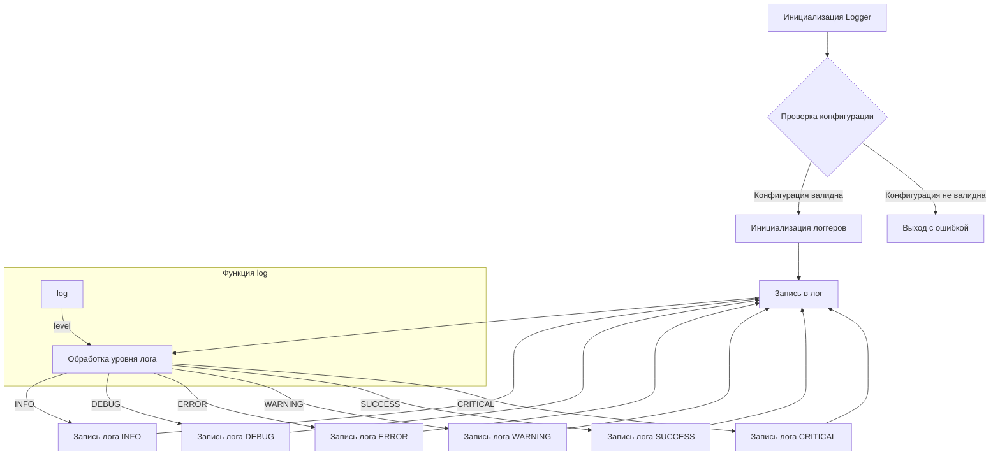

# <algorithm>

**Блок-схема алгоритма:**



**Описание шагов:**

1. **Инициализация Logger:** Создается экземпляр класса Logger.
2. **Проверка конфигурации:** Проверяется корректность переданной конфигурации (config).
3. **Инициализация логгеров:**  Функция `initialize_loggers` создает и настраивает логгеров (для консоли и файлов) на основе данных из конфигурации.
4. **Запись в лог:**  Функция `log` получает уровень лога и сообщение.
5. **Обработка уровня лога:** Логика определяет, какой тип лога нужно записать (INFO, DEBUG, ERROR и т.д.).
6. **Запись лога (INFO, DEBUG, ERROR, WARNING, SUCCESS, CRITICAL):**  Лог записывается в соответствующий файл или на консоль с учетом указанного уровня и формата.
7. **Возвращение:**  Функция `log` возвращает объект logging.Logger.

**Примеры данных:**

* **Входные данные:** `logger.info('Данные успешно загружены')`
* **Переменные:** `level=logging.INFO`, `message='Данные успешно загружены'`
* **Обработка:** Функция log обрабатывает уровень `INFO` и сообщение.
* **Выходные данные:** Запись в файл `info.log` с форматом сообщения.

**Взаимосвязи с другими частями проекта:**

Модуль `logger` используется другими частями проекта для записи сообщений об ошибках, информационных сообщений и отладки. Взаимодействие происходит путем вызова функций (например, `logger.info()`) из других модулей.

# <mermaid>

```mermaid
graph LR
    subgraph Logger
        Logger --> initialize_loggers;
        initialize_loggers --> log;
        log --> info;
        log --> debug;
        log --> error;
        log --> warning;
        log --> success;
        log --> critical;
        info --> write_to_file;
        debug --> write_to_file;
        error --> write_to_file;
        warning --> write_to_file;
        success --> write_to_file;
        critical --> write_to_file;
        subgraph logging
            write_to_file --> logging.Logger;
        end
    end
    subgraph External
        Other Modules --> Logger;
    end
```

# <explanation>

**Импорты:**

* В данном коде отсутствуют явные импорты, поскольку документация описывает использование модуля `logging` и предположительно `colorama`. Необходимо импортировать эти модули, чтобы код работал.

**Классы:**

* **`SingletonMeta`:**  Реализует паттерн Singleton, гарантируя, что у Logger будет только один экземпляр. Этот класс определяет поведение класса Logger, делая его Singleton.
* **`JsonFormatter`:**  Настраивает вывод логов в формате JSON.
* **`Logger`:** Основной класс для логирования. Он использует `logging.Logger` для записи логов.  Классу предоставляются параметры для управления различными типами логирования, уровнями, форматированием, путями к файлам.

**Функции:**

* **`__init__`:** Инициализирует экземпляр `Logger`, создавая placeholders для различных типов логгеров (консоль, файл, JSON).
* **`_configure_logger`:**  Настраивает и возвращает экземпляр `logging.Logger` с заданными параметрами.  Ключевое значение – `logging.Logger` является точкой входа для взаимодействия с базовым функционалом логирования.
* **`initialize_loggers`:** Инициализирует логгеров для различных целей: консоль, файлы (info, debug, error, json).  Это функция связывает логгер с заданными файлами для записи.
* **`log(level, message, ...)`:**  Основная функция для записи логов, принимающая уровень логирования (e.g., `logging.INFO`), сообщение и опциональные параметры для обработки исключений и цветового форматирования.
* **`info`, `success`, `warning`, `debug`, `error`, `critical`:** Это вспомогательные функции для записи сообщений разных уровней логирования (INFO, SUCCESS, WARNING, DEBUG, ERROR, CRITICAL).  Они вызывают `log` с соответствующими значениями уровня.

**Переменные:**

* **`config`:**  Словарь, хранящий пути к файлам для логирования.

**Возможные ошибки/улучшения:**

* **Отсутствие явных проверок:**  Не реализованы проверки на корректность путей к файлам,  что может привести к ошибкам.
* **Переиспользование ресурсов:**  Реализация паттерна Singleton может быть слишком жесткой. Если логгер используется в нескольких потоках, возможны проблемы с потокобезопасностью.
* **Более гибкий конфигуратор:**  Настройка логирования могла бы быть более гибкой (например, через YAML или JSON).
* **Документация:** Хотя документация хорошая, добавление примеров использования разных параметров (уровней логов, форматирования, цветового отображения) улучшило бы ее.
* **Отсутствие проверки на существование файлов:** Нужно добавить проверки на существование файлов, чтобы избежать ошибок при открытии.

**Заключение:**

Модуль `logger` предоставляет гибкую систему логирования, поддерживающую различные форматы и уровни. Однако для обеспечения устойчивости и масштабируемости рекомендуется добавить проверки на корректность данных и лучшую обработку ошибок.