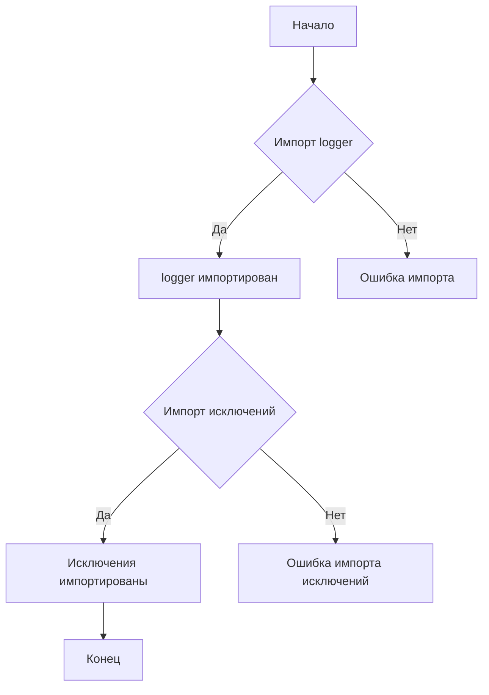
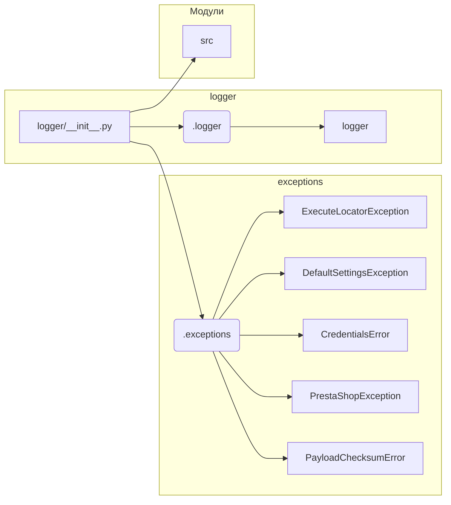

```MD
# Анализ кода hypotez/src/logger/__init__.py

## <input code>

```python
## \file hypotez/src/logger/__init__.py
# -*- coding: utf-8 -*-\
#! venv/Scripts/python.exe
#! venv/bin/python/python3.12

"""
.. module: src.logger 
	:platform: Windows, Unix
	:synopsis:

"""
MODE = 'dev'

from .logger import logger
#from .beeper import Beeper
from .exceptions import ( ExecuteLocatorException, 
                         DefaultSettingsException, 
                         CredentialsError, 
                         PrestaShopException, 
                         PayloadChecksumError
                        )
```

## <algorithm>

Этот код, скорее всего, является инициализационной частью модуля `logger` проекта `hypotez`.  Алгоритм прост: он импортирует необходимые компоненты.  Никаких сложных вычислений или операций с данными нет.

**Блок-схема:**



**Пример:**

Если все импорты пройдут успешно, скрипт продолжит работу. В противном случае произойдет ошибка.


## <mermaid>



**Объяснение диаграммы:**

* `logger/__init__.py` - инициализирующий файл модуля `logger`.
* `.logger` - файл с классом или функциями для логгирования.
* `.exceptions` - файл с определениями собственных исключений проекта.
* `src` - главный каталог проекта (судя по пути).


## <explanation>

**Импорты:**

* `from .logger import logger`: Импортирует объект `logger` из подкаталога `logger` этого же проекта.  Скорее всего, `logger` это класс для ведения логов в приложении. Подчёркивание `.` указывает на текущий модуль.
* `from .exceptions import ...`: Импортирует несколько классов исключений (`ExecuteLocatorException`, `DefaultSettingsException`, `CredentialsError`, `PrestaShopException`, `PayloadChecksumError`) из подкаталога `exceptions`.  Это специфичные для проекта исключения, вероятно, связанные с различными возможными ошибками.


**Классы (скорее всего):**

* В этом файле нет определений классов, но импорт `logger` намекает на существование класса `logger` в модуле `.logger`. Этот класс, вероятно, предоставляет методы для записи логов (например, `logger.info`, `logger.error` и т.п.)

**Функции (скорее всего):**

* В этом файле нет определений функций.

**Переменные:**

* `MODE = 'dev'`:  Переменная, скорее всего, задаёт режим работы приложения (в данном случае, режим разработки - 'dev'). Может использоваться для конфигурирования поведения программы (например, включения или отключения логов).

**Возможные ошибки или области для улучшений:**

* Отсутствие документации: Хотя есть docstrings, они очень просты.  Добавление более подробной документации (например, для переменной `MODE` и всех исключений) существенно улучшит читабельность кода и понимание его назначения.
* Лучше использовать стандартные исключения Python вместо создания своих, если они существуют, и если это подходит.
* Непонятен смысл  `#! venv/Scripts/python.exe` и `#! venv/bin/python/python3.12`. Не стандартный для python способ указывать интерпретатор. Скорее всего, это используется для задания виртуальной среды.

**Цепочка взаимосвязей с другими частями проекта:**

*  Файл `logger/__init__.py` служит начальной точкой для доступа к функциям логгирования и к определённым исключениям.
*  Он указывает на наличие подмодулей `logger` и `exceptions`, вероятно, содержащих классы и функции для регистрации событий приложения и обработки ошибок соответственно.


```