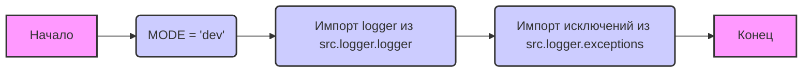

## Анализ кода `hypotez/src/logger/__init__.py`

### 1. <алгоритм>

1.  **Начало**: Инициализация модуля `src.logger`.
2.  **Определение режима**: Устанавливается переменная `MODE` в значение `'dev'`. Это может использоваться для определения режима работы приложения (например, разработка или продакшн).
    *   **Пример**: В режиме `dev` может вестись более подробное журналирование, чем в продакшне.
3.  **Импорт `logger`**: Импортируется объект `logger` из модуля `src.logger.logger`.
    *   **Пример**: `logger` используется для записи сообщений о событиях в процессе работы приложения.
4. **Импорт исключений**: Импортируются классы исключений `ExecuteLocatorException`, `DefaultSettingsException`, `CredentialsError`, `PrestaShopException`, `PayloadChecksumError` из модуля `src.logger.exceptions`.
    *   **Пример**: `ExecuteLocatorException` может быть возбуждено при ошибке локатора, `CredentialsError` при ошибке аутентификации, и т.д.
5.  **Конец**: Модуль готов к использованию.

### 2. <mermaid>

**Описание `mermaid` диаграммы:**

*   **`graph LR`**: Указывает, что это граф, отображаемый слева направо.
*   **`A[Начало] --> B(MODE = 'dev')`**:  Стартовая точка A ("Начало"), переходит к узлу B, где переменной `MODE` присваивается значение `'dev'`.
*  **`B --> C(Импорт logger из src.logger.logger)`**: От узла B происходит переход к узлу C, представляющему импорт объекта `logger` из модуля `src.logger.logger`.
*   **`C --> D(Импорт исключений из src.logger.exceptions)`**:  Из узла C происходит переход к узлу D, представляющему импорт исключений из модуля `src.logger.exceptions`.
*   **`D --> E[Конец]`**: Из узла D переходим к конечному узлу E ("Конец").
* **`classDef classFill fill:#f9f,stroke:#333,stroke-width:2px`**:  Определяет стиль для стартового и конечного узла
* **`class A,E classFill`**:  Применяет стиль к стартовому и конечному узлу
* **`style B fill:#ccf,stroke:#333,stroke-width:2px`**:  Применяет стиль к узлу `B`
* **`style C fill:#ccf,stroke:#333,stroke-width:2px`**:  Применяет стиль к узлу `C`
* **`style D fill:#ccf,stroke:#333,stroke-width:2px`**:  Применяет стиль к узлу `D`

Диаграмма отображает последовательность действий, происходящих при инициализации модуля `src.logger`, и иллюстрирует зависимости, такие как импорт модулей `logger` и `exceptions`.

### 3. <объяснение>

**Импорты:**

*   **`from .logger import logger`**:
    *   **Назначение**: Импортирует объект `logger` из модуля `logger.py`, находящегося в той же директории (`.`) -  `src/logger`. Этот объект, вероятно, используется для журналирования событий приложения.
    *   **Взаимосвязь**: `logger` является центральным компонентом для записи диагностической информации, и он используется другими частями проекта.
*  **`from .exceptions import (...)`**:
    *   **Назначение**: Импортирует пользовательские исключения из модуля `exceptions.py`, находящегося в той же директории (`.`) -  `src/logger`. Эти исключения используются для обработки различных ошибок, возникающих в процессе работы приложения.
    *   **Взаимосвязь**: Эти исключения могут быть возбуждены в разных частях проекта и обрабатываются в соответствующих блоках `try...except`.

**Переменные:**

*   **`MODE = 'dev'`**:
    *   **Тип**: Строка.
    *   **Назначение**: Определяет режим работы приложения. В данном случае установлен режим разработки (`dev`). Значение этой переменной может влиять на поведение логирования и других частей приложения.
    *   **Пример**: Можно использовать для включения или отключения детального журналирования.

**Цепочка взаимосвязей:**

1.  Модуль `src.logger` предоставляет функциональность логирования и обработки исключений.
2.  Объект `logger`, импортированный из `src.logger.logger`, будет использоваться в других модулях проекта для записи сообщений.
3.  Исключения, импортированные из `src.logger.exceptions`, будут возбуждаться в различных частях проекта при возникновении ошибок, и обрабатываться для обеспечения устойчивости работы приложения.

**Потенциальные ошибки и области для улучшения:**

*   Отсутствует обработка ошибок при импорте модулей. Стоит добавить `try...except` блоки для отлова возможных `ImportError`.
*   В настоящее время `MODE` установлен как константа `'dev'`. Хорошей практикой было бы его получение из переменных окружения или конфигурационного файла, чтобы можно было легко переключать режим работы приложения.
*   В коде закомментирована строка `#from .beeper import Beeper`,  почему-то было принято решение не импортировать данный класс, стоит выяснить причину. Возможно, `Beeper` используется в других частях проекта.
*  Необходимо добавить больше информации о том как использовать объект `logger`, чтобы было понятно, как он работает.

**Дополнительные замечания:**

*   Файл начинается с указания кодировки  `# -*- coding: utf-8 -*-`.
*   Присутствуют Shebang строки `#! venv/Scripts/python.exe` и `#! venv/bin/python/python3.12`.
*   В docstring указано использование на платформах `Windows, Unix`, а также добавлена строка `:synopsis:` -  описание модуля.
*   `__init__.py` делает модуль `logger` пакетом, позволяя импортировать его компоненты из других частей проекта.