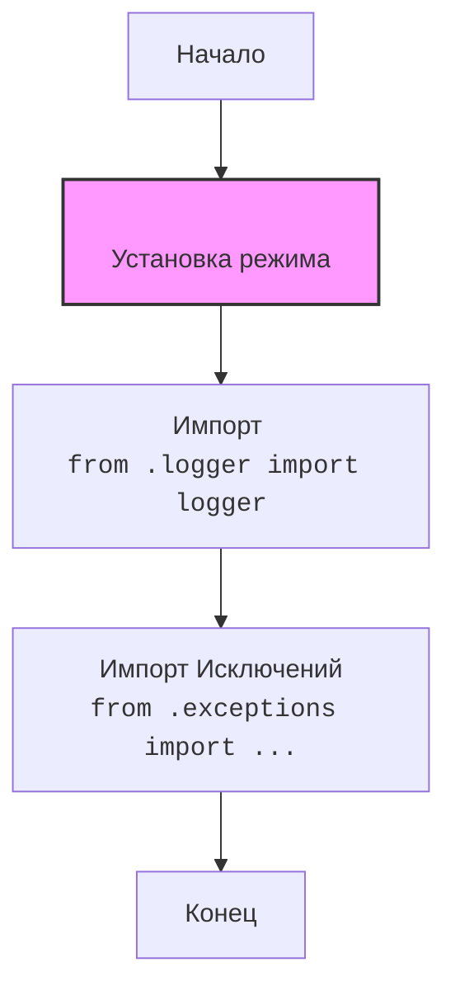

## ИНСТРУКЦИЯ:

Анализируй предоставленный код подробно и объясни его функциональность. Ответ должен включать три раздела:  

1. **<алгоритм>**: Опиши рабочий процесс в виде пошаговой блок-схемы, включая примеры для каждого логического блока, и проиллюстрируй поток данных между функциями, классами или методами.  
2. **<mermaid>**: Напиши код для диаграммы в формате `mermaid`, проанализируй и объясни все зависимости, 
    которые импортируются при создании диаграммы. 
    **ВАЖНО!** Убедитесь, что все имена переменных, используемые в диаграмме `mermaid`, 
    имеют осмысленные и описательные имена. Имена переменных вроде `A`, `B`, `C`, и т.д., не допускаются!  
    
    **Дополнительно**: Если в коде есть импорт `import header`, добавьте блок `mermaid` flowchart, объясняющий `header.py`:\
    ```mermaid\
    flowchart TD\
        Start --> Header[<code>header.py</code><br> Determine Project Root]\
    
        Header --> import[Import Global Settings: <br><code>from src import gs</code>] \
    ```

3. **<объяснение>**: Предоставьте подробные объяснения:  
   - **Импорты**: Их назначение и взаимосвязь с другими пакетами `src.`.  
   - **Классы**: Их роль, атрибуты, методы и взаимодействие с другими компонентами проекта.  
   - **Функции**: Их аргументы, возвращаемые значения, назначение и примеры.  
   - **Переменные**: Их типы и использование.  
   - Выделите потенциальные ошибки или области для улучшения.  

Дополнительно, постройте цепочку взаимосвязей с другими частями проекта (если применимо).  

Это обеспечивает всесторонний и структурированный анализ кода.
## Формат ответа: `.md` (markdown)
**КОНЕЦ ИНСТРУКЦИИ**
```
## <алгоритм>

1.  **Начало**: Инициализация модуля `src.logger`.
2.  **Объявление переменной `MODE`**:
    *   Переменная `MODE` устанавливается в значение `'dev'`. Это может использоваться для определения режима работы логгера (например, разработка или продакшн).
    *   Пример:  ``
3.  **Импорт `logger`**:
    *   Импортируется объект `logger` из модуля `src.logger.logger`. Предполагается, что этот объект - настроенный экземпляр логгера, используемый для записи сообщений.
    *   Пример: `from .logger import logger`
4.  **Импорт исключений**:
    *   Импортируются пользовательские исключения из модуля `src.logger.exceptions`. Эти исключения используются для обработки конкретных ошибок, возникающих в приложении.
        *   `ExecuteLocatorException`: Исключение, связанное с проблемами при выполнении локатора.
        *   `DefaultSettingsException`: Исключение, возникающее при ошибках с настройками по умолчанию.
        *   `CredentialsError`: Исключение, возникающее при проблемах с аутентификационными данными.
        *   `PrestaShopException`: Исключение, связанное с ошибками в работе с PrestaShop.
        *    `PayloadChecksumError`: Исключение, возникающее при несоответствии контрольной суммы полезной нагрузки.
    *   Пример: `from .exceptions import ( ExecuteLocatorException, DefaultSettingsException, CredentialsError, PrestaShopException, PayloadChecksumError )`
5.  **Завершение**: Модуль `src.logger` готов к использованию.

## <mermaid>



**Объяснение зависимостей:**

*   `Start`: Начальная точка модуля.
*   `ModeDeclaration`: Объявляется и инициализируется переменная `MODE` (режим работы).
*   `ImportLogger`: Импортируется объект `logger` из модуля `logger.py` для логирования сообщений.
*   `ImportExceptions`: Импортируются пользовательские исключения, специфичные для проекта, из модуля `exceptions.py`.
*   `End`: Конечная точка.

## <объяснение>

**Импорты:**

*   `from .logger import logger`:
    *   Назначение: Импортирует настроенный экземпляр логгера из модуля `logger.py` в той же директории.
    *   Взаимосвязь: Обеспечивает доступ к функциям логирования. Это позволяет использовать общий экземпляр логгера во всем проекте, чтобы гарантировать единообразие в записях.
*   `from .exceptions import ( ExecuteLocatorException, DefaultSettingsException, CredentialsError, PrestaShopException, PayloadChecksumError )`:
    *   Назначение: Импортирует пользовательские исключения из модуля `exceptions.py` в той же директории.
    *   Взаимосвязь: Позволяет использовать специфичные для проекта исключения, которые могут быть обработаны в вызывающем коде. Улучшает читаемость и отладку. Эти исключения могут быть использованы в разных частях проекта, что помогает отслеживать различные типы ошибок.

**Классы:**

*   В этом коде нет классов, только импорты исключений. Сами исключения определены в файле `exceptions.py`, который не представлен в коде.

**Функции:**

*   В данном коде нет функций. Функции логирования предполагаются в файле `logger.py`, который импортируется.

**Переменные:**

*   `MODE`:
    *   Тип: `str`.
    *   Использование: Указывает режим работы логгера и приложения. В данном случае установлено значение `'dev'`, что может означать, что логирование будет более детальным. В других частях проекта этот параметр может использоваться для переключения между разными настройками (например, для логирования в файл или в консоль).

**Цепочка взаимосвязей:**

1.  `__init__.py` служит точкой входа для модуля `src.logger` и импортирует необходимые компоненты.
2.  `logger.py` (не представлен, но импортируется): Содержит логику настройки и экземпляр логгера.
3.  `exceptions.py` (не представлен, но импортируются исключения): Содержит определения пользовательских исключений, которые используются для обработки ошибок.
4.  Другие части проекта используют `logger`, импортируя его из `src.logger` и могут обрабатывать исключения, импортированные из `src.logger.exceptions`.

**Потенциальные ошибки и области для улучшения:**

*   Отсутствие обработки ошибки импорта: Если `logger.py` или `exceptions.py` не существуют, импорт выдаст исключение. Можно добавить try-except блоки для более аккуратной обработки.
*   Жестко заданный ``: Можно сделать режим конфигурируемым через переменные среды или файл конфигурации, чтобы легко переключать режимы работы (например, `prod` для продакшна).
*   Отсутствие документации: Можно добавить комментарии или docstring для более детального объяснения функциональности модуля и импортируемых объектов.
*   Отсутствие примера использования: Хорошо бы добавить пример использования логгера и обработки исключений.