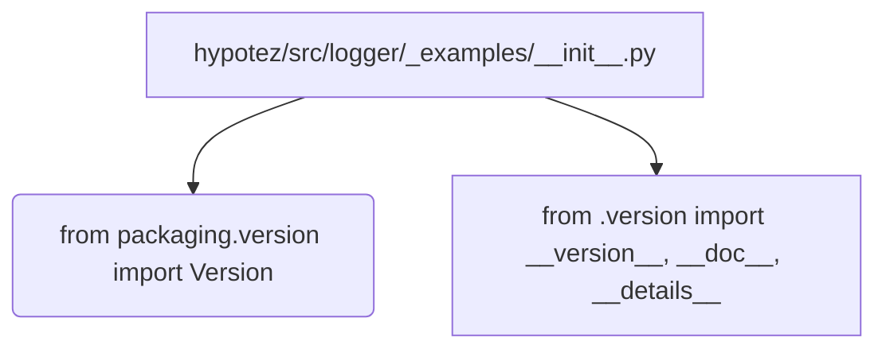

# <input code>

```python
## \file hypotez/src/logger/_examples/__init__.py
# -*- coding: utf-8 -*-\
#! venv/Scripts/python.exe
#! venv/bin/python/python3.12

"""
.. module: src.logger._examples 
	:platform: Windows, Unix
	:synopsis:

"""
MODE = 'dev'

"""
	:platform: Windows, Unix
	:synopsis:

"""


"""
	:platform: Windows, Unix
	:synopsis:

"""


"""
  :platform: Windows, Unix

"""
"""
  :platform: Windows, Unix
  :platform: Windows, Unix
  :synopsis:
"""MODE = 'dev'
  
""" module: src.logger._examples """


from packaging.version import Version
from .version import __version__, __doc__, __details__
```

# <algorithm>

Код представляет собой модуль `__init__.py` в пакете `hypotez/src/logger/_examples`.  Алгоритм прост - он импортирует функции и переменные из подмодуля `version.py` внутри того же пакета. Никаких сложных вычислений или операций нет.  Все сводится к импорту.  Пример:

```
Вход: Пустой модуль __init__.py.
Шаг 1: Импортируется модуль `Version` из `packaging.version`.
Шаг 2: Импортируются переменные `__version__`, `__doc__` и `__details__` из `version.py` из того же пакета.
Выход: Модуль `__init__.py` готов для использования, импортировав нужные компоненты.
```

# <mermaid>



# <explanation>

* **Импорты**:
    - `from packaging.version import Version`: Импортирует класс `Version` из пакета `packaging.version`.  Этот пакет используется для работы с версиями пакетов Python. Импортирование этого класса, вероятно, подразумевает, что в этом проекте планируется обрабатывать или сравнивать версии.
    - `from .version import __version__, __doc__, __details__`: Импортирует переменные `__version__`, `__doc__` и `__details__` из файла `version.py` в том же каталоге (`_examples`).  Эти переменные, вероятно, содержат метаданные о версии, документации и других деталях модуля `_examples`.

* **Классы**:
    - Нет определенных классов в этом `__init__.py`. Импортируется лишь один класс из `packaging.version` - `Version`.


* **Функции**:
    - Нет определенных функций в этом `__init__.py`.


* **Переменные**:
    - `MODE = 'dev'`: Переменная, скорее всего, задает режим работы. `'dev'` - это скорее всего режим разработки.  Значение переменной `MODE` используется для настройки поведения других модулей в проекте.


* **Возможные ошибки или области для улучшений**:
    - Нет явной ошибки в этом коде, но недостаточно информации, чтобы оценить его целиком.  В идеале, `version.py` должен содержать документацию по этим переменным.
    - Необходимы дальнейшие сведения о проекте, чтобы понять, куда ведет эта `__init__.py`. Для анализа всей структуры проекта необходимо больше контекста.

**Цепочка взаимосвязей**:

`hypotez/src/logger/_examples/__init__.py` импортирует переменные и функции из `hypotez/src/logger/_examples/version.py`.  Дальнейшая логика, вероятно, использует эти метаданные о версии (и возможно документации) в других модулях проекта, например, для управления версиями, выбора версий или вывода информации. Без доступа к остальному коду нельзя полностью проследить взаимосвязи, но указанные импорты являются начальным звеном.