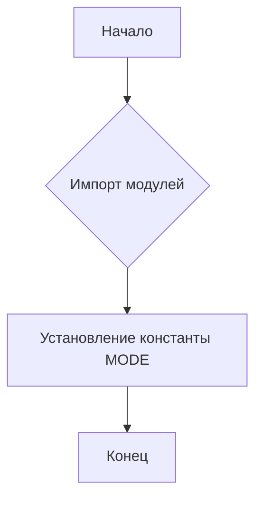
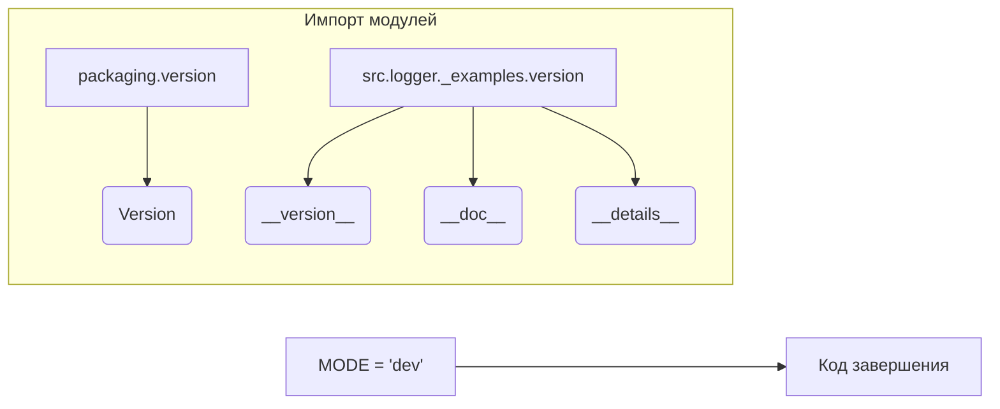

# <input code>

```python
## \file hypotez/src/logger/_examples/__init__.py
# -*- coding: utf-8 -*-
#! venv/Scripts/python.exe
#! venv/bin/python/python3.12

"""
.. module: src.logger._examples 
	:platform: Windows, Unix
	:synopsis:

"""
MODE = 'dev'

"""
	:platform: Windows, Unix
	:synopsis:

"""


"""
	:platform: Windows, Unix
	:synopsis:

"""


"""
  :platform: Windows, Unix

"""
"""
  :platform: Windows, Unix
  :platform: Windows, Unix
  :synopsis:
"""MODE = 'dev'
  
""" module: src.logger._examples """


from packaging.version import Version
from .version import __version__, __doc__, __details__
```

# <algorithm>



Пример:

1. **Начало:** Программа начинается.
2. **Импорт модулей:** Модуль `packaging.version` импортируется, чтобы работать с версиями пакетов. Модули `__version__`, `__doc__`, `__details__` из `./version` также импортируются.
3. **Установление константы MODE:** Переменная `MODE` присваивается значение 'dev'.
4. **Конец:** Программа завершается.


# <mermaid>



* **Объяснение диаграммы:**

Диаграмма отображает структуру импортов и инициализацию константы `MODE`.  Модуль `packaging.version` импортируется для работы с версиями.  Из подпапки `version` внутри `src.logger._examples` импортируются `__version__`, `__doc__`, и `__details__`.  Именно эти данные, скорее всего, описывают информацию о версии и документацию для модуля `src.logger._examples`. Переменная `MODE` инициализируется значением 'dev'.


# <explanation>

* **Импорты:**
    * `from packaging.version import Version`: Импортирует класс `Version` из пакета `packaging.version`. Этот пакет, вероятно, используется для управления версиями пакетов.  Связь с `src`  отсутствует напрямую.  Это сторонний пакет.
    * `from .version import __version__, __doc__, __details__`: Импортирует три переменные (вероятно, константы) из модуля `version`, расположенного в той же директории (`./version`). Это внутренний модуль проекта.  Эти переменные скорее всего содержат метаданные о версии, документации и других характеристиках модуля `_examples`.


* **Классы:** Нет классов.


* **Функции:** Нет функций.


* **Переменные:**
    * `MODE = 'dev'`:  Строковая переменная, вероятно, определяющая режим работы модуля (`dev`, `prod`, и т.п.).  Значение `'dev'` указывает на разработочный режим.  Это глобальная переменная, доступная во всем модуле.


* **Возможные ошибки или области для улучшений:**

    * **Неясные комментарии:** Некоторые строки документации (docstrings) пусты или неинформативны. Необходимо уточнить, для чего используется переменная `MODE`.
    * **Отсутствие использования:**  Константа `MODE` не используется в этом файле.  По смыслу, она, скорее всего, необходима для более сложного логирования, в других частях приложения.
    * **Пустые блоки:** Есть несколько пустых строк и блоков кода (много `""" `).


* **Цепочка взаимосвязей:**

    Модуль `hypotez/src/logger/_examples/__init__.py` вероятно предоставляет базовый функционал для логирования (записи данных). Переменная `MODE`, возможно, используется в других частях проекта для настройки логирования (включение/выключение различных логгеров). `__version__`, `__doc__`, `__details__`, вероятно, нужны для документирования и отслеживания версий.  Для более полного анализа необходимы кода других модулей и файлов проекта.