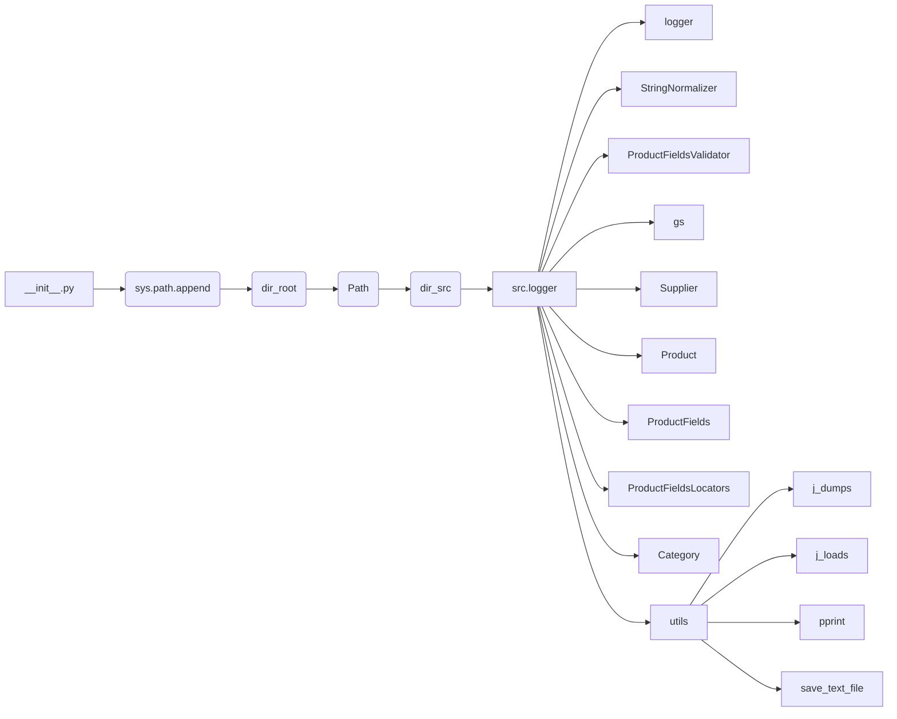

# <input code>

```python
## \file hypotez/src/logger/_examples/header.py
# -*- coding: utf-8 -*-
#! venv/Scripts/python.exe
#! venv/bin/python/python3.12

"""
.. module: src.logger._examples 
	:platform: Windows, Unix
	:synopsis:

"""
MODE = 'dev'

"""
	:platform: Windows, Unix
	:synopsis:

"""


"""
	:platform: Windows, Unix
	:synopsis:

"""


"""
  :platform: Windows, Unix

"""
"""
  :platform: Windows, Unix
  :platform: Windows, Unix
  :synopsis:
"""MODE = 'dev'
  
""" module: src.logger._examples """


import sys
import os
from pathlib import Path

dir_root : Path = Path (os.getcwd()[:os.getcwd().rfind('hypotez')+11])
sys.path.append (str (dir_root) )  # Добавляю корневую папку в sys.path
dir_src = Path (dir_root, 'src')
sys.path.append (str (dir_root) ) 
...

print(dir_root)
# ----------------
from pathlib import Path
import json
import re
# ----------------

from src import gs
from src.suppliers import Supplier
from src.product import Product, ProductFields, ProductFieldsLocators
from src.category import Category
from src.utils.jjson import j_dumps, j_loads,   pprint, save_text_file
from src.logger import logger
, StringNormalizer, ProductFieldsValidator
...
```

# <algorithm>

(блок-схема отсутствует, т.к. код содержит фрагмент импорта и инициализации, но не полный алгоритм)

# <mermaid>



**Описание зависимостей:**

* `src.logger`, `src.suppliers`, `src.product`, `src.category`, `src.utils.jjson`, `gs` — это модули или пакеты, находящиеся в подпапке `src` проекта.  Код добавляет пути к директориям `dir_root` и `dir_src` в переменную `sys.path`, чтобы Python мог найти эти импортированные модули.
* `pathlib`, `json`, `re` — это стандартные библиотеки Python.
*  Зависимости образуют иерархическую структуру, где `src` — основной пакет, содержащий другие подпакеты.


# <explanation>

**Импорты:**

Код импортирует модули из различных частей проекта.  Ключевой частью является добавление пути к корню проекта в `sys.path`. Это позволяет Python импортировать модули из подпапок `src`, которые могут находиться на разных уровнях проекта.

* `sys`, `os`, `pathlib` — стандартные библиотеки Python, используемые для работы с системными переменными, файловой системой и путями.
* `json`, `re` — стандартные библиотеки, используемые для работы с JSON-данными и регулярными выражениями.
* `gs`, `Supplier`, `Product`, `ProductFields`, `ProductFieldsLocators`, `Category`, `StringNormalizer`, `ProductFieldsValidator`, `j_dumps`, `j_loads`, `pprint`, `save_text_file`, `logger` — это модули или классы, определённые внутри проекта (вероятно, в `src` или его подпапках).  Эти импорты показывают сложную структуру проекта.

**Классы:**

Код импортирует различные классы, связанные с обработкой данных продукта, поставщиков и категорий.  Конкретные классы (например, `Supplier`, `Product`, `Category`) пока не определены, но ясно, что они, вероятно, находятся в `src` и относятся к обработке данных.

**Функции:**

Некоторые функции, например, `j_dumps`, `j_loads`, `pprint`, `save_text_file` и `logger` (вероятно, логирование) предполагаются как имеющиеся в проекте и используемые для обработки данных.

**Переменные:**

`dir_root` — путь к корню проекта, вычисляется и запоминается.
`dir_src` — путь к директории `src` в проекте.
`MODE` — переменная, вероятно, определяющая режим работы приложения ('dev' — предполагается режим разработки).

**Возможные ошибки и улучшения:**

* **Неполный код:** Код является фрагментом, содержащим лишь импорты. Необходимо увидеть полные определения классов и функций, чтобы понять их точную функциональность.
* **Обработка исключений:** Отсутствует обработка ошибок при работе с файлами, путями и другими ресурсами.
* **Документация:**  Комментарии `"""docstrings"""` есть, но для более сложных проектов их должно быть больше, особенно для объяснения поведения классов и функций.
* **Структура проекта:** Должны быть определены роли и ответственность каждого модуля.
* **Использование `sys.path.append`:**  Использование `sys.path.append` может создавать проблемы при запуске из разных директорий. Вместо этого лучше добавить в `PYTHONPATH` при установке проекта.

**Цепочка взаимосвязей:**

Файл `hypotez/src/logger/_examples/header.py` явно пытается инициализировать среду выполнения, добавляя в `sys.path` необходимые пути для последующего импорта и использования классов и функций из пакета `src`.  Он устанавливает общие переменные и пути, которые будут использоваться в следующих модулях проекта. Взаимосвязь идёт с подпапками `src`, где находятся основные классы и функции приложения.  Зависимости образуют сложную иерархическую структуру проекта.