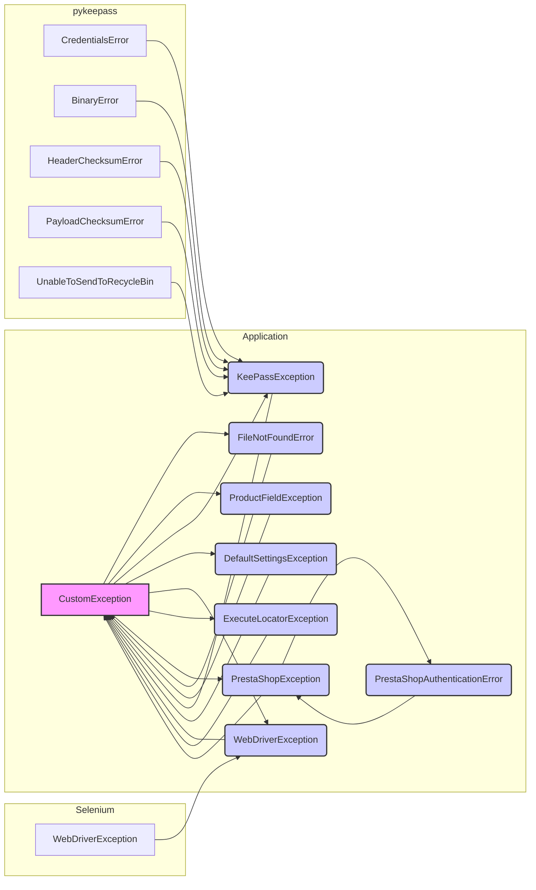

# <input code>

```python
## \file hypotez/src/logger/exceptions.py
# -*- coding: utf-8 -*-\
#! venv/Scripts/python.exe
#! venv/bin/python/python3.12

"""
.. module: src.logger.exceptions
    :platform: Windows, Unix
    :synopsis: This module defines custom exceptions used in the application.

Program Exceptions
------------------

This module contains several custom exception classes to handle errors related to various application components, including file operations, product fields, KeePass database connections, and PrestaShop WebService errors.

Classes:
--------
- CustomException: The base custom exception class that handles logging.
- FileNotFoundError: Raised when a file is not found.
- ProductFieldException: Raised for errors related to product fields.
- KeePassException: Raised for errors related to KeePass database connections.
- DefaultSettingsException: Raised when there are issues with default settings.
- WebDriverException: Raised for errors related to WebDriver.
- ExecuteLocatorException: Raised for errors related to locator executors.
- PrestaShopException: Raised for generic PrestaShop WebService errors.
- PrestaShopAuthenticationError: Raised for authentication errors with PrestaShop WebServices.

"""

MODE = 'dev'

from typing import Optional
from src.logger import logger
from selenium.common.exceptions import WebDriverException as WDriverException
from pykeepass.exceptions import (CredentialsError, BinaryError,
                                   HeaderChecksumError, PayloadChecksumError,
                                   UnableToSendToRecycleBin)
class CustomException(Exception):
    """Base custom exception class.

    This is the base class for all custom exceptions in the application. It handles logging of the exception
    and provides a mechanism for dealing with the original exception if it exists.

    Attributes:
    ----------
    original_exception : Optional[Exception]
        The original exception that caused this custom exception, if any.
    exc_info : bool
        A flag to indicate if exception information should be logged.
    """

    def __init__(self, message: str, e: Optional[Exception] = None, exc_info: bool = True):
        """Initializes the CustomException with a message and an optional original exception."""
        super().__init__(message)
        self.original_exception = e
        self.exc_info = exc_info
        self.handle_exception()

    def handle_exception(self):
        """Handles the exception by logging the error and original exception, if available."""
        logger.error(f"Exception occurred: {self}")
        if self.original_exception:
            logger.debug(f"Original exception: {self.original_exception}")
        # Add recovery logic, retries, or other handling as necessary.

# ... (rest of the code)
```

# <algorithm>

The code defines a hierarchy of custom exception classes for handling various errors in an application.  The `CustomException` class is the base, and others inherit from it or other relevant exception types.

* **CustomException:** Logs the exception message and any original exception that triggered it.
* **FileNotFoundError:** A specific exception for file not found errors, inheriting from both `CustomException` and `IOError`.
* **ProductFieldException:** Exception for errors related to product fields.
* **KeePassException:** Exception for problems interacting with a KeePass database, inheriting from multiple `pykeepass.exceptions`.
* **DefaultSettingsException:**  Exception for issues with default settings.
* **WebDriverException:**  Handles WebDriver-related errors, inheriting from `selenium.common.exceptions.WebDriverException`.
* **ExecuteLocatorException:**  For errors related to locator executors.
* **PrestaShopException:**  A base exception for errors related to PrestaShop web services. Includes specific error details from the service, like code and message.
* **PrestaShopAuthenticationError:** A specialized PrestaShopException for authentication failures.


The algorithm is primarily object-oriented, defining exception classes and handling specific error scenarios. Each custom exception class inherits from a base class (either `CustomException` or another standard Python exception) to extend its functionality.

Example Usage (IlluStartive):

```python
try:
    # ... some code that might raise an exception ...
    raise FileNotFoundError("File not found", OSError("Path error"))  # Example triggering a FileNotFoundError
except FileNotFoundError as e:
    # Handle the FileNotFoundError, log it, and maybe take recovery actions.
    print(f"Caught exception: {e}")
    print(f"Original exception: {e.original_exception}")
```

# <mermaid>



# <explanation>

* **Imports**:
    * `from typing import Optional`: Imports the `Optional` type from the `typing` module, used for type hinting optional parameters.
    * `from src.logger import logger`: Imports the `logger` object from the `src.logger` module, suggesting a logging system. This is crucial for error handling and debugging.
    * `from selenium.common.exceptions import WebDriverException as WDriverException`: Imports `WebDriverException` from the `selenium` library, used for handling Selenium WebDriver errors.
    * `from pykeepass.exceptions import ...`: Imports specific exception types from the `pykeepass` library for handling KeePass database related errors.


* **Classes**:
    * `CustomException`: Base class for all custom exceptions. It logs the exception using the imported `logger`, stores the original exception, and provides a `handle_exception` method for customized error handling (though this is currently basic).
    * `FileNotFoundError`, `ProductFieldException`, `KeePassException`, `DefaultSettingsException`, `WebDriverException`, `ExecuteLocatorException`, `PrestaShopException`, and `PrestaShopAuthenticationError`: These are specialized exception classes, each inheriting from either `CustomException` or a standard Python exception, to handle specific error scenarios related to different parts of the application.  `PrestaShopException` provides a structured way to handle potential errors from the PrestaShop WebService, including error codes and messages.

* **Functions**:
    * `__init__(self, message: str, e: Optional[Exception] = None, exc_info: bool = True)`: Constructor for `CustomException`. Takes a message, an optional original exception, and a flag to indicate if exception information should be logged. Calls the parent's `__init__` and then `handle_exception`.
    * `handle_exception(self)`:  Handles the exception by logging it and any original exception. A crucial method for adding future error handling, like retry logic or recovery actions.
    * `__str__(self)`: The PrestaShopException class has an overridden `__str__` method, which allows it to display a user-friendly message.


* **Variables**:
    * `MODE`: A variable with the value 'dev' likely used for conditional logging or other configuration.

* **Possible Errors/Improvements**:
    * The `handle_exception` method currently just logs the exception. It should be expanded to include more robust error handling Startegies, like retries, alternative actions, or escalation mechanisms.
    * More specific error handling could be added for file operations (e.g., exceptions specific to writing, reading, or deleting files).
    * Using exceptions for logging is a bit awkward (logging and exceptions are different roles). The code should use the logging module to log errors for monitoring, and exceptions to signal that something cannot be completed.


* **Relationships with Other Parts of the Project**:
    The `logger` object from `src.logger` suggests that this `exceptions.py` module is part of a larger application structure. The use of `selenium` and `pykeepass` libraries suggests that the application interacts with web browser automation and KeePass password manager.  The PrestaShop integration shows a connection to an e-commerce platform. The application likely uses these libraries for functionalities like interacting with these services or performing specific tasks.  The exceptions defined in this module help these interactions by providing an organized way to handle potential failures within these integrations.