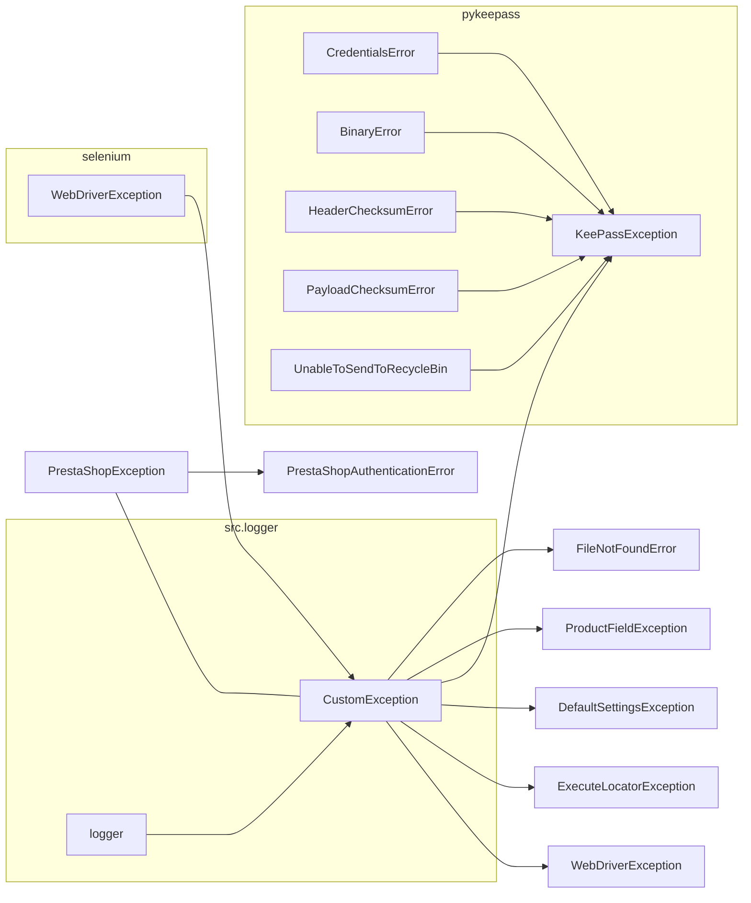

```MD
# <input code>

```python
## \file hypotez/src/logger/exceptions.py
# -*- coding: utf-8 -*-\
#! venv/Scripts/python.exe
#! venv/bin/python/python3.12

"""
.. module: src.logger.exceptions
    :platform: Windows, Unix
    :synopsis: This module defines custom exceptions used in the application.

Program Exceptions
------------------

This module contains several custom exception classes to handle errors related to various application components, including file operations, product fields, KeePass database connections, and PrestaShop WebService errors.

Classes:
--------
- CustomException: The base custom exception class that handles logging.
- FileNotFoundError: Raised when a file is not found.
- ProductFieldException: Raised for errors related to product fields.
- KeePassException: Raised for errors related to KeePass database connections.
- DefaultSettingsException: Raised when there are issues with default settings.
- WebDriverException: Raised for errors related to WebDriver.
- ExecuteLocatorException: Raised for errors related to locator executors.
- PrestaShopException: Raised for generic PrestaShop WebService errors.
- PrestaShopAuthenticationError: Raised for authentication errors with PrestaShop WebServices.

"""

MODE = 'dev'

from typing import Optional
from src.logger import logger
from selenium.common.exceptions import WebDriverException as WDriverException
from pykeepass.exceptions import (CredentialsError, BinaryError,
                                   HeaderChecksumError, PayloadChecksumError,
                                   UnableToSendToRecycleBin)
```
```

# <algorithm>

**Алгоритм работы модуля exceptions.py:**

Модуль определяет иерархию пользовательских исключений для обработки ошибок в приложении. Основная идея - централизованная логика обработки исключений, включая запись в лог.

**Шаг 1:** Импорты
- Импортируются необходимые типы данных (`Optional`), логгер (`logger`) из `src.logger`, исключения из `selenium.common.exceptions` и `pykeepass.exceptions`.  Это подключает необходимые компоненты для работы с логами и обработкой различных типов ошибок.

**Шаг 2:** Базовый класс `CustomException`
- Принимает сообщение об ошибке (`message`), необязательный исходный тип исключения (`e`) и флаг, указывающий, нужно ли логгировать детали исключения (`exc_info`).
- Инициализирует атрибуты `original_exception` и `exc_info`.
- Вызывает метод `handle_exception()`, который логгирует информацию об ошибке.

**Шаг 3:** Обработка `handle_exception()`
- Логирует основное сообщение об ошибке.
- Если есть исходный тип исключения (`original_exception`), логирует и его детали.
- (ВАЖНО) Имеет место для добавления логики по обработке/восстановлению от ошибки.


**Шаг 4:** Производные классы исключений
- `FileNotFoundError`, `ProductFieldException`, `KeePassException`, `DefaultSettingsException`, `WebDriverException`, `ExecuteLocatorException`, `PrestaShopException`, `PrestaShopAuthenticationError` — специфические исключения для разных областей приложения.
- Они наследуются от `CustomException` или других подходящих базовых классов.
- Некоторые, как `KeePassException`, наследуются от исключений, приходящих из внешних библиотек.

**Шаг 5:** `PrestaShopException`
- Имеет дополнительные атрибуты для хранения деталей ошибки со стороны PrestaShop (код, сообщение и т.д.).
- Переопределяет метод `__str__` для удобного представления ошибки.


**Пример:**
Если произойдет ошибка при работе с файлом, будет вызвано `FileNotFoundError`, который наследуется от `CustomException`.


# <mermaid>


**Описание диаграммы:**

Диаграмма отображает иерархию классов исключений.
- `src.logger` - модуль, предоставляющий логгирование.
- `selenium`, `pykeepass` - внешние библиотеки с собственными исключениями, которые используются в приложении.
- Стрелки показывают наследование. Например, `CustomException` — базовый класс для всех пользовательских исключений, а `FileNotFoundError` его наследник.

# <explanation>

**Импорты:**

- `from typing import Optional`: Импортирует тип данных `Optional`, который используется для обозначения необязательных параметров.
- `from src.logger import logger`: Импортирует логгер из модуля `logger` в подпаке `src`. Это позволяет записывать сообщения об ошибках в лог.
- `from selenium.common.exceptions import WebDriverException as WDriverException`: Импортирует исключение `WebDriverException` из библиотеки Selenium, переименовывая его для избежания конфликтов имен (этот импорт используется для  `WebDriverException`).
- `from pykeepass.exceptions import ...`: Импортирует набор исключений из библиотеки `pykeepass`. Это позволяет обрабатывать ошибки, возникающие при работе с базой данных KeePass.


**Классы:**

- `CustomException`: Базовый класс для всех пользовательских исключений. Он логгирует информацию об ошибке и, при необходимости, исходное исключение. `handle_exception` — важная часть, позволяющая централизованно обрабатывать исключения и записывать в лог.
- `FileNotFoundError`, `ProductFieldException`, `KeePassException`, `DefaultSettingsException`, `WebDriverException`, `ExecuteLocatorException`, `PrestaShopException`, `PrestaShopAuthenticationError`:  Это производные классы, специализированные на определённых типах ошибок, например, для работы с файлами, полями продукта или взаимодействием с PrestaShop.


**Функции:**

- `__init__` во всех классах:  Инициализирует объекты исключения. `CustomException` добавляет логику логгирования и обработки исходного исключения. `PrestaShopException` принимает дополнительные параметры для хранения деталей ошибки со стороны PrestaShop.
- `handle_exception()`:  Метод, отвечающий за логирование информации об ошибке.


**Переменные:**

- `MODE`: Переменная, хранящая режим работы приложения ('dev').


**Возможные ошибки или области для улучшений:**

- **Обработка ошибок:**  В методе `handle_exception` есть комментарий о необходимости добавления логики по обработке/восстановлению от ошибки.  Важно добавить реальную логику обработки для конкретных типов исключений, например, повторные попытки соединения, отказ пользователю с пояснением или другие варианты восстановления.
- **Типы данных:**  В `PrestaShopException` и некоторых других местах можно использовать более конкретные типы для атрибутов, например, `int` вместо `Optional[int]`, когда тип значения уже известен.
- **Docstrings**:  Некоторые классы и методы могли бы получить выгоду от более подробных docstrings, описывающих ситуации, при которых эти исключения могут возникнуть.


**Взаимосвязь с другими частями проекта:**

Модуль `exceptions` тесно связан с модулем `logger` для записи сообщений об ошибках, а также с компонентами приложения, которые могут генерировать эти ошибки (например, с обработкой файлов, запросами к базам данных или сторонним API).