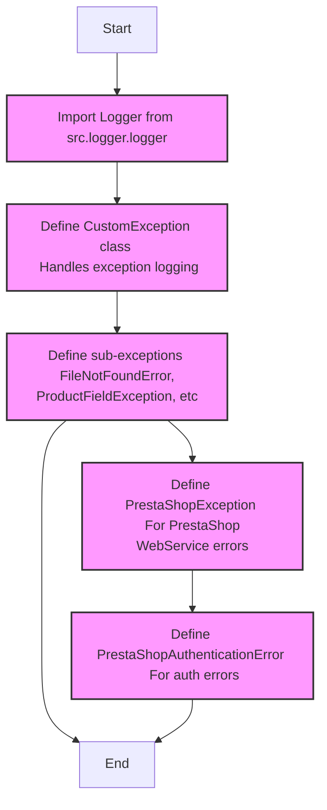

## ИНСТРУКЦИЯ:

Анализируй предоставленный код подробно и объясни его функциональность. Ответ должен включать три раздела:

1. **<алгоритм>**: Опиши рабочий процесс в виде пошаговой блок-схемы, включая примеры для каждого логического блока, и проиллюстрируй поток данных между функциями, классами или методами.
2. **<mermaid>**: Напиши код для диаграммы в формате `mermaid`, проанализируй и объясни все зависимости,
    которые импортируются при создании диаграммы.
    **ВАЖНО!** Убедитесь, что все имена переменных, используемые в диаграмме `mermaid`,
    имеют осмысленные и описательные имена. Имена переменных вроде `A`, `B`, `C`, и т.д., не допускаются!

    **Дополнительно**: Если в коде есть импорт `import header`, добавьте блок `mermaid` flowchart, объясняющий `header.py`:\
    ```mermaid
    flowchart TD
        Start --> Header[<code>header.py</code><br> Determine Project Root]

        Header --> import[Import Global Settings: <br><code>from src import gs</code>]
    ```

3. **<объяснение>**: Предоставьте подробные объяснения:
   - **Импорты**: Их назначение и взаимосвязь с другими пакетами `src.`.
   - **Классы**: Их роль, атрибуты, методы и взаимодействие с другими компонентами проекта.
   - **Функции**: Их аргументы, возвращаемые значения, назначение и примеры.
   - **Переменные**: Их типы и использование.
   - Выделите потенциальные ошибки или области для улучшения.

Дополнительно, постройте цепочку взаимосвязей с другими частями проекта (если применимо).

Это обеспечивает всесторонний и структурированный анализ кода.
## Формат ответа: `.md` (markdown)
**КОНЕЦ ИНСТРУКЦИИ**

```markdown
## <алгоритм>

### Общая схема работы модуля `exceptions.py`

1.  **Инициализация:**
    *   Задается переменная ``.
    *   Импортируются необходимые модули и классы:
        *   `Optional` из `typing` для указания необязательных типов.
        *   `logger` из `src.logger.logger` для логирования.
        *   `WebDriverException` из `selenium.common.exceptions` для обработки ошибок веб-драйвера.
        *   `CredentialsError`, `BinaryError`, `HeaderChecksumError`, `PayloadChecksumError`, `UnableToSendToRecycleBin` из `pykeepass.exceptions` для обработки ошибок KeePass.

2.  **Определение базового класса исключений `CustomException`:**
    *   Конструктор `__init__`:
        *   Принимает сообщение об ошибке `message` типа `str`, опциональное исключение `e` типа `Exception` и флаг `exc_info` типа `bool`.
        *   Вызывает конструктор родительского класса `Exception`.
        *   Сохраняет оригинальное исключение `e` в атрибуте `original_exception`.
        *   Сохраняет значение флага `exc_info` в атрибуте `exc_info`.
        *   Вызывает метод `handle_exception`.
        *   Пример: `CustomException("Файл не найден", FileNotFoundError("file.txt"))`
    *   Метод `handle_exception`:
        *   Логирует сообщение об ошибке с помощью `logger.error`.
        *   Если присутствует `original_exception`, логирует его с помощью `logger.debug`.
        *   Содержит закомментированную часть для логики восстановления.

3.  **Определение производных классов исключений:**
    *   `FileNotFoundError`: Наследуется от `CustomException` и `IOError`. Представляет ошибку отсутствия файла.
        *   Пример: `raise FileNotFoundError("Файл config.ini не найден")`
    *   `ProductFieldException`: Наследуется от `CustomException`. Представляет ошибки, связанные с полями продукта.
        *   Пример: `raise ProductFieldException("Неверный формат поля 'цена'")`
    *   `KeePassException`: Наследуется от нескольких исключений из `pykeepass.exceptions`. Представляет ошибки подключения к базе данных KeePass.
        *   Пример: `raise KeePassException("Ошибка чтения базы данных KeePass")`
    *   `DefaultSettingsException`: Наследуется от `CustomException`. Представляет ошибки, связанные с настройками по умолчанию.
        *   Пример: `raise DefaultSettingsException("Неверные настройки по умолчанию")`
    *   `WebDriverException`: Наследуется от `WDriverException` из `selenium.common.exceptions`. Представляет ошибки веб-драйвера.
        *   Пример: `raise WebDriverException("Не удалось найти элемент на странице")`
    *   `ExecuteLocatorException`: Наследуется от `CustomException`. Представляет ошибки исполнителя локаторов.
        *   Пример: `raise ExecuteLocatorException("Не удалось выполнить локатор")`

4.  **Определение класса исключений `PrestaShopException`:**
    *   Конструктор `__init__`:
        *   Принимает сообщение об ошибке `msg` типа `str`, опциональный код ошибки `error_code` типа `int`, сообщение об ошибке PrestaShop `ps_error_msg` типа `str` и опциональный код ошибки PrestaShop `ps_error_code` типа `int`.
        *   Сохраняет значения в атрибутах.
        *    Пример: `PrestaShopException("Ошибка PrestaShop", 500, "Internal Server Error", 500)`
    *   Метод `__str__`:
        *   Возвращает строковое представление ошибки PrestaShop или сообщения, если первое отсутствует.

5.  **Определение производного класса исключений `PrestaShopAuthenticationError`:**
    *   Наследуется от `PrestaShopException`. Представляет ошибки аутентификации PrestaShop (Unauthorized).
        *   Пример: `raise PrestaShopAuthenticationError("Ошибка аутентификации в PrestaShop")`

### Поток данных:

1.  Исключения возникают в различных частях кода.
2.  Если исключение является пользовательским, оно наследуется от `CustomException`.
3.  `CustomException` логирует ошибку с помощью `logger`.
4.  Исключения `PrestaShopException` и `PrestaShopAuthenticationError` не логируются напрямую через  `CustomException`, но могут быть обработаны другим способом.
5.  Обработка исключений выполняется в блоках `try...except`, где перехватываются и обрабатываются соответствующие типы исключений.

## <mermaid>

```mermaid
classDiagram
    class CustomException {
        -original_exception: Optional<Exception>
        -exc_info: bool
        +__init__(message: str, e: Optional<Exception], exc_info: bool)
        +handle_exception()
    }
    class FileNotFoundError {
        <<exception>>
    }
    class ProductFieldException {
        <<exception>>
    }
    class KeePassException {
        <<exception>>
    }
    class DefaultSettingsException {
      <<exception>>
    }
   class WebDriverException {
        <<exception>>
    }
    class ExecuteLocatorException {
        <<exception>>
    }
    class PrestaShopException {
        -msg: str
        -error_code: Optional<int>
        -ps_error_msg: str
        -ps_error_code: Optional<int>
        +__init__(msg: str, error_code: Optional<int], ps_error_msg: str, ps_error_code: Optional<int])
        +__str__()
    }
    class PrestaShopAuthenticationError {
       <<exception>>
    }

    CustomException <|-- FileNotFoundError
    CustomException <|-- ProductFieldException
    CustomException <|-- DefaultSettingsException
    CustomException <|-- ExecuteLocatorException
    PrestaShopException <|-- PrestaShopAuthenticationError
    KeePassException --|> CredentialsError
    KeePassException --|> BinaryError
    KeePassException --|> HeaderChecksumError
    KeePassException --|> PayloadChecksumError
    KeePassException --|> UnableToSendToRecycleBin
    WebDriverException --|> WDriverException
    CustomException <|-- ExecuteLocatorException
```

### Анализ зависимостей `mermaid`:

*   **`CustomException`**: Базовый класс для большинства пользовательских исключений. Он содержит общую логику для инициализации и обработки исключений, включая логирование.
    *   `original_exception`:  Хранит исходное исключение, если таковое имеется.
    *   `exc_info`:  Флаг, указывающий, нужно ли логировать информацию об исключении.
    *   `__init__`: Конструктор класса, инициализирует атрибуты и вызывает `handle_exception()`.
    *   `handle_exception`:  Метод, который логирует ошибку и исходное исключение (если оно есть) с использованием `logger`.
*   **`FileNotFoundError`**: Исключение, возникающее, когда файл не найден. Наследуется от `CustomException` и `IOError`.
*   **`ProductFieldException`**:  Исключение, возникающее при проблемах с полями продукта. Наследуется от `CustomException`.
*   **`KeePassException`**:  Исключение, связанное с ошибками при работе с KeePass. Наследуется от нескольких исключений из `pykeepass.exceptions`, что позволяет обрабатывать различные ошибки, связанные с KeePass.
    *   `CredentialsError`, `BinaryError`, `HeaderChecksumError`, `PayloadChecksumError`, `UnableToSendToRecycleBin`: Наследует от различных классов ошибок `pykeepass.exceptions`,  используются для специфичных ошибок.
*   **`DefaultSettingsException`**:  Исключение, возникающее при проблемах с настройками по умолчанию. Наследуется от `CustomException`.
*   **`WebDriverException`**:  Исключение, связанное с ошибками веб-драйвера. Наследуется от  `WDriverException` из `selenium.common.exceptions`.
*  **`ExecuteLocatorException`**: Исключение, связанное с ошибками при работе с локаторами. Наследуется от `CustomException`.
*   **`PrestaShopException`**: Базовый класс для ошибок PrestaShop.  Содержит специфичные атрибуты для ошибок PrestaShop.
    *   `msg`: Сообщение об ошибке.
    *   `error_code`:  Код ошибки.
    *   `ps_error_msg`:  Сообщение об ошибке от PrestaShop.
    *   `ps_error_code`: Код ошибки от PrestaShop.
    *   `__init__`:  Конструктор для инициализации атрибутов.
    *   `__str__`: Метод для строкового представления исключения.
*  **`PrestaShopAuthenticationError`**:  Исключение, возникающее при ошибках аутентификации в PrestaShop. Наследуется от `PrestaShopException`.
*  **Связи**:
    *   `CustomException` является базовым классом для исключений, связанных с общими ошибками приложения.
    *   `PrestaShopException` является базовым классом для исключений, связанных с PrestaShop.
    *   `KeePassException` объединяет специфические исключения `pykeepass.exceptions` для удобства использования.
    *   `WebDriverException` связан с исключениями `selenium.common.exceptions`.

## <объяснение>

### Импорты:

*   `from typing import Optional`: Импортирует `Optional` для указания необязательных типов. Это используется, например, в `CustomException` для `e: Optional[Exception]`, что означает, что исключение `e` может быть, а может и не быть передано.
*   `from src.logger.logger import logger`: Импортирует экземпляр логгера `logger` из модуля `src.logger.logger`. Этот логгер используется для записи информации об исключениях.
*   `from selenium.common.exceptions import WebDriverException as WDriverException`: Импортирует `WebDriverException` из пакета `selenium.common.exceptions` и переименовывает его в `WDriverException`. Это используется для обработки исключений, связанных с веб-драйвером.
*   `from pykeepass.exceptions import CredentialsError, BinaryError, HeaderChecksumError, PayloadChecksumError, UnableToSendToRecycleBin`: Импортирует специфичные исключения из пакета `pykeepass.exceptions`, связанные с ошибками при работе с базой данных KeePass.

### Классы:

1.  **`CustomException`**:
    *   **Роль**: Базовый класс для всех пользовательских исключений в приложении. Предоставляет общую функциональность для инициализации и логирования исключений.
    *   **Атрибуты**:
        *   `original_exception`: Содержит оригинальное исключение, если таковое имеется. Тип `Optional[Exception]`.
        *   `exc_info`: Флаг для указания, нужно ли логировать информацию об исключении. Тип `bool`.
    *   **Методы**:
        *   `__init__(self, message: str, e: Optional[Exception] = None, exc_info: bool = True)`: Конструктор, инициализирует атрибуты и вызывает `handle_exception`.
        *   `handle_exception(self)`: Логирует сообщение об ошибке и оригинальное исключение (если оно есть) с использованием `logger`.
    *   **Взаимодействие**: Используется как базовый класс для других исключений, обеспечивая общий механизм обработки и логирования.

2.  **`FileNotFoundError`**:
    *   **Роль**: Представляет ошибку отсутствия файла.
    *   **Атрибуты**: Нет дополнительных атрибутов.
    *   **Методы**: Нет дополнительных методов.
    *   **Взаимодействие**: Наследуется от `CustomException` и `IOError`, расширяя его поведение для конкретного случая.

3.  **`ProductFieldException`**:
    *   **Роль**: Представляет ошибки, связанные с полями продукта.
    *   **Атрибуты**: Нет дополнительных атрибутов.
    *   **Методы**: Нет дополнительных методов.
    *   **Взаимодействие**: Наследуется от `CustomException`, расширяя его поведение для конкретного случая.

4.  **`KeePassException`**:
    *   **Роль**: Представляет ошибки, связанные с подключением к KeePass.
    *   **Атрибуты**: Нет дополнительных атрибутов.
    *   **Методы**: Нет дополнительных методов.
    *   **Взаимодействие**: Наследуется от множества специфичных исключений `pykeepass.exceptions`, объединяя их для удобства использования.

5.  **`DefaultSettingsException`**:
    *  **Роль**: Представляет ошибки, связанные с настройками по умолчанию.
    *   **Атрибуты**: Нет дополнительных атрибутов.
    *   **Методы**: Нет дополнительных методов.
    *   **Взаимодействие**: Наследуется от `CustomException`, расширяя его поведение для конкретного случая.

6. **`WebDriverException`**:
     *   **Роль**: Представляет ошибки, связанные с веб-драйвером.
     *   **Атрибуты**: Нет дополнительных атрибутов.
     *   **Методы**: Нет дополнительных методов.
     *   **Взаимодействие**: Наследуется от `WDriverException` из `selenium.common.exceptions`, расширяя его поведение для конкретного случая.

7. **`ExecuteLocatorException`**:
    *   **Роль**: Представляет ошибки, связанные с работой с локаторами.
    *   **Атрибуты**: Нет дополнительных атрибутов.
    *   **Методы**: Нет дополнительных методов.
    *   **Взаимодействие**: Наследуется от `CustomException`, расширяя его поведение для конкретного случая.

8.  **`PrestaShopException`**:
    *   **Роль**: Базовый класс для ошибок PrestaShop WebService.
    *   **Атрибуты**:
        *   `msg`: Сообщение об ошибке. Тип `str`.
        *   `error_code`: Код ошибки. Тип `Optional[int]`.
        *   `ps_error_msg`: Сообщение об ошибке от PrestaShop. Тип `str`.
        *   `ps_error_code`: Код ошибки от PrestaShop. Тип `Optional[int]`.
    *   **Методы**:
        *   `__init__(self, msg: str, error_code: Optional[int] = None, ps_error_msg: str = '', ps_error_code: Optional[int] = None)`: Конструктор, инициализирует атрибуты.
        *   `__str__(self)`: Возвращает строковое представление ошибки PrestaShop или общего сообщения, если ps_error_msg отсутствует.
    *   **Взаимодействие**: Используется как базовый класс для специфичных ошибок PrestaShop.

9.  **`PrestaShopAuthenticationError`**:
    *   **Роль**: Представляет ошибки аутентификации PrestaShop.
    *   **Атрибуты**: Нет дополнительных атрибутов.
    *   **Методы**: Нет дополнительных методов.
    *   **Взаимодействие**: Наследуется от `PrestaShopException`, расширяя его поведение для конкретного случая.

### Переменные:

*   ``: Глобальная переменная, определяющая режим работы приложения.  Может использоваться для переключения между режимами разработки и продакшена (но не используется в данном коде).

### Функции:

*   В данном коде нет явных функций, кроме методов классов.

### Потенциальные ошибки и области для улучшения:

*   **Отсутствие обработки исключений на верхнем уровне**: Код определяет исключения, но не показывает, как и где они перехватываются и обрабатываются. Нужно гарантировать, что в других частях приложения, где эти исключения могут быть вызваны, существуют блоки `try-except`, корректно обрабатывающие их.
*   **Жесткая привязка к `logger`**:  Использование `logger` прямо в методе `handle_exception` делает класс `CustomException` зависимым от конкретной реализации логирования. Можно рассмотреть возможность передачи логгера через параметр, чтобы класс стал более гибким.
*   **Не все исключения логируются**: `PrestaShopException` и `PrestaShopAuthenticationError` не используют механизм логирования `CustomException`. Возможно, следует пересмотреть архитектуру или добавить логику для их логирования.
*   **Закомментированный код в `handle_exception`**: Нужно либо реализовать логику восстановления (например, повторные попытки), либо удалить закомментированный код.
*   **Отсутствие документации для специфичных ошибок KeePass**: `KeePassException` наследуется от нескольких исключений, но нет явного указания, когда какое исключение вызывается. Это может затруднить понимание и обработку ошибок в других частях приложения.
*   **Отсутствие конкретных примеров использования исключений**: В коде описаны классы исключений, но нет примеров, как и когда они должны быть использованы в других модулях.
*   **Отсутствие обработки ошибок в `PrestaShopException`**: Хотя код и предоставляет методы для форматирования сообщений об ошибках, отсутствует обработка данных ошибок, получаемых из PrestaShop API.
*   **Режим `dev`**: Глобальная переменная `MODE` установлена в `'dev'`, но не используется нигде в данном коде. Возможно, это задел на будущее использование, но в текущем виде это просто лишняя переменная.

### Цепочка взаимосвязей с другими частями проекта:

1.  **`src.logger.logger`**: Модуль `exceptions.py` напрямую зависит от модуля `src.logger.logger` для логирования ошибок. Это означает, что если модуль логирования не работает, то ошибки в `exceptions.py` не будут логироваться, что критично для отладки и мониторинга приложения.
2. **Другие модули** : Остальные модули, использующие классы исключений, будут зависеть от этого модуля. Например, модули, работающие с PrestaShop, будут использовать `PrestaShopException` и `PrestaShopAuthenticationError`. Модули, которые работают с файлами, будут использовать `FileNotFoundError`, и т.д.
3. **`selenium.common.exceptions`**: При возникновении ошибок при работе с веб-драйвером, будет использоваться  `WebDriverException`.
4.  **`pykeepass.exceptions`**: При возникновении ошибок при работе с базой данных `KeePass`, будет использоваться `KeePassException`.

Таким образом, модуль `exceptions.py` является важной частью системы обработки ошибок в приложении и имеет взаимосвязи с модулями логирования, веб-драйвера, KeePass и другими частями проекта, которые могут вызывать эти исключения.

**Дополнительно**:

Примеры использования исключений в других частях проекта:
* В модуле работы с PrestaShop API:
```python
    try:
        # Код взаимодействия с PrestaShop API
        pass
    except PrestaShopAuthenticationError as e:
        logger.error(f"Ошибка аутентификации PrestaShop: {e}")
    except PrestaShopException as e:
        logger.error(f"Ошибка PrestaShop: {e}, код ошибки: {e.error_code}, ps_error_msg: {e.ps_error_msg}, ps_error_code: {e.ps_error_code}")
```
* В модуле обработки настроек:
```python
    try:
        # Код загрузки настроек
        pass
    except DefaultSettingsException as e:
         logger.error(f"Ошибка настроек по умолчанию: {e}")

```
* В модуле загрузки файла:
```python
    try:
        with open("config.ini", "r") as f:
             # Код загрузки файла
             pass
    except FileNotFoundError as e:
        logger.error(f"Файл не найден: {e}")
```
