## hypotez/src/logger/exceptions.py

### <алгоритм>

1.  **Инициализация:**
    *   Модуль начинается с определения переменной `MODE = 'dev'`, которая, вероятно, используется для настройки поведения приложения в зависимости от режима работы (разработка, продакшн и т.д.).
    *   Импортируются необходимые модули: `typing.Optional`, `src.logger.logger.logger` (для логирования), `selenium.common.exceptions.WebDriverException` (для ошибок веб-драйвера), и различные исключения из `pykeepass.exceptions`.
2.  **`CustomException` Класс:**
    *   Базовый класс для всех пользовательских исключений. Принимает сообщение об ошибке, опциональное оригинальное исключение и флаг `exc_info`.
    *   Метод `__init__`: Инициализирует атрибуты экземпляра, включая сообщение об ошибке (`message`), оригинальное исключение (`original_exception`) и флаг для логирования информации об исключении (`exc_info`). Вызывает метод `handle_exception`.
        *   *Пример*: `CustomException("Something went wrong", ValueError("Invalid value"), exc_info=True)`
    *   Метод `handle_exception`: Логирует сообщение об ошибке и оригинальное исключение (если оно есть) с помощью логгера.
        *   *Пример*: Если `handle_exception` вызывается с `CustomException("Test Error", ValueError("Test value"))`, то в лог будет записано сообщение "Exception occurred: Test Error" и "Original exception: Test value".
3.  **Производные классы от `CustomException`:**
    *   `FileNotFoundError`: Выбрасывается, когда файл не найден.
        *   *Пример*: `raise FileNotFoundError("File not found", FileNotFoundError("File 'test.txt' not found"))`
    *   `ProductFieldException`: Выбрасывается при ошибках с полями продукта.
        *   *Пример*: `raise ProductFieldException("Invalid product field", KeyError("Product field 'name' not found"))`
    *   `DefaultSettingsException`: Выбрасывается при ошибках с настройками по умолчанию.
        *   *Пример*: `raise DefaultSettingsException("Default settings error", ValueError("Invalid settings format"))`
    *   `ExecuteLocatorException`: Выбрасывается при ошибках с локаторами.
        *   *Пример*: `raise ExecuteLocatorException("Locator execution error", TimeoutError("Timeout waiting for element"))`
4.  **`KeePassException` Класс:**
    *   Представляет ошибки, связанные с KeePass. Наследует исключения из `pykeepass.exceptions`.
        *   *Пример*: `raise KeePassException("KeePass error")`
5.  **`WebDriverException` Класс:**
    *   Представляет ошибки, связанные с веб-драйвером. Наследует `selenium.common.exceptions.WebDriverException`.
        *   *Пример*: `raise WebDriverException("WebDriver error")`
6.  **`PrestaShopException` Класс:**
    *   Базовый класс для ошибок PrestaShop WebService. Принимает сообщение об ошибке, код ошибки, сообщение и код ошибки от PrestaShop.
    *   Метод `__init__`: Инициализирует атрибуты экземпляра, такие как `msg` (сообщение об ошибке), `error_code`, `ps_error_msg` (сообщение об ошибке PrestaShop) и `ps_error_code` (код ошибки PrestaShop).
        *   *Пример*: `PrestaShopException("Error connecting to PrestaShop", error_code=500, ps_error_msg="Database error", ps_error_code=101)`
    *   Метод `__str__`: Возвращает строковое представление объекта ошибки, приоритетно используя сообщение PrestaShop, если оно есть, или общее сообщение об ошибке.
        *   *Пример*: Если `PrestaShopException("General error", ps_error_msg="API error")` создается, то `str(instance)` вернет 'API error'.
7.  **`PrestaShopAuthenticationError` Класс:**
    *   Выбрасывается при ошибках аутентификации PrestaShop. Наследует `PrestaShopException`.
        *   *Пример*: `raise PrestaShopAuthenticationError("Authentication failed", error_code=401, ps_error_msg="Invalid credentials")`

```mermaid
classDiagram
    class CustomException {
        -original_exception: Optional<Exception>
        -exc_info: bool
        +__init__(message: str, e: Optional<Exception>, exc_info: bool)
        +handle_exception()
    }

    class FileNotFoundError {
    }

    class ProductFieldException {
    }

    class KeePassException {
    }

   class DefaultSettingsException {
    }
    class WebDriverException {
    }
   class ExecuteLocatorException {
    }


    class PrestaShopException {
       -msg: str
       -error_code: Optional<int>
       -ps_error_msg: str
       -ps_error_code: Optional<int>
       +__init__(msg: str, error_code: Optional<int>, ps_error_msg: str, ps_error_code: Optional<int>)
       +__str__()
    }

    class PrestaShopAuthenticationError {
    }

    CustomException <|-- FileNotFoundError
    CustomException <|-- ProductFieldException
     CustomException <|-- DefaultSettingsException
    CustomException <|-- ExecuteLocatorException
    PrestaShopException <|-- PrestaShopAuthenticationError
    
    CredentialsError <|-- KeePassException
    BinaryError <|-- KeePassException
    HeaderChecksumError <|-- KeePassException
    PayloadChecksumError <|-- KeePassException
    UnableToSendToRecycleBin <|-- KeePassException
    WDriverException <|-- WebDriverException
    IOError <|-- FileNotFoundError
```

### <mermaid>

**Объяснение диаграммы:**

*   **`CustomException`**: Это базовый класс для всех пользовательских исключений в проекте. Он имеет атрибуты `original_exception` (опциональное оригинальное исключение) и `exc_info` (флаг для логирования информации об исключении), а также методы для инициализации и обработки исключений.
*   **`FileNotFoundError`, `ProductFieldException`, `DefaultSettingsException`, `ExecuteLocatorException`**: Эти классы наследуют `CustomException` и представляют конкретные типы исключений, которые могут возникнуть в разных частях приложения. `FileNotFoundError` так же наследуется от `IOError`.
*   **`KeePassException`**: Этот класс представляет собой объединение различных исключений из библиотеки `pykeepass`, связанные с проблемами при работе с базой данных KeePass. Он наследует `CredentialsError`, `BinaryError`, `HeaderChecksumError`, `PayloadChecksumError`, `UnableToSendToRecycleBin` из `pykeepass.exceptions`.
*   **`WebDriverException`**: Этот класс представляет собой исключение, возникающее при работе с WebDriver. Он наследует `WDriverException` из `selenium.common.exceptions`.
*  **`PrestaShopException`**: Это базовый класс для исключений, связанных с API PrestaShop. Он имеет атрибуты для хранения сообщения об ошибке, кода ошибки, сообщения об ошибке PrestaShop и кода ошибки PrestaShop. А так же методы инициализации и строкового представления исключения.
*  **`PrestaShopAuthenticationError`**: Этот класс наследует `PrestaShopException` и представляет исключение, которое выбрасывается при ошибках аутентификации с PrestaShop API.
*   **Стрелки `<|--`**:  Указывают на отношение наследования. Например, `FileNotFoundError <|-- CustomException` означает, что `FileNotFoundError` наследует от `CustomException`.
* **Зависимости (Импорты):**
    *   `src.logger.logger`: Используется для логирования ошибок. Зависимость от `src.logger`, так как `src.logger.logger` используется для записи информации об ошибках.
    *   `selenium.common.exceptions`: Используется для обработки ошибок веб-драйвера (связь с библиотекой `selenium`).
    *   `pykeepass.exceptions`: Используется для обработки ошибок при работе с базами данных KeePass.

### <объяснение>

**Импорты:**

*   `typing.Optional`: Используется для обозначения типов переменных, которые могут иметь значение `None`. Это улучшает читаемость кода и помогает в статической типизации.
*   `src.logger.logger`: Импортирует логгер из модуля `src.logger.logger`. Этот логгер используется для записи сообщений об ошибках и отладочной информации.
*   `selenium.common.exceptions.WebDriverException as WDriverException`: Импортирует исключение `WebDriverException` из библиотеки `selenium` для обработки ошибок, связанных с веб-драйверами. Псевдоним `WDriverException` используется для избежания конфликтов имен.
*   `pykeepass.exceptions`: Импортирует несколько исключений из библиотеки `pykeepass`, которые используются для обработки ошибок, возникающих при работе с базами данных KeePass (например, проблемы с аутентификацией, проблемы с бинарными данными и т.д.). Зависит от сторонней библиотеки `pykeepass`.

**Переменные:**

*   `MODE`: Глобальная переменная, установленная в `'dev'`. Предположительно, используется для определения режима работы приложения (разработка или продакшн), что может влиять на поведение логгера, обработку ошибок и т.д.

**Классы:**

*   **`CustomException`**:
    *   **Роль**: Базовый класс для всех пользовательских исключений в приложении. Он обеспечивает механизм для логирования ошибок и обработки исходных исключений.
    *   **Атрибуты**:
        *   `original_exception`: Сохраняет исходное исключение, если оно есть (типа `Optional[Exception]`).
        *   `exc_info`: Флаг типа `bool`, определяющий, следует ли логировать подробную информацию об исключении.
    *   **Методы**:
        *   `__init__(self, message: str, e: Optional[Exception] = None, exc_info: bool = True)`: Конструктор класса, принимающий сообщение об ошибке (`message`), исходное исключение (`e`) и флаг `exc_info`. Инициализирует атрибуты и вызывает `handle_exception`.
        *   `handle_exception(self)`: Логирует сообщение об ошибке и исходное исключение (если есть), используя логгер `logger.error` и `logger.debug`.
    *   **Взаимодействие**: Этот класс служит базой для других пользовательских исключений, которые наследуют его поведение логирования.
*   **`FileNotFoundError`**:
    *   **Роль**: Представляет исключение, возникающее, когда файл не найден.
    *   **Взаимодействие**: Наследует `CustomException` и `IOError`, что позволяет ему использовать логику базового класса и быть совместимым с проверками `IOError`.
*    **`ProductFieldException`**:
    *    **Роль**: Представляет исключение, связанное с ошибками в полях продукта.
    *    **Взаимодействие**: Наследует `CustomException`, используя его механизм логирования.
*    **`KeePassException`**:
    *   **Роль**: Представляет собой агрегат исключений, связанных с KeePass, объединяя ошибки аутентификации, бинарные ошибки, ошибки контрольных сумм и т.д.
    *   **Взаимодействие**: Наследует сразу несколько исключений из `pykeepass.exceptions`, что позволяет обрабатывать разные типы ошибок KeePass.
*   **`DefaultSettingsException`**:
    *   **Роль**: Представляет исключение, возникающее при проблемах с настройками по умолчанию.
    *   **Взаимодействие**: Наследует `CustomException`, используя его механизм логирования.
*    **`WebDriverException`**:
    *    **Роль**: Представляет исключение, связанное с ошибками WebDriver.
    *   **Взаимодействие**: Наследует `WDriverException` из `selenium.common.exceptions`, перенося исключение из `selenium`.
*    **`ExecuteLocatorException`**:
    *    **Роль**: Представляет исключение, связанное с ошибками локаторов.
    *    **Взаимодействие**: Наследует `CustomException`, используя его механизм логирования.
*   **`PrestaShopException`**:
    *   **Роль**: Базовый класс для исключений, связанных с PrestaShop WebService.
    *   **Атрибуты**:
        *   `msg`: Сообщение об ошибке.
        *   `error_code`: Код ошибки, если есть.
        *   `ps_error_msg`: Сообщение об ошибке от PrestaShop.
        *   `ps_error_code`: Код ошибки от PrestaShop.
    *   **Методы**:
        *   `__init__(self, msg: str, error_code: Optional[int] = None, ps_error_msg: str = '', ps_error_code: Optional[int] = None)`: Конструктор, инициализирующий атрибуты.
        *   `__str__(self)`: Возвращает строковое представление ошибки (сообщение PrestaShop или общее сообщение, если PrestaShop отсутствует).
    *   **Взаимодействие**: Используется как базовый класс для более специфичных исключений PrestaShop.
*   **`PrestaShopAuthenticationError`**:
    *   **Роль**: Исключение, возникающее при ошибках аутентификации PrestaShop.
    *   **Взаимодействие**: Наследует `PrestaShopException`, что позволяет использовать его структуру и атрибуты для ошибок аутентификации.

**Функции:**

*   `__init__` методы классов: Конструкторы классов для инициализации их атрибутов.
*   `handle_exception` (метод в `CustomException`): Обрабатывает и логирует исключения.
*   `__str__` (метод в `PrestaShopException`): Возвращает строковое представление объекта исключения.

**Потенциальные ошибки и области для улучшения:**

*   **Жестко закодированный режим `MODE = 'dev'`**: Режим работы приложения должен задаваться через конфигурационный файл или переменные окружения, чтобы можно было легко переключаться между режимами.
*   **Обработка `CustomException`**: В методе `handle_exception` отсутствует логика восстановления после ошибки. В реальных приложениях сюда нужно добавить логику повторных попыток, отката транзакций или другие механизмы обработки.
*   **Отсутствие конкретных сообщений об ошибках**:  Классы исключений, производные от `CustomException`, не имеют собственной логики сообщений. Было бы полезно добавлять более конкретные сообщения в конструкторы этих классов.

**Цепочка взаимосвязей с другими частями проекта:**

1.  **`src.logger.logger`**: Логгер используется во всех пользовательских исключениях, что позволяет отслеживать ошибки.
2.  **`selenium`**: `WebDriverException` используется для обработки ошибок веб-драйвера.
3.  **`pykeepass`**: `KeePassException` обрабатывает ошибки, связанные с базами данных KeePass.
4. **`PrestaShop`**: `PrestaShopException` и `PrestaShopAuthenticationError` обрабатывают ошибки, связанные с взаимодействием с PrestaShop WebService.

**Общее назначение модуля:**

Модуль `exceptions.py` предоставляет набор пользовательских исключений для различных компонентов приложения. Эти исключения позволяют обрабатывать ошибки более структурировано, с возможностью логирования и, в дальнейшем, возможной обработки ошибок. Этот подход помогает сделать приложение более надежным и удобным для отладки.