## Анализ кода `src/logger/exceptions.py`

### 1. <алгоритм>

**Общая логика:**
Модуль определяет иерархию пользовательских исключений, используемых в приложении. `CustomException` является базовым классом, который обрабатывает логирование ошибок. Другие классы исключений наследуются от `CustomException` или других стандартных исключений, адаптируя их под конкретные ситуации (ошибки ввода/вывода, проблемы с продуктами, KeePass, WebDriver, PrestaShop и т.д.).

**Блок-схема:**

```mermaid
graph LR
    A[Start] --> B(CustomException.__init__);
    B --> C{e is None?};
    C -- Yes --> D[Log: "Exception occurred: {self}"];
    C -- No --> E[Log: "Exception occurred: {self}"];
    E --> F[Log: "Original exception: {e}"];
    D --> G(CustomException.handle_exception);
    F --> G;
    G --> H[End];

    I[Raise FileNotFoundError] --> J(CustomException.__init__);
    J --> K(CustomException.handle_exception)
    K --> L[End];
    
    M[Raise ProductFieldException] --> N(CustomException.__init__);
    N --> O(CustomException.handle_exception);
    O --> P[End];
    
    Q[Raise KeePassException] --> R(KeePassError.__init__);
    R --> S[End];
    
    T[Raise DefaultSettingsException] --> U(CustomException.__init__);
    U --> V(CustomException.handle_exception);
    V --> W[End];
    
    X[Raise WebDriverException] --> Y(WebDriverException.__init__);
    Y --> Z[End];
    
     A1[Raise ExecuteLocatorException] --> A2(CustomException.__init__);
    A2 --> A3(CustomException.handle_exception);
    A3 --> A4[End];
    
    B1[Raise PrestaShopException] --> B2(PrestaShopException.__init__);
    B2 --> B3[End];
    
    C1[Raise PrestaShopAuthenticationError] --> C2(PrestaShopException.__init__);
    C2 --> C3[End];
    
    style A fill:#f9f,stroke:#333,stroke-width:2px
    style H fill:#ccf,stroke:#333,stroke-width:2px
     style L fill:#ccf,stroke:#333,stroke-width:2px
     style P fill:#ccf,stroke:#333,stroke-width:2px
     style S fill:#ccf,stroke:#333,stroke-width:2px
     style W fill:#ccf,stroke:#333,stroke-width:2px
     style Z fill:#ccf,stroke:#333,stroke-width:2px
    style A4 fill:#ccf,stroke:#333,stroke-width:2px
     style B3 fill:#ccf,stroke:#333,stroke-width:2px
     style C3 fill:#ccf,stroke:#333,stroke-width:2px
```

**Примеры:**

*   **`CustomException`**: Когда возникает общая ошибка, не связанная с конкретным типом, создается экземпляр `CustomException` с сообщением и, возможно, оригинальным исключением.
    ```python
    try:
        # Some code that might fail
        raise ValueError("Invalid value")
    except ValueError as e:
        raise CustomException("Failed to process value", e)
    ```

*   **`FileNotFoundError`**: Когда файл не найден, создается экземпляр `FileNotFoundError`.
    ```python
    try:
        with open("nonexistent_file.txt", "r") as f:
            pass
    except FileNotFoundError as e:
        raise FileNotFoundError("File not found", e)
    ```

*   **`PrestaShopException`**:  Когда возникает ошибка при взаимодействии с PrestaShop API, создается экземпляр `PrestaShopException` с деталями ошибки.
     ```python
     try:
        # Some code that might fail with PrestaShop
        raise Exception("PrestaShop Error", 500, "Invalid data", 1002)
     except Exception as e:
       raise PrestaShopException(msg="Error from PrestaShop API", ps_error_msg="Invalid data", ps_error_code=1002, error_code=500)
    ```

### 2. <mermaid>



```mermaid
classDiagram
    class CustomException {
        -original_exception: Optional[Exception]
        -exc_info: bool
        +__init__(message: str, e: Optional[Exception], exc_info: bool)
        +handle_exception()
    }
    class FileNotFoundError {
    }
    class ProductFieldException {
    }
    class KeePassException {
    }
     class DefaultSettingsException {
    }
    class WebDriverException {
    }
    class ExecuteLocatorException {
    }
    class PrestaShopException {
       -msg: str
        -error_code: Optional[int]
        -ps_error_msg: str
        -ps_error_code: Optional[int]
        +__init__(msg: str, error_code: Optional[int], ps_error_msg: str, ps_error_code: Optional[int])
        +__str__()
    }
    class PrestaShopAuthenticationError {
    }
    
    CustomException <|-- FileNotFoundError
    CustomException <|-- ProductFieldException
    CustomException <|-- DefaultSettingsException
    CustomException <|-- ExecuteLocatorException
    PrestaShopException <|-- PrestaShopAuthenticationError
    
    KeePassException --|> CredentialsError
    KeePassException --|> BinaryError
    KeePassException --|> HeaderChecksumError
    KeePassException --|> PayloadChecksumError
    KeePassException --|> UnableToSendToRecycleBin
    
    WebDriverException --|> WDriverException

    
    
    
    class CredentialsError{
    }
    class BinaryError{
    }
    class HeaderChecksumError{
    }
    class PayloadChecksumError{
    }
    class UnableToSendToRecycleBin{
    }
     class WDriverException{
    }

```

**Анализ зависимостей:**

*   **`CustomException`**:
    *   Это базовый класс для большинства пользовательских исключений в модуле.
    *   Он имеет атрибуты для хранения исходного исключения (`original_exception`) и флага для информации об исключении (`exc_info`).
    *   Метод `__init__` инициализирует объект, вызывая конструктор родительского класса `Exception`.
    *   Метод `handle_exception` регистрирует ошибку и исходное исключение, если оно существует.
*   **`FileNotFoundError`**: Наследуется от `CustomException` и `IOError`, используется для ошибок, связанных с файлами.
*   **`ProductFieldException`**: Наследуется от `CustomException`, используется для ошибок, связанных с полями продукта.
*  **`KeePassException`**: Наследуется от нескольких исключений из библиотеки `pykeepass` для обработки ошибок, связанных с KeePass.
*  **`DefaultSettingsException`**: Наследуется от `CustomException`, используется для ошибок, связанных с настройками по умолчанию.
*   **`WebDriverException`**: Наследуется от `selenium.common.exceptions.WebDriverException`, используется для ошибок, связанных с Selenium WebDriver.
*   **`ExecuteLocatorException`**: Наследуется от `CustomException`, используется для ошибок, связанных с выполнением локаторов.
*   **`PrestaShopException`**:
    *   Наследуется от `Exception`.
    *   Содержит атрибуты для хранения сообщения об ошибке, кода ошибки и деталей ошибки PrestaShop.
    *   Метод `__str__` возвращает читаемое представление ошибки.
*   **`PrestaShopAuthenticationError`**: Наследуется от `PrestaShopException`, используется для ошибок аутентификации PrestaShop.

### 3. <объяснение>

**Импорты:**

*   `from typing import Optional`: Импортирует `Optional` для указания, что переменная может быть либо определенного типа, либо `None`.
*   `from src.logger.logger import logger`: Импортирует объект логгера из модуля `src.logger.logger`.
*    `from selenium.common.exceptions import WebDriverException as WDriverException`: Импортирует исключение `WebDriverException` из библиотеки `selenium`, переименовывая его в `WDriverException`
*   `from pykeepass.exceptions import ...`: Импортирует несколько исключений из библиотеки `pykeepass` для обработки ошибок, связанных с KeePass.

**Классы:**

*   **`CustomException`**:
    *   **Роль**: Базовый класс для всех пользовательских исключений.
    *   **Атрибуты**:
        *   `original_exception`:  Хранит оригинальное исключение, которое вызвало текущее, если оно есть.
        *   `exc_info`:  Флаг, указывающий, нужно ли логировать информацию об исключении.
    *   **Методы**:
        *   `__init__(self, message: str, e: Optional[Exception] = None, exc_info: bool = True)`: Инициализирует исключение, принимая сообщение, оригинальное исключение (необязательно) и флаг логирования.
        *   `handle_exception(self)`: Обрабатывает исключение, записывая сообщение об ошибке в лог и, если доступно, оригинальное исключение.
    *   **Взаимодействие**:  Используется как родительский класс для других пользовательских исключений, обеспечивая общую логику логирования.

*   **`FileNotFoundError`**:
    *   **Роль**: Исключение для ошибок, когда файл не найден.
    *   **Наследование**: Наследуется от `CustomException` и `IOError`.
    *   **Взаимодействие**:  Используется в коде, где выполняются файловые операции, для обработки ситуаций, когда файл не может быть открыт.

*   **`ProductFieldException`**:
    *   **Роль**: Исключение для ошибок, связанных с полями продукта.
    *   **Наследование**: Наследуется от `CustomException`.
    *   **Взаимодействие**:  Используется в коде, где обрабатываются данные продуктов.

*    **`KeePassException`**:
    *   **Роль**: Исключение для ошибок, связанных с KeePass.
    *   **Наследование**: Наследуется от нескольких классов исключений библиотеки `pykeepass`.
    *   **Взаимодействие**:  Используется в коде, где происходит взаимодействие с базой данных KeePass, для обработки ошибок аутентификации, бинарных данных, и проблем с хеш-суммами заголовков и полезной нагрузки.

*    **`DefaultSettingsException`**:
    *   **Роль**: Исключение для ошибок, связанных с настройками по умолчанию.
    *   **Наследование**: Наследуется от `CustomException`.
    *   **Взаимодействие**:  Используется в коде, где проверяются настройки по умолчанию.

*   **`WebDriverException`**:
    *   **Роль**: Исключение для ошибок, связанных с Selenium WebDriver.
    *   **Наследование**: Наследуется от `WDriverException` (переименованный импорт).
    *   **Взаимодействие**:  Используется в коде, который управляет браузерами через Selenium, для обработки ошибок, связанных с веб-драйвером.

*   **`ExecuteLocatorException`**:
    *   **Роль**: Исключение для ошибок, связанных с выполнением локаторов.
    *   **Наследование**: Наследуется от `CustomException`.
    *   **Взаимодействие**:  Используется в коде, где динамически выполняются локаторы элементов.

*   **`PrestaShopException`**:
    *   **Роль**: Базовое исключение для ошибок, связанных с PrestaShop.
    *   **Атрибуты**:
        *   `msg`: Сообщение об ошибке.
        *   `error_code`: Код ошибки.
        *   `ps_error_msg`: Сообщение об ошибке PrestaShop.
        *   `ps_error_code`: Код ошибки PrestaShop.
    *   **Методы**:
        *   `__init__(self, msg: str, error_code: Optional[int] = None, ps_error_msg: str = '', ps_error_code: Optional[int] = None)`: Инициализирует исключение.
        *   `__str__(self)`: Возвращает сообщение об ошибке или сообщение от PrestaShop.
    *   **Взаимодействие**:  Используется как базовое исключение для ошибок PrestaShop, от которого наследуются более специализированные исключения.

*   **`PrestaShopAuthenticationError`**:
    *   **Роль**: Исключение для ошибок аутентификации PrestaShop.
    *   **Наследование**: Наследуется от `PrestaShopException`.
    *   **Взаимодействие**:  Используется, когда ошибка аутентификации при работе с PrestaShop API.

**Переменные**:

*   В основном используются локальные переменные внутри методов, такие как `message`, `e` в `CustomException.__init__` или `msg`, `error_code`, `ps_error_msg`, `ps_error_code` в `PrestaShopException.__init__`.

**Потенциальные ошибки и улучшения**:

1.  **Логирование `exc_info`**: В `CustomException` есть атрибут `exc_info`, но он нигде не используется в методе `handle_exception`. Можно добавить `logger.exception(f"Exception occurred: {self}", exc_info=self.exc_info)` чтобы использовать этот флаг.
2.  **Обработка исключений**: В `handle_exception` есть комментарий: `# Add recovery logic, retries, or other handling as necessary.`. Это место можно расширить для добавления логики восстановления после ошибки.
3.  **Типизация**: Можно использовать более конкретные типы для `error_code` и `ps_error_code` в `PrestaShopException`, например, `int` вместо `Optional[int]`, если они всегда должны быть целыми числами, когда присутствуют.
4.  **Сообщения об ошибках**: Сообщения об ошибках (в исключениях) могут быть более информативными для разработчика, например, включать имя файла или поля, вызвавшие ошибку.

**Взаимосвязь с другими частями проекта:**

*   **`src.logger.logger`**: Используется для логирования ошибок. Все пользовательские исключения используют этот модуль для записи своих ошибок, что обеспечивает централизованное логирование.
*   **`src`**: Так как этот модуль находится внутри `src`, он предназначен для работы с другими модулями пакета. Эти исключения могут использоваться в любом модуле, который может вызвать ошибку.
*   **`selenium`**: `WebDriverException` используется при работе с Selenium.
*   **`pykeepass`**: `KeePassException` используется для обработки ошибок при работе с базой данных KeePass.
*   **PrestaShop API**:  `PrestaShopException` и `PrestaShopAuthenticationError` используются при работе с PrestaShop API.

Таким образом, модуль `src/logger/exceptions.py` является важной частью инфраструктуры обработки ошибок в проекте, обеспечивая стандартизированный способ создания и обработки исключений с возможностью логирования.