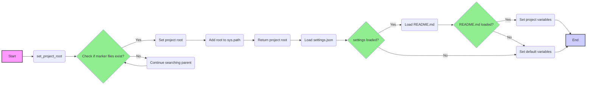

## Анализ кода `hypotez/src/logger/header.py`

### 1. `<алгоритм>`

**1. Определение корня проекта (`set_project_root`)**

   - **Вход:** `marker_files` (кортеж строк - имена файлов/папок, которые сигнализируют о корне проекта). По умолчанию `('pyproject.toml', 'requirements.txt', '.git')`.
   - **Инициализация:**
      - `current_path` - путь к директории, в которой находится текущий файл `header.py`.
      - `__root__` - инициализируется как `current_path`.
   - **Поиск корня проекта:**
      - Цикл по родительским директориям `current_path`:
         - Для каждой родительской директории проверяется, существует ли в ней какой-либо из файлов/папок из `marker_files`.
         - Если существует, то родительская директория становится новым корнем проекта `__root__`. Выход из цикла.
   - **Добавление корня проекта в `sys.path`:**
      - Если корень проекта `__root__` отсутствует в `sys.path`, то он добавляется в начало списка путей.
   - **Выход:** Возвращается `__root__` - путь к корню проекта.

   _Пример:_
   ```
   marker_files = ('pyproject.toml', 'requirements.txt', '.git')
   # Пусть текущий файл находится в /project/src/logger/header.py
   # Функция начнет поиск с /project/src/logger, /project/src, /project
   # Предположим, что /project/pyproject.toml существует
   # Тогда __root__ будет /project
   # __root__ добавляется в sys.path, если его там нет.
   # Функция вернет Path('/project')
   ```

**2. Инициализация переменных проекта**

   - **Получение корня проекта:** Вызывается функция `set_project_root()`, результат записывается в переменную `__root__`.
   - **Загрузка настроек из `settings.json`:**
     - Пытается открыть и загрузить JSON-файл `/src/settings.json` (относительно корня проекта) в словарь `settings`.
     - Если файл не найден или JSON не валиден, присваивается `settings=None`, и программа продолжает работу.
   - **Загрузка документации из `README.MD`:**
     - Пытается открыть и прочитать содержимое файла `/src/README.MD` (относительно корня проекта) в строку `doc_str`.
     - Если файл не найден или возникла ошибка, присваивается `doc_str=None`, и программа продолжает работу.
   - **Инициализация переменных:**
     - `__project_name__`: Если `settings` есть, берет значение ключа `project_name`, иначе `'hypotez'`.
     - `__version__`: Если `settings` есть, берет значение ключа `version`, иначе `''`.
     - `__doc__`: Если `doc_str` не пустая, берет `doc_str`, иначе `''`.
     - `__details__`: Инициализируется пустой строкой `''`.
     - `__author__`: Если `settings` есть, берет значение ключа `author`, иначе `''`.
     - `__copyright__`: Если `settings` есть, берет значение ключа `copyrihgnt`, иначе `''`.
     - `__cofee__`: Если `settings` есть, берет значение ключа `cofee`, иначе "Treat the developer to a cup of coffee for boosting enthusiasm in development: https://boosty.to/hypo69".

   _Пример:_
     ```
     # Пусть __root__ = Path('/project')
     # Предположим, что /project/src/settings.json содержит:
     # {
     #    "project_name": "MyProject",
     #    "version": "1.2.3",
     #    "author": "John Doe"
     # }
     # и /project/src/README.MD содержит:
     # # My Project
     # This is a project description
     #
     # Тогда:
     # __project_name__ = "MyProject"
     # __version__ = "1.2.3"
     # __doc__ = "# My Project\nThis is a project description"
     # __details__ = ''
     # __author__ = "John Doe"
     # __copyright__ = ''
     # __cofee__ = "Treat the developer to a cup of coffee for boosting enthusiasm in development: https://boosty.to/hypo69"
     ```

### 2. `<mermaid>`



**Объяснение диаграммы:**

- **`A[Start]`**: Начало выполнения скрипта.
- **`B(set_project_root)`**: Вызов функции `set_project_root()`.
- **`C{Check if marker files exist?}`**: Проверка наличия маркерных файлов в текущей директории или ее родительских директориях.
- **`D(Set project root)`**: Установка текущей директории как корня проекта.
- **`E(Continue searching parent)`**: Переход к родительской директории.
- **`F(Add root to sys.path)`**: Добавление пути к корню проекта в `sys.path` для корректной работы импортов.
- **`G(Return project root)`**: Возврат корня проекта.
- **`H(Load settings.json)`**: Попытка загрузки `settings.json`.
- **`I{settings loaded?}`**: Проверка успешности загрузки `settings.json`.
- **`J(Load README.md)`**: Попытка загрузки `README.md`.
- **`K(Set default variables)`**: Установка значений переменных по умолчанию, если `settings.json` или `README.md` не были загружены.
- **`L{README.md loaded?}`**: Проверка успешности загрузки `README.md`.
- **`M(Set project variables)`**: Установка значений переменных проекта из `settings.json` и `README.md`.
- **`N[End]`**: Конец выполнения скрипта.

**Зависимости, использованные при построении диаграммы:**

- **graph LR**: Объявление графа слева направо.
- **-->**: Стрелки, показывающие последовательность выполнения.
- **{}**: Условные блоки (ромбы).
- **()**: Блоки процессов.
- **[]**: Блоки начала и конца.
- **classDef green fill:#90EE90**: Определение класса для стилизации.
- **style**: Применение стилей к отдельным блокам.
- **class**: Применение класса к блокам.

### 3. `<объяснение>`

**Импорты:**

- `sys`: Используется для работы с системными параметрами, такими как список путей импорта (`sys.path`).
- `json`: Используется для загрузки данных из JSON-файла `settings.json`.
- `packaging.version.Version`: Импортируется, но не используется в текущем коде, предположительно, используется в других частях проекта для управления версиями.
- `pathlib.Path`: Используется для работы с путями к файлам и директориям.
- `src.gs`: Импорт модуля `gs` из каталога `src` для доступа к переменной `gs.path.root`, которая представляет корень проекта.

**Классы:**

- В коде используются только `Path` из модуля `pathlib`. Это класс для представления путей к файлам и каталогам, используется для манипуляции путями.

**Функции:**

- `set_project_root(marker_files: tuple = ('pyproject.toml', 'requirements.txt', '.git')) -> Path`:
   - **Аргументы:**
     - `marker_files` (tuple): Кортеж строк с именами файлов или директорий, которые могут служить маркерами корня проекта.
   - **Возвращаемое значение:** `Path` - объект, представляющий путь к корню проекта.
   - **Назначение:** Функция ищет корень проекта, начиная с текущей директории и двигаясь вверх по родительским директориям, пока не будет найдена директория, содержащая хотя бы один из указанных файлов/папок в `marker_files`.

**Переменные:**

- `MODE`:  Строка, содержащая режим работы (по умолчанию 'dev').
- `__root__`: Объект `Path`, представляющий корень проекта.
- `settings`: Словарь, загруженный из `settings.json`, содержит настройки проекта.
- `doc_str`: Строка, содержащая содержимое `README.md`, документацию проекта.
- `__project_name__`: Строка, имя проекта, берется из настроек или по умолчанию 'hypotez'.
- `__version__`: Строка, версия проекта, берется из настроек или пустая строка.
- `__doc__`: Строка, документация проекта, берется из `README.md` или пустая строка.
- `__details__`: Пустая строка для дополнительных деталей.
- `__author__`: Строка, имя автора проекта, берется из настроек или пустая строка.
- `__copyright__`: Строка, авторские права проекта, берется из настроек или пустая строка.
- `__cofee__`: Строка с приглашением поддержать разработчика, берется из настроек или значение по умолчанию.

**Потенциальные ошибки или области для улучшения:**

- **Обработка исключений:** При загрузке `settings.json` и `README.MD` используется пустой `except` блок, который скрывает ошибки.  Рекомендуется ловить конкретные исключения (например, `FileNotFoundError`, `json.JSONDecodeError`) и обрабатывать их более явно, например, выводя сообщение об ошибке в лог или устанавливая значения переменных по умолчанию.
- **Зависимость от `src.gs`:**  Использование `src.gs` может создать циклическую зависимость. Лучше продумать структуру проекта, чтобы избежать таких ситуаций.  Возможно, `gs` должен использовать механизм определения корня проекта из `header.py`, а не наоборот.
- **Использование `...` в блоке `except`:** Использование `...` как заглушки в `except` блоках не очень информативно. Следует либо прописывать логику обработки исключения, либо использовать `pass` для обозначения отсутствия действий.

**Цепочка взаимосвязей с другими частями проекта:**

1.  **`set_project_root`**: Эта функция играет ключевую роль в определении корня проекта и, следовательно, является основой для корректной работы всех остальных модулей, так как все импорты построены относительно этого корня.
2.  **`settings.json`**: Этот файл содержит настройки проекта, такие как название, версия, автор и т.д., которые используются в других модулях для определения метаданных проекта.
3.  **`README.MD`**: Этот файл содержит документацию проекта, которая может использоваться для вывода в консоль или в другом формате, предоставляя пользователю информацию о проекте.
4.  **`src.gs`**: Этот модуль, вероятно, предоставляет глобальные настройки и переменные проекта, но, как отмечено выше, его зависимость от `header.py` может вызывать проблемы, и ее стоит пересмотреть.
5.  **Другие модули:** Все другие модули, которые используют импорты от корня проекта, косвенно зависят от `header.py`, поскольку он определяет, где этот корень находится.

В целом, `header.py` выполняет важную функцию - инициализирует базовые переменные проекта, определяет его корень и делает его доступным для других модулей. Правильная его работа критически важна для всего проекта.