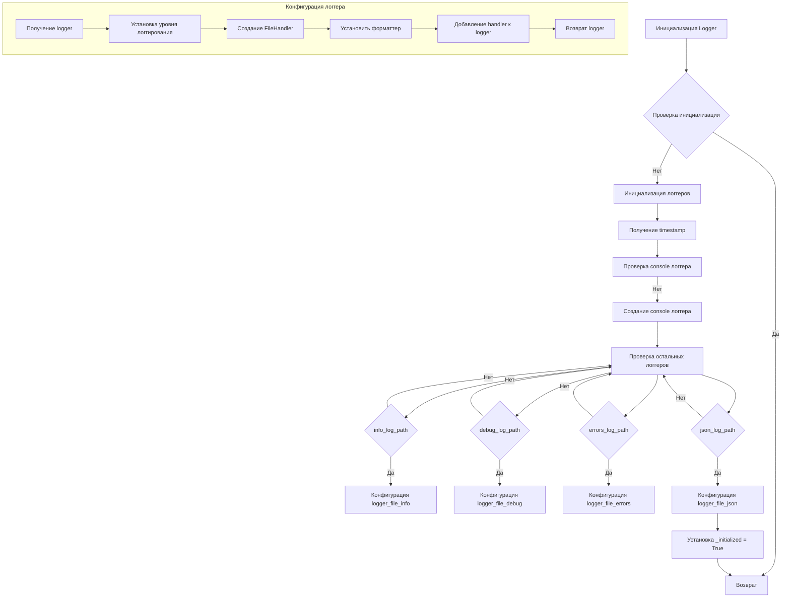

```MD
# <input code>

```python
import threading
import traceback
import logging
from typing import Optional
import colorama
import datetime
import json
import inspect

class SingletonMeta(type):
    """Metaclass for Singleton pattern implementation."""

    _instances = {}
    _lock = threading.Lock()

    def __call__(cls, *args, **kwargs):
        if cls not in cls._instances:
            with cls._lock:
                if cls not in cls._instances:
                    instance = super().__call__(*args, **kwargs)
                    cls._instances[cls] = instance
        return cls._instances[cls]

class JsonFormatter(logging.Formatter):
    """Custom formatter for logging in JSON format."""

    def format(self, record: logging.LogRecord) -> str:
        """Format the log record as JSON."""
        log_entry = {
            "asctime": self.formatTime(record, self.datefmt),
            "name": record.name,
            "levelname": record.levelname,
            "message": record.getMessage(),
            "exc_info": self.formatException(record.exc_info) if record.exc_info else None,
        }
        return json.dumps(log_entry, ensure_ascii=False)

class Logger(metaclass=SingletonMeta):
    """Logger class implementing Singleton pattern with console, file, and JSON logging."""
    # ... (rest of the class)
```

# <algorithm>

**Блок-схема:**



**Пример:**

При вызове `logger.info("Сообщение")`, выполняется логика из функции `info`.

**Пример перемещения данных:**

Функция `log` получает уровень сообщения (`level`), сообщение (`message`), возможное исключение (`ex`) и другие параметры.
Функция форматирует сообщение с помощью `_format_message`, добавляет информацию об исключении, если необходимо.
Полученное форматированное сообщение передается разным логгерам (console, file, json) для записи.

# <mermaid>

```mermaid
graph LR
    subgraph "Модули Python"
        A[threading] --> B(Logger);
        C[traceback] --> B;
        D[logging] --> B;
        E[typing] --> B;
        F[colorama] --> B;
        G[datetime] --> B;
        H[json] --> B;
        I[inspect] --> B;
    end
    subgraph "Логгер"
        B --> J(SingletonMeta);
        J --> K(JsonFormatter);
        J --> L(Logger);
        L --> M(initialize_loggers);
        L --> N(log);
        L --> O(info);
        L --> P(success);
        L --> Q(warning);
        L --> R(debug);
        L --> S(error);
        L --> T(critical);
    end
    J -- Singleton --> B;
    K -- Custom formatter --> B;
    N --> U(logger_console);
    N --> V(logger_file_info);
    N --> W(logger_file_debug);
    N --> X(logger_file_errors);
    N --> Y(logger_file_json);
    U -- Output --> "Консоль";
    V -- Output --> "Файл info";
    W -- Output --> "Файл debug";
    X -- Output --> "Файл errors";
    Y -- Output --> "Файл json";
```

# <explanation>

**Импорты:**

- `threading`: Для реализации Singleton pattern с блокировкой.
- `traceback`: Для обработки исключений.
- `logging`: Для основного функционала логгирования.
- `typing`: Для типизации.
- `colorama`: Для добавления цвета в консольные сообщения.
- `datetime`: Для получения текущей даты и времени.
- `json`: Для сериализации сообщений в формате JSON.
- `inspect`: Для получения информации о вызове функций при обработке исключений.


**Классы:**

- `SingletonMeta`: Метакласс, реализующий паттерн Singleton для класса `Logger`. Обеспечивает создание только одного экземпляра класса.
- `JsonFormatter`: Наследуется от `logging.Formatter` и отвечает за форматирование записей логов в формате JSON.
- `Logger`: Класс, отвечающий за логгирование. Реализует Singleton pattern, имея статические атрибуты для разных логгеров, а также `_initialized` для предотвращения повторной инициализации. `initialize_loggers` метод настраивает логгеры для консоли, файлов (info, debug, error) и JSON.  `log` - основной метод, принимающий уровень, сообщение, возможные исключения и цвет. Методы `info`, `success`, `warning`, `debug`, `error`, `critical` - это просто удобные wrapper'ы для различных уровней логирования, добавление форматирования цвета для лучшей читаемости.


**Функции:**

- `_configure_logger`: Конфигурирует и возвращает экземпляр `logging.Logger`. Принимает имя логгера, путь к файлу, уровень логгирования, форматтер и режим файла.
- `initialize_loggers`: Инициализирует логгеры для консоли, файлов info, debug, error, и JSON, создаёт имена логгеров с timestamp.
- `_format_message`: Форматирует сообщение с опциональным цветом и информацией об исключении.
- `_ex_full_info`: Форматирует подробную информацию об исключении с указанием файла, функции и строки кода, где оно произошло.
- `log`: Основная функция для логгирования сообщений на заданном уровне. Она обращается к другим функциям, чтобы проверить, нужно ли запускать `initialize_loggers`.
- `info`, `success`, `warning`, `debug`, `error`, `critical`: Удобные wrapper'ы, которые вызывают `log` с соответствующими уровнями.


**Переменные:**

- Локальные переменные, используемые в методах и функциях, хранят данные, необходимые для работы функциональности.
- Статические переменные `logger_console`, `logger_file_info`, и т.д. хранят экземпляры `logging.Logger`, которые используются для записи сообщений в разные места.

**Возможные ошибки или области для улучшений:**

- Обработка исключений в `_configure_logger` и других местах.
- Добавление проверки на существование файлов, перед записью в них.
- Поддержка более гибких форматов логгирования (например, использование различных форматеров).
- Проверка валидности пути к файлу.


**Взаимосвязь с другими частями проекта:**

Эта реализация логгера может быть использована во всех частях проекта, обеспечивая централизованное управление и обработку логов. Она не зависит от какого-либо конкретного функционала, и может использоваться любым модулем приложения.