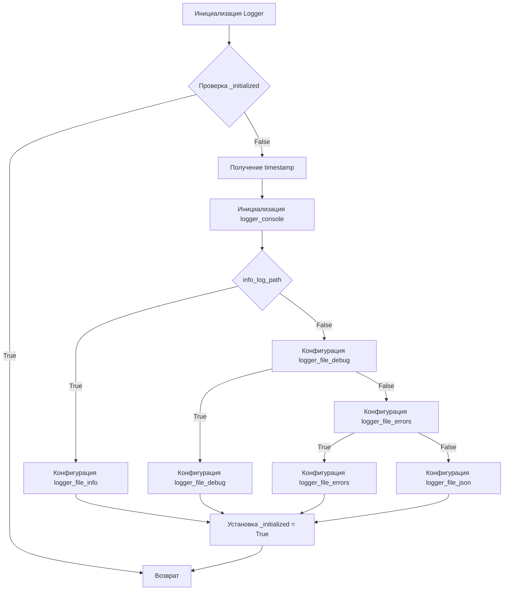
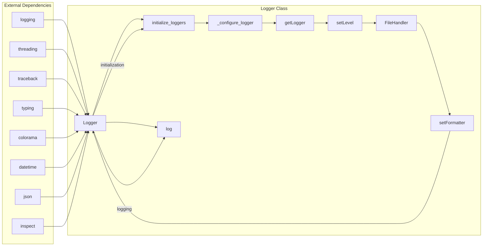

```MD
# <input code>

```python
import threading
import traceback
import logging
from typing import Optional
import colorama
import datetime
import json
import inspect

class SingletonMeta(type):
    """Metaclass for Singleton pattern implementation."""

    _instances = {}
    _lock = threading.Lock()

    def __call__(cls, *args, **kwargs):
        if cls not in cls._instances:
            with cls._lock:
                if cls not in cls._instances:
                    instance = super().__call__(*args, **kwargs)
                    cls._instances[cls] = instance
        return cls._instances[cls]

class JsonFormatter(logging.Formatter):
    """Custom formatter for logging in JSON format."""

    def format(self, record: logging.LogRecord) -> str:
        """Format the log record as JSON."""
        log_entry = {
            "asctime": self.formatTime(record, self.datefmt),
            "name": record.name,
            "levelname": record.levelname,
            "message": record.getMessage(),
            "exc_info": self.formatException(record.exc_info) if record.exc_info else None,
        }
        return json.dumps(log_entry, ensure_ascii=False)

class Logger(metaclass=SingletonMeta):
    """Logger class implementing Singleton pattern with console, file, and JSON logging."""

    logger_console: Optional[logging.Logger] = None
    logger_file_info: Optional[logging.Logger] = None
    logger_file_debug: Optional[logging.Logger] = None
    logger_file_errors: Optional[logging.Logger] = None
    logger_file_json: Optional[logging.Logger] = None
    _initialized: bool = False

    def __init__(self):
        self.logger_console = None
        self.logger_file_info = None
        self.logger_file_debug = None
        self.logger_file_errors = None
        self.logger_file_json = None
        self._initialized = False

    def _configure_logger(
        self,
        name: str,
        log_path: str,
        level: Optional[int] = logging.DEBUG,
        formatter: Optional[logging.Formatter] = None,
        mode: Optional[str] = 'a'
    ) -> logging.Logger:
        """Configures and returns a logger."""
        logger = logging.getLogger(name)
        logger.setLevel(level)
        handler = logging.FileHandler(filename=log_path, mode=mode)
        handler.setFormatter(formatter or logging.Formatter('%(asctime)s - %(levelname)s - %(message)s'))
        logger.addHandler(handler)
        return logger

    def initialize_loggers(
        self,
        info_log_path: Optional[str] = '',
        debug_log_path: Optional[str] = '',
        errors_log_path: Optional[str] = '',
        json_log_path: Optional[str] = ''
    ):
        """Initializes loggers."""
        if self._initialized:
            return

        timestamp = datetime.datetime.now().strftime('%d%m%y%H%M')

        if not self.logger_console:
            self.logger_console = logging.getLogger(f'console_{timestamp}')
            self.logger_console.setLevel(logging.DEBUG)
            console_handler = logging.StreamHandler()
            console_handler.setFormatter(logging.Formatter('%(levelname)s: %(message)s'))
            self.logger_console.addHandler(console_handler)

        if info_log_path:
            self.logger_file_info = self._configure_logger(f'info_{timestamp}', info_log_path, logging.INFO)

        if debug_log_path:
            self.logger_file_debug = self._configure_logger(f'debug_{timestamp}', debug_log_path, logging.DEBUG)

        if errors_log_path:
            self.logger_file_errors = self._configure_logger(f'errors_{timestamp}', errors_log_path, logging.ERROR)

        if json_log_path:
            self.logger_file_json = self._configure_logger(f'json_{timestamp}', json_log_path, logging.DEBUG, JsonFormatter())

        self._initialized = True


    # ... (rest of the code)
```

# <algorithm>

**Блок-схема:**



**Описание:**

Код реализует класс `Logger` для логгирования, использующий паттерн Singleton. `Logger` позволяет конфигурировать логгирование для консоли, файла и JSON. При вызове метода `log` данные передаются в зависимости от уровня логгирования и настроек. Если логгер не был инициализирован, то происходит инициализация.


# <mermaid>



**Объяснение диаграммы:**

Диаграмма отображает основные компоненты и зависимости класса `Logger`. `Logger` использует внешние зависимости, такие как `logging`, `threading` и др., для реализации функциональности. Внешние зависимости необходимы для функциональности логгирования.


# <explanation>

**Импорты:**

- `threading`: Необходим для синхронизации доступа к ресурсу (паттерн Singleton).
- `traceback`: Вероятно, используется для обработки исключений.
- `logging`: Основной модуль для логгирования.
- `typing`:  Используется для указания типов переменных (Optional[str], Optional[int]...).
- `colorama`: Для цветного вывода в консоль.
- `datetime`: Для формирования времени лога.
- `json`: Для сериализации логов в формате JSON.
- `inspect`: Для получения информации о текущей функции и строке кода при возникновении исключения.

**Классы:**

- `SingletonMeta`: Метакласс, реализующий паттерн Singleton для `Logger`. Обеспечивает создание только одного экземпляра класса `Logger`.
- `JsonFormatter`:  Наследован от `logging.Formatter`, предназначен для форматирования логов в формате JSON.
- `Logger`: Главный класс, реализующий логгирование.  Атрибуты `logger_*` хранят экземпляры `logging.Logger` для разных типов логов (консоль, файлы). `_initialized` - флаг, предотвращающий повторную инициализацию логгеров. `__init__` инициализирует переменные. `_configure_logger` конфигурирует логгер и возвращает его. `initialize_loggers` создает и настраивает логгеры для консоли, файлов (info, debug, errors) и JSON. `log` - основной метод для логгирования (обрабатывает разные уровни), и методы `info`, `success`, `warning`, `debug`, `error`, `critical` служат для удобного логгирования различных событий.

**Функции:**

- `_configure_logger`: Конфигурирует и возвращает экземпляр `logging.Logger`, настраивая уровень, путь к файлу и форматирование.
- `initialize_loggers`: Инициализирует логгеры для различных целей (консоль, файлы, JSON), сохраняя экземпляры логгеров в соответствующих атрибутах класса.
- `_format_message`: Форматирует сообщение, добавляя цвет и информацию об исключении (если есть).
- `_ex_full_info`: Создаёт дополнительную информацию об исключении (строка, функция, номер).
- `log`: Общий метод для логгирования. `info`, `success`, `warning`, `debug`, `error`, `critical` - методы для логгирования с разными уровнями (INFO, WARNING, DEBUG, ERROR, CRITICAL).

**Переменные:**

- `logger_console`, `logger_file_info`, etc.: Экземпляры `logging.Logger`, хранящие настройки для разных типов логгеров.
- `_initialized`: Флаг, предотвращающий дублирование инициализации логгеров.
- `timestamp`: Строка, содержащая текущую дату и время, используемая для именования файлов логов.

**Возможные ошибки или области для улучшений:**

- Отсутствует обработка исключений в методах `_configure_logger` и `initialize_loggers`. При возникновении проблемы при открытии файла лога, программа завершится с ошибкой. Необходимо добавить `try...except` блоки.
- Неясно, как использовать `colors` в `log`. Нужно добавить явные проверки на тип `colors`.

**Взаимосвязи с другими частями проекта:**

Класс `Logger` является частью инфраструктуры логирования приложения. Другие части проекта используют этот класс для записи логов.  Этот класс тесно связан с другими модулями, использующими логгирование для отслеживания событий, обработки ошибок и диагностики.